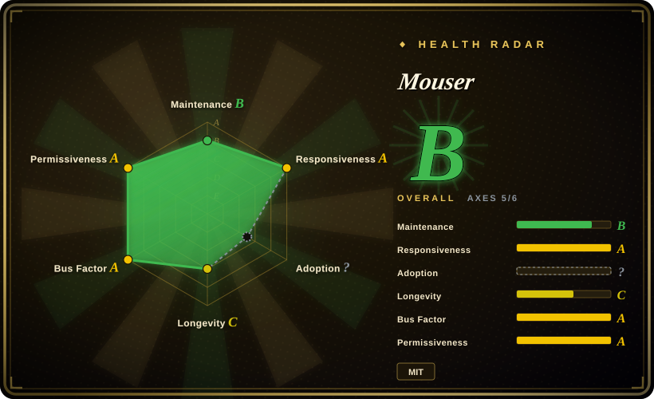
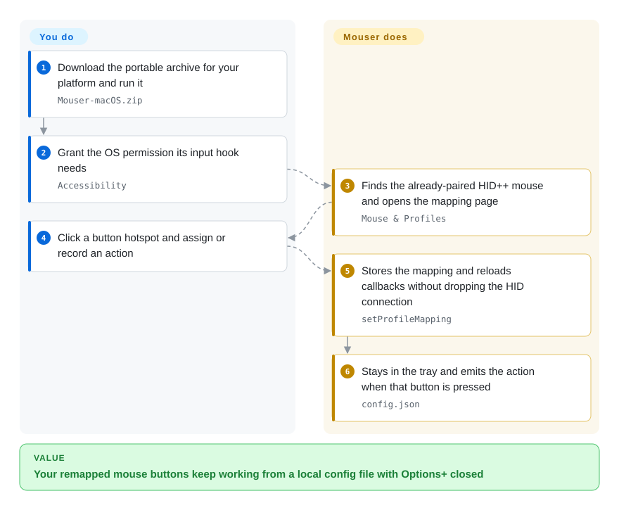

# Mouser

A portable, mouse-first, fully local replacement for Logitech Options+: remap Logitech HID++ mice, per-application, from a downloaded archive with no installer and no account.

## When to use

You have an MX Master or MX Anywhere, you move between a work laptop and a personal machine (Windows, macOS, or Linux), and you refuse to install the vendor app: Options+ is heavy, account-adjacent, and on Linux it does not exist at all. You don't need pairing, battery dashboards, keyboard remapping or lighting — you need the *back/forward/gesture/mode-shift* buttons and the thumbwheel to do what you want, and you want a different set of actions when your editor is frontmost than when a browser is.

You pick Mouser when portability is the deciding factor: one ZIP per platform, extract, run, grant the OS's input-permission prompt, and you're mapping buttons — versus [Solaar](solaar.md)'s package-manager-plus-udev-rule install and Linux-only scope, or [OpenLogi](openlogi.md)'s installers, resident agent service and versioned config schema. Mouser is the only one of the three that runs the same way on all three OSes without a package manager. The tradeoff you accept: it is a 7-month-old project with a much narrower device scope (HID++ mice, best on MX Master/MX Anywhere), no receiver pairing, and profile mappings that are still global rather than per-device.

## How it works

Mouser is a single local Python application with a PySide6/QML window that lives in the tray or menu bar. On launch it probes the mice your OS has *already* paired — it deliberately does not do pairing — discovers the reprogrammable controls the mouse exposes (`REPROG_CONTROLS_V4`), and installs an OS-level mouse hook so it can also see buttons the mouse does not divert on its own. You work in the **Mouse & Profiles** page: click a hotspot on the device drawing, choose a built-in action or record a keyboard shortcut, and the backend saves it to a local `config.json` and reloads the callbacks without tearing down the HID connection. When a button fires, the engine decides whether to block the original event or pass it through, then synthesizes the replacement input through the platform API (Win32 hooks on Windows, CGEventTap/Quartz on macOS, evdev/uinput on Linux). Your part is picking actions and granting one permission; Mouser's part is the device protocol, the event interception and the per-application switching.

<!-- flow-steps:begin (generated from flows/mouser.json by tools/flow_card.py — do not edit) -->

Text version of the flow

1. **You**: Download the portable archive for your platform and run it — `Mouser-macOS.zip`
2. **You**: Grant the OS permission its input hook needs — `Accessibility`
3. **Mouser**: Finds the already-paired HID++ mouse and opens the mapping page — `Mouse & Profiles`
4. **You**: Click a button hotspot and assign or record an action
5. **Mouser**: Stores the mapping and reloads callbacks without dropping the HID connection — `setProfileMapping`
6. **Mouser**: Stays in the tray and emits the action when that button is pressed — `config.json`

**Value**: Your remapped mouse buttons keep working from a local config file with Options+ closed

<!-- flow-steps:end -->

## When NOT to use

- **You need to pair or unpair a device on a receiver.** Mouser requires an already-paired mouse and has no pairing UI — use [Solaar](solaar.md), whose receiver-slot pairing is the reason it exists.
- **Your keyboard, webcam or lighting is in scope.** Mouser's device catalogue is mice; there is no RGB/lighting implementation in the default branch. Use [OpenLogi](openlogi.md) for keyboard remapping, static RGB, Litra lights and UVC webcam control.
- **You need Flow, Smart Actions, the Marketplace, or fleet deployment.** Those are official-options territory — use Logitech Options+ / G HUB.
- **You run multiple mice and expect each to keep its own mapping.** Profile mappings are global today, with per-device layout overrides only; "true per-device config" is on the project's own roadmap.
- **Your Linux desktop is GNOME on Wayland (or any non-KDE Wayland).** App detection covers X11 and KDE Wayland; other compositors fall back to the default profile, so per-app switching silently stops working. Use OpenLogi or Solaar there, or accept a single global profile.
- **You must not keep running Options+.** Both programs fight over HID++ access, so Options+ has to be closed. If your workflow depends on it, Mouser cannot be additive.
- **You need to inject keys into elevated windows or some games.** The README states injected input may not reach elevated windows or certain games; running elevated is the documented workaround, not the default.
- **You are on a non-Logitech or non-HID++ mouse.** Unknown Logitech HID++ models get a best-effort generic layout, and everything else is out of scope entirely.

## Comparison

| Alternative | In index | Our verdict | Tradeoff |
|---|---|---|---|
| [OpenLogi](openlogi.md) | ✅ | Choose Mouser when you want a no-installer, mouse-only tool you can carry between Windows/macOS/Linux; choose OpenLogi when keyboards, webcams, Litra lights, receiver-attached devices or a scriptable CLI are in scope. | OpenLogi gains breadth (keyboard, camera, lighting), a real CLI and formal installers; it pays with a resident agent service and a versioned TOML schema that rejects invalid edits. Mouser gains a single archive you run and a JSON config; it pays with mouse-only scope and global mappings. |
| [Solaar](solaar.md) | ✅ | Choose Mouser for a mouse-first GUI on Windows or macOS — Solaar does not support Windows and its macOS support is partial; choose Solaar on Linux when pairing, battery/device status and broader HID++ settings matter. | Solaar gains pairing, device management and 14 years of history; it pays with Linux-first scope and a GTK-era UI. Mouser gains cross-platform portability and a modern per-app mapping UI; it pays with no pairing and a thin maintenance record. |
| [logiops](logiops.md) | ✅ | Choose logiops on Linux when you want a root daemon configured by a versionable config file and you don't mind no GUI; choose Mouser when you want a GUI, Windows/macOS support and per-application profiles without touching system config. | logiops gains a stable config language and distro packaging; it pays with a root daemon, no GUI, HID++ 2.0+ only, and a release cadence that has slowed to roughly one release in two years. Mouser is the user-level inverse. |
| Logitech Options+ (official) | 未收录 | Keep Options+ when you need Flow, Smart Actions, the Marketplace, firmware updates or vendor device QA; choose Mouser when you want local-only operation with no installer and no account. | Options+ is the only option with Flow, firmware updates and official device coverage; it pays with a heavy closed app and no Linux build. Mouser trades those away for portability and locality. |

## Tech stack

- **Language:** Python (no machine-readable `python_requires`; docs say 3.10+ generally and 3.11+ on macOS, CI pins 3.12).
- **GUI:** PySide6 + Qt Quick/QML (`QApplication` + `QQmlApplicationEngine` loading `Main.qml`) — the development docs note this replaced an earlier tkinter UI.
- **Platform integration:** macOS uses PyObjC (`pyobjc-framework-Quartz` for CGEventTap/key emulation, Cocoa for frontmost-app detection and media keys) plus ctypes-loaded ApplicationServices/CoreFoundation; Windows uses Win32 low-level hooks and Raw Input; Linux uses `evdev` + `uinput`, with `xdotool`/`kdotool` for foreground-app detection.
- **Device protocol:** its own HID++ implementation in `core/hid_gesture.py` (feature discovery, `REPROG_CONTROLS_V4`, DPI, SmartShift, battery, wheel, haptics) on top of `hidapi`; source comments cite Solaar for protocol knowledge, but there is no runtime dependency on it.
- **Packaging:** PyInstaller, producing menu-bar (`LSUIElement`) builds for Apple Silicon and Intel plus Windows and Linux archives; no PyPI package exists for this project.

## Dependencies

- **An already-paired Logitech HID++ mouse** attached over Bluetooth, Logi Bolt or a USB receiver. Mouser does not pair devices; best coverage is MX Master / MX Anywhere, with PID/name probing and a generic fallback UI for other models.
- **macOS 12+** (per the build prerequisites) with **Accessibility permission granted** — without it the remapping engine does not start. The release builds are ad-hoc signed, not notarized, so Gatekeeper and re-authorization after a rebuild are real operational steps.
- **Linux:** read access to `/dev/hidraw*` and `/dev/input/event*` plus write access to `/dev/uinput`; a bundled `install-linux-permissions.sh` installs the udev rules, and distros without logind/uaccess also need the `input` group.
- **No account, no telemetry, no service.** Config is a local JSON file (`%APPDATA%\Mouser\config.json`, `~/Library/Application Support/Mouser/config.json`, `~/.config/Mouser/config.json`); logs rotate at 5 × 5 MB.
- **Coexistence constraint:** Options+ must be closed while Mouser runs — they compete for HID++ access.

## Ops difficulty

**Low on Windows, low-to-medium on macOS, medium on Linux.** There is no installer, no service and no config language to learn: extract, run, grant one permission, click. The costs are all platform friction — macOS Accessibility grants that can be revoked by an unsigned rebuild, Linux udev rules that must be installed once before anything is visible, and auto-start entries written into HKCU Run / LaunchAgents / XDG autostart. Upgrades are manual outside the portable-Windows layout, and the app only notifies from `releases/latest`. Nothing here needs an operator; it does need the user to understand why a permission dialog appeared and why the app must stay in the tray.

## Health & viability

- **Maintenance — high activity, bursty releases (as of 2026-09-20).** Created 2026-02-24; 13 releases between 2026-03 and 2026-07; latest v3.7.3 on 2026-07-28; last default-branch commit 2026-08-12, `pushed_at` 2026-08-13; CI (Python compile, unittest discovery, QML lint) was green on the default branch. At the time of writing there had been roughly 54 days without a release while commits continued.
- **Governance & bus factor — one owner, several substantial contributors.** The repo is a `User` account and the roadmap is hosted there; contributor totals are 85 / 79 / 47 for `TomBadash` / `thisislvca` / `hieshima`, so this is not a solo project, but there is no `GOVERNANCE.md`, CODEOWNERS, foundation or company behind it, and funding is a personal GitHub Sponsors link.
- **Age & Lindy — 7 months, so unproven.** A 2026-02 project cannot be a Lindy bet. What it does have is unusually broad participation and a real feedback volume for its age (125 open issues, ~61 closed, 79 merged PRs) — attention is confirmed, durability is not.
- **Adoption & ecosystem — distribution through GitHub releases only, and that shapes the score.** ~5.3k stars, 196 forks, and roughly 27.5k downloads across 13 releases' assets. There is no Homebrew cask and no PyPI package for this project (the `mouser` name on PyPI belongs to an unrelated parts-API CLI), so "install" always means "download a ZIP" — which is why the radar **cannot score adoption** (`?`, no package-registry structure to measure) rather than scoring it low.
- **Risk flags — the aggregate looks healthier than the recent tail, and there is no security policy.** Measured responsiveness is Grade A with a 54.1-hour median first response over qualifying issues, yet the nine most recent open issues sampled in 2026-08/09 all had zero comments, including a 1 GB memory-leak report. Historically the maintainer has done high-quality root-cause work on hard bugs, so this reads as a young maintainer's triage debt rather than abandonment. `[推断]` There is no `SECURITY.md` and no published advisory history.

## Caveats (unverified)

- `[未验证]` **Cross-platform support is a README and release-asset claim.** Windows/macOS/Linux archives exist and platform-specific hook code exists, but only macOS/Linux behaviour was inspected here — Windows was not exercised.
- `[未验证]` **Stars (~5.3k) and the ~27.5k aggregate release downloads** are API-verified counts as of 2026-09; their meaning as adoption or vetting is not established, and both are date-sensitive.
- `[推断]` **The recent cluster of zero-comment issues indicates triage debt, not abandonment** — the last default-branch push is roughly five weeks old and CI was green at that point, but the project's future responsiveness is not verifiable.
- `[未验证]` **Device coverage is best-effort beyond MX Master/MX Anywhere.** The README describes PID/name probing and a generic layout for other HID++ mice; no compatibility matrix was verified.
- `[未验证]` **Profile mappings are global, not per-device**, per the project's own Limitations section; whether a later commit changes this was not checked against the default branch head.
- `[未验证]` **Linux app detection is documented for X11 and KDE Wayland only**; behaviour on GNOME Wayland is taken from the README's own limitation, not reproduced.
- `[未验证]` **`install-linux-permissions.sh` contents and the exact udev rules it installs** were not read line by line; the required device paths come from the README and the script's stated purpose.
