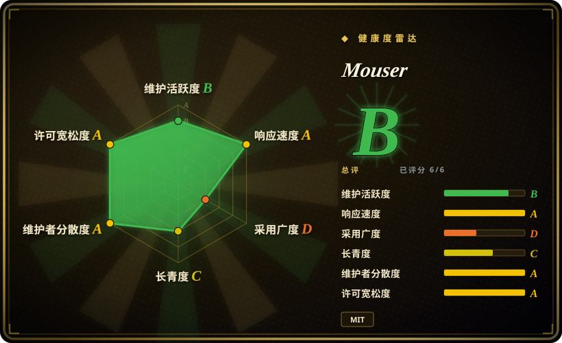
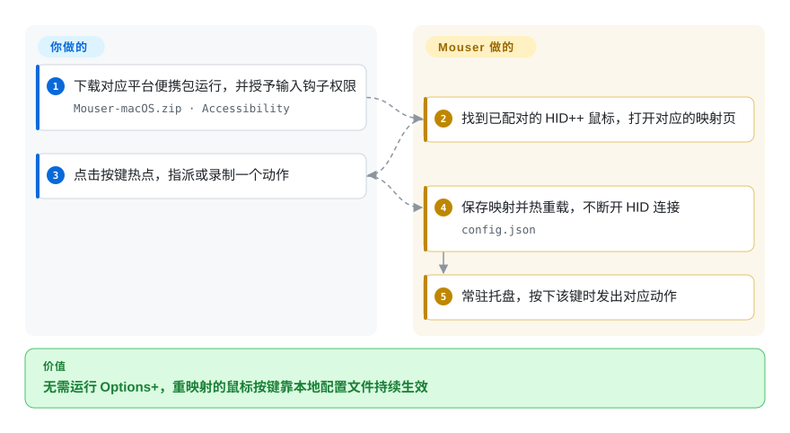

# Mouser

便携、鼠标优先、完全本地的 Logitech Options+ 替代品：下载压缩包解压即用，无安装器、无账号，按应用重映射罗技 HID++ 鼠标。

## 何时使用

你有一只 MX Master 或 MX Anywhere，在工作的笔记本和私人机器之间来回切换（Windows、macOS 或 Linux），并且拒绝安装厂商应用：Options+ 又重又跟账号纠缠，而且在 Linux 上根本不存在。你不需要配对、电量面板、键盘重映射或灯效——你需要的是**前进／后退／手势／ModeShift 按键**和拇指轮按你的意思工作，并且希望编辑器在前台时和浏览器在前台时用不同的动作。

当**便携性**是决定性因素时你选 Mouser：每个平台一个压缩包，解压、运行、授一次输入权限，然后就开始映射——相比之下 [Solaar](solaar.zh.md) 要走包管理器加 udev 规则，而且只支持 Linux；[OpenLogi](openlogi.zh.md) 要装安装包、跑常驻 agent 服务，还有带版本的配置 schema。三者中只有 Mouser 在三个系统上用同一种方式运行、且不需要包管理器。你接受的取舍是：它只有 7 个月历史，设备范围窄得多（HID++ 鼠标，MX Master／MX Anywhere 体验最好），没有接收器配对，而且 profile 映射仍是全局而非按设备。

## 怎么用起来

Mouser 是一个本地 Python 应用，PySide6／QML 窗口常驻系统托盘或菜单栏。启动时它探测**操作系统已经配好**的鼠标——它有意不做配对——发现鼠标暴露的可重编程控件（`REPROG_CONTROLS_V4`），并安装一个系统级鼠标钩子，以便看到鼠标自己不 divert 的按键。你在 **Mouse & Profiles** 页面工作：点击设备图上的热点，选一个内置动作或录制一个快捷键，后端把它存进本地 `config.json`，并在不拆掉 HID 连接的情况下重载回调。按键触发时，引擎决定拦下原始事件还是透传，然后通过平台 API 合成替代输入（Windows 上是 Win32 钩子，macOS 上是 CGEventTap／Quartz，Linux 上是 evdev／uinput）。你要做的只是挑动作、授一次权限；Mouser 负责设备协议、事件拦截与按应用切换。

<!-- flow-steps:begin (generated from flows/mouser.json by tools/flow_card.py — do not edit) -->

流程文字版

1. **你**：下载对应平台便携包并直接运行 — `Mouser-macOS.zip`
2. **你**：授予输入钩子所需的系统权限 — `Accessibility`
3. **Mouser**：找到已配对的 HID++ 鼠标并打开映射页 — `Mouse & Profiles`
4. **你**：点击按键热点，指派或录制一个动作
5. **Mouser**：保存映射并重载回调，不断开 HID 连接 — `setProfileMapping`
6. **Mouser**：常驻托盘，按下该键时发出对应动作 — `config.json`

**价值**：无需运行 Options+，重映射的鼠标按键靠本地配置文件持续生效

<!-- flow-steps:end -->

## 何时不用

- **你需要配对或解绑接收器上的设备。** Mouser 要求鼠标已经配对，没有配对界面——改用 [Solaar](solaar.zh.md)，接收器槽位配对正是它存在的理由。
- **键盘、摄像头或灯效也在范围内。** Mouser 的设备目录是鼠标；默认分支里没有 RGB／灯效实现。键盘重映射、静态 RGB、Litra 灯与 UVC 摄像头控制改用 [OpenLogi](openlogi.zh.md)。
- **你需要 Flow、Smart Actions、Marketplace 或企业批量部署。** 这些属于官方产品的地盘——用 Logitech Options+／G HUB。
- **你有好几只鼠标，并指望每只保留自己的映射。** 目前 profile 映射是全局的，只有按设备的布局覆盖；「真正的按设备配置」还在项目自己的路线图上。
- **你的 Linux 桌面是 GNOME on Wayland（或任何非 KDE 的 Wayland）。** 应用检测覆盖 X11 与 KDE Wayland；其他合成器会回退到默认 profile，按应用切换会静默失效。这种情况下改用 OpenLogi 或 Solaar，或者接受单一全局 profile。
- **你不能不跑 Options+。** 两个程序会争抢 HID++ 访问权，所以必须关掉 Options+。如果你的流程依赖它，Mouser 就没法作为叠加方案。
- **你需要往提权窗口或某些游戏里注入按键。** README 明确说注入的输入可能进不了提权窗口或某些游戏；以提权方式运行是文档给出的绕过办法，不是默认行为。
- **你用的是非罗技或非 HID++ 鼠标。** 未知的罗技 HID++ 型号只会得到尽力而为的通用布局，其他品牌则完全不在范围内。

## 横向对比

| 替代品 | 是否收录 | 我们的评价 | 取舍 |
|---|---|---|---|
| [OpenLogi](openlogi.zh.md) | ✅ | 当你想要一个免安装、只管鼠标、能在 Windows／macOS／Linux 之间带走的小工具时选 Mouser；当键盘、摄像头、Litra 灯、挂在接收器上的设备或可脚本化的 CLI 在范围内时选 OpenLogi。 | OpenLogi 换来广度（键盘、摄像头、灯效）、真正的 CLI 与正式安装包；代价是常驻 agent 服务，以及会拒绝非法编辑的带版本 TOML。Mouser 换来一个解压即用的包和 JSON 配置；代价是只管鼠标、映射为全局。 |
| [Solaar](solaar.zh.md) | ✅ | 在 Windows 或 macOS 上要鼠标优先的 GUI 就选 Mouser——Solaar 不支持 Windows，macOS 支持也只是部分；在 Linux 上当配对、电量／设备状态与更广的 HID++ 设置重要时选 Solaar。 | Solaar 换来配对、设备管理以及 14 年历史；代价是 Linux 优先的定位与 GTK 时代的界面。Mouser 换来跨平台便携与现代化的按应用映射界面；代价是没有配对、维护记录很薄。 |
| [logiops](logiops.zh.md) | ✅ | 在 Linux 上，当你想要一个由可版本化配置文件驱动的 root 守护进程、且不介意没有 GUI 时选 logiops；当你想要 GUI、Windows／macOS 支持，并且不想碰系统配置就能有按应用 profile 时选 Mouser。 | logiops 换来稳定的配置语言与发行版打包；代价是 root 守护进程、没有 GUI、只支持 HID++ 2.0+，以及已放缓到约两年一版的发布节奏。Mouser 是用户级的反面。 |
| Logitech Options+（官方） | 未收录 | 当你需要 Flow、Smart Actions、Marketplace、固件更新或厂商设备质量保证时继续用 Options+；当你想要无安装器、无账号、纯本地运行时选 Mouser。 | Options+ 是唯一具备 Flow、固件更新和官方设备覆盖的选项；代价是沉重的闭源应用和没有 Linux 版本。Mouser 用这些换取便携与本地性。 |

## 技术栈

- **语言：** Python（没有机器可读的 `python_requires`；文档写通用 3.10+、macOS 3.11+，CI 固定 3.12）。
- **界面：** PySide6 + Qt Quick／QML（`QApplication` + `QQmlApplicationEngine` 加载 `Main.qml`）——开发文档说明它替换了早期的 tkinter 界面。
- **平台集成：** macOS 使用 PyObjC（`pyobjc-framework-Quartz` 做 CGEventTap／按键模拟，Cocoa 做前台应用检测与媒体键），另用 ctypes 加载 ApplicationServices／CoreFoundation；Windows 使用 Win32 低级钩子与 Raw Input；Linux 使用 `evdev` + `uinput`，前台应用检测借助 `xdotool`／`kdotool`。
- **设备协议：** 自己在 `core/hid_gesture.py` 里实现 HID++（feature 发现、`REPROG_CONTROLS_V4`、DPI、SmartShift、电量、滚轮、触觉反馈），底层走 `hidapi`；源码注释引用了 Solaar 的协议知识，但运行时并不依赖它。
- **打包：** PyInstaller，产出 Apple Silicon 与 Intel 的菜单栏（`LSUIElement`）构建以及 Windows、Linux 压缩包；本项目在 PyPI 上没有包。

## 依赖

- **一只已配对的罗技 HID++ 鼠标**，通过蓝牙、Logi Bolt 或 USB 接收器连接。Mouser 不做配对；覆盖最好是 MX Master／MX Anywhere，其他型号靠 PID／名称探测加通用回退界面。
- **macOS 12+**（按构建前提），并**授予辅助功能（Accessibility）权限**——没有它重映射引擎不会启动。发布包是 ad-hoc 签名、未公证，所以 Gatekeeper 拦截、以及重新构建后需要重新授权，都是实打实的操作步骤。
- **Linux：** 需要读 `/dev/hidraw*` 与 `/dev/input/event*`、写 `/dev/uinput` 的权限；仓库自带 `install-linux-permissions.sh` 安装 udev 规则，没有 logind／uaccess 的发行版还需要加入 `input` 组。
- **无账号、无遥测、无服务。** 配置是本地 JSON 文件（`%APPDATA%\Mouser\config.json`、`~/Library/Application Support/Mouser/config.json`、`~/.config/Mouser/config.json`）；日志按 5 个 × 5 MB 轮转。
- **共存约束：** Mouser 运行时必须关掉 Options+——两者争抢 HID++ 访问权。

## 运维难度

**Windows 上低，macOS 上低到中，Linux 上中。** 没有安装器、没有服务、没有要学的配置语言：解压、运行、授一次权限、点几下。成本全在平台摩擦上——macOS 的辅助功能授权可能因未签名构建而失效，Linux 的 udev 规则必须先装一次否则什么都看不到，自启动入口会写进 HKCU Run／LaunchAgents／XDG autostart。除 Windows 便携布局外升级都要手动，应用只是从 `releases/latest` 查询后提示。这里不需要运维人员；但需要用户理解为什么弹出权限对话框、以及为什么应用必须留在托盘里。

## 健康度与可持续性

- **维护活跃度——活动频繁，发版呈突发式（截至 2026-09-20）。** 创建于 2026-02-24；2026-03 至 2026-07 之间 13 个版本；最新 v3.7.3 发布于 2026-07-28；默认分支最后提交 2026-08-12，`pushed_at` 为 2026-08-13；CI（Python 编译、unittest discovery、QML lint）在默认分支上是绿的。写作时已有约 54 天没有新版本，但提交仍在继续。
- **治理与维护者分散度——一名所有者，数位实质贡献者。** 仓库是 `User` 账号，路线图也挂在那里；贡献数为 `TomBadash` 85、`thisislvca` 79、`hieshima` 47，所以这**不是**单人项目，但背后没有 `GOVERNANCE.md`、CODEOWNERS、基金会或公司，资金只是一条个人 GitHub Sponsors 链接。
- **项目年龄与 Lindy——7 个月，尚未被证明。** 2026-02 创建的项目不可能构成 Lindy 赌注。它确实有的是相对年龄而言异常广泛的参与度与真实反馈量（125 个未关闭 issue、约 61 个已关闭、79 个已合并 PR）——关注度成立，持久性不成立。
- **采用与生态——分发只走 GitHub Releases，这也决定了它的得分。** 约 5.3k star、196 fork，13 个版本的资产合计约 27.5k 次下载。没有 Homebrew cask，本项目在 PyPI 上也没有包（PyPI 上的 `mouser` 名字属于一个无关的电子元器件 API CLI），所以「安装」永远意味着「下载一个压缩包」——这也是雷达**无法给采用广度评分**（`?`，没有可度量的包注册结构）而非给它低分的原因。
- **风险旗标——聚合数字比近期长尾更好看，且没有安全策略。** 测得的响应速度为 A，首次响应中位数为 54.1 小时（按合格 issue 统计），但 2026-08／09 抽样到的最近 9 个未关闭 issue 全部零评论，其中包括一个 1 GB 内存泄漏报告。历史上维护者对硬骨头做过高质量的根因分析，因此这读起来更像年轻维护者的 triage 债务，而不是弃坑。`[推断]` 仓库没有 `SECURITY.md`，也没有已公布的 advisory 历史。

## 存疑（未验证）

- `[未验证]` **跨平台支持是 README 与发布资产的声明。** Windows／macOS／Linux 压缩包存在，平台专属钩子代码也存在，但本文只考察了 macOS／Linux 行为，未在 Windows 上实测。
- `[未验证]` **star 数（约 5.3k）与约 27.5k 的发布资产累计下载量** 截至 2026-09 经 API 核实；它们作为「被采用」或「被验证」的含义都不成立，且两个数字都随时间变化。
- `[推断]` **近期一批零评论 issue 反映的是 triage 债务而非弃坑**——默认分支最后推送约在五周前且当时 CI 为绿，但项目未来的响应性无法验证。
- `[未验证]` **超出 MX Master／MX Anywhere 的设备覆盖是尽力而为。** README 描述为 PID／名称探测加通用布局；没有核实过兼容性矩阵。
- `[未验证]` **profile 映射是全局而非按设备**（据项目自己的 Limitations 章节）；后续提交是否改变了这一点，未对照默认分支头部核实。
- `[未验证]` **Linux 应用检测被文档限定为 X11 与 KDE Wayland**；GNOME Wayland 上的行为取自 README 的自述限制，未复现。
- `[未验证]` **`install-linux-permissions.sh` 的内容与其安装的确切 udev 规则**未被逐行阅读；所需设备路径来自 README 与该脚本声明的用途。
