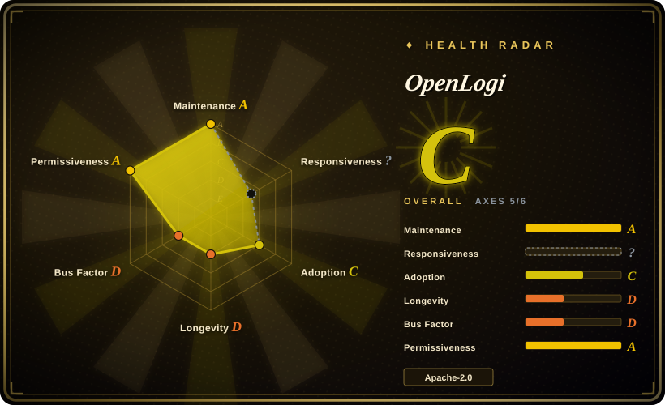
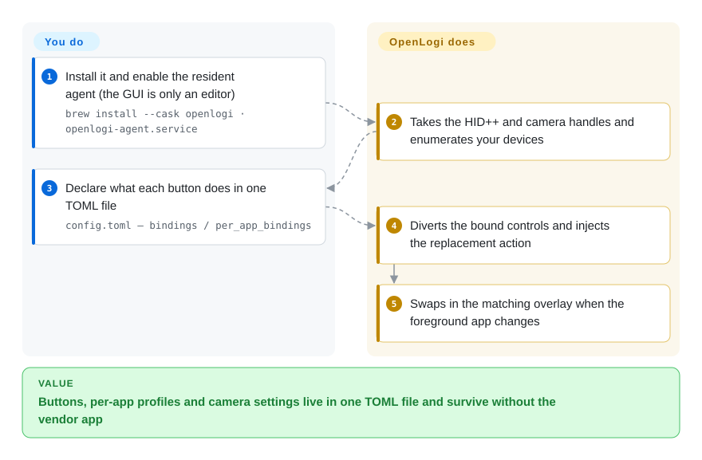

# OpenLogi

A local-first, cross-platform replacement for Logitech Options+: it speaks HID++ to Logitech mice/keyboards and UVC to Logitech webcams, exposing one TOML config shared by a GPUI desktop app, a resident agent, and a CLI.

## When to use

You daily-drive a Logitech mouse (MX-series, or anything on a Bolt/Unifying receiver) and a Logitech keyboard, and you're on Linux — where Logitech simply does not ship Options+. The device works: pointer, clicks, wheel, typing. What doesn't work is everything you bought it for: the thumbwheel and mode-shift button do nothing, the gesture button has no gesture, DPI is whatever the last Windows machine wrote into onboard memory, and there is no way to give your editor and your terminal different button maps. Your two established options each stop short — Solaar is a Linux-only device manager whose scope is Logitech devices on Linux, and logiops is a root daemon with a hand-written config and no GUI or pairing.

You pick OpenLogi when you want the *whole* vendor-app set — button and gesture remapping, per-application profiles, DPI/SmartShift, keyboard remapping and static RGB, plus Logitech webcam image controls — on macOS, Linux, and Windows from one program, with settings living in a plain TOML file you can commit and a CLI you can script. The deciding tradeoff against Solaar is breadth over maturity: OpenLogi covers devices and platforms Solaar does not (webcams, keyboard lighting, Windows/macOS), but it is months old and pre-1.0 while Solaar has shipped since 2012.

## How it works

OpenLogi runs as two cooperating processes that share one config file. The **GUI** (`OpenLogi.app` / `.exe`) is only the editor and the views; the **resident agent** owns every byte of device I/O — it opens the HID++/raw-HID/camera handles, diverts the buttons you have bound, and injects the replacement keystrokes or clicks through the OS input hook. The two talk over a local RPC channel, so closing the window does not stop your bindings. Both sides read the same TOML at `~/.config/openlogi/config.toml` (Windows: `%USERPROFILE%\.config\openlogi\config.toml`), where each device is keyed by a generated physical-device key and holds `bindings`, optional `per_app_bindings` overlays, DPI, scroll, lighting and camera settings. You choose what a button should do — in the GUI or by editing the file — and the agent turns that declaration into a diverted control plus an emitted action; you never write HID++ yourself.

<!-- flow-steps:begin (generated from flows/openlogi.json by tools/flow_card.py — do not edit) -->

Text version of the flow

1. **You**: Install it from the package manager for your OS — `brew install --cask openlogi`
2. **You**: Enable the per-user agent service — `systemctl --user enable --now openlogi-agent.service`
3. **OpenLogi**: Claims the HID++ and camera handles, then enumerates your devices
4. **You**: Declare what each button does in one TOML file — `per_app_bindings`
5. **OpenLogi**: Diverts the bound control and injects the replacement action
6. **OpenLogi**: Swaps the action overlay when the frontmost app changes
7. **You**: Check state from the CLI, or never open the GUI at all — `openlogi list`

**Value**: Buttons, per-app profiles and camera settings live in one TOML file and survive without the vendor app

<!-- flow-steps:end -->

## When NOT to use

- **You're on Linux and want the mature, best-documented Logitech device manager — including receiver pairing.** Use [Solaar](solaar.md) instead: it has shipped since 2012, is packaged by Debian/Fedora/Arch, and manages Unifying/Bolt pairing, unpairing and device status. OpenLogi's strength is the vendor-app feature set, not device-management depth.
- **You only need distro packages and a root daemon with a config language you already understand.** Use [logiops](logiops.md) instead, because its long release history and packaging beat a 4-month-old pre-1.0 app if stability outranks breadth.
- **You want a mouse-only, portable, no-installer GUI and never want a background service.** Use [Mouser](mouser.md) instead — same niche, narrower scope, no daemon.
- **You need Logitech Flow (cross-computer clipboard/file handoff), firmware updates, or Easy-Switch/keyboard pairing management.** These are not in OpenLogi's documented feature set — use Logitech's own Options+ / G HUB, and check the live repo before assuming parity, since absence from the README is not proof of absence. `[未验证]`
- **You need a config schema you can freeze for years.** OpenLogi's README states the project is under active development and that features and config may still change; the config carries `schema_version` with documented migrations (current `7`) and newer-than-build versions are rejected. That churn is a real cost for a long-lived dotfile.
- **You must keep running Options+ alongside it.** Only one process can own a receiver's HID++ access; OpenLogi's install instructions tell you to quit Options+ first. If a workflow depends on Options+ for Flow or the Marketplace, OpenLogi cannot be additive.

## Comparison

| Alternative | In index | Our verdict | Tradeoff |
|---|---|---|---|
| [Solaar](solaar.md) | ✅ | Choose Solaar on Linux when receiver pairing, device status and a 14-year maintenance record matter more than breadth; choose OpenLogi when you want per-app profiles, keyboard remapping, webcam controls and Windows/macOS from the same program. | Solaar gains maturity, distro packaging and pairing/unpairing; it pays with Linux-only scope, a GTK-era UI, and no webcam or RGB story. OpenLogi gains breadth and a native UI; it pays with pre-1.0 churn and no pairing management. |
| [Mouser](mouser.md) | ✅ | Choose Mouser when a mouse-only, portable Windows/macOS/Linux GUI is enough and you never want a background service; choose OpenLogi when keyboards, webcams, Litra lights or receiver-attached devices are in scope. | Mouser gains a download-and-run shape and an explicit MX-mouse coverage policy; it pays with profile mappings that are still global rather than per-device, and no keyboard, camera or lighting coverage. |
| [logiops](logiops.md) | ✅ | Choose logiops on Linux when you prefer a root systemd daemon and a hand-written config over a GUI, and your devices are HID++ 2.0+ mice; choose OpenLogi when you want a GUI, cross-platform installers and camera support. | logiops gains Debian/Fedora/AUR packaging and a stable config language; it pays with a root daemon, no GUI, and a release cadence that has slowed to roughly one release in two years. OpenLogi is the inverse: fast-moving, user-level, broader — and much younger. |
| Logitech Options+ (official) | 未收录 | Keep Options+ if you need Flow, Smart Actions, the Marketplace, fleet deployment, or vendor-blessed firmware and device support — and you are on Windows/macOS. | Options+ is the only option with Flow, firmware update and Logitech's full device QA; it pays with no Linux build and a closed app. OpenLogi trades those away for local-first text config, a CLI and Linux support. |
| Logitech G HUB (official) | 未收录 | Choose G HUB instead if your hardware is Logitech *G* gaming gear and you need game-aware profiles and LIGHTSYNC across G keyboards, mice and headsets. | G HUB covers the G ecosystem (audio, racing, game libraries) that OpenLogi does not touch; OpenLogi covers Logitech's productivity HID++ line, which G HUB does not. |

## Tech stack

- **Language:** Rust (edition 2024, `rust-version = 1.98`), organized as a 21-crate workspace.
- **UI:** GPUI (Zed's GPU-accelerated Rust UI framework), with a separate overlay crate for the Actions Ring; the same workspace builds GUI, agent and CLI.
- **Process model:** GUI plus resident agent over RPC (`tarpc` on an `interprocess` local transport); the agent is the sole owner of device handles.
- **Device layers:** `openlogi-hidpp` (a vendored, 0BSD-licensed fork of the `hidpp` crate) and `openlogi-hidpp-derive`; `openlogi-hid` as the HID abstraction; `openlogi-camera` for UVC; `openlogi-inject` / `openlogi-hook` for OS-level input capture and injection; `openlogi-permissions` for OS permission prompts; `windows-sys` for the Windows backend.
- **Config:** plain TOML with a required `schema_version` (currently `7`) and on-load migrations; the GUI writes atomically and keeps `config.toml.backup.1`–`.5`.

## Dependencies

- **Hardware:** Logitech HID++ devices (Bolt or Unifying receiver, Bluetooth, or wired) and/or any Logitech UVC webcam. Capability is per-device and feature-gated by what the device reports — not a blanket "all Logitech" promise.
- **OS:** macOS 13+; Linux with the bundled udev rules granting user access to `/dev/hidraw*`, `/dev/uinput` and the mouse's `/dev/input/event*` (prebuilt Linux packages need GLIBC 2.35+, the Ubuntu 22.04 baseline); Windows 10/11 with `OpenLogi.exe` and `openlogi-agent.exe` kept side by side.
- **No account, no telemetry, no hosted backend.** Device-render asset sync probes `assets.openlogi.org`, a versioned Cloudflare Pages alias, and a pinned jsDelivr npm release; it can be pinned with `OPENLOGI_ASSETS`.
- **Coexistence constraint:** only one process can own a receiver's HID++ access, so Logi Options+ must be quit while OpenLogi runs.

## Ops difficulty

**Medium.** Installing is genuinely easy — a signed/notarized `.dmg` or `brew install --cask openlogi`, a `.deb`/`.rpm`/`.pkg.tar.zst` with udev rules included, a NixOS module, or a signed `.msi`/portable zip. The medium part is what you then operate: a resident per-user agent (`systemctl --user enable --now openlogi-agent.service` on Linux) that must be running for any binding to work; a strict, versioned TOML whose misspelled, obsolete or out-of-range fields stop the config loading and drop the GUI into read-only mode; and migrations that are documented as *not* fully automatic (v2 model-key device settings cannot be safely assigned to v3 physical keys when two identical devices exist). Editing the file while the GUI is open is a documented conflict — the next GUI save is refused rather than merged. None of this is hard, but it is a config surface you own, not a wizard.

## Health & viability

- **Maintenance — very active (as of 2026-09-20).** `pushed_at` 2026-09-19T21:36:02Z; latest release v0.8.6 published 2026-09-19, with v0.8.2–v0.8.5 inside the preceding three weeks; ~1,494 commits in the trailing 12 months; not archived. This is the opposite of a coasting project.
- **Governance & bus factor — one owner, no foundation.** The repo is a `User` account (`AprilNEA`); contributor totals are 1,206 / 52 / 25 for `AprilNEA` / `davidbudnick` / `cserby`, so the roadmap and the overwhelming share of the code rest with one person. Named contributors do own whole subsystems (Windows/cameras/i18n; the Linux port), which spreads knowledge but not authority.
- **Age & Lindy — young and hyped, so read the star count as attention, not survival.** Created 2026-05-24 (~4 months old as of 2026-09) against ~21.7k stars. That ratio is the textbook "young + hot" shape: it says people want this, not that it has been proven.
- **Adoption & ecosystem — real distribution, unresolved support load.** Official Homebrew cask, distro packages, a NixOS module, a signed MSI, 21,660 stars and 701 forks. Measured with the index's radar, **adoption grades D with 0 dependent repos** — that axis reads dependency-graph and install reach, and an end-user desktop app with no library dependents scores low there by construction, not because nobody runs it. The real counterweight is 587 open issues+PRs on a 4-month-old repo; the metadata cannot separate growth pressure from triage backlog. `[推断]`
- **Responsiveness is unscored (`?`)** — the scorer found no qualifying first-response window, which is itself the honest reading of a 4-month-old repo: there is not yet enough answered-issue history to measure.
- **Risk flags — pre-1.0 churn plus a brand carve-out.** Dual-licensed MIT OR Apache-2.0 (permissive, no relicense history), but the logo and app icon under `design/` are explicitly reserved, so forks cannot ship the OpenLogi name or icon. The HID++ crate is a vendored fork of an upstream 0BSD crate, and one dependency is pinned to an OpenLogi-specific version (`async-hid = "=0.5.3-openlogi.1"`) — extra supply-chain surface to track.

## Caveats (unverified)

- `[未验证]` **Device support is per-device and not enumerated.** The README lists HID++ feature IDs (`0x2201` DPI, `0x2111` SmartShift, `0x2121` scroll inversion, `0x8070`/`0x8080` RGB) and notes some gestures require device-reported diversion and raw-XY support, but publishes no compatibility matrix. Check the live repo for your exact model before assuming parity.
- `[未验证]` **"Validated end-to-end on Windows 11 with real hardware" is the README's own claim** (a wired keyboard and a Unifying-receiver mouse, including MSI install/upgrade/uninstall); it was not independently reproduced here.
- `[未验证]` **Feature *absence* is not established.** Logi Flow, firmware update, Easy-Switch management and receiver pairing are absent from the README feature list; that is documented scope, not proof the code has no such path.
- `[未验证]` **~21.7k stars on a ~4-month-old repo.** The count is API-verified as of 2026-09; its meaning as adoption or vetting is not. Do not adopt because of the number.
- `[推断]` **587 open issues+PRs on a repo this young reflects growth pressure, a triage backlog, or both** — GitHub metadata cannot separate them.
- `[未验证]` **macOS signing/notarization** is asserted by the install docs (signed, notarized `.dmg`); not independently verified here.
- `[推断]` **The brand-asset carve-out means downstream forks must rename and re-icon**, inferred from `design/LICENSE` excluding the logo/icon from the MIT/Apache grant rather than from an explicit fork policy.
- `[未验证]` **GitHub's license API reports only `Apache-2.0`** while the workspace manifest declares `MIT OR Apache-2.0`; the dual grant is taken from `Cargo.toml` plus the two `LICENSE-*` files.
