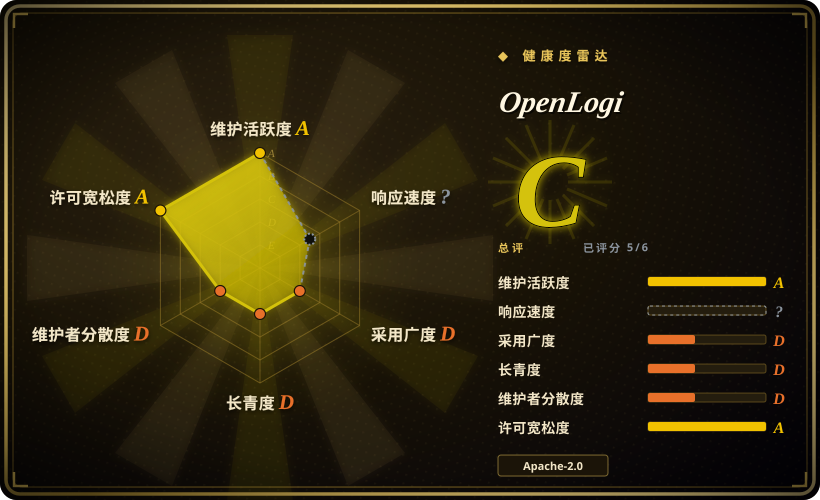
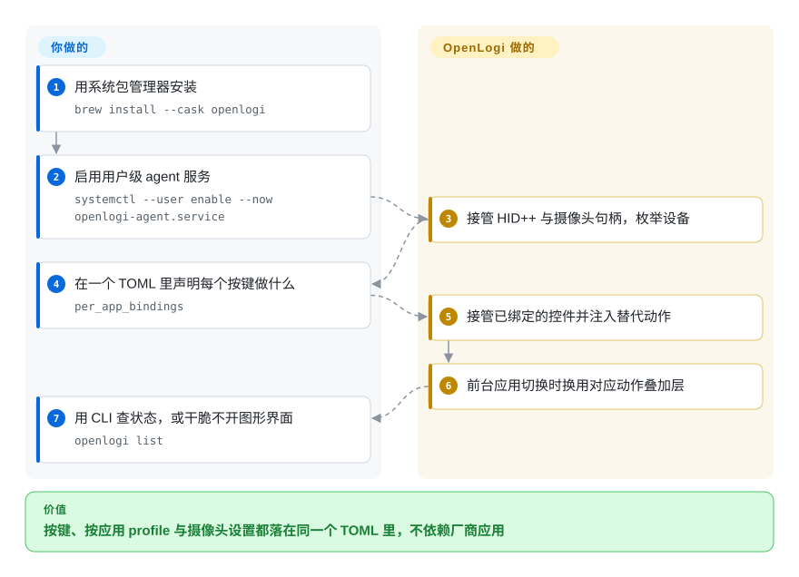

# OpenLogi

本地优先、跨平台的 Logitech Options+ 替代品：用 HID++ 驱动罗技键鼠、用 UVC 驱动罗技摄像头，GUI、常驻 agent 与 CLI 共享同一份 TOML 配置。

## 何时使用

你日常用一只罗技鼠标（MX 系列，或任何跑在 Bolt／Unifying 接收器上的型号）加一把罗技键盘，而且你在 Linux 上——罗技根本没有为 Linux 发布 Options+。设备本身是能用的：指针、点击、滚轮、打字都没问题。不能用的是你花钱买它的那些理由：拇指轮和 ModeShift 键按下去没反应，手势键没有手势，DPI 还是上一台 Windows 机器写进板载内存的值，也没办法让编辑器和终端各自用一套按键映射。你手上两个成熟选项都够不着：Solaar 是 Linux 专用的罗技设备管理器，logiops 是手写配置、没有 GUI 也没有配对功能的 root 守护进程。

你要的是把厂商应用给 Windows／macOS 用户的整套能力——按键与手势重映射、按应用 profile、DPI／SmartShift、键盘重映射与静态 RGB，外加罗技摄像头的图像控制——在 macOS、Linux、Windows 上用同一个程序拿到，配置落在你能提交进版本库的纯 TOML 里，还有一个能写脚本的 CLI。相对 Solaar，这里的取舍是「广度换成熟度」：OpenLogi 覆盖 Solaar 不覆盖的设备和平台（摄像头、键盘灯效、Windows／macOS），但它只有几个月历史、还没到 1.0，而 Solaar 从 2012 年就在发货。

## 怎么用起来

OpenLogi 由两个协作进程组成，共享同一份配置文件。**GUI**（`OpenLogi.app`／`.exe`）只是编辑器和各个视图；**常驻 agent** 才持有全部设备 I/O——它打开 HID++、raw-HID 与摄像头句柄，接管你绑定过的按键，再通过操作系统输入钩子注入替代的按键或点击。两者走本地 RPC 通道通信，所以关掉窗口不会停掉你的映射。双方读的是同一份 TOML：`~/.config/openlogi/config.toml`（Windows 为 `%USERPROFILE%\.config\openlogi\config.toml`），其中每个设备以自动生成的物理设备 key 为条目，内含 `bindings`、可选的 `per_app_bindings` 叠加层、DPI、滚动、灯效与摄像头设置。你只需要决定某个按键该做什么——在 GUI 里点，或者直接改文件——agent 把这份声明变成「接管的控件 + 发出的动作」；HID++ 层面的活不用你写。

<!-- flow-steps:begin (generated from flows/openlogi.json by tools/flow_card.py — do not edit) -->

流程文字版

1. **你**：安装并启用常驻 agent（GUI 只是编辑器） — `brew install --cask openlogi · openlogi-agent.service`
2. **OpenLogi**：接管 HID++ 与摄像头句柄，枚举设备
3. **你**：在一个 TOML 里声明每个按键做什么 — `config.toml — bindings / per_app_bindings`
4. **OpenLogi**：接管已绑定的控件并注入替代动作
5. **OpenLogi**：前台应用切换时换用对应动作叠加层

**价值**：按键、按应用 profile 与摄像头设置都落在同一个 TOML 里，不依赖厂商应用

<!-- flow-steps:end -->

## 何时不用

- **你在 Linux 上，想要成熟、文档最全、并且带接收器配对的罗技设备管理器。** 改用 [Solaar](solaar.zh.md)：它自 2012 年持续发布，被 Debian／Fedora／Arch 打包，能管理 Unifying／Bolt 的配对、解绑与设备状态。OpenLogi 的长处是厂商应用的功能面，不是设备管理深度。
- **你只需要发行版原生包和一个自己已经熟悉的 root 守护进程加配置文件。** 改用 [logiops](logiops.zh.md)：如果稳定性优先于功能广度，它长期的发布历史与打包体系胜过一款 4 个月大、尚未 1.0 的应用。
- **你要的是只管鼠标、免安装、便携的 GUI，而且不想有任何后台服务。** 改用 [Mouser](mouser.zh.md)：同一个细分场景，但范围更窄、无常驻进程。
- **你需要 Logi Flow（跨机剪贴板／文件流转）、固件更新，或 Easy-Switch 与键盘配对管理。** 这些不在 OpenLogi 的文档功能集里，请用罗技自家的 Options+／G HUB；不过在据此下结论前先看一遍仓库现状——README 里没写不等于代码里没有。`[未验证]`
- **你需要一个能冻结数年的配置 schema。** OpenLogi 的 README 明说项目处于活跃开发中、功能与配置仍可能变化；配置带 `schema_version`（当前为 `7`），有文档化的迁移，且高于当前构建版本的 schema 会被拒绝加载。对一份打算长期不动的 dotfile 来说，这种变动是真实成本。
- **你必须同时继续跑 Options+。** 同一个接收器的 HID++ 访问权只能被一个进程持有；OpenLogi 的安装说明要求你先退出 Options+。如果你的流程依赖 Options+ 的 Flow 或 Marketplace，那 OpenLogi 无法作为叠加方案存在。

## 横向对比

| 替代品 | 是否收录 | 我们的评价 | 取舍 |
|---|---|---|---|
| [Solaar](solaar.zh.md) | ✅ | 在 Linux 上，当接收器配对、设备状态和 14 年维护记录比功能广度更重要时选 Solaar；当你想要按应用 profile、键盘重映射、摄像头控制，并且希望 macOS／Windows 用同一个程序时选 OpenLogi。 | Solaar 换来成熟度、发行版打包与配对／解绑能力；代价是仅限 Linux、GTK 时代的界面，且没有摄像头与灯效。OpenLogi 换来广度与现代原生界面；代价是 1.0 之前的持续变动，以及完全没有配对管理。 |
| [Mouser](mouser.zh.md) | ✅ | 当只管鼠标、便携的 Windows／macOS／Linux GUI 就够、并且你绝不想要后台服务时选 Mouser；当键盘、摄像头、Litra 灯或挂在接收器上的设备也在范围内时选 OpenLogi。 | Mouser 换来「下载即用」的形态和对 MX 鼠标明确的覆盖策略；代价是 profile 映射仍为全局而非按设备，且完全不覆盖键盘、摄像头与灯效。 |
| [logiops](logiops.zh.md) | ✅ | 在 Linux 上，比起 GUI 你更想要 root systemd 守护进程加手写配置、并且设备是 HID++ 2.0+ 鼠标时选 logiops；当你想要 GUI、跨平台安装包和摄像头支持时选 OpenLogi。 | logiops 换来 Debian／Fedora／AUR 打包与稳定的配置语言；代价是 root 守护进程、没有 GUI，以及已放缓到约两年一版的发布节奏。OpenLogi 正好相反：迭代快、用户级、覆盖广——但也年轻得多。 |
| Logitech Options+（官方） | 未收录 | 如果你需要 Flow、Smart Actions、Marketplace、企业批量部署，或厂商背书的固件与设备支持，且你在 Windows／macOS 上，就继续用 Options+。 | Options+ 是唯一具备 Flow、固件更新和罗技完整设备质量保证的选项；代价是没有 Linux 版本、且应用闭源。OpenLogi 用这些换来了本地优先的文本配置、CLI 与 Linux 支持。 |
| Logitech G HUB（官方） | 未收录 | 如果你的硬件是罗技 *G* 系列游戏外设、需要游戏感知 profile 与覆盖 G 键盘／鼠标／耳机的 LIGHTSYNC，就选 G HUB。 | G HUB 覆盖 OpenLogi 完全不碰的 G 生态（音频、赛车、游戏库）；OpenLogi 覆盖罗技生产力 HID++ 产品线，而 G HUB 不管这条线。 |

## 技术栈

- **语言：** Rust（edition 2024，`rust-version = 1.98`），组织为 21 个 crate 的 workspace。
- **界面：** GPUI（Zed 的 GPU 加速 Rust UI 框架），Actions Ring 由单独的 overlay crate 实现；GUI、agent 与 CLI 由同一个 workspace 构建。
- **进程模型：** GUI 加常驻 agent，通过 RPC 通信（`tarpc` 跑在 `interprocess` 本地传输上）；agent 是设备句柄的唯一持有者。
- **设备层：** `openlogi-hidpp`（对 `hidpp` crate 的 vendored fork，0BSD 许可）与 `openlogi-hidpp-derive`；`openlogi-hid` 作 HID 抽象；`openlogi-camera` 处理 UVC；`openlogi-inject`／`openlogi-hook` 负责系统级输入捕获与注入；`openlogi-permissions` 处理系统权限申请；Windows 后端用 `windows-sys`。
- **配置：** 纯 TOML，要求 `schema_version`（当前 `7`）并带加载时迁移；GUI 原子写入，保留 `config.toml.backup.1`–`.5`。

## 依赖

- **硬件：** 罗技 HID++ 设备（Bolt 或 Unifying 接收器、蓝牙、有线均可）和／或任意罗技 UVC 摄像头。能力按设备、按设备自报的 feature 判定——不是「所有罗技都支持」的承诺。
- **系统：** macOS 13+；Linux 需要包内附带的 udev 规则，给用户授予 `/dev/hidraw*`、`/dev/uinput` 与鼠标 `/dev/input/event*` 的访问权（预编译 Linux 包要求 GLIBC 2.35+，即 Ubuntu 22.04 基线）；Windows 10／11 需把 `OpenLogi.exe` 与 `openlogi-agent.exe` 放在一起。
- **无账号、无遥测、无托管后端。** 设备渲染图资源会并发探测 `assets.openlogi.org`、带版本的 Cloudflare Pages 别名与固定版本的 jsDelivr npm 包，可用 `OPENLOGI_ASSETS` 固定来源。
- **共存约束：** 同一接收器的 HID++ 访问权只能被一个进程持有，所以跑 OpenLogi 时必须退出 Logi Options+。

## 运维难度

**中等。** 安装本身确实简单——签名的 `.dmg` 或 `brew install --cask openlogi`、自带 udev 规则的 `.deb`／`.rpm`／`.pkg.tar.zst`、NixOS 模块，或签名的 `.msi`／便携 zip。中等的是之后要操作的东西：一个必须处于运行状态才让映射生效的用户级 agent（Linux 上是 `systemctl --user enable --now openlogi-agent.service`）；一份严格、带版本的 TOML，写错、过时或超范围的字段会让配置直接拒绝加载并把 GUI 降为只读；以及文档明确说明**并非全自动**的迁移（当存在两台同型号设备时，v2 的 model-key 设备设置无法安全地映射到 v3 物理设备 key）。GUI 打开时改文件是文档化的冲突——下一次 GUI 保存会被拒绝而不是合并。这些都不难，但它是一个由你负责的配置面，而不是一个向导。

## 健康度与可持续性

- **维护活跃度——非常活跃（截至 2026-09-20）。** `pushed_at` 为 2026-09-19T21:36:02Z；最新版本 v0.8.6 发布于 2026-09-19，v0.8.2–v0.8.5 都在此前三周内；过去 12 个月约 1,494 次提交；未归档。这与「停滞」正好相反。
- **治理与维护者分散度——单一所有者，无基金会。** 仓库属于 `User` 账号（`AprilNEA`）；贡献数分别为 `AprilNEA` 1,206、`davidbudnick` 52、`cserby` 25，路线图和绝大多数代码都压在一个人身上。有署名贡献者各自负责整个子系统（Windows／摄像头／i18n；Linux 移植），这分散了知识但没有分散决策权。
- **项目年龄与 Lindy——年轻且热度高，所以把 star 当作关注度而非存活证据。** 创建于 2026-05-24（截至 2026-09 约 4 个月），却有约 21.7k star。这个比例是教科书的「年轻 + 当红」形态：它说明大家想要这个东西，不说明它已被验证。
- **采用与生态——分发渠道真实，支持负载未消化。** 官方 Homebrew cask、发行版包、NixOS 模块、签名 MSI，21,660 star、701 fork。按本索引的雷达口径，**采用广度评级为 C，依赖方数量为 0**——该轴看的是依赖图与安装触达，一个没有库依赖方的终端桌面应用天然在这里得分低，不代表没人用。真正的反面是 4 个月大的仓库上有 587 个未关闭的 issue 加 PR；元数据无法区分增长压力与积压。`[推断]`
- **响应速度未评分（`?`）**——评分器找不到符合条件的首次响应窗口，而这本身就是对 4 个月大仓库最诚实的读法：还没有足够的已回复 issue 历史可供度量。
- **风险旗标——1.0 之前的变动，以及品牌资源的例外条款。** 双许可 MIT OR Apache-2.0（宽松，无换证历史），但 `design/` 下的 logo 与应用图标被明确保留权利，fork 不能使用 OpenLogi 名称或图标。HID++ crate 是对上游 0BSD crate 的 vendored fork，另有一个依赖被钉到 OpenLogi 专有版本（`async-hid = "=0.5.3-openlogi.1"`）——需要额外跟踪的供应链面。

## 存疑（未验证）

- `[未验证]` **设备支持是逐设备的，且没有清单。** README 列出了 HID++ feature ID（`0x2201` DPI、`0x2111` SmartShift、`0x2121` 滚动反向、`0x8070`／`0x8080` RGB），并说明部分手势需要设备上报 diversion 与 raw-XY 支持，但没有发布兼容性矩阵。动手前请对着仓库确认你的具体型号。
- `[未验证]` **「在 Windows 11 上以真实硬件做了端到端验证」是 README 的自述**（有线键盘 + Unifying 接收器鼠标，含 MSI 安装／就地升级／卸载）；本文没有独立复现。
- `[未验证]` **功能缺失未获证实。** Logi Flow、固件更新、Easy-Switch 管理、接收器配对都不在 README 的功能清单里；这只能说明文档范围，不能证明代码里没有对应路径。
- `[未验证]` **约 21.7k star 出现在约 4 个月大的仓库上。** 该数字截至 2026-09 经 API 核实，但它作为「被采用」或「被验证」的含义不成立。不要因为这个数字就选它。
- `[推断]` **这么年轻的仓库出现 587 个未关闭 issue 加 PR，反映的是增长压力、分类积压，或两者兼有**——GitHub 元数据无法区分。
- `[未验证]` **macOS 签名与公证**由安装文档自述（签名、已公证的 `.dmg`），本文未独立核实。
- `[推断]` **品牌资源例外意味着下游 fork 必须改名换图标**，依据是 `design/LICENSE` 把 logo／图标排除在 MIT／Apache 授权之外，而不是某条明确的 fork 政策。
- `[未验证]` **GitHub 的 license API 只报告 `Apache-2.0`**，而 workspace 清单声明 `MIT OR Apache-2.0`；双许可是依据 `Cargo.toml` 加两个 `LICENSE-*` 文件判定的。
