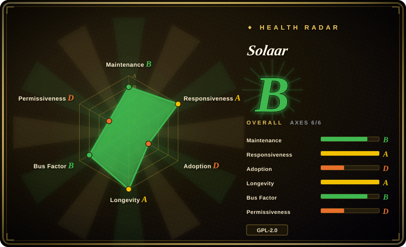
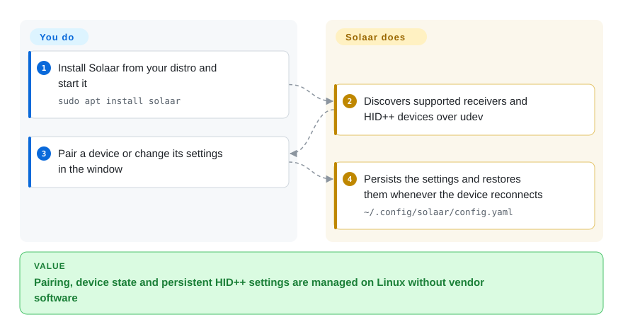

# Solaar

The long-lived Linux device manager for Logitech gear: pair and unpair receivers, read device state and battery, change HID++ settings, remap buttons and run rules — all locally, no vendor software.

## When to use

You run Linux, your desk has a Unifying or Bolt receiver with a mouse and a keyboard on it, and you need to do *device management*, not just remapping: a new mouse arrives and has to be paired into a receiver slot; a keyboard needs unpairing before it goes to a colleague; you want to see battery level and charge state for every attached device from one window. The vendor answer does not exist on Linux, and the alternatives are shaped differently — [logiops](logiops.md) is a root daemon with no GUI and no pairing at all, while [OpenLogi](openlogi.md) is a young pre-1.0 app whose documented scope is the Options+ feature set rather than device management.

You reach for Solaar when you want the boring, well-trodden path: `sudo apt install solaar` (or the Fedora/Arch package), a GTK window that discovers your receivers over udev, explicit pairing and unpairing, and a settings panel covering what the device actually reports. Its advantage over every alternative here is not features but a 14-year record — a project that has survived kernel and HID++ changes since 2012 and still ships releases is the safest bet in this category. The tradeoff you accept: Linux-only scope, no webcam or keyboard-RGB support, and a rules feature whose platform coverage is uneven under Wayland.

## How it works

Solaar is a Python/GTK application that assumes it can talk to your Logitech receivers and devices directly. Once a udev rule grants your user access to `/dev/hidraw*` and `/dev/uinput` (the packaged install ships it), Solaar discovers receivers, Bluetooth-connected and directly-attached HID++ devices, and shows them in one window; a small bundled HID++ implementation speaks the protocol so Solaar can read device features and change settings without root. You pair a device into an empty receiver slot (Bolt adds a passcode/click confirmation), or you flip a setting for a device you already own. The GUI is meant to keep running: it re-applies your settings when a device reconnects, which is why it registers itself as a hidden XDG autostart entry. A CLI (`solaar show`, `config`, `profiles`, `pair`, `unpair`) is there for one-off checks and scripts, and a rules engine can trigger actions on HID++ notifications — but only for controls the device is willing to divert, which is a per-device limit, not a Solaar one.

<!-- flow-steps:begin (generated from flows/solaar.json by tools/flow_card.py — do not edit) -->

Text version of the flow

1. **You**: Install Solaar from your distro and start it — `sudo apt install solaar`
2. **Solaar**: Discovers supported receivers and HID++ devices over udev
3. **You**: Pair a device or change its settings in the window
4. **Solaar**: Persists the settings and restores them whenever the device reconnects — `~/.config/solaar/config.yaml`

**Value**: Pairing, device state and persistent HID++ settings are managed on Linux without vendor software

<!-- flow-steps:end -->

## When NOT to use

- **You need the Options+ feature set — per-application profiles, gestures, an actions ring, keyboard remapping, webcam or lighting control.** Use [OpenLogi](openlogi.md) instead, because Solaar's scope is a Logitech device manager, not a vendor-app clone; its README describes it as explicitly *not* a device driver.
- **You want a single portable GUI on Windows or macOS.** Solaar is a Linux tool; macOS support is limited (pairing and settings work, rules and diversion do not) and Windows is not supported. Use [Mouser](mouser.md) for a cross-platform mouse-first GUI, or Logitech's own Options+ on Windows/macOS.
- **You want a headless root daemon with a hand-edited config and no GTK dependency.** Use [logiops](logiops.md) instead: Solaar's GUI is meant to keep running, and its rules need a live session to fire.
- **You need reliable rules under Wayland.** The rules system runs on Wayland, but its `Process`/`MouseProcess` conditions are unavailable there, and keyboard-group, modifier and simulated-input paths can produce wrong symbols; GNOME needs the Solaar extension to recover part of it. If your automation depends on those conditions, design around them or stay on X11.
- **You need macros and full gaming-mouse configuration.** Solaar can handle DPI, report rate, lighting and onboard-profile dump/load, but not onboard profile macros, and some gaming-mouse buttons are only reachable by editing YAML profiles — slow enough that the maintainers acknowledge the friction.
- **You run another Logitech configurator at the same time.** Solaar assumes it owns the settings of every device not marked Ignore; running it beside logiops or OpenLogi produces unpredictable results, and the documented fix is to stop one of them.
- **You want a Bluetooth *host-side* pairing workflow.** Solaar discovers and configures Bluetooth-attached devices, but host pairing is the OS's job; Solaar's pairing UI is for receiver slots.

## Comparison

| Alternative | In index | Our verdict | Tradeoff |
|---|---|---|---|
| [OpenLogi](openlogi.md) | ✅ | Choose OpenLogi when you want per-app profiles, gestures, keyboard remapping, webcam controls and Windows/macOS support on a HID++ device; choose Solaar when your job is pairing, device status and settings on Linux and you value a long track record. | Solaar gains 14 years of survival, distro packaging and real pairing/unpairing; it pays with Linux-only scope and no camera, RGB or per-app-profile features. OpenLogi is broader and faster-moving; it pays with pre-1.0 churn and no pairing management. |
| [logiops](logiops.md) | ✅ | Choose logiops when you want a root systemd daemon reading a hand-written config, and your devices are HID++ 2.0+ mice; choose Solaar when you also need HID++ 1.0 devices, Bluetooth/raw-HID attachment, a GUI, or pairing. | logiops gains a config-file workflow an ops-minded user can version and a stable config language; it pays with a root daemon, no GUI and no pairing. Solaar stays user-level via udev ACLs and covers more attachment types. |
| [Mouser](mouser.md) | ✅ | Choose Mouser when a portable, mouse-first GUI on Windows/macOS/Linux is what you want; choose Solaar when the devices are on a receiver, keyboards are in scope, or you need pairing and battery/status reporting. | Mouser gains a download-and-run shape with no package manager or udev rule; it pays with mouse-only coverage, no pairing, and per-application profiles limited to X11 and KDE Wayland. |
| Logitech Options+ (official) | 未收录 | Keep Options+ if you are on Windows/macOS and need Flow, Smart Actions, firmware updates or vendor device QA; choose Solaar if you are on Linux or require an auditable local tool. | Options+ is the only option with Flow, firmware update and vendor support; it pays with no Linux build and a closed application. Solaar trades those away for openness, local execution and Linux coverage. |

## Tech stack

- **Language:** Python 3 (`>=3.8`), packaged as `solaar` with the entry point `solaar.gtk:main`.
- **GUI:** GTK 3 via PyGObject (`gi.require_version("Gtk", "3.0")`) — not GTK4; system-tray icon usually needs Ayatana/AppIndicator, plus a GNOME extension on stock GNOME.
- **Protocol:** a bundled HID++ implementation (`logitech_receiver/hidpp10`, `hidpp20`, receiver/device/settings/diversion modules) with its own `hidapi`/udev layer. It does **not** depend on libratbag/ratbagd.
- **Dependencies:** `evdev`, `pyudev`, `PyYAML`, `python-xlib`, `psutil`, `dbus-python` (Linux), PyGObject/pycairo; optional `Notify`, `hid-parser`, `python-git-info`. Tests use pytest; lint uses Ruff.
- **CLI:** the single `solaar` binary with `show`, `probe`, `config`, `profiles`, `pair`, `unpair` subcommands (the old standalone `solaar-cli` was removed back in 1.0.3).

## Dependencies

- **A Linux desktop with udev**, a reasonably recent kernel, and the `hid-logitech-dj` / `hid-logitech-hidpp` modules with `CONFIG_HIDRAW`; the docs say most features work on kernels newer than 5.2, and some devices want a newer one than that.
- **A udev rule** granting your user access to `/dev/hidraw*` and `/dev/uinput` (`42-logitech-unify-permissions.rules`, using `TAG+="uaccess"`). Distro packages install it; a bare `pip install --user solaar` does not, and you must copy it in and reload udev. Solaar itself then runs **without root** — root is only needed to deploy that rule.
- **A live desktop session.** The GUI is expected to keep running to restore settings and execute rules; there is no systemd service, only a desktop entry and an XDG autostart entry (`solaar --window=hide`).
- **Logitech HID++/Centurion hardware.** Non-Logitech devices are out of scope, and even some directly-attached Logitech devices are unsupported when the model reports no usable information.
- **Coexistence constraint:** do not run it alongside another Logitech settings manager (logiops, OpenLogi) — they fight over the same device settings.

## Ops difficulty

**Medium.** On Debian/Ubuntu/Arch the install is one package command and the udev rule comes with it. Everything else is the friction of a user-session tool: the GUI must be running for settings to be restored and rules to fire; a pip/PyPI install leaves you hand-deploying the udev rule as root; the config lives at `~/.config/solaar/config.yaml` with rules in a separate `~/.config/solaar/rules.yaml` that you may end up hand-editing; and the rules language is powerful enough to be a real debugging surface. Budget time for device-specific quirks rather than for deployment.

## Health & viability

- **Maintenance — active, with uneven bursts (as of 2026-09-20).** Last push 2026-08-18; latest release 1.1.20 on 2026-06-28; ~199 commits in the trailing 12 months but concentrated — 63 in 2026-05, then 7/6/3 in June/July/August. Not archived. Two named maintainers (`pfps`, `ksanislo`) account for ~73% of the last year's commits.
- **Governance & bus factor — a two-person core behind an org-looking account.** The owner is a GitHub Organization (`pwr-Solaar`), but it holds a single public repository with no stated foundation or corporate backing, and the PyPI classifier still says "Development Status :: 4 - Beta" despite a 1.x version line. Bus factor is better than one, but it is a small volunteer core, not a funded team.
- **Age & Lindy — the strongest signal in this category.** Created 2012-09-11 and still shipping, with a documented relicense (MIT → GPLv2, October 2012) and non-trivial issue throughput (≈71 open vs ≈1,720 closed issues). Fourteen years of surviving kernel and HID++ changes is exactly the age × still-active prior this index rewards.
- **Adoption & ecosystem — distro-native, moderate volume.** Packaged by Debian and Arch's official `extra` repo, installable via apt, with Fedora/Ubuntu/NixOS/Gentoo/Mageia paths and a community (unverified-by-upstream) Flathub build; PyPI measures 2,709 downloads/month and Flathub roughly 7.5k/month. That is a solid niche, not mass adoption.
- **Responsiveness — measured Grade A, a 10.6-hour median first response** across 17 qualifying issues. Read it with the tail in mind: individual reports still sit unanswered, so the median and the tail disagree.
- **Risk flags — GPL, security-relevant hardware access, and no security policy.** GPL-2.0-or-later is copyleft, so embedding is constrained — the radar's permissiveness axis grades it D for exactly that reason; the udev rule grants raw device write access, which the project itself warns is risky because firmware writes become theoretically possible; there is no `SECURITY.md`, no CONTRIBUTING/CODEOWNERS, and no published advisory history.

## Caveats (unverified)

- `[未验证]` **License suffix.** Source file headers say "either version 2 of the License, or (at your option) any later version" (⇒ GPL-2.0-or-later), while GitHub's license API and the repo `LICENSE.txt` give the ambiguous `GPL-2.0`. The `-or-later` reading is taken from the source headers and the README badge.
- `[未验证]` **No foundation or corporate backing** was found for the `pwr-Solaar` organization; absence of evidence in its public profile is not proof that none exists.
- `[未验证]` **Windows usability.** Conditional Windows branches exist in `gtk.py`, but there is no Windows install documentation or CI coverage, so Windows support is not established.
- `[未验证]` **No Solaar CVE appears in GitHub Advisories, OSV or NVD as of 2026-09-20.** That only means nothing is registered in those indexes; the `docs/rules.md` and udev-rule warnings about firmware-write exposure are the project's own.
- `[未验证]` **Flathub monthly download figure (~7.5k) and PyPI monthly figure (~2.7k)** are third-party counters and date-sensitive; the Flathub build is community-maintained and explicitly not supported by upstream.
- `[推断]` **Rules capability is per-device, not per-Solaar.** Rules fire only on HID++ notifications and require the control to be divertable, so feature comparisons based on the rules language alone overstate what a given mouse can do.
- `[未验证]` **`docs/installation.md` still says Python 3.7+,** which contradicts `setup.py`/PyPI (`>=3.8`); the package metadata is treated as authoritative.
