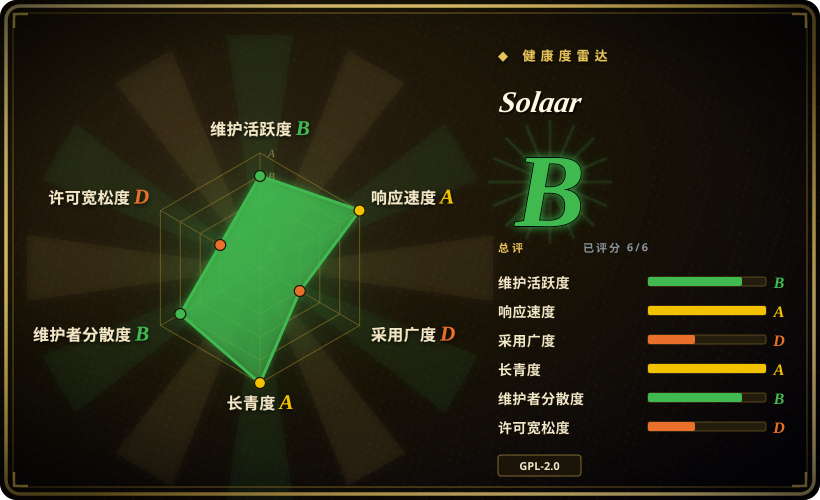
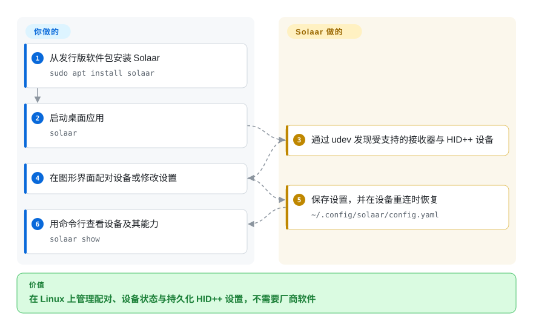

# Solaar

Linux 上历史最久的罗技设备管理器：配对与解绑接收器、读取设备状态与电量、修改 HID++ 设置、重映射按键、跑规则——全部本地完成，不需要厂商软件。

## 何时使用

你在 Linux 上办公，桌上是一个 Unifying 或 Bolt 接收器带一只鼠标加一把键盘，而你需要的是**设备管理**，不只是重映射：新鼠标到了，得配对进接收器的一个槽位；键盘要送给同事之前得先解绑；你想在一个窗口里看到所有已连接设备的电量与充电状态。这件事在 Linux 上没有厂商答案，而替代品形状都不同——[logiops](logiops.zh.md) 是 root 守护进程，没有 GUI，也完全没有配对；[OpenLogi](openlogi.zh.md) 是年轻的 1.0 之前项目，文档范围是 Options+ 的功能集，而不是设备管理。

你选 Solaar，是因为要的就是那条最不起眼、被踩得最实的路：`sudo apt install solaar`（或 Fedora／Arch 的包），一个通过 udev 发现接收器的 GTK 窗口，显式的配对与解绑，以及一个覆盖设备实际上报能力的设置面板。它相对本类所有替代品的优势不是功能，而是 14 年的记录——一个从 2012 年起扛过内核与 HID++ 变化、至今仍在发版的项目，是本分类里最稳的一个赌注。你接受的取舍是：仅限 Linux、不覆盖摄像头与键盘 RGB，以及规则功能在 Wayland 下的平台覆盖不齐。

## 怎么用起来

Solaar 是一个 Python／GTK 应用，前提是它能直接跟你的罗技接收器与设备对话。一旦 udev 规则授予用户访问 `/dev/hidraw*` 与 `/dev/uinput` 的权限（发行版包会自带这条规则），Solaar 就能发现接收器、蓝牙直连与直接连接的 HID++ 设备并显示在同一个窗口里；自带的一份精简 HID++ 实现让它无需 root 就能读取设备能力并修改设置。你把设备配对进接收器的空槽位（Bolt 会多一步 passcode 或点击确认），或者直接切换某台设备的某个设置。GUI 的设计前提是**保持运行**：设备重连时它会重新应用你的设置，这也是它把自己注册成隐藏的 XDG 自启动项的原因。CLI（`solaar show`、`config`、`profiles`、`pair`、`unpair`）用来做一次性查看和脚本化操作，规则引擎则在收到 HID++ 通知时触发动作——但只对设备愿意 divert 的控件生效，这是逐设备的限制，不是 Solaar 的限制。

<!-- flow-steps:begin (generated from flows/solaar.json by tools/flow_card.py — do not edit) -->

流程文字版

1. **你**：从发行版安装 Solaar 并启动 — `sudo apt install solaar`
2. **Solaar**：经 udev 发现受支持的接收器与 HID++ 设备
3. **你**：在界面里配对设备，或修改它的设置
4. **Solaar**：把设置持久化，设备重连时自动恢复 — `~/.config/solaar/config.yaml`

**价值**：在 Linux 上管理配对、设备状态与持久化 HID++ 设置，不需要厂商软件

<!-- flow-steps:end -->

## 何时不用

- **你需要 Options+ 那套功能——按应用 profile、手势、Actions Ring、键盘重映射、摄像头或灯效控制。** 改用 [OpenLogi](openlogi.zh.md)：Solaar 的范围是罗技设备管理器，不是厂商应用克隆；它的 README 明确说自己**不是**设备驱动。
- **你想要 Windows 或 macOS 上一个便携 GUI。** Solaar 是 Linux 工具；macOS 支持有限（配对与设置可用，规则与 diversion 不可用），Windows 不受支持。跨平台鼠标优先的 GUI 用 [Mouser](mouser.zh.md)，Windows／macOS 上也可以用罗技官方 Options+。
- **你想要无头 root 守护进程加手改配置，并且不想引入 GTK 依赖。** 改用 [logiops](logiops.zh.md)：Solaar 的 GUI 设计上就要一直运行，规则也依赖活动会话才能触发。
- **你需要在 Wayland 下可靠地跑规则。** 规则系统能在 Wayland 上运行，但 `Process`／`MouseProcess` 等条件在那里不可用，键盘组、修饰键与模拟输入路径也可能产生错误符号；GNOME 上要靠 Solaar 扩展补回一部分。如果你的自动化依赖这些条件，请绕开它们或留在 X11。
- **你需要宏和完整的游戏鼠标配置。** Solaar 能处理 DPI、回报率、灯效与板载 profile 的导入导出，但不支持板载 profile 宏，某些游戏鼠标按键只能靠手改 YAML profile 才能映射——维护者自己承认这个流程繁琐。
- **你同时还在跑另一个罗技配置工具。** Solaar 假定自己独占所有未标为 Ignore 的设备设置；与 logiops 或 OpenLogi 同时运行会产生不可预测的行为，文档给出的解决办法就是停掉其中一个。
- **你想要蓝牙主机侧的配对流程。** Solaar 能发现并配置蓝牙连接的设备，但主机侧配对是操作系统的职责；Solaar 的配对界面是给接收器槽位用的。

## 横向对比

| 替代品 | 是否收录 | 我们的评价 | 取舍 |
|---|---|---|---|
| [OpenLogi](openlogi.zh.md) | ✅ | 当你想要按应用 profile、手势、键盘重映射、摄像头控制，并希望 Windows／macOS 上对 HID++ 设备用同一套东西时选 OpenLogi；当你的任务是在 Linux 上做配对、设备状态与设置、并且看重长期记录时选 Solaar。 | Solaar 换来 14 年的存活记录、发行版打包和真正的配对／解绑能力；代价是仅限 Linux，且没有摄像头、RGB 与按应用 profile。OpenLogi 更广、更快，代价是 1.0 之前的变动与完全没有配对管理。 |
| [logiops](logiops.zh.md) | ✅ | 当你想要一个读手写配置的 root systemd 守护进程、且设备是 HID++ 2.0+ 鼠标时选 logiops；当你还需要 HID++ 1.0 设备、蓝牙／raw-HID 直连、GUI 或配对时选 Solaar。 | logiops 换来可版本化的配置文件工作流与稳定的配置语言；代价是 root 守护进程、没有 GUI、没有配对。Solaar 靠 udev ACL 保持用户级，并覆盖更多连接方式。 |
| [Mouser](mouser.zh.md) | ✅ | 当你要的是 Windows／macOS／Linux 上便携、鼠标优先的 GUI 时选 Mouser；当设备挂在接收器上、键盘在范围内、或你需要配对与电量／状态查看时选 Solaar。 | Mouser 换来免安装包管理器、免 udev 规则的「下载即用」；代价是只覆盖鼠标、没有配对，且按应用 profile 仅限 X11 与 KDE Wayland。 |
| Logitech Options+（官方） | 未收录 | 如果你在 Windows／macOS 上需要 Flow、Smart Actions、固件更新或厂商设备质量保证，就继续用 Options+；如果你在 Linux 上或需要可审计的本地工具，就选 Solaar。 | Options+ 是唯一具备 Flow、固件更新与厂商支持的选项；代价是没有 Linux 版本、应用闭源。Solaar 用这些换来开放性、本地执行与 Linux 覆盖。 |

## 技术栈

- **语言：** Python 3（`>=3.8`），打包为 `solaar`，入口是 `solaar.gtk:main`。
- **界面：** 通过 PyGObject 使用 GTK 3（`gi.require_version("Gtk", "3.0")`），不是 GTK4；系统托盘通常需要 Ayatana／AppIndicator，原版 GNOME 上还要装扩展。
- **协议：** 自带一套 HID++ 实现（`logitech_receiver/hidpp10`、`hidpp20` 以及 receiver／device／settings／diversion 模块），底层是自己的 `hidapi`／udev 层。它**不**依赖 libratbag／ratbagd。
- **依赖：** `evdev`、`pyudev`、`PyYAML`、`python-xlib`、`psutil`、`dbus-python`（Linux）、PyGObject／pycairo；可选 `Notify`、`hid-parser`、`python-git-info`。测试用 pytest，lint 用 Ruff。
- **CLI：** 单一 `solaar` 可执行文件，带 `show`、`probe`、`config`、`profiles`、`pair`、`unpair` 子命令（旧的独立 `solaar-cli` 早在 1.0.3 就被移除）。

## 依赖

- **带 udev 的 Linux 桌面**、较新的内核，以及启用 `CONFIG_HIDRAW` 的 `hid-logitech-dj`／`hid-logitech-hidpp` 模块；文档称大多数功能在内核 5.2 以上可用，部分设备要更新的内核。
- **一条 udev 规则**，给用户授予 `/dev/hidraw*` 与 `/dev/uinput` 的访问权（`42-logitech-unify-permissions.rules`，使用 `TAG+="uaccess"`）。发行版包会装上；裸的 `pip install --user solaar` 不会，需要你自己拷进去并重载 udev。之后 Solaar 本身**不需要 root**——root 只用于部署这条规则。
- **一个活动的桌面会话。** GUI 需要保持运行才能恢复设置与执行规则；没有 systemd 服务，只有桌面入口和 XDG 自启动项（`solaar --window=hide`）。
- **罗技 HID++／Centurion 硬件。** 非罗技设备不在范围内，甚至部分直连的罗技设备在型号信息不足时也不受支持。
- **共存约束：** 不要与另一个罗技设置管理器（logiops、OpenLogi）同时运行——它们会争抢同一批设备设置。

## 运维难度

**中等。** 在 Debian／Ubuntu／Arch 上安装就是一条包管理命令，udev 规则随包而来。其余摩擦都来自它是一个用户会话工具：GUI 必须运行，设置才会被恢复、规则才会触发；用 pip／PyPI 安装则要自己以 root 部署 udev 规则；配置在 `~/.config/solaar/config.yaml`，规则另存 `~/.config/solaar/rules.yaml`，很可能最终由你手改；规则语言足够强大，因此本身就是一个实打实的调试面。要预留的是处理逐设备怪癖的时间，而不是部署时间。

## 健康度与可持续性

- **维护活跃度——活跃但节奏不均（截至 2026-09-20）。** 最后推送 2026-08-18；最新版本 1.1.20 发布于 2026-06-28；过去 12 个月约 199 次提交，但分布集中——2026-05 有 63 次，随后 6／7／8 月分别为 7／6／3 次。未归档。两位署名维护者（`pfps`、`ksanislo`）承担了去年约 73% 的提交。
- **治理与维护者分散度——看似组织的账号背后是两人核心。** 所有者是 GitHub Organization（`pwr-Solaar`），但它只有一个公开仓库，没有声明的基金会或公司背书，且 PyPI 分类仍写着「Development Status :: 4 - Beta」，尽管版本已进入 1.x。分散度好过单人，但这是小型志愿者核心，不是有资金支持的团队。
- **项目年龄与 Lindy——本分类最强的信号。** 创建于 2012-09-11 且仍在发版，有一次有记录的换证（MIT → GPLv2，2012 年 10 月），issue 吞吐也不小（约 71 个未关闭对约 1,720 个已关闭）。14 年扛过内核与 HID++ 变化，正是本索引所奖励的「年龄 × 仍活跃」先验。
- **采用与生态——发行版原生，量级中等。** 由 Debian 与 Arch 官方 `extra` 仓库打包，可用 apt 安装，另有 Fedora／Ubuntu／NixOS／Gentoo／Mageia 路径，以及一个上游未验证的 Flathub 社区构建；PyPI 测得每月 2,709 次下载，Flathub 约每月 7.5k。这是一个扎实的细分市场，不是大众采用。
- **响应速度——测得评级 A，首次响应中位数 10.6 小时**（17 个合格 issue）。要连着长尾一起读：个别报告仍然无人回复，中位数与长尾并不一致。
- **风险旗标——GPL、与安全相关的硬件访问，以及没有安全策略。** GPL-2.0-or-later 是 copyleft，嵌入因此受限——雷达的许可宽松度轴正是因此给它 D；udev 规则授予原始设备写权限，项目自己也警告这在理论上让固件写入成为可能；仓库没有 `SECURITY.md`、没有 CONTRIBUTING／CODEOWNERS，也没有已公布的 advisory 历史。

## 存疑（未验证）

- `[未验证]` **许可证后缀。** 源文件头写的是「either version 2 of the License, or (at your option) any later version」（即 GPL-2.0-or-later），而 GitHub 的 license API 与仓库 `LICENSE.txt` 只给出含糊的 `GPL-2.0`。这里采用源码头与 README 徽章的 `-or-later` 读法。
- `[未验证]` **未发现 `pwr-Solaar` 组织有基金会或公司背书**；其公开资料里查不到，不等于不存在。
- `[未验证]` **Windows 可用性。** `gtk.py` 里有 Windows 条件分支，但没有 Windows 安装文档或 CI 覆盖，因此 Windows 支持不成立。
- `[未验证]` **截至 2026-09-20，GitHub Advisories、OSV 与 NVD 中都没有 Solaar 的 CVE 记录。** 这只说明这些索引里没有登记；`docs/rules.md` 与 udev 规则关于固件写入暴露面的警告来自项目自身。
- `[未验证]` **Flathub 月下载约 7.5k、PyPI 月下载约 2.7k** 属于第三方计数器且随时间变化；Flathub 构建由社区维护，上游明确表示不支持。
- `[推断]` **规则能力是逐设备的，不是 Solaar 的。** 规则只在收到 HID++ 通知时触发，且要求该控件可被 divert，因此仅凭规则语言比较会高估某只鼠标的实际能力。
- `[未验证]` **`docs/installation.md` 仍写 Python 3.7+**，与 `setup.py`／PyPI 的 `>=3.8` 矛盾；此处以包元数据为准。
