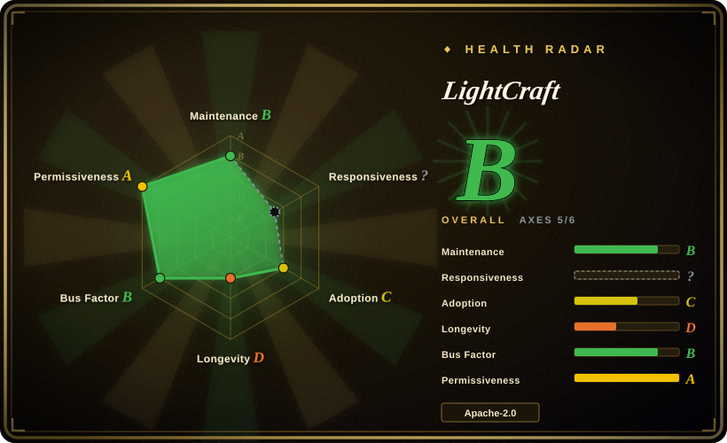
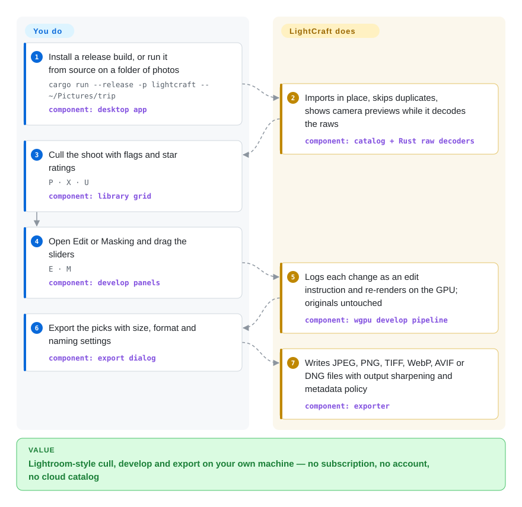

# LightCraft

Lightroom rents you a monthly subscription and keeps every rating and edit inside Adobe's catalog, while the open-source raw developers that could replace it (darktable, RawTherapee) look and behave nothing like it. LightCraft is a Lightroom-shaped photo library and raw developer — "raw" being the unprocessed sensor file your camera writes — that runs entirely on your machine, and every button in it is also a command a script or an AI agent can call.

## When to use

You shoot a few thousand frames a year on a Sony, Nikon, Fujifilm or older Canon body, cull and develop them in Lightroom, and the renewal email just arrived. You have tried darktable once: a module stack, a scene-referred workflow and a UI unlike anything in your muscle memory, so you went back. Or you are the developer on a small studio team who wants an agent to do the boring part — "flag the sharp ones from yesterday's shoot, pull the highlights down 45, export 2048 px JPEGs" — and Lightroom gives you no way to script that short of a plugin SDK.

LightCraft is worth trying in exactly that gap. It copies Lightroom's *workflow* — library with ratings/flags/albums, the same Light/Color/Effects sliders, masking, presets, sync settings, and even an importer for an existing Lightroom Classic `.lrcat` catalog — without Adobe's code or assets, it is MIT OR Apache-2.0 instead of GPL, and it exposes the whole app as commands over a CLI, a JSON control channel and an MCP server (the protocol agents like Claude use to call tools). The deciding tradeoff against darktable and RawTherapee is familiarity and agent control versus maturity: they have a decade of camera coverage and colour calibration, while LightCraft was created on 2026-09-30 and its own roadmap puts it at roughly 60–70% of a day-to-day Lightroom replacement.

## How it works

You point it at a folder; it copies nothing unless you ask, records every photo in its own library, and shows the camera's embedded preview at once while it decodes the raw itself with its own pure-Rust decoders (no LibRaw or other C library underneath). Every slider move is stored as a small edit instruction, not baked into pixels — the original file is never touched, like a recipe card clipped to a negative rather than a retouched print — and the library itself is an append-only log of those operations. Rendering runs as GPU compute shaders through wgpu (Metal, Vulkan or DirectX 12) with an all-cores CPU fallback that the project checks against the GPU output. You do the looking and deciding; LightCraft does the decoding, colour math, rendering and export. The same command registry that the menus call is what `lightcraft-cli run`, the `--control` socket and `lightcraft-cli mcp` expose, so an agent drives the real app rather than a side door.

<!-- flow-steps:begin (generated from flows/lightcraft.json by tools/flow_card.py — do not edit) -->

Text version of the flow

1. **You**: Install a release build, or run it from source on a folder of photos — `cargo run --release -p lightcraft -- ~/Pictures/trip` — component: `desktop app`
2. **LightCraft**: Imports in place, skips duplicates, shows camera previews while it decodes the raws — component: `catalog + Rust raw decoders`
3. **You**: Cull the shoot with flags and star ratings — `P · X · U` — component: `library grid`
4. **You**: Open Edit or Masking and drag the sliders — `E · M` — component: `develop panels`
5. **LightCraft**: Logs each change as an edit instruction and re-renders on the GPU; originals untouched — component: `wgpu develop pipeline`
6. **You**: Export the picks with size, format and naming settings — component: `export dialog`
7. **LightCraft**: Writes JPEG, PNG, TIFF, WebP, AVIF or DNG files with output sharpening and metadata policy — component: `exporter`

**Value**: Lightroom-style cull, develop and export on your own machine — no subscription, no account, no cloud catalog

<!-- flow-steps:end -->

## When NOT to use

- **Your edits must look like Lightroom's, or your existing Lightroom edits must carry over exactly.** Look parity is "tuned by eye" by the project's own admission, there is no measured fidelity suite yet, and the `.lrcat` importer renders unsupported Adobe profiles and AI settings approximately. Stay on Adobe Lightroom for client work that has to match previous deliveries.
- **You shoot recent Canon (CR3), compressed Olympus, or a body outside the tested corpus.** Only some CR3 variants (verified on M50, R100, R8) decode from sensor data; others and compressed ORF fall back to the embedded JPEG preview, and there is no measured camera colour calibration database, so non-DNG raws use estimated or neutral colour (open issues report a CR2 with no colour and odd Sony ARW renders). Use [darktable](https://github.com/darktable-org/darktable) or RawTherapee, whose decoders and camera profiles cover far more models.
- **You need AI masks, AI denoise, HDR editing, video, or Print/Book/Map.** Sky/subject masks are classical heuristics, SAM 3 masks and AI denoise need weights you fetch yourself under non-permissive licences, and HDR/video/Classic modules are 0–30% done. Use Lightroom for AI features; use darktable when you need its print and map modules in open source.
- **You need a tool you can bet a ten-year archive on today.** It is nine days old, shipped five releases in six days, is written largely through AI coding-agent branches merged in batches, and has no GitHub CI test gate (tests run locally via `cargo xtask ci`). For a long-lived archive, darktable's 13-year GPL track record is the safer default; keep originals and XMP sidecars so you can leave.
- **You want your photos backed up and browsable across phones and family members.** LightCraft is a single-machine desktop/browser app with no sync by design. Use [Immich](../document-management/immich.md) for a self-hosted, multi-device photo library and keep a raw developer for the editing.
- **You plan to ship a fork or embed its crates in a closed product.** The ArtCraft name and logos are not covered by the code licence (forks must remove them), and the SAM 3 port in `crates/segment` is Apache-2.0 only. Read `NOTICE` before redistributing; if all you need is raw decoding inside your own product, an established decoder library such as LibRaw (LGPL-2.1 or CDDL) is the conventional route.

## Comparison

| Alternative | In index | Our verdict | Tradeoff |
|---|---|---|---|
| Adobe Lightroom / Lightroom Classic | not a repo | Pick Lightroom when output must match prior edits, when you rely on AI masks/denoise, or when your camera is new; pick LightCraft when you want the same workflow without a subscription and with a scriptable, agent-drivable command surface. | Closed, paid subscription with cloud sync and mature camera profiles; LightCraft is free and local but trails on colour fidelity, camera coverage and AI features. |
| [darktable](https://github.com/darktable-org/darktable) | not indexed | Pick darktable when camera coverage, colour science and a long-lived community matter most; pick LightCraft when Lightroom-like library/slider ergonomics or MCP/CLI automation decide it. | 13 years old and GPL-3.0 with a deep module pipeline and its own learning curve; not added in this tab batch. |
| [RawTherapee](https://github.com/RawTherapee/RawTherapee) | not indexed | Pick RawTherapee when you want maximum control over demosaicing and per-image development and do not need a catalog; pick LightCraft when library management and Lightroom habits are the point. | GPL-3.0, file-browser workflow rather than a library, very mature decoders; no agent interface; not added in this tab batch. |
| [Immich](../document-management/immich.md) | ✅ | Pick Immich when the job is backing up and browsing the household's photos across devices; pick LightCraft when the job is developing raw files on one workstation. | Immich is a self-hosted server with phone apps, ML search and faces under AGPL-3.0; it does not develop raws, and LightCraft does not sync or back up. |

## Tech stack

- **Language & UI:** Rust 2024 edition (rust-version 1.90), a Cargo workspace of 28 members (24 library crates, 3 apps, `xtask`) with enforced layering checked by `cargo xtask layers`; UI in egui/eframe 0.36, native macOS menu bar via `muda`.
- **Imaging:** its own RAW decoders (DNG, CR2/CR3, ARW, NEF, RAF incl. X-Trans, RW2/RWL, PEF, ORF), its own colour pipeline (linear Rec.2020 float, OkLCh adjustments); codecs from the Rust ecosystem (`image`, `zune-jpeg`, `jxl-oxide`, `ravif`, `moxcms`); optional HEIF behind `--features heif`.
- **Compute:** `wgpu` 30 compute kernels in WGSL (Metal/Vulkan/DX12; no GL), `rayon` CPU fallback; `candle` 0.9.2 pinned for SAM 3 mask inference; its own ONNX reader for denoise and face models.
- **Agent surface:** MCP server over stdio JSON-RPC (`lightcraft-cli mcp`), a loopback JSON-lines control channel (`lightcraft --control 7980`), and a headless CLI (`run`, `render`, `snapshot`, `merge`).
- **Web:** the same app compiled to WebAssembly with `wasm-bindgen`, library persisted in OPFS/IndexedDB.
- **Interop:** XMP sidecar read/write, a pure-Rust SQLite reader for Lightroom Classic `.lrcat` import; `unsafe` confined to one macOS memory-pressure FFI call in `crates/sysmem`.

## Dependencies

- **End users:** nothing to run alongside it. Signed installers for Windows (x64/arm64/x86 MSI and portable), a notarized macOS universal DMG, Linux AppImage/Flatpak/deb/rpm/tarball, a FreeBSD tarball, a static web bundle, or `nix run github:storytold/lightcraft`. A GPU is optional (CPU fallback).
- **Building from source:** Rust 1.90+; optionally the separate `storytold/craft-fonts` repo via `CRAFT_FONTS_DIR`, without which Chinese and Japanese UI text has no glyphs; the `wasm32-unknown-unknown` target and a matching `wasm-bindgen` CLI for the web build.
- **Optional AI weights (never bundled):** the `facebook/sam3` checkpoint under Meta's SAM License (non-OSI) for object masks, a 232 KB face detector and opt-in recognition models, and user-supplied or GPL-3.0 RawNIND denoise weights. Model downloads use the project's own HTTP client, which has no proxy support.

## Ops difficulty

**Low to use, medium to build or depend on.** As a desktop app it is install-and-open: no server, no account, no database to run, and the library is a local folder. Building the ~7.7 MB Rust workspace is heavy enough that the README tunes CI to one build job per 1.5 GB of free RAM. The recurring cost is churn: releases land every one to two days, ✅ rows in the parity tracker are self-reported by whoever landed the feature, and bugs keep surfacing in areas marked done, so pin a version for any scripted pipeline and re-check after upgrades. For agent use, the default MCP listing is 252 tools — pass `--compact` if your client struggles with a large tool list.

## Health & viability

- **Maintenance (as of 2026-10-09):** extremely active — v0.1.0 on 2026-10-02 through v0.4.0 on 2026-10-08, ~310 PRs (238 merged) and ~231 issues (126 closed) in nine days. Velocity this high is also the instability signal: integration happens in batched `claude/integrate-batch-*` merges without a GitHub test workflow.
- **Governance & bus factor:** an organization repo, but one human (the ArtCraft founder) holds about half of all commits (~600) and an AI-agent account another ~140; the roadmap and merge decisions sit with ArtCraft. No foundation, no CLA.
- **Backing & longevity:** backed by ArtCraft, a small startup whose own product is a separate AI image/video studio; the seven "Crafting Apps" are free, and the company's long-term reason to fund them is not stated. Age is nine days, so the Lindy prior gives almost no support yet — treat it as promising and unproven. [推断]
- **Adoption:** ~7.1k stars and ~2.1k forks in nine days, ~160k release-asset downloads across five releases, and issues filed by real photographers with camera-specific raw files. The whole org shows the same pattern (sibling PhotoCraft passed 32k stars in the same window), and the fork-to-star ratio (~29%) is unusually high; stargazer timestamps could not be inspected, so how organic the star curve is stays open.
- **Risk flags:** "clean-room" is a process rule enforced by agent instructions (never read Adobe binaries or GPL raw code; decoders written from prose format descriptions), not an external audit, and freedom-to-operate review for local Laplacian filters, PatchMatch and HEVC is listed as still open. Trademarked ArtCraft branding is excluded from the code licence.

## Caveats (unverified)

- [未验证] Performance numbers (≈4 ms slider re-render, ≈0.3 s full export on an M4 Pro, ≈50 ms per photo when stepping) are the project's own measurements; not reproduced here.
- [未验证] Raw decoding and colour quality were not tested on real raw files; only `lightcraft-cli render` on a synthetic PNG (exposure/clarity changed the output) and the MCP `tools/list` call (252 tools) were run, with the v0.4.0 macOS CLI on 2026-10-09.
- [未验证] The "~79% feature parity / 60–70% day-to-day replacement" figures are the project's self-assessment in `ROADMAP.md`; ✅ rows are set by whoever landed the feature and have not been systematically checked.
- [推断] The clean-room claim cannot be audited from outside: the code is largely written by AI coding agents following `AGENTS.md`, and whether model-generated decoder code is free of GPL-derived logic is not something a reader can confirm.
- [未验证] Whether the star and fork counts are organic: GitHub's stargazer API returned 404 for every repo on 2026-10-09, so star timestamps and accounts could not be sampled; forks and issues sampled looked like real users.
- [推断] ArtCraft's motive and long-term funding for free Crafting Apps (e.g. as a funnel to its AI studio) is inferred from the README and org layout, not stated by the company.
- [未验证] The Windows installer UI and GPU paths outside Apple hardware are marked as unverified or user-reported in the project's own roadmap.
