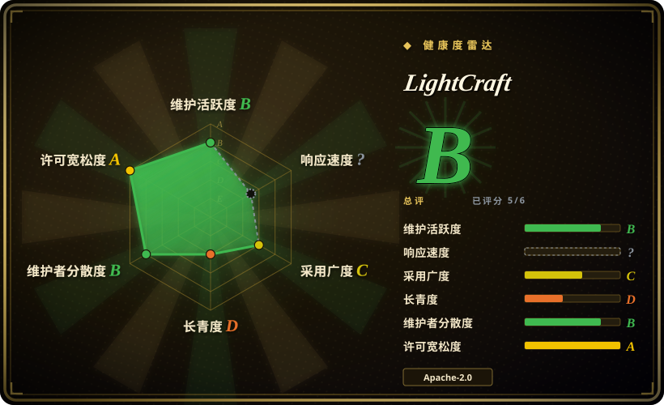
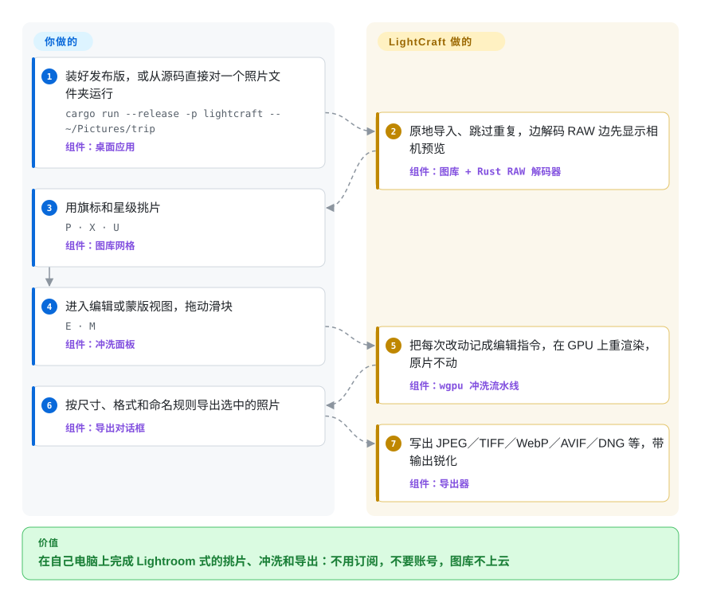

# LightCraft

用 Lightroom 每月要交订阅费，所有评分和修图记录都锁在 Adobe 的图库里；能替代它的开源 RAW 冲洗软件（darktable、RawTherapee）界面和用法又跟它完全两样。LightCraft 是一个照着 Lightroom 的样子从头写的照片图库加 RAW 冲洗工具（RAW 指相机直接写下的、未经处理的传感器文件），全程在你自己的电脑上跑，而且里面每个按钮同时也是一条脚本或 AI 智能体能直接调用的命令。

## 何时使用

你一年拍几千张，用的是索尼、尼康、富士或者老款佳能，平时在 Lightroom 里挑片、调色，这时续费邮件到了。你试过一次 darktable：一摞模块、场景参考（scene-referred）工作流、和肌肉记忆完全对不上的界面，于是又回去了。又或者你是小工作室里那个写代码的人，想让智能体干掉枯燥的部分——“把昨天那组里清晰的挑出来，高光拉低 45，导出长边 2048 的 JPEG”——而 Lightroom 除了插件 SDK 之外没有任何办法把这件事脚本化。

LightCraft 正好值得在这个缺口里试一试。它照搬的是 Lightroom 的*工作方式*——带评分、旗标、相册的图库，同一套 Light／Color／Effects 滑块，蒙版，预设，同步设置，甚至能导入现有的 Lightroom Classic `.lrcat` 图库——但不用 Adobe 的代码和素材；许可证是 MIT 或 Apache-2.0 二选一，而不是 GPL；整个应用都以命令的形式通过 CLI、JSON 控制通道和 MCP 服务器暴露出来（MCP 是 Claude 这类智能体调用外部工具的协议）。它和 darktable、RawTherapee 之间的决定性取舍是“熟悉的操作方式加智能体可控”对“成熟度”：后两者有十年级别的机型覆盖和色彩校准，而 LightCraft 创建于 2026-09-30，它自己的路线图也只说做到了日常替代 Lightroom 的大约 60–70%。

## 怎么用起来

你把它指向一个文件夹；除非你要求，它不复制文件，只把每张照片登记进自己的图库，先立刻显示相机内嵌的预览图，同时用自己写的纯 Rust 解码器解开 RAW（底下没有 LibRaw 之类的 C 库）。每次拖动滑块，存下的只是一条很小的编辑指令，不会写进像素里——原始文件永远不被改动，就像在底片上夹一张配方卡，而不是去改一张冲好的照片——图库本身也是这些操作的只追加日志。渲染通过 wgpu 在 GPU 上以计算着色器运行（Metal、Vulkan 或 DirectX 12），没有 GPU 时用所有 CPU 核心跑同一条流水线，项目会拿 CPU 结果去核对 GPU 结果。看图和拿主意是你的事；解码、色彩计算、渲染和导出是 LightCraft 的事。菜单调用的那套命令注册表，也正是 `lightcraft-cli run`、`--control` 控制端口和 `lightcraft-cli mcp` 暴露出去的东西，所以智能体操作的是真正的应用，而不是一扇侧门。

<!-- flow-steps:begin (generated from flows/lightcraft.json by tools/flow_card.py — do not edit) -->

流程文字版

1. **你**：装好发布版，或从源码直接对一个照片文件夹运行 — `cargo run --release -p lightcraft -- ~/Pictures/trip` — 组件：`桌面应用`
2. **LightCraft**：原地导入、跳过重复，边解码 RAW 边先显示相机预览 — 组件：`图库 + Rust RAW 解码器`
3. **你**：用旗标和星级挑片 — `P · X · U` — 组件：`图库网格`
4. **你**：进入编辑或蒙版视图，拖动滑块 — `E · M` — 组件：`冲洗面板`
5. **LightCraft**：把每次改动记成编辑指令，在 GPU 上重渲染，原片不动 — 组件：`wgpu 冲洗流水线`
6. **你**：按尺寸、格式和命名规则导出选中的照片 — 组件：`导出对话框`
7. **LightCraft**：写出 JPEG／TIFF／WebP／AVIF／DNG 等，带输出锐化 — 组件：`导出器`

**价值**：在自己电脑上完成 Lightroom 式的挑片、冲洗和导出：不用订阅，不要账号，图库不上云

<!-- flow-steps:end -->

## 何时不用

- **你的成片必须和 Lightroom 调出来的一样，或者已有的 Lightroom 修图必须原样迁过来。** 项目自己承认画面观感是“凭眼睛调”的，还没有量化的保真度测试；`.lrcat` 导入遇到不支持的 Adobe 配置文件和 AI 设置时只能近似渲染。要和以往交付保持一致的客户活儿，继续用 Adobe Lightroom。
- **你拍的是新款佳能（CR3）、压缩格式的奥林巴斯，或者不在测试样本里的机身。** CR3 只有部分变体（在 M50、R100、R8 上验证过）能从传感器数据解码，其余变体和压缩 ORF 只能退回到内嵌 JPEG 预览；而且没有实测的相机色彩校准库，非 DNG 的 RAW 只能用估算或中性的色彩（未关闭的 issue 里就有 CR2 完全没颜色、索尼 ARW 渲染异常的报告）。这种情况用 [darktable](https://github.com/darktable-org/darktable) 或 RawTherapee，它们的解码器和机型配置覆盖面大得多。
- **你需要 AI 蒙版、AI 降噪、HDR 编辑、视频，或者打印／画册／地图模块。** 天空和主体蒙版目前是传统启发式算法；SAM 3 蒙版和 AI 降噪需要你自己下载权重，而且权重许可证不宽松；HDR、视频和 Classic 那几个模块完成度在 0–30%。要 AI 功能就用 Lightroom；要开源的打印和地图模块就用 darktable。
- **你要找一个今天就能托付十年照片档案的工具。** 它才九天大，六天内发了五个版本，代码大量出自 AI 编程智能体的分支并成批合并，GitHub 上也没有跑测试的 CI 门禁（测试靠本地 `cargo xtask ci`）。长期档案的稳妥默认选项是有 13 年 GPL 历史的 darktable；如果要用 LightCraft，保留原片和 XMP 附属文件，确保随时能走。
- **你想让照片在多台手机、多个家庭成员之间备份和浏览。** LightCraft 是单机的桌面／浏览器应用，按设计就不做同步。多设备的自托管照片库用 [Immich](../document-management/immich.zh.md)，修图再另配一个 RAW 冲洗工具。
- **你打算发布一个分支，或把它的 crate 嵌进闭源产品。** ArtCraft 的名称和标志不在代码许可证范围内（分支必须去掉），`crates/segment` 里的 SAM 3 移植只能按 Apache-2.0 使用。再分发前先读 `NOTICE`；如果你只是要在自己的产品里解码 RAW，常规做法是用成熟的解码库，比如 LibRaw（LGPL-2.1 或 CDDL）。

## 横向对比

| 替代品 | 是否收录 | 我们的评价 | 取舍 |
|---|---|---|---|
| Adobe Lightroom / Lightroom Classic | 非仓库 | 成片必须和以往修图一致、依赖 AI 蒙版／降噪、或者相机很新时，选 Lightroom；想要同样的工作方式但不想交订阅、还要一个可脚本化、可交给智能体的命令接口时，选 LightCraft。 | 闭源付费订阅，带云同步和成熟的机型配置；LightCraft 免费且本地运行，但在色彩保真、机型覆盖和 AI 功能上落后。 |
| [darktable](https://github.com/darktable-org/darktable) | 未收录 | 机型覆盖、色彩科学和长期存续的社区最重要时，选 darktable；类 Lightroom 的图库和滑块手感、或者 MCP／CLI 自动化是决定因素时，选 LightCraft。 | 已有 13 年、GPL-3.0，模块流水线很深，有自己的学习曲线；本批次未收录。 |
| [RawTherapee](https://github.com/RawTherapee/RawTherapee) | 未收录 | 想把去马赛克和单张冲洗的控制做到极致、又不需要图库时，选 RawTherapee；图库管理和 Lightroom 习惯才是重点时，选 LightCraft。 | GPL-3.0，文件浏览器式工作流而不是图库，解码器非常成熟；没有智能体接口；本批次未收录。 |
| [Immich](../document-management/immich.zh.md) | ✅ | 要做的是全家照片跨设备备份和浏览时，选 Immich；要做的是在一台工作站上冲洗 RAW 时，选 LightCraft。 | Immich 是带手机端、机器学习搜索和人脸识别的自托管服务器，AGPL-3.0；它不冲洗 RAW，LightCraft 也不做同步和备份。 |

## 技术栈

- **语言与界面：** Rust 2024 edition（rust-version 1.90），一个 28 个成员的 Cargo 工作区（24 个库 crate、3 个应用、`xtask`），分层依赖由 `cargo xtask layers` 强制检查；界面用 egui/eframe 0.36，macOS 原生菜单栏用 `muda`。
- **图像：** 自写的 RAW 解码器（DNG、CR2/CR3、ARW、NEF、含 X-Trans 的 RAF、RW2/RWL、PEF、ORF），自写的色彩流水线（线性 Rec.2020 浮点，调整在 OkLCh 中计算）；编解码用 Rust 生态的 `image`、`zune-jpeg`、`jxl-oxide`、`ravif`、`moxcms`；HEIF 需 `--features heif` 开启。
- **计算：** `wgpu` 30 的 WGSL 计算内核（Metal/Vulkan/DX12，不用 GL），`rayon` 做 CPU 回退；SAM 3 蒙版推理锁定 `candle` 0.9.2；降噪和人脸模型用自写的 ONNX 读取器。
- **智能体接口：** 走 stdio JSON-RPC 的 MCP 服务器（`lightcraft-cli mcp`），本机回环的 JSON-lines 控制通道（`lightcraft --control 7980`），以及无界面 CLI（`run`、`render`、`snapshot`、`merge`）。
- **网页版：** 同一个应用用 `wasm-bindgen` 编译成 WebAssembly，图库存放在 OPFS/IndexedDB。
- **互操作：** XMP 附属文件读写，用纯 Rust 的 SQLite 读取器导入 Lightroom Classic `.lrcat`；`unsafe` 只出现在 `crates/sysmem` 里一次 macOS 内存回收的 FFI 调用中。

## 依赖

- **最终用户：** 不需要额外运行任何东西。有签名的 Windows 安装包（x64/arm64/x86 的 MSI 和便携版）、公证过的 macOS 通用 DMG、Linux 的 AppImage/Flatpak/deb/rpm/tar 包、FreeBSD tar 包、静态网页包，或者 `nix run github:storytold/lightcraft`。GPU 可选（有 CPU 回退）。
- **从源码构建：** Rust 1.90+；可选地通过 `CRAFT_FONTS_DIR` 引入单独的 `storytold/craft-fonts` 仓库，否则界面里的中文和日文没有字形；网页版还需要 `wasm32-unknown-unknown` 目标和版本匹配的 `wasm-bindgen` CLI。
- **可选 AI 权重（从不随包分发）：** 物体蒙版用的 `facebook/sam3` 权重，遵循 Meta 的 SAM License（非 OSI 认证）；232 KB 的人脸检测器和可选的识别模型；用户自备或 GPL-3.0 的 RawNIND 降噪权重。模型下载走项目自写的 HTTP 客户端，不支持代理。

## 运维难度

**用起来低，构建或依赖它中等。** 作为桌面应用就是装上就开：没有服务器、没有账号、没有数据库要维护，图库就是一个本地文件夹。构建这个约 7.7 MB 源码的 Rust 工作区足够重，README 专门把 CI 调成每 1.5 GB 空闲内存才开一个编译任务。持续成本在于变动：一到两天就发一个版本，功能对照表里的 ✅ 由落地该功能的人自己勾，标成完成的区域里还在不断冒出 bug，所以任何脚本化流水线都要锁定版本，升级后重新核对。给智能体用时，默认的 MCP 工具列表有 252 个工具——客户端吃不消大工具列表就加 `--compact`。

## 健康度与可持续性

- **维护（截至 2026-10-09）：** 极其活跃——v0.1.0 发布于 2026-10-02，v0.4.0 发布于 2026-10-08，九天里约 310 个 PR（合并 238 个）、约 231 个 issue（关闭 126 个）。这么高的速度本身也是不稳定信号：集成靠成批的 `claude/integrate-batch-*` 合并完成，GitHub 上没有测试工作流。
- **治理与巴士系数：** 仓库挂在组织名下，但约一半的提交（约 600 次）来自一个人（ArtCraft 创始人），另有约 140 次来自一个 AI 智能体账号；路线图和合并决定都在 ArtCraft 手里。没有基金会，也没有 CLA。
- **背书与存续：** 背后是 ArtCraft，一家小型创业公司，它自己的产品是另一款 AI 图像／视频工作室；七个 “Crafting Apps” 都免费，公司长期出钱维护它们的理由没有明说。项目只有九天，Lindy 先验几乎给不了支持——把它当作有前景但未经证明的项目看待。[推断]
- **采用度：** 九天约 7.1k 星、约 2.1k 个分支，五个版本的发布文件累计下载约 16 万次，issue 由真实摄影师提交，带着具体机型的 RAW 文件。整个组织都是同一种曲线（同族的 PhotoCraft 在同一时间窗口里超过 3.2 万星），而分支数与星数之比（约 29%）异常地高；星标时间戳无法查看，所以星数曲线有多少是自然增长仍是未知数。
- **风险信号：** “clean-room（净室）”是由智能体指令执行的流程规则（不读 Adobe 二进制和 GPL 的 RAW 代码，解码器按文字版格式描述编写），不是外部审计；局部拉普拉斯滤波、PatchMatch 和 HEVC 的自由实施（FTO）审查也被列为仍未完成。带商标的 ArtCraft 品牌素材不在代码许可证范围内。

## 存疑（未验证）

- [未验证] 性能数字（约 4 ms 的滑块重渲染、M4 Pro 上约 0.3 s 的全尺寸导出、逐张浏览约 50 ms）都是项目自己的测量，这里没有复现。
- [未验证] 没有用真实 RAW 文件测试解码和色彩质量；2026-10-09 只用 v0.4.0 的 macOS CLI 跑了 `lightcraft-cli render`（输入是合成的 PNG，改曝光和清晰度后输出确有变化）和 MCP 的 `tools/list` 调用（252 个工具）。
- [未验证] “约 79% 功能对齐／日常替代约 60–70%”是 `ROADMAP.md` 里的自评；✅ 由落地功能的人自己勾，没有经过系统性核对。
- [推断] 净室声明无法从外部审计：代码大量由按 `AGENTS.md` 工作的 AI 编程智能体写出，模型生成的解码器代码里是否不含源自 GPL 的逻辑，读者无从确认。
- [未验证] 星数和分支数是否自然增长：2026-10-09 GitHub 的 stargazer 接口对所有仓库都返回 404，无法抽查星标时间和账号；抽查到的分支和 issue 看起来是真实用户。
- [推断] ArtCraft 免费维护 Crafting Apps 的动机和长期资金（比如作为其 AI 工作室的引流）是根据 README 和组织结构推断的，公司没有明说。
- [未验证] Windows 安装界面和非 Apple 硬件上的 GPU 路径，在项目自己的路线图里标为未验证或仅有用户报告。
