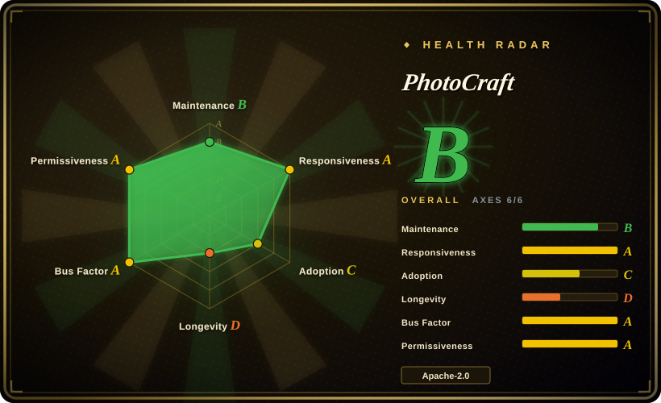
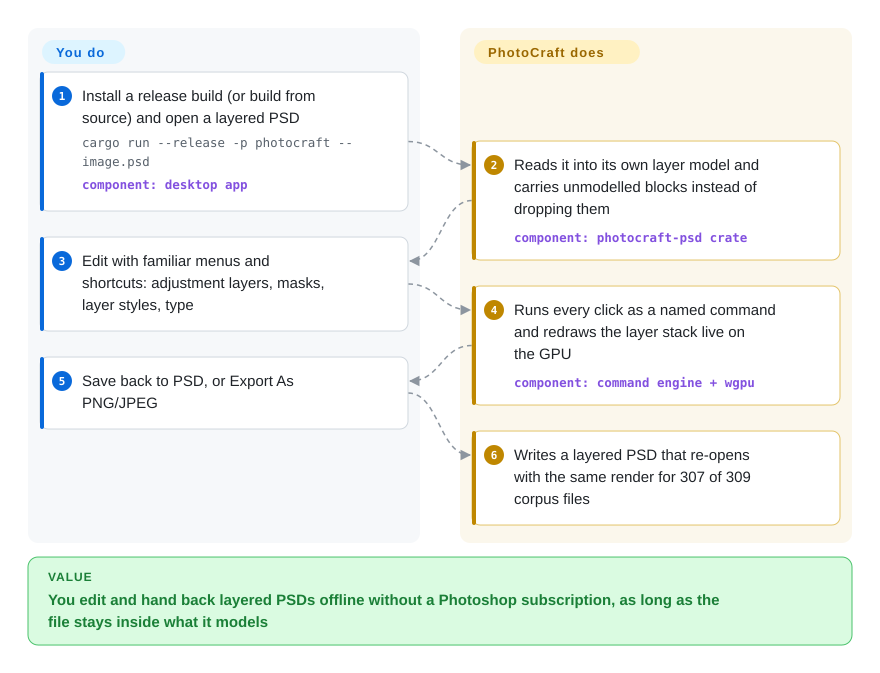

# PhotoCraft

Someone sends you a layered `.psd` with adjustment layers, masks and live type, and the only tool that opens it without flattening is a Photoshop subscription you don't have. PhotoCraft is a free desktop editor (macOS, Windows, Linux, browser) that copies Photoshop's menus and shortcuts and reads and writes those layers natively — but it is nine days old and its own README says it is not yet fit for daily professional work.

## When to use

You maintain a small design pipeline: clients hand over `banner_v7.psd` with a Curves adjustment layer, a masked Hue/Saturation layer and two editable type layers, and you need to change the headline, nudge the grade and send a PSD back. GIMP opens it but you lose the live adjustment layers; Photopea keeps them but runs in a browser tab with ads and your file on someone else's page; the Photoshop seat is the expense you are trying to drop. You also want an agent or a shell script to do the same edit on the next 200 banners.

That is PhotoCraft's trigger: an **offline, native, Photoshop-shaped editor whose PSD layers stay editable**, plus the same engine exposed as a CLI and an MCP server (MCP: the protocol coding agents use to call tools). You pick it over GIMP or Krita when PSD round trips and Photoshop muscle memory matter more than two decades of stability; over Photopea when the file must not leave your machine and you want source access (MIT or Apache-2.0); and over a pure batch tool like ImageMagick when the edit is layer-aware (change a type layer, toggle an adjustment) rather than a flat resize. Pick it knowing the bet: a 2026-09-30 repo, mostly agent-written, whose maintainers rate "a professional could switch for daily work" at roughly 25–35%.

## How it works

PhotoCraft is one Rust program split into layers: a pure-data document model (layers, masks, adjustment and effect settings), a **command engine** that holds 500+ named commands (`filter.sharpen.smartSharpen`, `layer.newAdjustmentLayer.curves`…), and a thin UI drawn with egui on top. Every menu item, tool and dialog just calls a command, so the GUI, the `photocraft-cli` binary, a token-protected local control channel and the MCP server all do exactly the same things — think of the UI as one remote control among four. Pixels live in 256×256 copy-on-write tiles (a tile is copied only when an edit touches it, which keeps undo cheap), and two compositors stack the layers into the picture you see: a CPU one used as the reference and a wgpu one (wgpu: a Rust layer over Metal, Vulkan, DirectX 12 and WebGPU) that draws the canvas, tested against each other. PSD reading and writing is a standalone crate written from Adobe's public spec; anything it does not understand is carried through on save rather than discarded. You supply the file and the edits; it supplies the model, the rendering and the format fidelity — and where a feature is only "wired" (a menu item exists) but not behaviourally faithful, you find out by using it.

<!-- flow-steps:begin (generated from flows/photocraft.json by tools/flow_card.py — do not edit) -->

Text version of the flow

1. **You**: Install a release build (or build from source) and open a layered PSD — `cargo run --release -p photocraft -- image.psd` — component: `desktop app`
2. **PhotoCraft**: Reads it into its own layer model and carries unmodelled blocks instead of dropping them — component: `photocraft-psd crate`
3. **You**: Edit with familiar menus and shortcuts: adjustment layers, masks, layer styles, type
4. **PhotoCraft**: Runs every click as a named command and redraws the layer stack live on the GPU — component: `command engine + wgpu`
5. **You**: Save back to PSD, or Export As PNG/JPEG
6. **PhotoCraft**: Writes a layered PSD that re-opens with the same render for 307 of 309 corpus files

**Value**: You edit and hand back layered PSDs offline without a Photoshop subscription, as long as the file stays inside what it models

<!-- flow-steps:end -->

## When NOT to use

- **Daily professional retouching or print production with a deadline.** The project's own 2026-10-05 assessment puts "a professional could switch for daily work" at ~25–35% and real Photoshop parity "well below 50%"; on first public use users found broken basics (214 shortcut failures, an immovable crop frame). Keep **Adobe Photoshop** for paid work; treat PhotoCraft as a second seat you evaluate.
- **You need generative or AI features (Generative Fill, neural filters, AI background removal).** The roadmap grades AI/generative at ~0% and deferred by decision (#41); smart selection is classical, not ML. Use **Photoshop's** generative tools, or Krita with its AI Diffusion plug-in if it must be open source.
- **Your workflow depends on Photoshop plug-ins, ExtendScript/UXP scripts or `.atn` actions.** None of those load; PhotoCraft uses its own sandboxed WebAssembly plug-ins and its own action JSON. Stay on **Photoshop**, or port the automation to PhotoCraft's CLI deliberately.
- **Painting and illustration is the main job.** PhotoCraft's brush engine exists, but macOS pen pressure is "not yet verified on tablet hardware" and native Wayland pen input is open (#79). Use **Krita**, which is built around painting and has years of tablet support.
- **You need the most stable free editor today, not the most Photoshop-like one.** A 9-day-old codebase with ~350 open issues and a release every one or two days is churn by definition. Use **GIMP** (decades old, GPL) when stability beats PSD fidelity.
- **Headless batch conversion or thumbnailing in a server or CI job.** `photocraft-cli batch` exists, but it pulls in a 700-crate desktop editor workspace and is days old. Use [ImageMagick](../media-processing/image-processing/imagemagick.md) for shell pipelines or [sharp](../media-processing/image-processing/sharp.md) inside Node.js, both proven at that job.
- **Linux Wayland desktop, today.** Files dropped on the window do not open (winit 0.30 has no Wayland drag and drop, #386) and pen pressure goes through Xwayland. Run it under XWayland as the README describes, or use **GIMP/Krita** natively.
- **Exposing the control channel or MCP server to other users.** The TCP channel needs a 256-bit token but grants the whole command surface to anyone holding it — no per-tool capabilities, no audit log (SECURITY.md). Keep it on loopback for one local agent; do not put it behind a shared endpoint.
- **You want to fork and ship it under your own brand.** The code is MIT/Apache-2.0, but the ArtCraft name and logos are trademarks that forks must remove, and the shared engineering standards it cites (`craftrules`) are a private repo. Budget for rebranding and for reading the code without those standards.

## Comparison

| Alternative | In index | Our verdict | Tradeoff |
|---|---|---|---|
| Adobe Photoshop | not a repo | For paid client work, print and anything needing generative fill or third-party plug-ins, keep Photoshop; pick PhotoCraft only for offline, subscription-free PSD edits you can verify by eye. | Closed commercial app (out of scope by shape); full fidelity and ecosystem for a monthly fee, versus a free editor whose own team rates daily-pro readiness at ~25–35%. |
| GIMP | not indexed | When you need a free raster editor that has been stable for decades and PSD is only an import format, pick GIMP; pick PhotoCraft when PSD adjustment and type layers must stay live and Photoshop shortcuts matter. | Real repo (`GNOME/gimp`, GPL-3.0-or-later, GitLab-hosted), not added in this tab batch; maturity and plug-in history versus a different UI model and weaker PSD layer fidelity. |
| Krita | not indexed | For painting, illustration and tablet-first work, pick Krita; pick PhotoCraft for photo editing and PSD layout files where adjustment layers and layer styles are the point. | Real repo (`KDE/krita`, GPL-3.0), not added in this tab batch; a KDE-backed painting app with a mature brush/tablet stack, but not a Photoshop clone in menus or file model. |
| Graphite | not indexed | When you want a Rust, node-based procedural editor and can live with its own paradigm, pick Graphite; pick PhotoCraft when the job is "open this PSD and edit it like Photoshop". | Real repo (`GraphiteEditor/Graphite`, Apache-2.0, since 2020), not added in this tab batch; six years of a non-destructive node graph, versus nine days of a layer-stack clone with far broader PSD coverage. |
| Photopea | not a repo | When you need the best PSD compatibility for free and a browser tab is acceptable, pick Photopea; pick PhotoCraft when files must stay offline or you need source and a CLI/MCP surface. | Closed, ad-supported web app (out of scope by shape); a decade of PSD tuning, versus local-only processing and an open codebase. |

## Tech stack

- **Rust** only (edition 2024, `rust-version = 1.95`), a 24-crate workspace with build-time layering checks; `unsafe_code = "forbid"` everywhere except an isolated pen-tablet crate.
- **egui/eframe 0.36** for the UI (no Electron or web view), **wgpu 30** for the GPU compositor (Metal, Vulkan, DX12, WebGPU), **rayon** for multithreaded filters, **parley** for text layout, **resvg/usvg** for SVG.
- Own crates for PSD/PSB, ICC colour management, codecs, camera RAW, and a read-only Affinity reader; **rmcp** for the MCP server, **tokio** for automation servers, **wasmi** to run sandboxed WebAssembly plug-ins.
- The whole engine and UI also compile to WebAssembly (trunk + wasm-bindgen) for the browser build.

## Dependencies

- **Runtime:** a desktop OS (macOS universal, Windows x64/arm64/x86, Linux x86_64/aarch64 as AppImage/deb/rpm/Flatpak/tarball, FreeBSD 14) with a GPU that wgpu supports; the CPU compositor is the fallback for cases the GPU path does not cover. The web build is a static site you host.
- **No hosted service or account:** `Cargo.lock` has no HTTP client crate (no reqwest/ureq/hyper), consistent with the "offline" claim.
- **Optional:** the `craft-fonts` repo for Japanese UI/Type fonts at build time (release builds include it); `--features heif` for HEIC reading.
- **From source:** Rust 1.95+ and a ~700-crate dependency tree (`Cargo.lock` lists 711 packages).

## Ops difficulty

**Low** to install — signed and notarized macOS builds, signed Windows MSIs, Linux packages in five formats, all with `SHA256SUMS.txt`. The real cost is **change management**: seven releases between 2026-10-02 and 2026-10-08 (v0.1.0 → v0.5.0), so pin a version for anything repeatable and re-check results after each upgrade. Building from source is **medium** (current stable Rust, a large dependency tree, optional fonts repo). Running the MCP/control server is low effort but needs the security caveats above.

## Health & viability

- **Maintenance (2026-10-09):** extremely active — ~930 commits since the first on 2026-09-30, 785 merged PRs, ~880 issues filed (526 closed). CI on `main` is mostly cancelled by the next push rather than completed; the few finished runs pass.
- **How it was built:** the opening commits are a 42k-line "one-shot" followed by a 38k-line "continued wip", and one commit message reads "(+ in-progress work of other agents)"; a `claude` account is among the top contributors. Treat it as an AI-agent-generated codebase steered by a small team — large and test-heavy (1,700+ tests claimed), but with no human track record behind any given module.
- **Governance / backing:** owned by the `storytold` organization (ArtCraft, created 2021, which also ships the ArtCraft AI studio); one maintainer account leads commits (237) with a long tail of community PR authors. Roadmap and the shared engineering standards live with the vendor, and part of them (`craftrules`) is private. How the vendor funds it is not stated.
- **Age / Lindy:** nine days old on 2026-10-09 — the Lindy prior gives almost no reassurance. It is one of seven sibling "Crafting Apps" (VectorCraft, LightCraft, FilmCraft, PdfCraft, EffectCraft, DesignCraft) launched within a week, which spreads the same team across many large codebases.
- **Adoption:** ~32.7k stars and ~4.6k forks in nine days; the v0.5.0 release assets show ~160k downloads within a day, and issue traffic comes from many distinct users. Real interest is evident; whether the star count is entirely organic was not checked [未验证].
- **Risk flags:** the "clean-room" provenance claim cannot be verified from outside; trademark-gated branding; no private security reporting channel (SECURITY.md says so); the GitHub license badge reads Apache-2.0 while the repo is dual MIT/Apache-2.0.

## Caveats (unverified)

- [未验证：护栏拦截] Star velocity organicity: REST `stargazers` returned 404 for this repo and the GraphQL stargazer query was blocked by a local command guard, so account-age sampling was not done. Downloads (~160k on v0.5.0) and ~880 issues point to substantial real use [推断].
- [未验证] "Clean-room, implemented from public specs and observed behaviour only" is the project's own claim (README, AGENTS.md); no code-provenance audit was possible. The repo dropped references to an earlier name, "Photon Studio", on 2026-10-02 — its history was not traced.
- [未验证] PSD fidelity figures (307/309 psd-tools round trips, 116/116 shape layers, oracle 115/170) are the project's test results, not reproduced here; the build and test suite were not run.
- [未验证] The ~25–35% "daily pro" and "<50% parity" numbers are the maintainers' own 2026-10-05 estimates and may move quickly either way.
- [推断] No network egress at runtime is inferred from the absence of HTTP client crates in `Cargo.lock`; the web build and platform code paths were not read.
- [未验证] GIMP's weaker PSD adjustment-layer handling and Krita's tablet maturity in the Comparison come from general knowledge of those projects, not from re-testing them for this page.
- [未验证] How ArtCraft funds the Crafting Apps (open-core, upsell to the ArtCraft studio, or otherwise) is not stated in the repo.
