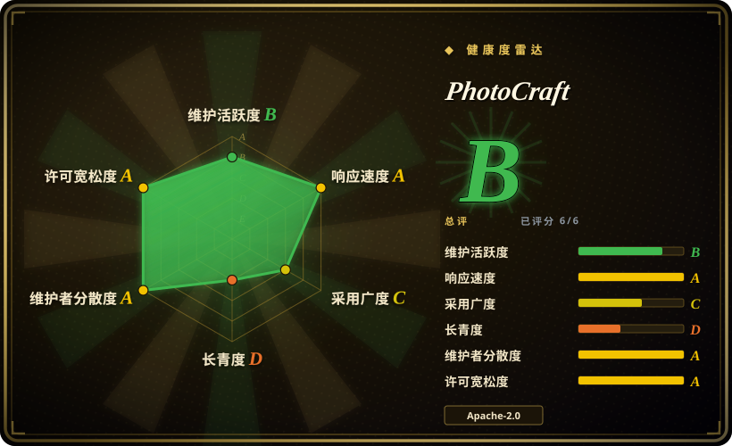
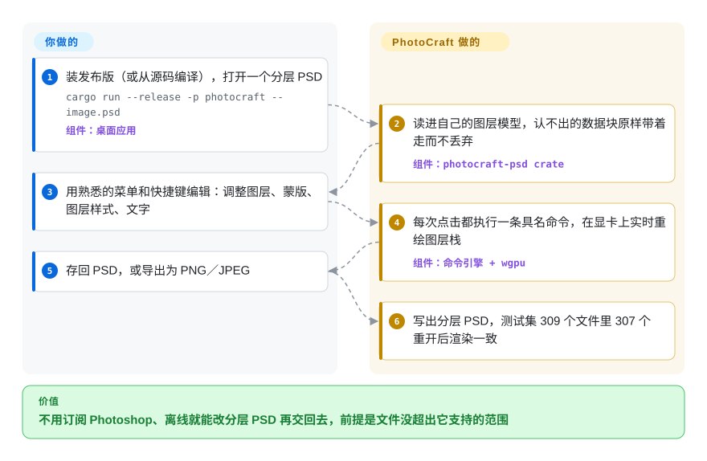

# PhotoCraft

别人发来一个带调整图层、蒙版和可编辑文字的分层 `.psd`，能打开又不把图层拍平的只有你没订阅的 Photoshop。PhotoCraft 是一个免费桌面图像编辑器（macOS、Windows、Linux、浏览器都能跑），照搬 Photoshop 的菜单和快捷键，原生读写这些图层——但它只有九天历史，自己的 README 也说还不能拿来做日常专业工作。

## 何时使用

你维护一条小型设计流水线：客户交来 `banner_v7.psd`，里面有一个曲线调整图层、一个带蒙版的色相／饱和度图层和两个可编辑文字图层，你要改标题、微调色调，再交回一个 PSD。GIMP 能打开，但调整图层不再是活的；Photopea 能保住它们，但它跑在浏览器标签页里，带广告，文件在别人的网页上；而 Photoshop 的席位正是你想砍掉的开销。你还希望接下来 200 张横幅能让 agent 或 shell 脚本照样改一遍。

这就是 PhotoCraft 的触发场景：一个**离线、原生、长得像 Photoshop、PSD 图层保持可编辑**的编辑器，同一个引擎还以命令行和 MCP 服务器的形式开放（MCP：coding agent 调用外部工具的协议）。当 PSD 往返保真和 Photoshop 肌肉记忆比二十年的稳定性更重要时，你选它而不是 GIMP 或 Krita；文件不能离开本机、又想拿到源码（MIT 或 Apache-2.0）时，你选它而不是 Photopea；要改的是图层级内容（改一个文字图层、开关一个调整图层），而不是把整张图缩放转码时，你选它而不是 ImageMagick 这类批处理工具。选它要清楚押的是什么：一个 2026-09-30 才建的仓库，代码主要由 agent 写成，维护者自己估计“专业用户能切换过来做日常工作”的程度大约只有 25–35%。

## 怎么用起来

PhotoCraft 是一个分层组织的 Rust 程序：最底下是纯数据的文档模型（图层、蒙版、调整和效果参数），中间是**命令引擎**，登记了 500 多条具名命令（`filter.sharpen.smartSharpen`、`layer.newAdjustmentLayer.curves` 等），最上面是用 egui 画的一层薄界面。每个菜单项、工具和对话框都只是去调一条命令，所以图形界面、`photocraft-cli` 命令行、带令牌保护的本地控制通道和 MCP 服务器能做的事完全一样——可以把界面看成四个遥控器里的一个。像素存放在 256×256 的写时复制图块里（某块只有被编辑碰到时才复制一份，撤销因此很便宜）；两个合成器负责把图层叠成你看到的画面：一个跑在 CPU 上当参照标准，一个跑在 wgpu 上（wgpu：Rust 对 Metal、Vulkan、DirectX 12 和 WebGPU 的统一封装）负责画布，二者互相对拍测试。PSD 读写是一个按 Adobe 公开规范独立实现的 crate，读不懂的部分在保存时原样带过去而不丢弃。你提供文件和编辑操作；它负责文档模型、渲染和格式保真——至于某个功能只是“接上了”（菜单项存在）还是行为真的一致，要你用了才知道。

<!-- flow-steps:begin (generated from flows/photocraft.json by tools/flow_card.py — do not edit) -->

流程文字版

1. **你**：装发布版（或从源码编译），打开一个分层 PSD — `cargo run --release -p photocraft -- image.psd` — 组件：`桌面应用`
2. **PhotoCraft**：读进自己的图层模型，认不出的数据块原样带着走而不丢弃 — 组件：`photocraft-psd crate`
3. **你**：用熟悉的菜单和快捷键编辑：调整图层、蒙版、图层样式、文字
4. **PhotoCraft**：每次点击都执行一条具名命令，在显卡上实时重绘图层栈 — 组件：`命令引擎 + wgpu`
5. **你**：存回 PSD，或导出为 PNG／JPEG
6. **PhotoCraft**：写出分层 PSD，测试集 309 个文件里 307 个重开后渲染一致

**价值**：不用订阅 Photoshop、离线就能改分层 PSD 再交回去，前提是文件没超出它支持的范围

<!-- flow-steps:end -->

## 何时不用

- **有截止日期的日常专业修图或印刷出版。** 项目 2026-10-05 的自我评估里，“专业用户能切换过来做日常工作”约为 25–35%，真实的 Photoshop 对等程度“远低于 50%”；首次公开使用时用户就撞上了基础问题（214 处快捷键失效、裁剪框拖不动）。收费活继续用 **Adobe Photoshop**，PhotoCraft 当作待评估的第二个工位。
- **你需要生成式或 AI 功能（创成式填充、神经滤镜、AI 抠图）。** 路线图给 AI／生成式打的是约 0%，并已决定暂缓（#41）；智能选择是传统算法，不是机器学习。用 **Photoshop** 的生成式工具；必须开源的话，用 Krita 配 AI Diffusion 插件。
- **你的流程依赖 Photoshop 插件、ExtendScript／UXP 脚本或 `.atn` 动作。** 这些都加载不了；PhotoCraft 用的是自己的沙箱化 WebAssembly 插件和自己的动作 JSON。继续用 **Photoshop**，或者有计划地把自动化迁到 PhotoCraft 的命令行上。
- **主要工作是绘画和插画。** PhotoCraft 有画笔引擎，但 macOS 的压感“尚未在数位板硬件上验证”，原生 Wayland 笔输入仍未解决（#79）。用 **Krita**，它围绕绘画设计，数位板支持做了很多年。
- **你今天要的是最稳的免费编辑器，而不是最像 Photoshop 的那个。** 一个九天大的代码库，约 350 个未关闭 issue，一两天发一个版本，本身就意味着频繁变动。稳定性比 PSD 保真更重要时，用 **GIMP**（几十年历史，GPL）。
- **在服务器或 CI 里做无界面的批量转码或缩略图。** `photocraft-cli batch` 存在，但它要拉进一个七百多个 crate 的桌面编辑器工程，而且才几天大。shell 流水线用 [ImageMagick](../media-processing/image-processing/imagemagick.zh.md)，Node.js 进程内用 [sharp](../media-processing/image-processing/sharp.zh.md)，二者在这件事上都久经考验。
- **眼下在 Linux Wayland 桌面上用。** 拖进窗口的文件打不开（winit 0.30 不支持 Wayland 拖放，#386），压感也要绕道 Xwayland。按 README 的说明在 XWayland 下运行，或者原生用 **GIMP／Krita**。
- **把控制通道或 MCP 服务器开放给其他用户。** TCP 通道需要一个 256 位令牌，但持有令牌的人就能用全部命令——没有按工具的权限划分，也没有审计日志（见 SECURITY.md）。只在回环地址上给一个本地 agent 用，不要挂到共享端点后面。
- **你想 fork 后换成自己的品牌发布。** 代码是 MIT／Apache-2.0，但 ArtCraft 名称和标志是商标，fork 必须删掉；它引用的共享工程规范（`craftrules`）是私有仓库。要为换品牌、以及在没有这些规范的情况下读懂代码留出成本。

## 横向对比

| 替代品 | 是否收录 | 我们的评价 | 取舍 |
|---|---|---|---|
| Adobe Photoshop | 非仓库 | 给客户的收费活、印刷，以及任何需要创成式填充或第三方插件的工作，继续用 Photoshop；只有能肉眼核对结果、又想离线免订阅改 PSD 时才选 PhotoCraft。 | 闭源商业软件（形态上不在收录范围）；按月付费换完整保真和生态，对面是一个团队自评日常专业可用度约 25–35% 的免费编辑器。 |
| GIMP | 未收录 | 需要一个稳定了几十年的免费位图编辑器、PSD 只是导入格式时选 GIMP；PSD 的调整图层和文字图层必须保持可编辑、Photoshop 快捷键很重要时选 PhotoCraft。 | 真实仓库（`GNOME/gimp`，GPL-3.0-or-later，托管在 GitLab），本批未收录；换来成熟度和插件历史，代价是界面模型不同、PSD 图层保真更弱。 |
| Krita | 未收录 | 绘画、插画、以数位板为主的工作选 Krita；以调整图层和图层样式为核心的照片编辑和 PSD 版式文件选 PhotoCraft。 | 真实仓库（`KDE/krita`，GPL-3.0），本批未收录；KDE 支持、画笔和数位板栈成熟，但菜单和文件模型都不是 Photoshop 的翻版。 |
| Graphite | 未收录 | 想要一个 Rust 写的节点式程序化编辑器、并能接受它自成一套的思路时选 Graphite；任务是“打开这个 PSD，像在 Photoshop 里那样改”时选 PhotoCraft。 | 真实仓库（`GraphiteEditor/Graphite`，Apache-2.0，2020 年起），本批未收录；一边是六年积累的非破坏性节点图，一边是九天大、但 PSD 覆盖面宽得多的图层栈复刻。 |
| Photopea | 非仓库 | 要免费拿到最好的 PSD 兼容性、能接受浏览器标签页时选 Photopea；文件必须离线、或需要源码和 CLI／MCP 接口时选 PhotoCraft。 | 闭源、靠广告支撑的网页应用（形态上不在收录范围）；十年的 PSD 调校，对面是纯本地处理和开放代码。 |

## 技术栈

- 只用 **Rust**（edition 2024，`rust-version = 1.95`），24 个 crate 组成的工作区，编译时检查分层依赖；除一个隔离的数位板 crate 外，全工程 `unsafe_code = "forbid"`。
- 界面用 **egui／eframe 0.36**（不用 Electron 或 web view），GPU 合成器用 **wgpu 30**（Metal、Vulkan、DX12、WebGPU），滤镜多线程用 **rayon**，文字排版用 **parley**，SVG 用 **resvg／usvg**。
- 自研 PSD／PSB、ICC 色彩管理、编解码器、相机 RAW 和只读 Affinity 读取等 crate；MCP 服务器用 **rmcp**，自动化服务用 **tokio**，沙箱化 WebAssembly 插件用 **wasmi** 运行。
- 整个引擎和界面也能编译成 WebAssembly（trunk + wasm-bindgen），即浏览器版。

## 依赖

- **运行时：** 一台桌面系统（macOS 通用版；Windows x64／arm64／x86；Linux x86_64／aarch64 的 AppImage、deb、rpm、Flatpak、tarball；FreeBSD 14），显卡需被 wgpu 支持；GPU 路径覆盖不到的情况回退到 CPU 合成器。浏览器版是一个你自己托管的静态站点。
- **不需要托管服务或账号：** `Cargo.lock` 里没有 HTTP 客户端 crate（没有 reqwest／ureq／hyper），与“离线”的说法一致。
- **可选：** 编译时用 `craft-fonts` 仓库提供日文界面和文字字体（发布版已包含）；读 HEIC 需要 `--features heif`。
- **从源码编译：** Rust 1.95 以上，以及约 700 个 crate 的依赖树（`Cargo.lock` 列了 711 个包）。

## 运维难度

安装是**低**难度——macOS 版签名并公证，Windows MSI 签名，Linux 提供五种包格式，全部附 `SHA256SUMS.txt`。真正的成本在**变更管理**：2026-10-02 到 2026-10-08 之间发了七个版本（v0.1.0 → v0.5.0），凡是要可重复的工作都应锁定版本，每次升级后重新核对结果。从源码编译是**中等**难度（需要最新稳定版 Rust、依赖树很大、字体仓库可选）。跑 MCP／控制服务器本身不费事，但要遵守上面的安全注意事项。

## 健康度与可持续性

- **维护（2026-10-09）：** 极其活跃——自 2026-09-30 第一个提交以来约 930 个提交，785 个 PR 已合并，约 880 个 issue（526 个已关闭）。`main` 上的 CI 大多被下一次推送取消而没跑完；少数跑完的都通过了。
- **它是怎么写出来的：** 最初的提交是一个 4.2 万行的“one-shot”，接着是一个 3.8 万行的“continued wip”，还有一条提交信息写着“(+ in-progress work of other agents)”；贡献者前列里有一个 `claude` 账号。应把它看作由小团队操控、AI agent 大规模生成的代码库——体量大、测试多（自称 1,700 多个测试），但任何一个模块背后都没有人类的长期维护记录。
- **治理与背后的组织：** 归 `storytold` 组织（ArtCraft，2021 年创建，同时做 ArtCraft AI 创作工作室）所有；一个维护者账号贡献了最多提交（237 个），之后是一长串社区 PR 作者。路线图和共享工程规范由厂商掌握，其中一部分（`craftrules`）是私有的。厂商如何为它提供资金，仓库里没有说明。
- **年龄／Lindy：** 到 2026-10-09 只有九天——Lindy 先验几乎给不了任何保证。它是一周内连发的七个姊妹“Crafting Apps”之一（另有 VectorCraft、LightCraft、FilmCraft、PdfCraft、EffectCraft、DesignCraft），同一个团队被摊到好几个大型代码库上。
- **采用度：** 九天约 3.27 万 star、约 4.6 千 fork；v0.5.0 的发布文件一天内下载约 16 万次，issue 来自大量不同用户。真实关注度是明显的；star 数是否完全自然增长没有核查 [未验证]。
- **风险信号：** “clean-room（净室实现）”的来源声明无法从外部核实；品牌受商标限制；没有私密的安全漏洞报告渠道（SECURITY.md 自己这么说）；GitHub 的许可证徽章显示 Apache-2.0，而仓库实际是 MIT／Apache-2.0 双许可。

## 存疑（未验证）

- [未验证：护栏拦截] star 增速是否自然：该仓库的 REST `stargazers` 接口返回 404，GraphQL 的 stargazer 查询被本地命令护栏拦下，所以没有做账号年龄抽样。v0.5.0 约 16 万次下载和约 880 个 issue 说明真实使用量可观 [推断]。
- [未验证] “净室实现，只依据公开规范和观察到的行为”是项目自己的说法（README、AGENTS.md），无法做代码来源审计。仓库在 2026-10-02 删除了对早先名字“Photon Studio”的引用，这段历史没有追查。
- [未验证] PSD 保真数据（psd-tools 309 个文件中 307 个往返一致、形状图层 116／116、oracle 115／170）是项目自己的测试结果，本页没有复现；没有编译和运行测试套件。
- [未验证] “日常专业可用约 25–35%”和“对等程度低于 50%”是维护者 2026-10-05 的自我估计，可能很快朝任一方向变化。
- [推断] 运行时没有网络外连，是从 `Cargo.lock` 里没有 HTTP 客户端 crate 推断的；浏览器版和各平台代码路径没有读。
- [未验证] 横向对比里 GIMP 的 PSD 调整图层处理更弱、Krita 数位板更成熟，来自对这两个项目的一般了解，没有为本页重新测试。
- [未验证] ArtCraft 如何为 Crafting Apps 提供资金（开放核心、引流到 ArtCraft 工作室或其他方式），仓库里没有说明。
