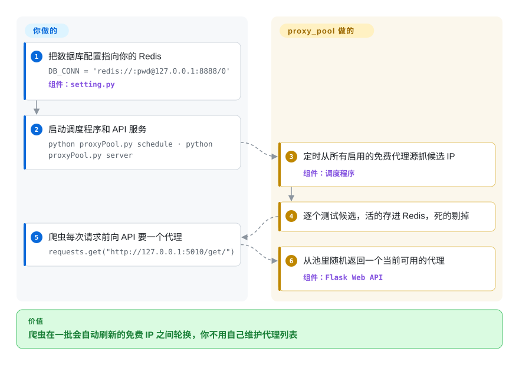

# proxy_pool

一个自建的免费代理 IP 池：它从公开网页源头爬取免费 HTTP/HTTPS 代理，按计划周期性地校验，把存活的存进 Redis，再通过一个极小的 Flask HTTP API 把可用 IP 喂给你的爬虫。

## 何时使用

你在写一个 Python 爬虫，老是被限流或封 IP，因为每个请求都从同一个地址发出。你不想为一个业余/研究项目去买商业代理套餐，又懒得手工维护一份几小时就失效的脆弱代理 IP 列表。你用 `docker-compose up` 把 proxy_pool 跑起来，指向一个 Redis 实例，让它的调度器不停地去爬免费代理站点、逐个测试候选、把失效的剔除。你的爬虫只需调 `GET http://127.0.0.1:5010/get/` 拉一个当前存活的代理，拿去发请求，发现某个不行了就调 `/delete/`——于是这个池子自我修复，你的爬虫拿到一份持续轮换的 IP 供给，而你不用盯着列表。

它最适合的场景是：代理*质量*可以将就，但你想免费拿到*轮换与新鲜度*——以适中量级抓取公开数据、把请求分散到大量临时 IP 上，或者在决定是否值得上付费代理之前先试试水。

## 怎么用起来

proxy_pool 是围着一个 Redis（内存键值库，整个代理池都存在里面）转的两个小 Python 进程。**找代理、测代理归它**：*调度程序*定时醒来，跑 `fetcher/sources/` 里每个启用的代理源——每个源负责抓一个公开免费代理网站——再逐个测试候选 IP，只留下还能连通的，剔掉死的。*服务*进程是一个很小的 Flask Web API（Flask 是一个极简的 Python Web 框架），从库里往外发代理。**你负责跑起 Redis 和这两个进程，爬虫去调 API**：`/get/` 随机拿一个可用代理，失效了调 `/delete/?proxy=host:port`，用 `/count/` 看池子大小。想加代理源，就写一个产出 `ip:port` 字符串的小抓取类，调度程序下次运行时自动接上。

<!-- flow-steps:begin (generated from flows/proxy-pool.json by tools/flow_card.py — do not edit) -->

流程文字版

1. **你**：把数据库配置指向你的 Redis — `DB_CONN = 'redis://:pwd@127.0.0.1:8888/0'` — 组件：`setting.py`
2. **你**：启动调度程序和 API 服务 — `python proxyPool.py schedule · python proxyPool.py server`
3. **proxy_pool**：定时从所有启用的免费代理源抓候选 IP — 组件：`调度程序`
4. **proxy_pool**：逐个测试候选，活的存进 Redis，死的剔掉
5. **你**：爬虫每次请求前向 API 要一个代理 — `requests.get("http://127.0.0.1:5010/get/")`
6. **proxy_pool**：从池里随机返回一个当前可用的代理 — 组件：`Flask Web API`

**价值**：爬虫在一批会自动刷新的免费 IP 之间轮换，你不用自己维护代理列表

<!-- flow-steps:end -->

## 何时不用

- **你需要可靠、快、安全——免费代理这三样都没有。** 免费代理是从公开列表爬来的：大多已死、很慢、过载，或几小时内就消失，而且每个都由一个来路不明的第三方运营。任何要紧的生产用途，付费住宅/数据中心代理才是对的工具——proxy_pool 是一个*免费档的便利品*，不是可依赖的传输层。
- **你要往里面送任何敏感数据。** 一个不可信的免费代理可以读取、记录或篡改你的流量（MITM）；绝不要把凭据、已登录会话或私密数据经过这个池子。即便走 HTTPS，你也是在信任一个匿名运营者。
- **你想绕过反爬系统。** 这是个 IP 轮换器，不是反检测栈——它不做指纹/TLS/JS 挑战规避。Cloudflare/DataDome 这一类防护不会因为换 IP 就被解决。
- **抓取的法律 / ToS 风险。** 用轮换 IP 来规避限流或封禁，可能违反站点的服务条款，并且视司法辖区和目标而定可能带来法律风险。这个工具不会让抓取变得合法，那是你自己的责任。
- **你不想运维基础设施。** 它是自托管的，需要一个由你运营和监控的 Redis（或 SSDB）实例，外加一个长驻的调度器/API 进程。
- **你需要可预测的吞吐或 SLA。** 存活代理数随免费源当天产出而波动；你无法保证一个最小池子规模或延迟。

## 横向对比

| 替代品 | 是否收录 | 我们的评价 | 取舍 |
|---|---|---|---|
| 付费代理服务（Bright Data / Decodo） | 未收录 | 生产环境需要 SLA、干净 IP 段和支持时，选付费代理服务。 | 商业住宅/数据中心/ISP 代理，带 SLA、大片干净 IP 段和支持——可靠又快，但收费（常按 GB 计量）且非开源。生产环境的正确选择。 |
| [ProxyBroker](proxybroker.zh.md) | ✅ | 需要 Python 异步库/CLI 来发现并检测公开代理时，选 ProxyBroker。 | Python 异步库/CLI，用来发现并检测公开代理；更像工具箱/库，而非打包好的带 API + 存储的服务。维护时断时续。[未验证] |
| [scylla](scylla.zh.md) | ✅ | 需要带 Web UI 和 API 的自托管智能免费代理池时，选 scylla。 | 自托管的智能免费代理池，带 Web UI 和 API（Python）；同一细分赛道，技术栈与功能侧重不同。[未验证] |
| [haipproxy](haipproxy.zh.md) | ✅ | 只把 haipproxy 当作 Scrapy/Redis 代理池的设计参考；真要跑起来选 proxy_pool，因为 haipproxy 默认分支自 2019-07 起没有提交。 | 面向抓取的 Scrapy/Redis 高可用设计，但 2019-07 后就停了，也比 proxy_pool 的小 Flask 服务更重。 |
| scrapy-rotating-proxies | 未收录 | 已有代理列表、只需要 Scrapy 轮换中间件时，选 scrapy-rotating-proxies。 | 一个 Scrapy *下载器中间件*，轮换你提供的列表并封掉失效项——它*消费*代理，并不去*获取/校验*代理；应当与本项目这类池子搭配，而非当成替代品。 |

## 技术栈

- **语言：** Python。
- **API：** Flask 提供一个很小的 REST 接口（`/get`、`/all`、`/count`、`/delete`、`/pop`、`/refresh`），跑在 gunicorn 下。
- **存储：** 默认/主要后端是 Redis；也支持 SSDB（通过 `redis://` / `ssdb://` 形式的 `DB_CONN` URL 配置）。
- **爬取 / 校验：** 用 `requests` + `lxml` 抓取并解析免费代理源页面；用 `APScheduler` 驱动周期性的爬取-校验循环。
- **架构：** 两个角色——一个*调度器*进程（爬代理，再定时校验/剔除）和一个*Web API*进程（把代理供给客户端），共享同一个 Redis 存储。

## 依赖

- **运行时：** Python（3.x），以及它钉死的库（`requests`、`lxml`、`Flask`、`gunicorn`、`APScheduler`、`redis`、`click`）。
- **数据存储（你来跑）：** 一个 Redis 实例（或 SSDB）——必需；池子的全部状态都存在那里。
- **源头（外部、不可控）：** 它爬取的那些公开免费代理网站——不是你安装的依赖，但你池子的质量完全受制于它们，而且源页面会随时间失效。
- **安装路径：** clone + `pip install -r requirements.txt`，或用项目提供的 Docker / docker-compose 方案（app + Redis）。

## 运维难度

**低到中。** 跑起来很容易：docker-compose 一把拉起 app 和 Redis，没有集群或 schema 要管。持续的负担是运维上的盯梢而非扩容：免费代理*源*页面会变或失效，于是爬虫会过期、需要修补/扩展；当源枯竭时存活代理数会暴跌；你会想监控池子规模并调校验间隔。Redis 是唯一一块有状态的部分，要保活并（最好）设密码，因为整个服务的价值就只是那个存储里的东西。

## 健康度与可持续性

- **响应速度**：无法计算——no_traffic。
- **维护（截至 2026-10-08）。** 仓库**未归档**；最后一次提交在 2026-06-15（集中补了一批单元测试和打包修复），最近 13 周没有提交——但**最后一个打标的 release 是 2023-02 的 2.4.1**；应理解为有人在维护但并不频繁发版，而非快速演进。[推断]
- **治理 / bus factor。** 一个**单一维护者的 User 仓库**（owner jhao104，约 533 次提交；第二名贡献者约 13 次）——这是明显的 **bus-factor 标记**：路线图和延续性押在一个人身上。[推断]
- **年龄与 Lindy 判断。** **2016-11 创建（约 9.5 年）**且仍在收到提交⇒就其细分赛道而言是**还不错的 Lindy** 信号——长寿、在中文爬虫圈很有名，而非被炒作的新秀。[推断]
- **采用度。** 约 23.8k star、约 5.4k fork，表明它作为免费代理池的参考实现有广泛而持续的人气。[未验证]
- **风险标记——真正的风险在模型，不在仓库。** MIT 许可，未发现 relicense 历史。主导风险是**内生的**：免费代理池的好坏只取决于它爬的那些公开源，所以无论代码多健康，可靠性在结构上就是低的。[推断]

## 存疑（未验证）

- [未验证] 截至 2026-10-08 约 23.8k star / 约 5.4k fork——star/fork 数对时间敏感、作为质量信号不可靠，仅供参考。
- [未验证] 最新 GitHub release 2.4.1 日期为 2023-02（另有 2024-01 的 2.4.2 tag，未发 release）；2026-06 的提交只按提交信息扫过（测试、tox/uv 兼容），未逐行审计。
- [推断]「单一维护者 / bus-factor」是从贡献者分布（一个主导作者）推断的，并非来自任何明示的治理文档。
- [推断] 几个替代项目（ProxyBroker、scylla、haipproxy、scrapy-rotating-proxies）是按其一般声誉/角色定位的，本轮没有逐仓库重新审计——依赖该对比前请核实其现状。
- [未验证] proxy_pool 爬取的免费代理源站点的集合与稳定性随时间变化；其有效存活代理产出未做实测。
