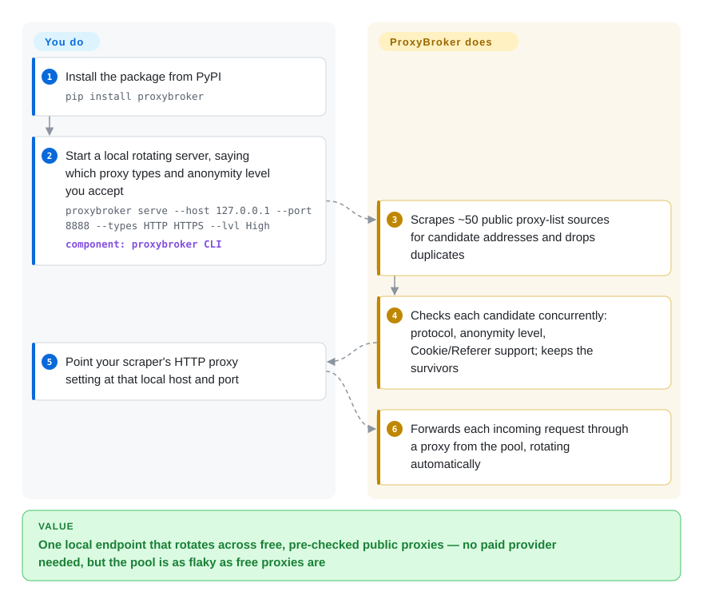

# ProxyBroker

An async Python tool that finds public proxies from ~50 sources, checks them (type, anonymity, latency, country, DNSBL), and can run as a self-rotating proxy server in front of your traffic.

## When to use

You're prototyping a small scraper and need a throwaway pool of free public proxies — you don't have a paid proxy provider yet, and you just want something that discovers live HTTP(S)/SOCKS proxies, filters out the dead and the non-anonymous ones, and exposes a single local endpoint that rotates across the survivors. You `pip install proxybroker`, run `proxybroker find --types HTTP HTTPS --lvl High --limit 10` to harvest and validate a batch, or `proxybroker serve --host 127.0.0.1 --port 8888` to stand up a rotating server, then point your client's proxy at `127.0.0.1:8888` and let it cycle. Because it's asyncio end-to-end, the find/check phase is fast for what it is, and the three sub-commands (`find` / `grab` / `serve`) cover discovery, raw collection, and live serving.

This is a *learning/experiment* reach: when you want to understand how a finder-checker-server pool fits together, or need free proxies for a low-stakes one-off, and you accept that free public proxies are flaky by nature.

## How it works

ProxyBroker is three jobs in one process: a **finder** that scrapes about 50 public proxy-list websites for candidate `ip:port` addresses, a **checker** that connects through each candidate concurrently (asyncio — one thread juggling thousands of open connections) to confirm the protocol, the anonymity level (whether the target site can see your real IP or that a proxy is in use), and that Cookies and Referer headers survive, and a **server** that hands out the survivors. **It does the harvesting, testing and rotation for you** — you only choose filters (types, anonymity, country) and point your client at its local port. Nothing is stored: the pool lives in memory for that run, so a restart re-harvests from scratch. If you would rather consume proxies in your own code, the same work is available as a Python API (`Broker(queue).find(...)` feeding an `asyncio.Queue`) instead of the `serve` command.

<!-- flow-steps:begin (generated from flows/proxybroker.json by tools/flow_card.py — do not edit) -->

Text version of the flow

1. **You**: Install the package from PyPI — `pip install proxybroker`
2. **You**: Start a local rotating server, saying which proxy types and anonymity level you accept — `proxybroker serve --host 127.0.0.1 --port 8888 --types HTTP HTTPS --lvl High` — component: `proxybroker CLI`
3. **ProxyBroker**: Scrapes ~50 public proxy-list sources for candidate addresses and drops duplicates
4. **ProxyBroker**: Checks each candidate concurrently: protocol, anonymity level, Cookie/Referer support; keeps the survivors
5. **You**: Point your scraper's HTTP proxy setting at that local host and port
6. **ProxyBroker**: Forwards each incoming request through a proxy from the pool, rotating automatically

**Value**: One local endpoint that rotates across free, pre-checked public proxies — no paid provider needed, but the pool is as flaky as free proxies are

<!-- flow-steps:end -->

## When NOT to use

- **Anything production or reliability-sensitive.** Free public proxies are slow, short-lived, and frequently malicious; a self-harvested pool is unsuitable for jobs that must not fail. Buy residential/datacenter proxies instead.
- **Modern Python without pinning.** The project's last real release predates several asyncio/Python changes; users widely report install/runtime breakage on newer Python versions and need pinned environments or patches to run it at all. Treat compatibility as your problem to solve. [未验证]
- **You need authentication, uptime tracking, or per-site checks.** The README's own TODO lists proxy auth, uptime tracking, and site-specific access checks as *missing* — and given dormancy, they're unlikely to land.
- **Trust / security-sensitive traffic.** Routing real credentials or sensitive data through unknown free proxies is a data-exposure risk; some public proxies intercept traffic. [推断]
- **You want a maintained dependency.** With no recent releases and minimal activity, you're adopting effectively-frozen code (see Health).

## Comparison

| Alternative | In index | Our verdict | Tradeoff |
|---|---|---|---|
| [Scylla](scylla.md) | ✅ | Choose Scylla when you need an always-on proxy pool service with UI/API. | A longer-lived intelligent proxy pool with a web UI, JSON API, and quality scoring — more of a runnable *service* than ProxyBroker's CLI, and more recently maintained, though also not frequently released. |
| [haipproxy](haipproxy.md) | ✅ | Choose haipproxy when distributed Scrapy+Redis scale matters more than one-shot CLI simplicity. | Distributed Scrapy+Redis proxy pool aimed at high availability for large crawlers — far heavier (needs Redis, Scrapy) and itself long-dormant, but architected for scale rather than a single CLI. |
| Paid proxy providers (Bright Data, Oxylabs, …) | 未收录 | Choose paid providers when commercial SLAs, auth, and managed rotation are required. | Commercial residential/datacenter pools with SLAs, auth, and rotation built in — the actual production answer; ProxyBroker only makes sense when free + throwaway is acceptable. |
| scrapy-rotating-proxies / proxy middlewares | 未收录 | Choose Scrapy proxy middleware when you already have the proxy list and only need rotation. | Library middleware that rotates a *list you supply* inside Scrapy; complements rather than competes — it doesn't harvest proxies, it consumes them. |

## Tech stack

- **Language:** Python (asyncio throughout; historically Python 3.5+).
- **Networking:** `aiohttp` (async HTTP), `aiodns` (async DNS); `maxminddb` for GeoIP/country filtering.
- **Surface:** a CLI with `find` (harvest + validate), `grab` (collect without checking), and `serve` (rotating proxy server); supports HTTP(S), SOCKS4/5, CONNECT, and filters by anonymity level, latency, country, DNSBL.

## Dependencies

- **Runtime:** Python (3.5+ historically; modern versions often need pinning/patches), `aiohttp`, `aiodns`, `maxminddb`.
- **Data:** a bundled/GeoIP database for country filtering. [推断]
- **No external services / no datastore** — proxies are harvested live and held in memory for the session.
- **Install:** `pip install proxybroker` (expect to pin a compatible Python/lib set).

## Ops difficulty

**Low to run, high to keep working.** Starting it is trivial — one pip install, one sub-command. The difficulty is entirely in fighting decay: getting it to install/run on a current Python often requires version pinning or patches because of its age; the free-proxy sources it scrapes go stale; and the proxies themselves churn constantly so any "pool" is ephemeral. There's no service/datastore to operate, but expect to babysit compatibility and accept unreliable output — the operational cost is in the unreliability, not the infrastructure.

## Health & viability

- **Responsiveness**: Cannot be scored — no_traffic.
- **Maintenance (2026-10).** Effectively **dormant**: the last release (0.3.2) shipped 2019-03-12 and the last default-branch commit is 2019-03-13; GitHub's 2024-03 `pushed_at` matches no commit on any surviving branch. Not formally archived, but not developed for over seven years. Treat as frozen.
- **Governance / bus factor.** Single-author project (constverum, a User account) that has gone quiet — maximal bus-factor risk: the original maintainer is largely absent and no successor has taken it over. [推断]
- **Age & Lindy verdict.** ~11 years old (created 2015-10) but **no longer active** ⇒ Lindy *fails* here: age without continued activity is an abandonment signal, not durability. Old + dormant is a red flag.
- **Adoption.** ~4.2k stars and many forks reflect historical popularity, but high stars on a dormant repo are *legacy* adoption, not evidence of current viability. [未验证]
- **Risk flags.** Dormancy + reported modern-Python breakage are the headline risks; plus the inherent risk of routing traffic through unknown free proxies. Apache-2.0, no relicense concern.

## Caveats (unverified)

- [推断] GitHub reports `pushed_at` 2024-03-18, but no surviving branch carries a commit after 2019-03-13; the push is assumed to be a since-deleted branch or tag, not development.
- [未验证] Breakage on modern Python versions is widely reported by users but not re-tested here; the precise failing versions are unconfirmed.
- [推断] "Dormant, not maintained" is inferred from the release/commit history (no recent releases, sporadic pushes), not an official deprecation notice.
- [推断] Free-public-proxy security risk (interception) is a general property of such proxies, not a claim about any specific source ProxyBroker scrapes.
