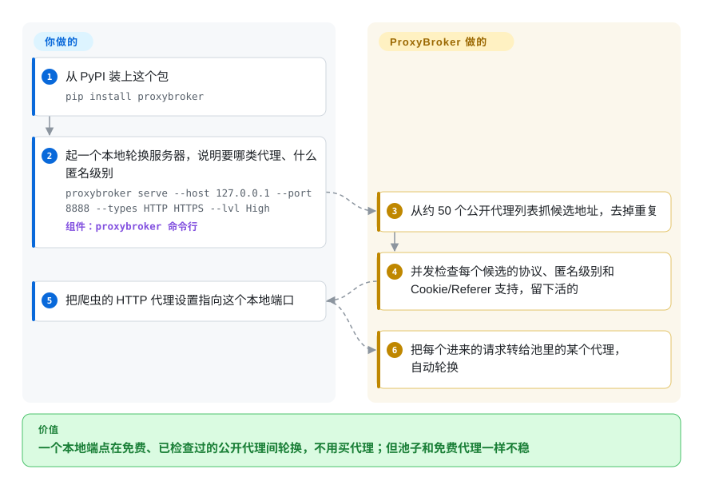

# ProxyBroker

一个异步 Python 工具，从约 50 个来源找公开代理、检查它们（类型、匿名度、延迟、国家、DNSBL），并能作为一个自轮换的代理服务器挡在你的流量前面。

## 何时使用

你在给一个小爬虫做原型，需要一池用完即弃的免费公开代理——你还没有付费代理供应商，只想要个东西能发现活的 HTTP(S)/SOCKS 代理、过滤掉死的和不匿名的，再暴露一个本地端点在存活者之间轮换。你 `pip install proxybroker`，跑 `proxybroker find --types HTTP HTTPS --lvl High --limit 10` 收割并校验一批，或 `proxybroker serve --host 127.0.0.1 --port 8888` 起一个轮换服务器，然后把客户端的代理指向 `127.0.0.1:8888` 让它循环。因为它端到端 asyncio，find/check 阶段就其本质而言算快，三个子命令（`find` / `grab` / `serve`）覆盖了发现、原始收集和实时服务。

这是一个*学习/实验*的选择：当你想搞懂「finder-checker-server」池是怎么拼到一起的，或为一件低风险的一次性活儿要点免费代理，并接受免费公开代理天生就不稳。

## 怎么用起来

ProxyBroker 把三件事放进一个进程：**找**——从约 50 个公开代理列表网站抓候选的 `ip:port` 地址；**验**——用 asyncio（一个线程同时照看成千上万个连接）并发地经由每个候选去连一次，确认协议、匿名级别（目标网站能不能看到你的真实 IP、能不能看出你在用代理），以及 Cookie 和 Referer 头能不能原样带过去；**发**——把活下来的代理分给你用。**收割、测试和轮换都是它替你做的**——你只选过滤条件（类型、匿名度、国家），再把客户端指向它的本地端口。它什么都不落盘：池子只活在本次运行的内存里，重启就从头再抓一遍。如果你更想在自己的代码里取代理，同样的能力也有 Python API（`Broker(queue).find(...)` 往一个 `asyncio.Queue` 里塞结果），不必走 `serve` 命令。

<!-- flow-steps:begin (generated from flows/proxybroker.json by tools/flow_card.py — do not edit) -->

流程文字版

1. **你**：从 PyPI 装上这个包 — `pip install proxybroker`
2. **你**：起一个本地轮换服务器，说明要哪类代理、什么匿名级别 — `proxybroker serve --host 127.0.0.1 --port 8888 --types HTTP HTTPS --lvl High` — 组件：`proxybroker 命令行`
3. **ProxyBroker**：从约 50 个公开代理列表抓候选地址，去掉重复
4. **ProxyBroker**：并发检查每个候选的协议、匿名级别和 Cookie/Referer 支持，留下活的
5. **你**：把爬虫的 HTTP 代理设置指向这个本地端口
6. **ProxyBroker**：把每个进来的请求转给池里的某个代理，自动轮换

**价值**：一个本地端点在免费、已检查过的公开代理间轮换，不用买代理；但池子和免费代理一样不稳

<!-- flow-steps:end -->

## 何时不用

- **任何生产或对可靠性敏感的场景。** 免费公开代理又慢、寿命又短、还常有恶意；自己收割的池子不适合不能失败的任务。请改买住宅/数据中心代理。
- **不做版本钉死的现代 Python。** 项目最后一次真正发版早于若干 asyncio/Python 变更；用户普遍报告在较新 Python 上装/跑都会崩，得靠钉死环境或打补丁才跑得起来。把兼容性当成你自己要解决的问题。[未验证]
- **你需要鉴权、在线率追踪或按站点检查。** README 自己的 TODO 把代理鉴权、在线率追踪和按站点访问检查都列为*缺失*——鉴于项目休眠，它们大概率不会落地。
- **涉及信任 / 安全敏感的流量。** 把真实凭据或敏感数据经由未知免费代理转发是数据暴露风险；有些公开代理会拦截流量。[推断]
- **你想要一个在维护的依赖。** 没有近期发布、活动极少，你采纳的是实质上冻结的代码（见健康度）。

## 横向对比

| 替代品 | 是否收录 | 我们的评价 | 取舍 |
|---|---|---|---|
| [Scylla](scylla.zh.md) | ✅ | 需要带 UI/API 的常驻代理池服务时，选 Scylla。 | 一个更长寿的智能代理池，带网页 UI、JSON API 和质量打分——比 ProxyBroker 的 CLI 更像一个可运行的*服务*，也维护得更近，尽管同样不常发版。 |
| [haipproxy](haipproxy.zh.md) | ✅ | 分布式 Scrapy+Redis 规模比一次性 CLI 简洁更重要时，选 haipproxy。 | 分布式 Scrapy+Redis 代理池，面向大型爬虫的高可用——重得多（需要 Redis、Scrapy）且自身也长期休眠，但为规模而非单个 CLI 设计。 |
| 付费代理供应商（Bright Data、Oxylabs……） | 未收录 | 需要商业 SLA、鉴权和托管轮换时，选付费代理供应商。 | 商业住宅/数据中心池，自带 SLA、鉴权和轮换——真正的生产答案；只有当「免费 + 用完即弃」可接受时，ProxyBroker 才说得通。 |
| scrapy-rotating-proxies / 代理中间件 | 未收录 | 已有代理列表、只需要在 Scrapy 内轮换时，选 Scrapy 代理中间件。 | 在 Scrapy 内轮换*你提供的列表*的库中间件；是互补而非竞争——它不收割代理，只消费代理。 |

## 技术栈

- **语言：** Python（端到端 asyncio；历史上 Python 3.5+）。
- **网络：** `aiohttp`（异步 HTTP）、`aiodns`（异步 DNS）；`maxminddb` 做 GeoIP/国家过滤。
- **接口面：** 一个 CLI，含 `find`（收割 + 校验）、`grab`（只收集不检查）、`serve`（轮换代理服务器）；支持 HTTP(S)、SOCKS4/5、CONNECT，并按匿名级别、延迟、国家、DNSBL 过滤。

## 依赖

- **运行时：** Python（历史上 3.5+；现代版本常需钉死/打补丁）、`aiohttp`、`aiodns`、`maxminddb`。
- **数据：** 一个打包/GeoIP 数据库用于国家过滤。[推断]
- **无外部服务 / 无数据存储**——代理是实时收割、在会话内存里持有。
- **安装：** `pip install proxybroker`（预期要钉死一套兼容的 Python/库）。

## 运维难度

**跑起来低，保持能用高。** 启动它很简单——一次 pip 安装、一条子命令。难度全在对抗衰朽：让它在当前 Python 上装上/跑起来常需版本钉死或补丁（因其年代久远）；它爬的免费代理来源会失效；代理本身也持续流失，所以任何「池子」都是临时的。没有服务/数据存储要运维，但预期要照看兼容性并接受不可靠的产出——运维成本在不可靠，而非基建。

## 健康度与可持续性

- **响应速度**：无法计算——no_traffic。
- **维护（2026-10）。** 实质上**休眠**：最后一次发布（0.3.2）在 2019-03-12，默认分支最后一次提交在 2019-03-13；GitHub 显示的 2024-03 `pushed_at` 在现存任何分支上都对不上提交。未正式归档，但已七年多没有开发。当作冻结对待。
- **治理 / bus factor。** 单作者项目（constverum，一个 User 账号）已沉寂——bus-factor 风险拉满：原维护者基本缺席，也无继任者接手。[推断]
- **年龄与 Lindy 判断。** 约 11 年（2015-10 创建）但**不再活跃**⇒ Lindy 在这里*失效*：有年龄而无持续活动是弃用信号，不是耐久性。老 + 休眠是红旗。
- **采用度。** 约 4.2k star 和大量 fork 反映历史人气，但休眠仓库上的高 star 是*遗产*采用，不是当前可持续性的证据。[未验证]
- **风险标记。** 休眠 + 报告的现代 Python 崩坏是头号风险；外加经未知免费代理转发流量的固有风险。Apache-2.0，无 relicense 顾虑。

## 存疑（未验证）

- [推断] GitHub 报的 `pushed_at` 是 2024-03-18，但现存分支上没有 2019-03-13 之后的提交；推测那次 push 来自已删除的分支或标签，不代表有开发。
- [未验证] 在现代 Python 上的崩坏经用户广泛报告，但此处未重新测试；具体崩的版本未确认。
- [推断] 「休眠、未维护」是从发布/提交历史推断（无近期发布、零星 push），而非官方弃用声明。
- [推断] 免费公开代理的安全风险（拦截）是这类代理的普遍属性，并非针对 ProxyBroker 所爬某个具体来源的断言。
