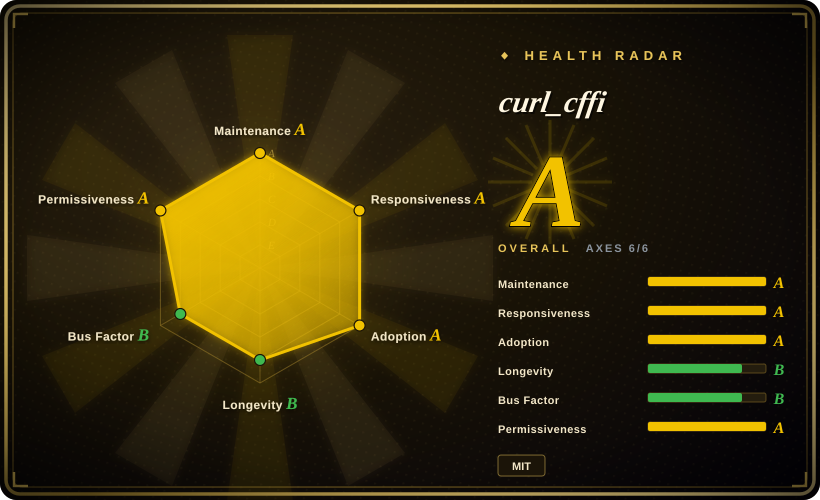
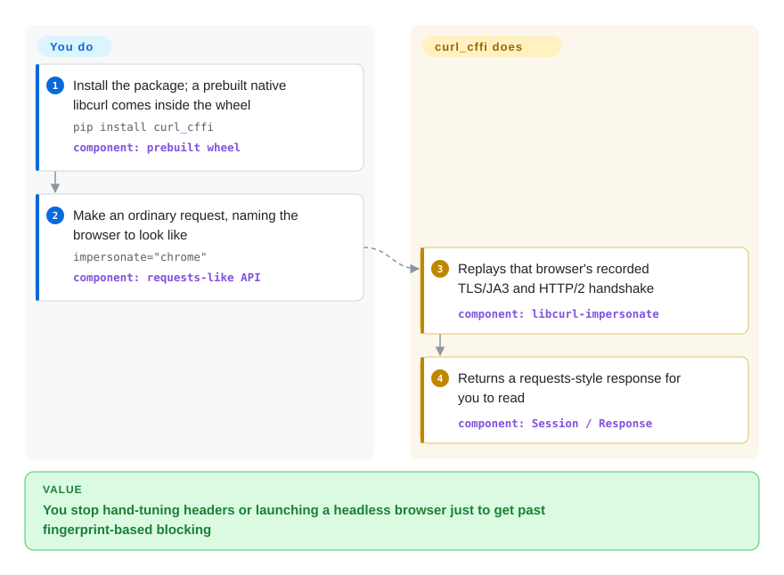

# curl_cffi

A Python HTTP client that reproduces a real browser's TLS/JA3 and HTTP/2 handshake by binding a patched libcurl — a `requests`-like API for when a site blocks you for "no obvious reason".

## When to use

You're writing Python that has to fetch pages or API endpoints from a site protected by Cloudflare, Akamai, DataDome or a WAF, and plain `requests` / `httpx` come back with 403s, empty bodies, or a challenge page — even though the same URL loads fine in your browser and `curl` from the shell. The site is not checking your headers or cookies; it is fingerprinting your TLS handshake (JA3/JA4) and HTTP/2 settings, and Python's OpenSSL-based clients present a ClientHello no real browser ever sends. Rather than standing up Playwright or Selenium and paying for a headless browser per request, you `pip install curl_cffi` and change one call: `curl_cffi.get(url, impersonate="chrome")`. The wheel carries a prebuilt libcurl-impersonate that replays a recorded Chrome handshake, so the server sees a fingerprint it recognizes, while you keep a `requests`-shaped API (`Session`, `.text`, `.json()`, proxies, cookies) — plus HTTP/2, HTTP/3 and WebSocket support that `requests` never had.

Reach for it specifically when the blocker is **fingerprint-based** rather than protocol-feature-based: over `httpx`/`aiohttp` when those get blocked, and over a browser-automation stack when you don't need JavaScript to run — bulk page/API fetching and polling, where launching a real browser per request is too heavy.

## How it works

`curl_cffi` is a `cffi` binding to a fork of `curl-impersonate`, a patched libcurl built to reproduce one specific browser's TLS ClientHello and HTTP/2 settings byte-for-byte. The project ships that patched native library prebuilt inside the wheel, so "install" does not mean compiling curl on your machine. On top of it you get two Python layers: a low-level `curl` API, and a high-level `requests`-like one (`Session`, `AsyncSession`, `get`/`post`, `WebSocket`). You select the disguise with `impersonate="chrome"` (or `"safari"`, `"safari_ios"`, …), or supply your own `ja3=`, `akamai=` and `extra_fp=` values for non-browser targets; the library applies those to the handshake and HTTP/2 layer before the request leaves your process, then hands back a response object you consume as usual. The division of labour: **you** pick the target fingerprint and write otherwise ordinary request code; **curl_cffi** owns the native binary, the version-to-browser fingerprint mapping, and the handshake itself.

<!-- flow-steps:begin (generated from flows/curl-cffi.json by tools/flow_card.py — do not edit) -->

Text version of the flow

1. **You**: Install the package; a prebuilt native libcurl comes inside the wheel — `pip install curl_cffi` — component: `prebuilt wheel`
2. **You**: Make an ordinary request, naming the browser to look like — `impersonate="chrome"` — component: `requests-like API`
3. **curl_cffi**: Replays that browser's recorded TLS/JA3 and HTTP/2 handshake — component: `libcurl-impersonate`
4. **curl_cffi**: Returns a requests-style response for you to read — component: `Session / Response`

**Value**: You stop hand-tuning headers or launching a headless browser just to get past fingerprint-based blocking

<!-- flow-steps:end -->

## When NOT to use

- **The site needs JavaScript executed or a JS challenge solved.** Impersonation covers the TLS/HTTP layer only; it does not run page scripts. Use a real browser-automation stack (Playwright, or the same author's `brimp` / commercial token services) instead.
- **You need a pure-Python, dependency-free client.** The wheel bundles a native libcurl, so you inherit a platform-specific binary. If that is unacceptable — locked-down CI, unusual architecture, PyPy, a strict source-audit policy — use `requests`, `httpx` or `urllib3` and accept that you cannot impersonate.
- **Nothing is fingerprinting you.** For ordinary REST calls, an internal service, or a well-behaved public API, this is a heavier dependency for no benefit. Use `httpx` for a modern sync+async client, or `aiohttp` if you are already asyncio-native.
- **You want guaranteed API stability.** The project is `0.x` and PyPI-classified `Development Status :: 4 - Beta`; minor releases have raised the floor (Python ≥ 3.10 since v0.14) and can reorganize APIs. Pin the version if you depend on it.
- **You need fingerprints beyond the free set, or the newest ones immediately.** The open-source repo ships a preset list plus free Chrome/Safari/Firefox updates via `curl-cffi update`; the wider and fresher fingerprint database is the paid `impersonate.pro` tier. If you cannot take a commercial dependency, treat the free set as your ceiling.
- **You are not on Python.** Use `bogdanfinn/tls-client` (Go, with bindings), the `curl-impersonate` binary itself, or `impers` (Node.js) rather than shelling out to Python.
- **Using it against a target may breach that site's terms.** Impersonation software sits in a legal/policy grey zone; the library's legality does not make your scraping of a given site authorized.

## Comparison

| Alternative | In index | Our verdict | Tradeoff |
|---|---|---|---|
| requests | 未收录 | Pick `requests` when the target is not fingerprinting you — plain REST calls, auth flows and anything where a pure-Python, dependency-light client is the point. | The largest adapter ecosystem and zero native binaries, but no HTTP/2 and no control over the ClientHello, which is precisely what gets you blocked. |
| httpx | 未收录 | Pick `httpx` for new application code that wants sync and async behind one API and real HTTP/2 without pretending to be a browser. | A cleaner async story and first-party HTTP/2, but its OpenSSL handshake is still a fingerprint no browser sends, so anti-bot systems can still separate you from a real user. |
| aiohttp | 未收录 | Pick `aiohttp` when the whole service is already asyncio-native and you may also want its WebSocket client or server side. | A mature async stack, but an async-only API is a larger rewrite than swapping one `requests` call, and it offers no impersonation. |
| pycurl | 未收录 | Pick `pycurl` when you need libcurl's full option and protocol surface and fingerprints are irrelevant. | The same libcurl heritage and speed, but a libcurl-shaped API rather than a `requests`-shaped one, and no browser-impersonation layer. |
| bogdanfinn/tls-client | 未收录 | Pick `tls-client` when the caller is Go (or another language with a binding) rather than Python — it does comparable TLS-fingerprint impersonation from a different stack. | Comparable capability without a libcurl fork, but a different language, its own fingerprint set, and a separate release cycle to track. |

## Tech stack

- **Language:** Python (the binding); the bundled native layer is a patched libcurl fork, i.e. C.
- **Core dependencies:** `cffi>=2.0.0` and `certifi>=2024.2.2`; Python ≥ 3.10.
- **Optional extras:** `cli` (`rich`, for the bundled CLI) and `extra` (`readability-lxml`, `markdownify`, `lxml_html_clean`, `jsonpath-ng`).
- **API surface:** low-level `curl` API; `requests`-like `Session` / `AsyncSession` / `get` / `post`; `WebSocket` (sync and async); and a `curl-cffi` CLI (`curl-cffi get <url> --impersonate chrome`).

## Dependencies

- **Runtime:** Python ≥ 3.10, plus `cffi` and `certifi`. Wheel installs bundle the prebuilt libcurl-impersonate, so you do **not** need a system curl or a C compiler.
- **Source builds:** building from a checkout needs a C toolchain and `make preprocess` (it fetches and patches the bundled libcurl headers) — the README calls this the "unstable version" path.
- **Services/infra:** none — it is a client library and needs only outbound network. HTTP/SOCKS proxies are optional, per-request or per-session.

## Ops difficulty

**Low** to install and run: `pip install curl_cffi`, call it, nothing to deploy or operate. The ongoing cost is the arms race rather than the infrastructure — the preset fingerprints age, so you periodically `pip install --upgrade curl_cffi` (or `curl-cffi update` for fingerprint data) to stay current with the browsers and with whatever the anti-bot vendors started rejecting. Because the value proposition is "looks like a current browser", an outdated install degrades silently into the same 403s you started with; treat fingerprint freshness as an operational task, not a one-time setup.

## Health & viability

- **Maintenance (2026-09).** Very active: releases land every week or two (0.16.0 → 0.16.3 through Aug–Sep 2026, with betas in between), the default branch was pushed 2026-09-20, and PRs and issues turn over within days. This reads as a project under active, near-continuous development, not a stable frozen surface.
- **Governance / bus factor.** Owner is a **User** account (`lexiforest`, tied to Riverside AI LLC and the commercial `impersonate.pro`), so the roadmap is vendor-led even though 70+ contributors have touched the repo. The commercial arm funds the work — good for longevity, but it also means the free/paid line is a business decision you don't control.
- **Age & Lindy.** First published in 2022 and still shipping hard ~4.5 years later: the age alone is modest, but the **age × still-active** combination is a decent prior for a fast-moving utility.
- **Adoption.** ~6.5k stars and ~550 forks, a large PyPI install base, and a real integration surface — community Scrapy adapters, `requests`/`httpx` adapters, and a bundled agent-fetch skill. Popularity here follows the anti-bot arms race, which cuts both ways.
- **Risk flags.** Open-core: the newest and widest fingerprint database plus the JS-capable sibling (`brimp`) are commercial. Single-vendor ownership, `0.x` API stability, and the inherent cat-and-mouse nature of impersonation (a detection change can break a preset overnight) are the material risks; MIT on the code itself is permissive with no relicense history found.

## Caveats (unverified)

- [未验证] PyPI download figures are third-party estimates (pepy reported ~334M all-time and a ~7M/week badge as of 2026-09); they are not a maintainer-published number and were read from a dashboard, not an API contract.
- [未验证] Whether every platform's wheel actually bundles the native binary without requiring a compiler was inferred from the README's "pre-compiled, so you don't have to compile on your machine" and the packaging metadata; a source install instead needs `make preprocess`, which was not run here.
- [推断] "Very active" and the cadence claims are read from release dates, push time and issue/PR turnover on the default branch, not from any maintainer roadmap statement.
- [未验证] The set of browser presets and their freshness is maintained by the upstream `curl-impersonate` fork and the `impersonate.pro` service; the exact free-vs-paid split and preset count are not asserted here and should be checked with `curl-cffi list` on your own version.
- [推断] The free/paid boundary (open repository vs commercial fingerprints and JS support) is a business-model risk assessment, not a legal opinion; nothing here evaluates whether impersonation is permitted for any specific site or use case.
- [未验证] `bogdanfinn/tls-client` was referenced as a real project from curl_cffi's own `examples/impersonate.py`; its own maintenance state was not verified for this page.
