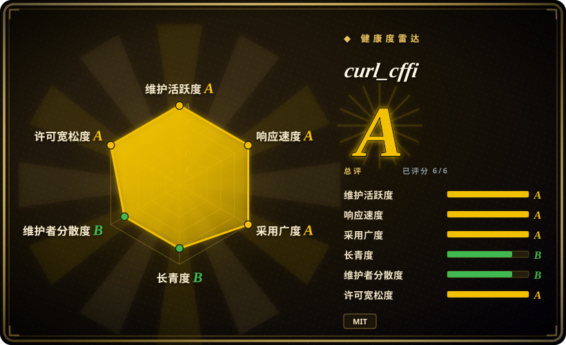
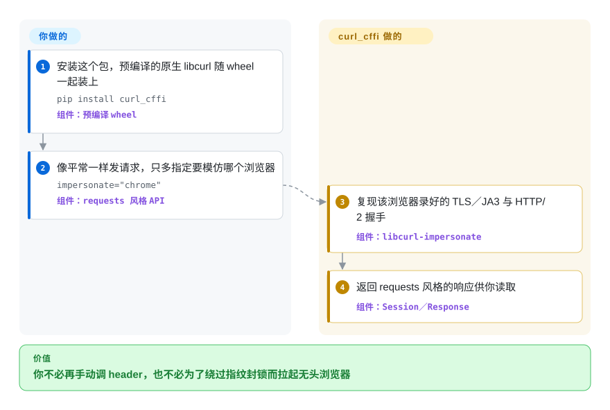

# curl_cffi

一个 Python HTTP 客户端：通过绑定打过补丁的 libcurl，复现真实浏览器的 TLS/JA3 与 HTTP/2 握手——当网站「无缘无故」封你时，用 `requests` 风格的 API 绕过去。

## 何时使用

你在写 Python，需要抓取受 Cloudflare、Akamai、DataDome 或某道 WAF 保护的页面或 API，而普通的 `requests`／`httpx` 换回来的是 403、空响应体或一个验证页——同一个 URL 在浏览器里、甚至命令行 `curl` 里都正常。问题不在 header 或 cookie：网站在对你的 TLS 握手（JA3／JA4）和 HTTP/2 设置做指纹识别，而 Python 这类基于 OpenSSL 的客户端给出的 ClientHello，任何真实浏览器都不会发。与其为每个请求拉起 Playwright／Selenium 并养一个无头浏览器，不如 `pip install curl_cffi`，只改一处调用：`curl_cffi.get(url, impersonate="chrome")`。wheel 里自带预编译的 libcurl-impersonate，复现录好的 Chrome 握手，于是服务端看到一个它认识的指纹；而你仍然用 `requests` 形状的 API（`Session`、`.text`、`.json()`、代理、cookie），并且拿到了 `requests` 从来没有的 HTTP/2、HTTP/3 与 WebSocket 能力。

专门选它的场景是：**拦截来自指纹**而非来自协议特性。此时它优于 `httpx`／`aiohttp`（它们会被同样拦下），也优于浏览器自动化栈（你并不需要执行 JavaScript）——适合批量抓页面／调接口和轮询这类每个请求都开真浏览器太重的工作。

## 怎么用起来

`curl_cffi` 是对 `curl-impersonate` 某个分支的 `cffi` 绑定，而后者是一个改过的 libcurl，用来逐字节复现某个具体浏览器的 TLS ClientHello 和 HTTP/2 设置。项目把这个打过补丁的原生库预编译好，直接放进 wheel，所以「安装」并不等于在你机器上编译 curl。在此之上给你两层 Python API：底层的 `curl` API，以及高层、仿 `requests` 的 API（`Session`、`AsyncSession`、`get`／`post`、`WebSocket`）。你用 `impersonate="chrome"`（或 `"safari"`、`"safari_ios"` 等）指定伪装对象，非浏览器目标则自己传 `ja3=`、`akamai=`、`extra_fp=`；库会在请求离开你的进程之前把这些应用到握手和 HTTP/2 层，然后把响应对象照常交还给你。分工是：**你**负责挑目标指纹、写本来就普通的请求代码；**curl_cffi** 负责原生二进制、版本到浏览器指纹的映射，以及握手本身。

<!-- flow-steps:begin (generated from flows/curl-cffi.json by tools/flow_card.py — do not edit) -->

流程文字版

1. **你**：安装这个包，预编译的原生 libcurl 随 wheel 一起装上 — `pip install curl_cffi` — 组件：`预编译 wheel`
2. **你**：像平常一样发请求，只多指定要模仿哪个浏览器 — `impersonate="chrome"` — 组件：`requests 风格 API`
3. **curl_cffi**：复现该浏览器录好的 TLS／JA3 与 HTTP/2 握手 — 组件：`libcurl-impersonate`
4. **curl_cffi**：返回 requests 风格的响应供你读取 — 组件：`Session／Response`

**价值**：你不必再手动调 header，也不必为了绕过指纹封锁而拉起无头浏览器

<!-- flow-steps:end -->

## 何时不用

- **网站需要执行 JavaScript 或解 JS 挑战。** 伪装只覆盖 TLS／HTTP 层，它不跑页面脚本。应改用真正的浏览器自动化栈（Playwright，或同一作者的 `brimp`／商业 token 服务）。
- **你需要纯 Python、无原生依赖的客户端。** wheel 里捆着原生 libcurl，你因此继承了一个平台相关的二进制。如果这不可接受——封闭的 CI、冷门架构、PyPy、严格的源码审计政策——就用 `requests`、`httpx` 或 `urllib3`，并接受无法伪装这件事。
- **根本没人对你做指纹识别。** 普通 REST 调用、内部服务、规矩的公开 API，选它只是徒增一个更重的依赖。这类需求选 `httpx`（现代同步＋异步客户端），已经 asyncio-native 就选 `aiohttp`。
- **你想要有保证的 API 稳定性。** 项目是 `0.x`，PyPI 分类为 `Development Status :: 4 - Beta`；小版本发布抬高过门槛（自 v0.14 起要求 Python ≥ 3.10），也可能重排 API。要依赖它就锁版本。
- **你需要免费集合之外的指纹，或要立刻拿到最新的。** 开源仓库自带一份预设列表，并通过 `curl-cffi update` 免费更新 Chrome／Safari／Firefox；更宽、更新的指纹库属于付费的 `impersonate.pro` 档。如果你不能引入商业依赖，就把免费集合当成上限。
- **你不在 Python 上。** 应改用 `bogdanfinn/tls-client`（Go，带多语言绑定）、`curl-impersonate` 二进制本身，或 `impers`（Node.js），而不是去 shell 调 Python。
- **用它打某个目标可能违反该站条款。** 伪装类软件处在法律／政策的灰色地带；库本身合法，不等于你抓某个站就被授权。

## 横向对比

| 替代品 | 是否收录 | 我们的评价 | 取舍 |
|---|---|---|---|
| requests | 未收录 | 如果目标没有对你做指纹识别——普通 REST 调用、登录流程，以及任何「纯 Python、依赖越轻越好」的场合——选 `requests`。 | 适配器生态最大、零原生二进制，但没有 HTTP/2、无法控制 ClientHello，而这恰恰就是你会被封的原因。 |
| httpx | 未收录 | 新应用代码希望同步与异步共用一套 API、并且要真正的 HTTP/2，但不需要假装成浏览器时，选 `httpx`。 | 异步路线更干净、HTTP/2 是一等公民，但它的 OpenSSL 握手仍是没有浏览器会发的指纹，反爬系统依然能把你和真人用户区分开。 |
| aiohttp | 未收录 | 整个服务本就 asyncio-native，或者你还需要它的 WebSocket 客户端乃至服务端时，选 `aiohttp`。 | 异步栈成熟，但纯异步 API 相比换掉一个 `requests` 调用是更大的改写，而且它同样不做伪装。 |
| pycurl | 未收录 | 你需要 libcurl 完整的选项与协议面、且指纹无关紧要时，选 `pycurl`。 | 同样出自 libcurl、速度相当，但 API 是 libcurl 形状而非 `requests` 形状，也没有浏览器伪装层。 |
| bogdanfinn/tls-client | 未收录 | 调用方是 Go（或其他有绑定的语言）而不是 Python 时，选 `tls-client`——它用另一套技术栈做同类的 TLS 指纹伪装。 | 能力相近且不必 fork libcurl，但换了语言，指纹集合另成一套，还得单独跟它的发布节奏。 |

## 技术栈

- **语言：** Python（绑定层）；随包的原生层是打过补丁的 libcurl 分支，即 C。
- **核心依赖：** `cffi>=2.0.0` 与 `certifi>=2024.2.2`；Python ≥ 3.10。
- **可选 extra：** `cli`（`rich`，供自带 CLI 用）与 `extra`（`readability-lxml`、`markdownify`、`lxml_html_clean`、`jsonpath-ng`）。
- **API 面：** 底层 `curl` API；仿 `requests` 的 `Session`／`AsyncSession`／`get`／`post`；`WebSocket`（同步与异步）；以及 `curl-cffi` CLI（`curl-cffi get <url> --impersonate chrome`）。

## 依赖

- **运行时：** Python ≥ 3.10，外加 `cffi` 与 `certifi`。wheel 安装自带预编译的 libcurl-impersonate，因此**不**需要系统 curl，也不需要 C 编译器。
- **从源码构建：** 从 checkout 构建需要 C 工具链和 `make preprocess`（它会拉取并给随包的 libcurl 头文件打补丁）——README 把这条路称为「不稳定版本」路径。
- **服务／基础设施：** 无——它是客户端库，只需要出站网络。HTTP／SOCKS 代理可选，按请求或按会话配置。

## 运维难度

安装和运行**很低**：`pip install curl_cffi`，调用它，没有任何要部署或运维的东西。持续成本在军备竞赛而不在基础设施——预设指纹会变旧，所以要定期 `pip install --upgrade curl_cffi`（或用 `curl-cffi update` 更新指纹数据），跟上浏览器、也跟上反爬厂商开始拒绝的东西。因为卖点就是「看起来像当前浏览器」，过期的安装会悄悄退化回你最初遇到的那批 403；请把指纹新鲜度当成一项运维任务，而不是一次性配置。

## 健康度与可持续性

- **维护（2026-09）。** 非常活跃：几乎每一两周就有发布（2026 年 8 至 9 月从 0.16.0 走到 0.16.3，中间还有若干 beta），默认分支最后 push 于 2026-09-20，PR 与 issue 都在几天内流转。读起来是一个持续、近乎不断在开发的项目，而不是冻结的稳定面。
- **治理／bus factor。** owner 是 **User** 账号（`lexiforest`，与 Riverside AI LLC 及商业服务 `impersonate.pro` 相连），因此路线图由厂商主导，尽管已有 70 多位贡献者参与过。商业线在供养这个项目——对长期存续是好事，但也意味着免费与付费的界线是一个你无法左右的商业决定。
- **年龄与 Lindy。** 2022 年首次发布，约 4.5 年后仍在高强度发版：单看年龄不算老，但**年龄 × 仍活跃**这个组合，对一个快速演进的工具来说是个不错的先验。
- **采用度。** 约 6.5k star、约 550 fork，PyPI 装机面很大，集成面真实存在——社区 Scrapy 适配器、`requests`／`httpx` 适配器，以及一个随仓库的 agent 抓取 skill。这里的人气绑在反爬军备竞赛上，因而是一把双刃剑。
- **风险标记。** 开放核心（open-core）：最新、最宽的指纹库，以及能跑 JS 的兄弟项目（`brimp`）都是商业的。单一厂商主导、`0.x` 的 API 稳定性，以及伪装天然的猫鼠性质（检测一变，某个预设可能一夜失效）是实质风险；代码本身是 MIT，未发现 relicense 历史。

## 存疑（未验证）

- [未验证] PyPI 下载量来自第三方估算（pepy 在 2026-09 报约 3.34 亿累计、周下载徽章约 700 万）；这不是维护者公布的数字，且读自仪表盘而非某项 API 契约。
- [未验证] 「各平台 wheel 都自带原生二进制、无需编译器」是从 README 的「pre-compiled, so you don't have to compile on your machine」与打包元数据推断的；而从源码安装则需要 `make preprocess`，这里没有实际跑过。
- [推断]「非常活跃」与发布节奏的判断读自发布日、push 时间与默认分支上的 issue／PR 流转，而非维护者的路线图声明。
- [未验证] 浏览器预设集合及其新鲜度由上游 `curl-impersonate` 分支和 `impersonate.pro` 服务维护；本页不断言免费与付费的确切界线或预设数量，请用你自己版本上的 `curl-cffi list` 核对。
- [推断] 免费／付费边界（开放仓库 vs 商业指纹与 JS 支持）是商业模式层面的风险评估，不是法律意见；本页不评估伪装在某个具体站点或用途上是否被允许。
- [未验证] `bogdanfinn/tls-client` 的存在是从 curl_cffi 自己的 `examples/impersonate.py` 引用中确认的；本页未核实它自身的维护状态。
