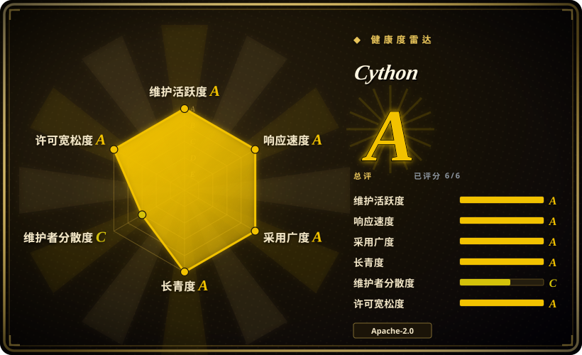
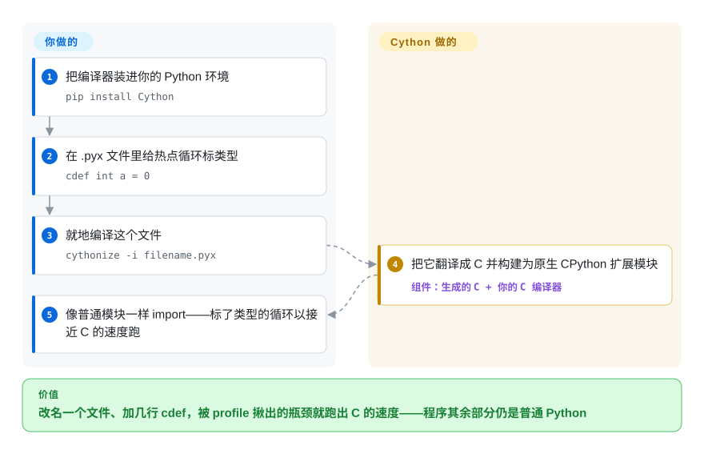

# Cython

你 profile 出一个爬得慢的 Python 内层循环——像素运算、解析器、一步 N-body——用 C 重写又赔掉你本想保留的 Python 顺手。Cython 是一个把 Python（外加可选的 C 类型声明）编译成 C 的编译器，产物构建为原生 CPython 扩展模块：热点部分以接近 C 的速度跑，其余一切仍是 Python。

## 何时使用

你给 Python 程序做了 profiling，发现有一个紧凑的数值循环主导了运行时——像素运算、解析器内层循环、一步 N-body。把整个东西用 C 重写杀鸡用牛刀，还会丢掉 Python 的顺手，但纯 Python 的循环就是太慢。你把模块 `.py` 改名成 `.pyx`，给热点变量加几个 `cdef int`/`cdef double` 类型标注，用 Cython 编译成 C 扩展，这个循环现在以接近 C 的速度跑，而代码其余部分仍是 Python。你没重写程序，只编译了要紧的那部分。

当你需要**封装一个 C 或 C++ 库**并暴露给 Python 时，你也会选 Cython：你写一个薄薄的 `.pyx`，用 `cdef extern from "lib.h"` 声明外部签名和面向 Python 的包装，Cython 生成胶水 C，构建成一个可 import 的模块。它是科学 Python 栈很大一片背后的主力——许多包都发布 Cython 生成的扩展——所以当 `ctypes`/`cffi` 显得太松或太慢、你想要编译的、带类型的、可静态检查的绑定时，它是经过验证的路径。

## 怎么用起来

Cython 是一台翻译器加一门语言。它读一个 `.py` 或 `.pyx` 文件，写出与 CPython C-API 对话的 **C 源码**，然后你的普通 C 编译器把那份 C 构建为可 import 的扩展模块（`.so`/`.pyd`）。速度来自可选的类型声明：`cdef int a = 0` 告诉编译器 `a` 是机器整数，于是循环里增的是一个裸寄存器值，而不是装箱对象、引用计数、运行时派发 `+`——不标类型的代码照样能跑，只是保留 Python 的动态开销。要封装现成的 C/C++ 库，你在 `cdef extern from "header.h"` 块里声明它的签名，胶水由 Cython 生成。它替你做的：代码生成、塞进 `setup.py` 的 `cythonize()` 钩子、一次性的 `cythonize -i` 命令行，以及做实验用的 Jupyter `%%cython` magic。留在你那儿的：每个构建平台上可用的 C 工具链、分发库时的 wheel 矩阵，还有最前面那次 profiling——它告诉你哪个循环值得改名成 `.pyx`。

<!-- flow-steps:begin (generated from flows/cython.json by tools/flow_card.py — do not edit) -->

流程文字版

1. **你**：把编译器装进你的 Python 环境 — `pip install Cython`
2. **你**：在 .pyx 文件里给热点循环标类型 — `cdef int a = 0`
3. **你**：就地编译这个文件 — `cythonize -i filename.pyx`
4. **Cython**：把它翻译成 C 并构建为原生 CPython 扩展模块 — 组件：`生成的 C + 你的 C 编译器`
5. **你**：像普通模块一样 import——标了类型的循环以接近 C 的速度跑

**价值**：改名一个文件、加几行 cdef，被 profile 揪出的瓶颈就跑出 C 的速度——程序其余部分仍是普通 Python

<!-- flow-steps:end -->

## 何时不用

- **你的瓶颈是 I/O 或已经向量化了。** 如果慢的部分是网络/磁盘等待，或者已经跑在 NumPy/pandas 的 C 代码里，编译你的 Python 循环帮不上忙——修算法或 I/O，而不是语言。
- **你想要零构建步骤 / 纯 Python 分发。** Cython 引入一个 **C 编译器加构建/wheel 管线**；如果你需要无编译、可 pip 安装的纯 Python 包，这个代价可能不值。考虑 Numba（JIT、无单独构建）或 PyPy。
- **JIT 更适合你。** 对数值核函数，**Numba** 用一个装饰器、无需 C 工具链就能给出大幅提速；对整程序速度，**PyPy** 可能胜过手工 Cython 化——Cython 的长处在于你想要显式的 C 级控制和稳定 ABI 扩展。
- **你在写全新的性能代码、不需要 Python 互操作。** 如果不需要活在 CPython 里，直接用 C/C++/Rust 写组件（经 PyO3/pybind11 绑定）可能比 Cython 超集更干净。
- **你受不了 .pyx/类型标注的学习曲线。** 拿到真实提速需要理解 `cdef`、typed memoryview、GIL 处理和 C 构建；对未标类型代码的天真 Cython 化收效甚微。

## 横向对比

| 替代品 | 是否收录 | 我们的评价 | 取舍 |
|---|---|---|---|
| Numba | 未收录 | 数组／循环核函数比扩展 ABI 或 C/C++ 封装更重要，且想用装饰器式数值 JIT 时，选 Numba。 | 无单独 C 构建，对数值核函数很强，但范围更窄，并且绑定运行时 JIT 模型。 |
| PyPy | 未收录 | 想先试整程序无改代码 JIT，而不是手工 Cython 化局部模块时，选 PyPy。 | 可加速整程序，但 C 扩展兼容性和生态契合可能是坑。 |
| pybind11 / nanobind | 未收录 | 性能关键代码已经是 C++，Python 只需要绑定层时，选 pybind11 或 nanobind。 | 很适合 C++ 库，但你写的是 C++，不是 Python 超集。 |
| cffi / ctypes | 未收录 | 只是薄薄调用 C，编译自定义 CPython 扩展反而过重时，选 cffi 或 ctypes。 | 薄 FFI 更简单，但没有编译级速度的 Python，静态类型也比 Cython 弱。 |
| mypyc | 未收录 | 标准类型标注的 Python 是源码真相，不能接受 Cython 专用语法时，选 mypyc。 | 更接近“编译我的 Python”且用标准类型，但比 Cython 更年轻更窄。 |
| Rust + PyO3 | 未收录 | 热点组件应改写成 Rust，而不是保留在 Python 超集语言里时，选 Rust + PyO3。 | 内存安全且快，但会引入另一种语言和工具链。 |

## 技术栈

- **它是什么：** 一个大体用 Cython/Python 写的编译器，产出 **C**（也能目标 C++），再由 C 编译器构建成 CPython 扩展模块。[推断]
- **语言模型：** Python 加可选的 C 类型声明（`cdef`、typed memoryview、`cpdef`、`nogil`）、纯 Python 模式标注，以及绑定 C/C++ API 的 `extern` 块。
- **构建集成：** setup.py / 构建后端里的 `cythonize()`，加上 Jupyter `%%cython` magic 做内联使用；产出标准 wheel。
- **目标：** CPython（主要目标）；生成的 C 可跨 CPython 支持的平台移植。

## 依赖

- **运行时（生成模块的）：** 只有 CPython——Cython 构建的扩展像其他编译模块一样 import，终端用户没有 Cython 运行时依赖。
- **构建期：** 一个 **C 编译器**（目标 C++ 时还要 C++ 编译器）加 CPython 开发头文件；Cython 本身是可 pip 安装的 Python 包。
- **可选：** 打包用的构建后端（setuptools/meson）；若对着 NumPy 的 C API 编译则需要 NumPy 头文件。[未验证]

## 运维难度

**低到中，而且是构建期的、不是运行期的。** 一旦编译完，得到的扩展只是一个可 import 的模块——没有服务、没有运维。负担是**构建管线**：每个构建平台都要有可用的 C 工具链，发布库意味着为每个 OS/Python 版本组合产出 wheel（manylinux、macOS、Windows），这是常见的原生扩展打包苦差。调试编译后的 Cython（gdb、typed-vs-object 陷阱、GIL bug）比调试纯 Python 难。单平台单应用很容易；广泛分发的库则那张矩阵就是工作量。

## 健康度与可持续性

- **响应速度**：Grade A——中位首次响应时间 3.0 小时，基于 46 个 qualifying issues/PRs。
- **维护（2026-09）。** 最后 push 于 2026-09-27；发布频繁且当前——3.2 线的 3.2.8（2026-06-24）与 3.2.9（2026-07-24），随后 **3.3.0 正式版于 2026-08-22 发布**（GitHub releases）——明显**非常活跃**。未归档。
- **治理 / bus factor。** 组织所有（`cython`），有深厚长期的核心团队（scoder/Stefan Behnel、robertwb/Robert Bradshaw、da-woods、dalcinl 等）——是真正多维护者项目，不是单人仓库。[推断]
- **年龄与 Lindy 判断。** 本仓库始于 2010-11（约 15 年），而 Cython 的血统（源自 Pyrex）还更早；**持续活跃十余年**⇒**非常强的 Lindy**。它是科学 Python 很大一片之下的基础设施。[推断]
- **采用度。** 约 10.9k star、1.6k fork，加上庞大的传递安装基数——PyData/科学生态很大一部分都发布 Cython 编译的扩展；上月 PyPI 下载 78,291,231 次（健康度评分器，2026-09-28；README 自述“超七千万”）。Apache-2.0 许可。[未验证]
- **风险标记。** 很少——宽松许可、治理面广、真实世界重度依赖。现实的“风险”是契合度而非可持续性：对某个任务，JIT（Numba/PyPy）或 Rust 绑定可能比 Cython 超集更合适。

## 存疑（未验证）

- [未验证] 截至 2026-09 约 10.9k star、1629 fork、1527 个 open issue——易变且对时间敏感；大量 open issue 与一个庞大、年长、广泛使用的项目相符，单看并非红旗。
- [未验证] 观察到的最新发布：3.3.0 正式版（2026-08-22，GitHub releases API）；发布线和日期会变，钉版本前请核实当前稳定线。
- [推断] 编译器产出 C / 目标 CPython 的架构和带类型超集的语言模型是据 Cython 文档化设计和 `language: Cython` 元数据描述的，并非源码审计。
- [未验证] 确切的构建期依赖（哪种 C/C++ 编译器、NumPy 头文件、构建后端）取决于你的目标和打包选择；请对照当前 Cython 文档核实。
