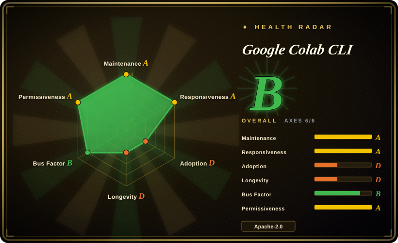
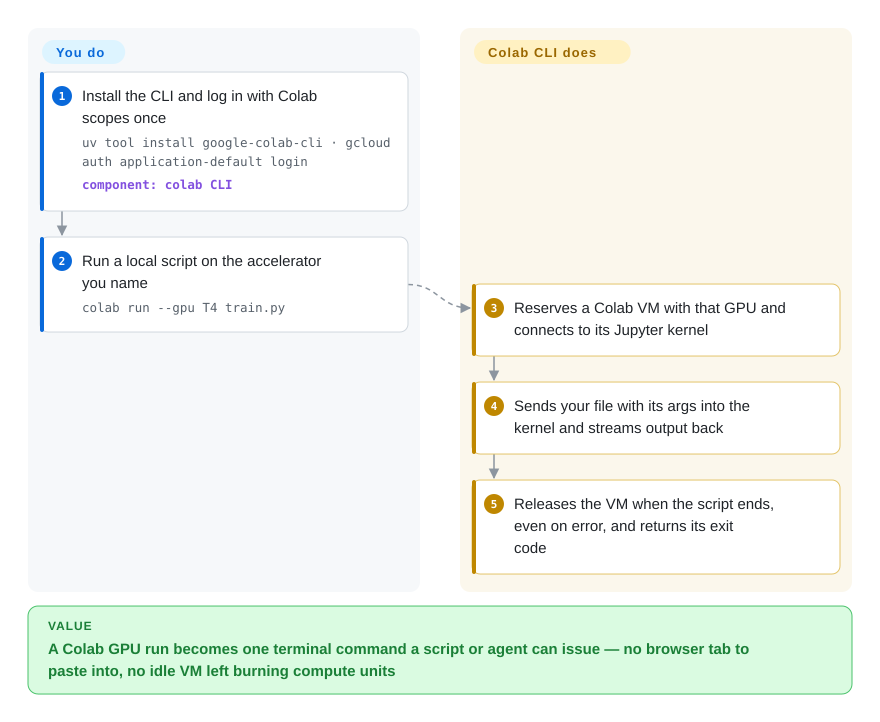

# Google Colab CLI

Your script is on your laptop and the GPU you pay for is in a Colab browser tab, so every run means pasting code into cells and keeping the tab open until it finishes — and a coding agent cannot click that tab at all. The Colab CLI rents the Colab VM from your terminal, pushes your local file into its Python kernel, and hands the VM back when the script exits.

## When to use

You are an ML engineer or student who already has a Colab account — often a paid tier with compute units — and your code lives in a local repo, not in a notebook. Today a GPU run looks like: open colab.research.google.com, pick a T4 or A100 runtime, paste `train.py` into a cell, `!pip install` the requirements, watch the tab, then remember to disconnect before the idle VM burns more units. Or you run a coding agent (Claude Code, Gemini CLI) that has written the training script and now reports `torch.cuda.is_available() == False` on your MacBook, with no way to reach a GPU. You reach for this CLI when Colab is the compute you already have: `colab run --gpu T4 train.py` allocates the VM, sends the file, streams output to your terminal, propagates the exit code and releases the VM; `colab new` / `colab exec` / `colab stop` keep a session open when you want state to persist across calls, and the repo ships a `colab-operator` skill so an agent knows the rules.

The deciding tradeoff is **reusing a Colab subscription versus buying compute some other way**. Against the [Modal client SDK](../sandboxing/modal-client.md) you give up a documented, per-second-billed platform built for production, and gain "no new vendor, no new bill" if Colab is already paid for. Against SkyPilot you give up bring-your-own-cloud provisioning with failover across providers, and gain zero cloud-account setup. Against the Kaggle CLI you give up a free notebook-batch quota, and gain an interactive, stateful kernel you drive command by command.

## How it works

The CLI is a thin Python client for the same machinery the Colab web page uses. It signs you in with your Google identity (Application Default Credentials from `gcloud`, or an OAuth copy-paste flow), then asks Colab's session backend to reserve a VM with the accelerator you named — that reservation is a billable "assignment", exactly like clicking *Connect* in the browser. From then on it talks to the Jupyter kernel on that VM — the long-running Python process a notebook's cells execute in — over a WebSocket, the same channel a notebook tab uses. `colab exec -f train.py` reads the file on your machine and sends its text as one cell, so nothing has to be uploaded first, and variables survive between `exec` calls just as they do between cells. Think of it as a remote control for the notebook tab you would otherwise keep open. Google provisions the hardware, runs the kernel and keeps it alive while it is busy; you choose the hardware, send the code, and are responsible for stopping it (`colab run` does the stop for you, even when the script fails). `colab ssh` reuses the same session and token to give you a real shell or an OpenSSH `ProxyCommand` for IDE remote development.

<!-- flow-steps:begin (generated from flows/google-colab-cli.json by tools/flow_card.py — do not edit) -->

Text version of the flow

1. **You**: Install the CLI and log in with Colab scopes once — `uv tool install google-colab-cli · gcloud auth application-default login` — component: `colab CLI`
2. **You**: Run a local script on the accelerator you name — `colab run --gpu T4 train.py`
3. **Google Colab CLI**: Reserves a Colab VM with that GPU and connects to its Jupyter kernel
4. **Google Colab CLI**: Sends your file with its args into the kernel and streams output back
5. **Google Colab CLI**: Releases the VM when the script ends, even on error, and returns its exit code

**Value**: A Colab GPU run becomes one terminal command a script or agent can issue — no browser tab to paste into, no idle VM left burning compute units

<!-- flow-steps:end -->

## When NOT to use

- **You are on Windows.** The README states Linux and macOS only; Windows fixes sit in unmerged PRs (#99, #135) and a Termux/Android port lives in a third-party fork. Use the Colab web UI, or the [Modal client SDK](../sandboxing/modal-client.md) if you need a cross-platform scripted GPU client.
- **A production pipeline must not break when Google changes something.** The client drives Colab's web-session endpoints (`/tun/m/assign`, `/tun/m/unassign`, `/tun/m/assignments`), which its own design docs say were mapped from captured browser traces rather than a published API; the project is pre-1.0 and fresh `pip install`s of `colab exec` broke twice in 2026 from dependency renames (#94, #137). For a job that must keep running next quarter, use SkyPilot on your own cloud account or the [Modal client SDK](../sandboxing/modal-client.md), both of which sell a documented interface.
- **You need a specific GPU to actually allocate, every time.** Accelerators are tier-gated: `colab new --gpu A100` can return 400/412 when the account lacks quota, and the bundled skill warns that an unrecognized `--gpu` value silently falls back to A100. If a run must land on named hardware with failover, use SkyPilot, which searches across clusters and clouds for capacity.
- **The job runs unattended for many hours.** VMs are reclaimed when the kernel goes idle, and until v0.7.3 (2026-09-25) sessions were dropped when the one-hour runtime token expired (#106, #147); long-lived `repl`/`console`/`ssh` connections still do not refresh that token mid-connection (docs/01_session_management.md). For multi-hour training use SkyPilot managed jobs or a cloud VM you control. [推断]
- **You want no subscription at all and can wait for results.** The Kaggle CLI's `kaggle kernels push --accelerator …` runs a notebook as a batch job on Kaggle's GPUs/TPUs; you lose the interactive session but need no Colab plan.
- **You want the agent to work inside a notebook a human is watching.** Google's separate Colab MCP server bridges a local agent into a browser Colab session instead; this CLI deliberately has no browser in the loop.
- **Fully headless agent setup including Drive or in-VM GCP auth.** `colab drivemount` and `colab auth` need a human at the terminal (the bundled skill forbids running them from an agent), and #113 reports `drivemount` timing out after browser auth. Move data with `colab upload` / `colab download`, or pull from a bucket inside your script.
- **Data residency or compliance forbids a consumer-style Google service.** Your code, data and outputs run on Google-managed Colab VMs under your personal or Workspace account; use your own cloud or on-prem GPUs (e.g. through SkyPilot on your Kubernetes) instead.
- **You expect to shape the roadmap with PRs.** CONTRIBUTING.md says external contributions are not accepted and feedback goes to Discussions, and PRs pass a Google CLA bot. If contributing upstream matters, SkyPilot is an Apache-2.0 community project that takes PRs.

## Comparison

| Alternative | In index | Our verdict | Tradeoff |
|---|---|---|---|
| [Modal client SDK](../sandboxing/modal-client.md) | ✅ | Choose Modal when GPU jobs are part of a product and need a documented API, per-second billing and deploy/serve primitives; choose the Colab CLI when you already pay for Colab and want to push local scripts onto it from a terminal or agent. | Modal is a platform you design against (image, resources and secrets in code) with no subscription reuse; the Colab CLI adds no new vendor but rides web-session endpoints, tier-gated GPUs and idle reclamation. Both are open clients of closed hosted backends. |
| SkyPilot (`skypilot-org/skypilot`) | not indexed | Choose SkyPilot when you have cloud accounts or Kubernetes/Slurm clusters and need a job to find capacity across them with failover and autostop; choose the Colab CLI when you have no cloud account and a Colab plan is your only GPU. | SkyPilot gives portability across 20+ infrastructures and multi-hour managed jobs at the cost of cloud credentials, quotas and a bill per provider; the Colab CLI needs only a Google login but is locked to one service's tiers. Not added in this tab batch. |
| Kaggle CLI (`Kaggle/kaggle-cli`) | not indexed | Choose the Kaggle CLI when a batch notebook run on free Kaggle accelerators is enough and you can wait for it; choose the Colab CLI when you need an interactive, stateful kernel you drive command by command. | `kaggle kernels push` uploads a notebook with metadata and runs it to completion (T4 ×2, L4, TPU v5e-8/v6e-8 per its docs), with outputs fetched afterwards; the Colab CLI keeps a live kernel, file ops and SSH but depends on your Colab tier. Not added in this tab batch. |
| Colab MCP server (`googlecolab/colab-mcp`) | not indexed | Choose the MCP server when the agent should act inside a Colab notebook open in your browser, where you watch and edit alongside it; choose the CLI when the agent should run headless from the terminal with no browser at all. | Same vendor, opposite surface: the MCP server needs a local MCP client and a live browser session; the CLI needs only credentials and is scriptable in CI and shells. Not added in this tab batch. |
| Colab web UI | not a repo | Keep the browser UI for exploratory, visual notebook work and for the interactive steps the CLI cannot automate (Drive mount, secrets); switch to the CLI when the code already lives in a local repo or an agent must run it. | The web UI is the closed hosted product itself, so it is out of scope as a repository; it has every Colab feature (Secrets panel, widgets, sharing) that the CLI only partly reaches — #157 asks for Secrets access from the CLI. |

## Tech stack

- **Language / packaging:** Python ≥ 3.12, published to PyPI as `google-colab-cli` (entry point `colab`); built with hatchling + hatch-vcs, so the version is the git tag; `uv.lock` for development; releases built by Google Cloud Build (`cloudbuild.yaml`).
- **CLI layer:** Typer on Click, Rich for rendering, prompt-toolkit + Pygments for the REPL, html2text for rich `display_data` output, nbformat for `.ipynb` execution and log export.
- **Backend protocol:** `requests` to `colab.research.google.com` (assign/unassign/assignments/ccu-info and the Jupyter Contents API for files); `jupyter-kernel-client` (pinned `==0.9.0` on PyPI; a `googlecolab` fork in dev sources) for kernel execution over WebSocket, patched for Colab-specific protocol extensions; `websocket-client` for the SSH bridge.
- **Auth:** `google-auth` / `google-auth-oauthlib` — ADC by default, OAuth copy-paste flow as an option; a bundled OAuth client config ships in the package.
- **Local state:** JSON files under `~/.config/colab-cli/` (sessions, settings, token, per-session history JSONL) guarded by `filelock`.

## Dependencies

- **A Google account with Colab access.** GPUs/TPUs and `--high-mem` depend on your tier and compute units (`colab usage` shows the balance, `colab pay` opens the subscription page); the design doc calls T4 the standard free-tier GPU.
- **Credentials with the right scopes.** The default ADC path needs the Google Cloud SDK and a re-minted login with `openid`, `cloud-platform`, `userinfo.email` and `colaboratory` scopes; the OAuth path needs a browser once to paste a code.
- **Linux or macOS with Python 3.12+** (install via `uv tool install google-colab-cli` or `pip`).
- **For `colab ssh`:** the system OpenSSH client and an `ed25519` or ECDSA key (RSA keys are rejected server-side).
- **Network egress** to `colab.research.google.com` and `colab.pa.googleapis.com`, plus a once-a-day PyPI version probe by the auto-update banner.

## Ops difficulty

**Low to install, medium to run safely.** Installation is one `uv tool install`, and there is no server of yours to operate. The real work is hygiene: getting ADC scopes right is what the bundled skill calls "the #1 thing that blocks agents"; every `colab new` reserves a billable VM, so forgotten sessions and orphaned assignments (`[?]` rows in `colab sessions`) cost compute units until you stop them; parallel agents should isolate state with `--config <path>`; and because fresh installs have broken on dependency releases, pin the CLI version in anything automated and re-test before upgrading.

## Health & viability

- **Maintenance (2026-09-30).** Active: last push 2026-09-26; tags from v0.5.x to v0.7.4; PyPI got 0.7.2, 0.7.3 and 0.7.4 within 2026-09-22 → 09-26 after a three-month gap in which 0.7.0 was tagged but never reached PyPI (0.7.1 changelog). Fast fixes, uneven release engineering.
- **Governance / bus factor (2026-09-30).** Owned by the `googlecolab` GitHub organization; commits concentrate in two maintainers (sethtroisi 26, teeler 17 of the top-20 contributor counts). CONTRIBUTING.md says external PRs are not accepted, yet several outside PRs were merged in 2026-08/09 (#88, #112, #122, #125), so practice is looser than policy. [推断]
- **Backing & Lindy (2026-09-30).** Backed by Google as the official Colab client, which also ships the service it talks to. The repo is ~5.5 months old (created 2026-04-17), so Lindy gives almost no credit; its lifetime is tied to Google's appetite for a terminal surface on Colab, not to community momentum.
- **Adoption (2026-09-30).** ~1.4k stars, 193 forks, roughly 13k–17k PyPI downloads in the last month (13,052 on pypistats; 17,123 in the health scorer's registry read); community ports (Termux/Android) and issue traffic show real use shortly after launch.
- **Risk flags (2026-09-30).** Apache-2.0 with no relicense history; the risks are structural — a client of a closed service's web-session endpoints, tier-gated hardware, Windows unsupported, and two install-breaking dependency incidents in 2026 (#94, #137).

## Caveats (unverified)

- [未验证] No command was run end-to-end: this session had no Colab account, so behavior, latency and allocation success come from the README, docs, bundled skill and issues, not reproduction.
- [推断] "Web-session endpoints, not a published API" rests on the repo's design docs (endpoints and parameters mapped from HAR browser traces) and AGENTS.md "Trace Alignment"; no Google-published API reference for `/tun/m/assign` was searched for.
- [未验证] Which accelerators each Colab tier can allocate, and at what compute-unit cost, was not checked against Colab's pricing pages; the page relies on the bundled skill ("tier-gated; most accounts can only get CPU") and the design doc's "T4: standard free-tier GPU".
- [未验证] Colab's terms of service on automated/headless use and SSH were not read for this page; the tool being Google's own suggests the use is sanctioned, but tier-specific restrictions may apply.
- [推断] The reliability judgment for multi-hour unattended jobs extrapolates from the token-expiry issues (#106, #147) and the documented idle reclamation; the 2026-09-25 token-refresh fix was not observed working in practice.
- [推断] The "practice looser than policy" governance note infers from merged PR authors that were not verified to be outside Google.
- [未验证] Kaggle's free accelerator quota size and SkyPilot managed-job behavior were not tested; the comparison uses their READMEs/docs only.
