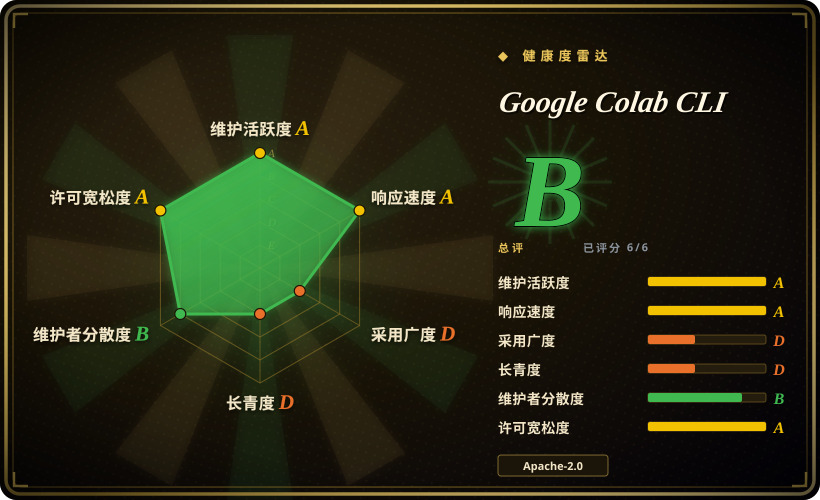
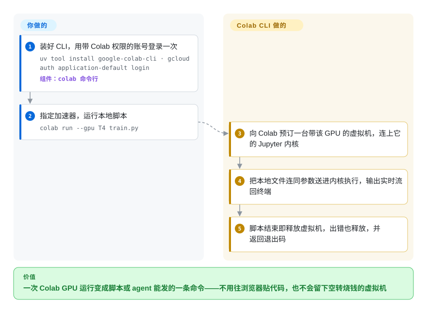

# Google Colab CLI

脚本在你笔记本电脑上，花钱买的 GPU 却在 Colab 的浏览器标签页里：每跑一次都要把代码贴进单元格、守着标签页等它跑完，而写代码的 agent 根本点不了那个标签页。Colab CLI 让你在终端里直接租下 Colab 虚拟机，把本地文件送进它的 Python 内核执行，脚本一结束就把虚拟机还回去。

## 何时使用

你是 ML 工程师或学生，手上已经有 Colab 账号——常常是付费档、带计算单元——而代码放在本地仓库里，不在 notebook 里。现在跑一次 GPU 是这样的：打开 colab.research.google.com，选 T4 或 A100 运行时，把 `train.py` 贴进单元格，`!pip install` 依赖，盯着标签页，最后还得记得断开，不然空转的虚拟机继续扣计算单元。又或者你在用 coding agent（Claude Code、Gemini CLI），它写好了训练脚本，却在你的 MacBook 上报 `torch.cuda.is_available() == False`，没有任何办法够到 GPU。当 Colab 就是你手里现成的算力时，就该想到这个 CLI：`colab run --gpu T4 train.py` 分配虚拟机、发送文件、把输出流回终端、透传退出码、释放虚拟机；想让状态跨多次调用保留时，用 `colab new` / `colab exec` / `colab stop` 维持一个会话；仓库还自带一个 `colab-operator` skill，让 agent 知道这套规矩。

决定性的取舍是**复用已有的 Colab 订阅，还是换一种方式买算力**。和 [Modal client SDK](../sandboxing/modal-client.zh.md) 比，你放弃了一个为生产设计、有文档、按秒计费的平台，换来“不引入新供应商、不多一张账单”——前提是 Colab 已经付过钱。和 SkyPilot 比，你放弃了用自己云账号开机、跨供应商自动故障转移的能力，换来零云账号配置。和 Kaggle CLI 比，你放弃了免费的 notebook 批跑额度，换来一个能逐条命令驱动、保留状态的交互式内核。

## 怎么用起来

这个 CLI 是一层很薄的 Python 客户端，背后用的是 Colab 网页本身那套机制。它先用你的 Google 身份登录（`gcloud` 生成的应用默认凭据 ADC，或者一次 OAuth 复制粘贴授权），再请 Colab 的会话后端为你预订一台带指定加速器的虚拟机——这次预订就是一个计费的“分配”（assignment），和在浏览器里点“连接”完全一样。之后它通过 WebSocket 和这台虚拟机上的 Jupyter 内核对话——内核就是 notebook 单元格实际在里面执行的那个常驻 Python 进程，走的正是 notebook 标签页用的同一条通道。`colab exec -f train.py` 在你本机读文件、把文本当成一个单元格发过去，所以不用先上传；变量会在多次 `exec` 之间保留，就像单元格之间一样。可以把它想成：你原本得一直开着的那个 notebook 标签页的遥控器。Google 负责提供硬件、运行内核、在它忙的时候保持存活；你负责选硬件、发代码，以及记得关机（`colab run` 会替你关，脚本出错也会关）。`colab ssh` 复用同一个会话和令牌，给你一个真正的 shell，或者当作 OpenSSH 的 `ProxyCommand` 供 IDE 远程开发使用。

<!-- flow-steps:begin (generated from flows/google-colab-cli.json by tools/flow_card.py — do not edit) -->

流程文字版

1. **你**：装好 CLI，用带 Colab 权限的账号登录一次 — `uv tool install google-colab-cli · gcloud auth application-default login` — 组件：`colab 命令行`
2. **你**：指定加速器，运行本地脚本 — `colab run --gpu T4 train.py`
3. **Google Colab CLI**：向 Colab 预订一台带该 GPU 的虚拟机，连上它的 Jupyter 内核
4. **Google Colab CLI**：把本地文件连同参数送进内核执行，输出实时流回终端
5. **Google Colab CLI**：脚本结束即释放虚拟机，出错也释放，并返回退出码

**价值**：一次 Colab GPU 运行变成脚本或 agent 能发的一条命令——不用往浏览器贴代码，也不会留下空转烧钱的虚拟机

<!-- flow-steps:end -->

## 何时不用

- **你在 Windows 上。** README 写明只支持 Linux 和 macOS；Windows 修复还停在未合并的 PR 里（#99、#135），Termux／Android 移植则在第三方 fork 里。用 Colab 网页界面；如果需要跨平台、可脚本化的 GPU 客户端，用 [Modal client SDK](../sandboxing/modal-client.zh.md)。
- **生产流水线不能因为 Google 改了点什么就断。** 这个客户端驱动的是 Colab 网页会话接口（`/tun/m/assign`、`/tun/m/unassign`、`/tun/m/assignments`），它自己的设计文档说这些是从抓到的浏览器流量里整理出来的，而非公开 API；项目还在 1.0 之前，2026 年全新 `pip install` 后的 `colab exec` 因依赖改名坏过两次（#94、#137）。要下个季度还稳稳跑的任务，用你自己云账号上的 SkyPilot，或 [Modal client SDK](../sandboxing/modal-client.zh.md)——两者卖的都是有文档的接口。
- **你需要指定的 GPU 每次都分得到。** 加速器按档位限制：账号没有配额时 `colab new --gpu A100` 会返回 400／412，自带的 skill 还提醒，不认识的 `--gpu` 值会静默回落成 A100。如果一次运行必须落到指定硬件上并能故障转移，用 SkyPilot，它会跨集群和云去找容量。
- **任务要无人值守地跑好几个小时。** 内核空闲时虚拟机会被回收；直到 v0.7.3（2026-09-25）之前，一小时的运行时令牌一过期会话就被丢掉（#106、#147）；长连接的 `repl`／`console`／`ssh` 至今仍不会在连接中途刷新令牌（docs/01_session_management.md）。多小时训练用 SkyPilot 托管作业，或者你自己掌控的云虚拟机。[推断]
- **你完全不想订阅，也能等结果。** Kaggle CLI 的 `kaggle kernels push --accelerator …` 会把 notebook 当成批处理任务跑在 Kaggle 的 GPU／TPU 上；你失去交互式会话，但不需要 Colab 套餐。
- **你想让 agent 在一个有人盯着的 notebook 里干活。** Google 另有一个 Colab MCP server，把本地 agent 接进浏览器里的 Colab 会话；这个 CLI 则刻意不让浏览器出现在回路里。
- **完全无头的 agent 流程还要挂 Drive 或在虚拟机内做 GCP 授权。** `colab drivemount` 和 `colab auth` 需要真人守在终端前（自带 skill 明令禁止 agent 执行它们），#113 还报告了浏览器授权完成后 `drivemount` 仍超时。数据改用 `colab upload`／`colab download` 搬，或在脚本里从存储桶拉取。
- **数据驻留或合规不允许用面向个人的 Google 服务。** 你的代码、数据和产出都跑在 Google 托管的 Colab 虚拟机上、挂在你的个人或 Workspace 账号下；改用你自己的云或本地 GPU（比如在你的 Kubernetes 上跑 SkyPilot）。
- **你想靠提 PR 影响路线图。** CONTRIBUTING.md 写明不接受外部贡献、反馈请发到 Discussions，PR 还要过 Google 的 CLA 机器人。如果向上游贡献很重要，SkyPilot 是接受 PR 的 Apache-2.0 社区项目。

## 横向对比

| 替代品 | 是否收录 | 我们的评价 | 取舍 |
|---|---|---|---|
| [Modal client SDK](../sandboxing/modal-client.zh.md) | ✅ | 如果 GPU 任务是产品的一部分、需要有文档的 API、按秒计费和部署／服务原语，选 Modal；如果你已经付费用 Colab、只想从终端或 agent 把本地脚本推上去，选 Colab CLI。 | Modal 是一个要照着它设计代码的平台（镜像、资源、密钥都写在代码里），没法复用已有订阅；Colab CLI 不引入新供应商，代价是依赖网页会话接口、按档位限制的 GPU 和空闲回收。两者都是闭源托管后端的开源客户端。 |
| SkyPilot（`skypilot-org/skypilot`） | 未收录 | 如果你有云账号或 Kubernetes／Slurm 集群，需要任务跨这些资源找容量、带故障转移和自动停机，选 SkyPilot；如果你没有云账号、Colab 套餐是唯一的 GPU 来源，选 Colab CLI。 | SkyPilot 换来跨 20 多种基础设施的可移植性和多小时托管作业，代价是云凭据、配额和每家供应商各一张账单；Colab CLI 只要一个 Google 登录，但被锁在一个服务的档位里。本批次未收录。 |
| Kaggle CLI（`Kaggle/kaggle-cli`） | 未收录 | 如果在 Kaggle 免费加速器上批跑一次 notebook 就够、也能等，选 Kaggle CLI；如果你需要一个能逐条命令驱动、保留状态的交互式内核，选 Colab CLI。 | `kaggle kernels push` 上传 notebook 和元数据后一口气跑完（按其文档可选 T4 ×2、L4、TPU v5e-8／v6e-8），产出事后再取；Colab CLI 保留活内核、文件操作和 SSH，但取决于你的 Colab 档位。本批次未收录。 |
| Colab MCP server（`googlecolab/colab-mcp`） | 未收录 | 如果 agent 应该在你浏览器里打开的 Colab notebook 中干活、你在旁边看着改，选 MCP server；如果 agent 应该在终端里无头运行、完全不碰浏览器，选 CLI。 | 同一家、相反的界面：MCP server 需要本地 MCP 客户端和一个活着的浏览器会话；CLI 只要凭据，能写进 CI 和 shell 脚本。本批次未收录。 |
| Colab 网页界面 | 非仓库 | 探索式、可视化的 notebook 工作，以及 CLI 自动化不了的交互步骤（挂载 Drive、Secrets），留在浏览器界面；代码已经在本地仓库里、或要让 agent 来跑时，换 CLI。 | 网页界面就是那个闭源托管产品本身，按形态不在收录范围内；它拥有 Colab 的全部功能（Secrets 面板、小组件、分享），CLI 只覆盖一部分——#157 就在要求从 CLI 访问 Secrets。 |

## 技术栈

- **语言／打包：** Python ≥ 3.12，以 `google-colab-cli` 发布到 PyPI（入口命令 `colab`）；用 hatchling + hatch-vcs 构建，版本号就是 git 标签；开发用 `uv.lock`；发布由 Google Cloud Build（`cloudbuild.yaml`）构建。
- **CLI 层：** 基于 Click 的 Typer，Rich 负责渲染，REPL 用 prompt-toolkit + Pygments，html2text 处理富 `display_data` 输出，nbformat 负责 `.ipynb` 执行和日志导出。
- **后端协议：** 用 `requests` 访问 `colab.research.google.com`（assign／unassign／assignments／ccu-info，以及文件操作用的 Jupyter Contents API）；内核执行走 WebSocket 上的 `jupyter-kernel-client`（PyPI 上钉死 `==0.9.0`，开发源指向 `googlecolab` 的 fork），并针对 Colab 专有的协议扩展打了补丁；SSH 桥用 `websocket-client`。
- **认证：** `google-auth`／`google-auth-oauthlib`——默认 ADC，可选 OAuth 复制粘贴流程；包里自带一份 OAuth 客户端配置。
- **本地状态：** `~/.config/colab-cli/` 下的 JSON 文件（会话、设置、令牌、每个会话的历史 JSONL），用 `filelock` 加锁。

## 依赖

- **一个能用 Colab 的 Google 账号。** GPU／TPU 和 `--high-mem` 取决于你的档位和计算单元（`colab usage` 看余额，`colab pay` 打开订阅页）；设计文档把 T4 称作免费档的标准 GPU。
- **权限范围正确的凭据。** 默认的 ADC 路径需要 Google Cloud SDK，并带上 `openid`、`cloud-platform`、`userinfo.email`、`colaboratory` 四个 scope 重新登录；OAuth 路径需要一次浏览器操作来粘贴授权码。
- **Linux 或 macOS，Python 3.12+**（用 `uv tool install google-colab-cli` 或 `pip` 安装）。
- **用 `colab ssh` 时：** 系统自带的 OpenSSH 客户端，以及一把 `ed25519` 或 ECDSA 密钥（RSA 密钥会被服务端拒绝）。
- **出网访问** `colab.research.google.com` 和 `colab.pa.googleapis.com`，外加自动更新提示每天一次的 PyPI 版本探测。

## 运维难度

**安装低，安全地用起来中等。** 安装就是一条 `uv tool install`，你这边没有服务器要运维。真正的工作是卫生习惯：把 ADC 的 scope 配对，是自带 skill 所说的“卡住 agent 的头号问题”；每次 `colab new` 都会预订一台计费虚拟机，忘了关的会话和孤儿分配（`colab sessions` 里的 `[?]` 行）会一直扣计算单元，直到你关掉；并行的多个 agent 应该用 `--config <path>` 隔离状态；而且全新安装曾因依赖发版而坏掉，所以任何自动化里都要钉死 CLI 版本，升级前先回归测试。

## 健康度与可持续性

- **维护（2026-09-30）。** 活跃：最近一次推送 2026-09-26；标签从 v0.5.x 到 v0.7.4；PyPI 在 2026-09-22 到 09-26 之间连发 0.7.2、0.7.3、0.7.4，此前有三个月空档——期间 0.7.0 打了标签却从未上 PyPI（见 0.7.1 changelog）。修得快，发布工程不稳。
- **治理／巴士因子（2026-09-30）。** 归 `googlecolab` GitHub 组织所有；提交集中在两位维护者（前 20 贡献者统计中 sethtroisi 26 次、teeler 17 次）。CONTRIBUTING.md 说不接受外部 PR，但 2026-08／09 合入了好几个外部 PR（#88、#112、#122、#125），实际比政策宽松。[推断]
- **背书与 Lindy（2026-09-30）。** 作为 Colab 官方客户端由 Google 背书，它所调用的服务也是 Google 自己的。仓库约 5.5 个月（创建于 2026-04-17），Lindy 几乎给不了加分；它能活多久取决于 Google 是否还想给 Colab 保留一个终端入口，而不是社区动能。
- **采用度（2026-09-30）。** 约 1.4k star、193 fork，PyPI 近一个月下载约 1.3 万到 1.7 万次（pypistats 为 13,052，健康度评分器读到的注册表数据为 17,123）；社区移植（Termux／Android）和 issue 流量说明上线不久就有真实使用。
- **风险信号（2026-09-30）。** Apache-2.0，无改协议历史；风险是结构性的——它是闭源服务网页会话接口的客户端、硬件按档位限制、不支持 Windows，且 2026 年有两次让安装直接坏掉的依赖事故（#94、#137）。

## 存疑（未验证）

- [未验证] 没有端到端跑过任何命令：本次没有 Colab 账号，行为、延迟和分配成功率都来自 README、文档、自带 skill 和 issue，而非复现。
- [推断] “网页会话接口而非公开 API”依据的是仓库设计文档（接口和参数由 HAR 浏览器抓包整理）以及 AGENTS.md 的“Trace Alignment”条款；没有专门去找 Google 是否发布过 `/tun/m/assign` 的 API 参考。
- [未验证] 各 Colab 档位能分到哪些加速器、要花多少计算单元，没有对照 Colab 定价页核实；本页依据的是自带 skill（“按档位限制，多数账号只能拿到 CPU”）和设计文档里“T4：免费档标准 GPU”的说法。
- [未验证] 没有阅读 Colab 服务条款中关于自动化／无头使用和 SSH 的规定；工具出自 Google 自己，说明这种用法是被认可的，但不同档位可能有限制。
- [推断] 对“多小时无人值守任务”可靠性的判断，是从令牌过期问题（#106、#147）和文档写明的空闲回收外推而来；2026-09-25 的令牌刷新修复在实际中是否奏效未观察到。
- [推断] 治理上“实际比政策宽松”的判断，是从被合入 PR 的作者推断的，未核实这些作者是否在 Google 之外。
- [未验证] Kaggle 免费加速器额度的大小和 SkyPilot 托管作业的行为没有实测；对比只依据它们的 README／文档。
