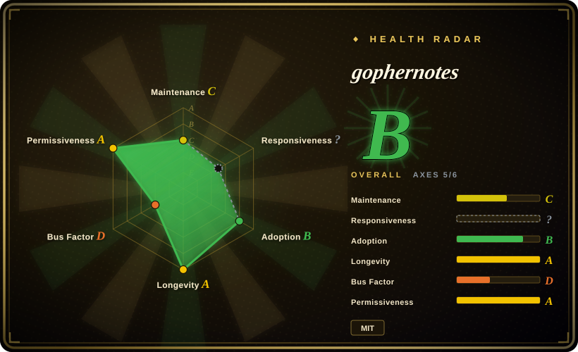
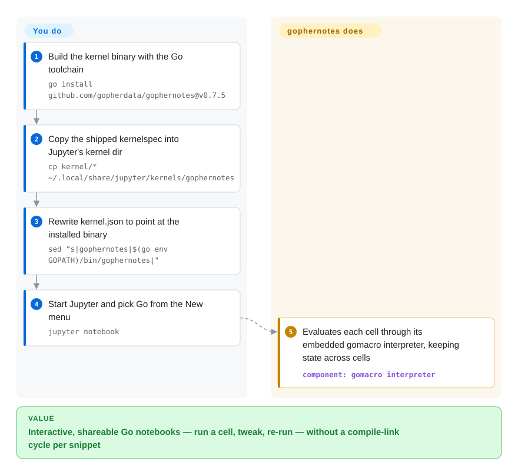

# gophernotes

Jupyter notebooks speak Python, but you ship Go and want the same cell-by-cell exploration in the language you actually use. gophernotes registers a Go kernel so Jupyter/nteract can run Go cells through an embedded interpreter — no compile-link cycle per snippet — with state persisting between cells.

## When to use

You think in Go and you want a notebook. You're exploring a dataset, sketching out an algorithm, or building a teaching document and you'd like the literate-programming workflow Jupyter gives Python users — run a cell, see the result, tweak, re-run, interleave prose and code — but in the language you actually ship. You install gophernotes as a Jupyter kernel, open a notebook, pick "Go," and now each cell evaluates Go: declare a variable in one cell, use it in the next, import a package, print output inline. For interactive Go exploration, prototyping, or producing a runnable Go tutorial as a notebook, it bridges Go into the Jupyter ecosystem you (or your readers) already use.

You also reach for it when you want **shareable, executable Go documents** — a notebook that mixes explanation with live Go cells someone can re-run — rather than a static `.go` file plus a README. It leans on a Go interpreter so cells run without a full compile-link cycle per snippet, which is what makes the notebook feel interactive rather than batch.

## How it works

Two processes share the work. Jupyter's front-end talks to gophernotes over the **Jupyter kernel protocol** (ZeroMQ messages — the same contract every language kernel implements), and gophernotes evaluates your Go with an embedded **gomacro** interpreter: a Go interpreter that keeps a live session, so a variable declared in cell 1 still exists in cell 4 without any recompile. Because cells are interpreted rather than compile-linked, they return in milliseconds — but the price is fidelity: some semantics are emulated or unsupported (generics edge cases, cgo, `unsafe.Pointer` conversions, partially-implemented `goto`; the README's Limitations list is the real contract). What it does for you: the protocol plumbing, the interpreter, and a ready `kernel/` spec directory to hand to Jupyter. What stays yours: a Go toolchain, `go install` of the binary, and one manual step — copying the kernelspec into Jupyter's data dir and rewriting `kernel.json` to point at the binary path (the README gives the exact `cp` + `sed`).

<!-- flow-steps:begin (generated from flows/gophernotes.json by tools/flow_card.py — do not edit) -->

Text version of the flow

1. **You**: Build the kernel binary with the Go toolchain — `go install github.com/gopherdata/gophernotes@v0.7.5`
2. **You**: Copy the shipped kernelspec into Jupyter's kernel dir — `cp kernel/* ~/.local/share/jupyter/kernels/gophernotes`
3. **You**: Rewrite kernel.json to point at the installed binary — `sed "s|gophernotes|$(go env GOPATH)/bin/gophernotes|"`
4. **You**: Start Jupyter and pick Go from the New menu — `jupyter notebook`
5. **gophernotes**: Evaluates each cell through its embedded gomacro interpreter, keeping state across cells — component: `gomacro interpreter`

**Value**: Interactive, shareable Go notebooks — run a cell, tweak, re-run — without a compile-link cycle per snippet

<!-- flow-steps:end -->

## When NOT to use

- **Maintenance history is dormancy-then-revival — verify before depending on it.** v0.7.5 shipped 2022, the repo then sat until **2026-09**, when a gomacro dependency-refresh commit (2026-09-09) and v0.7.6 (2026-09-23) revived it — one data point, not a proven cadence. The README's install snippets still pin v0.7.5. Against modern Go releases compatibility gaps may remain; confirm it works with your current Go version before building on it. [推断：复活是否持续无先例可验]
- **You need full, standard Go semantics.** It runs Go through an **interpreter** (gomacro lineage), not the standard compiler, so some language features, generics edge-cases, cgo, or certain packages may behave differently or not work. This is exploration, not production execution. [未验证]
- **Your data-science workflow is Python-shaped.** If your stack is pandas/NumPy/matplotlib, a Go kernel doesn't get you that ecosystem; the Python kernel + Go-as-microservice split is often more practical.
- **You want rich notebook plotting / widgets out of the box.** The Go notebook experience is far thinner than Python's (limited plotting, fewer display integrations); don't expect IPython/Jupyter-widget parity.
- **Production or CI execution.** Notebooks-as-pipeline and interpreter-run Go are a poor fit for reproducible production jobs — compile and run real Go binaries there.

## Comparison

| Alternative | In index | Our verdict | Tradeoff |
|---|---|---|---|
| Python (IPython) kernel | 未收录 | Choose the Python kernel when you do not specifically need Go and want the lowest-friction Jupyter/data-science ecosystem. | Full ecosystem and default support, but it does not teach or execute Go. |
| gomacro (REPL) | 未收录 | Choose gomacro when terminal-based interactive Go is enough and a notebook UI would add overhead. | It is the interpreter lineage gophernotes builds on, but not a Jupyter kernel experience by itself. |
| Go Playground / `go run` | 未收录 | Choose Go Playground or `go run` for quick one-off snippets with no need for persistent notebook state. | Fine for a snippet, not for prose-plus-code documents or cross-cell state. |
| Jupyter polyglot kernels (e.g. for Rust/JS) | 未收录 | Choose another Jupyter language kernel when the actual need is Rust, JavaScript, or another language inside notebooks. | Same pattern as gophernotes, but maintenance and completeness vary per language. |
| Tour of Go / interactive docs | 未收录 | Choose Tour of Go when the goal is guided learning rather than running your own exploratory notebook code. | Curated and interactive, but fixed-content rather than a reusable kernel. |

## Tech stack

- **Language:** Go; implements the **Jupyter kernel protocol** (ZeroMQ messaging) so Jupyter/nteract can drive it.
- **Execution:** evaluates Go via an embedded interpreter (gomacro lineage) so cells run without per-snippet compile-link, enabling persistent inter-cell state.
- **Integration:** registers as a Jupyter kernel (kernelspec); works in JupyterLab/Notebook and nteract.
- **Distribution:** installed as a Go binary + a Jupyter kernel registration step.

## Dependencies

- **Runtime:** a **Go toolchain**, **Jupyter** (or nteract), and the gophernotes binary registered as a kernel; ZeroMQ libraries underpin the kernel protocol.
- **Platform:** Linux/macOS/Windows where Go and Jupyter run; version compatibility with current Go is the practical constraint given the project's age. [未验证]
- **Install:** `go install` the binary, then copy/register the kernelspec into Jupyter.

## Ops difficulty

**Low-to-medium, and front-loaded at install.** There's no service to operate — it's a local kernel you register once. The friction is setup: installing the Go toolchain, building/installing the binary, wiring the kernelspec into Jupyter, and possibly satisfying ZeroMQ/native build prerequisites. Given the project's stalled maintenance, the realistic ops cost is **compatibility debugging** — making an older kernel work against your current Go/Jupyter versions — more than ongoing operation. Once it runs, day-to-day use is just opening notebooks.

## Health & viability

- **Responsiveness**: Cannot be scored — no_traffic.
- **Maintenance (2026-09).** Dormant after v0.7.5 (2022-05) — last push 2023-11 — then **revived in September 2026**: a dependency-refresh commit updating gomacro/zmq4/uuid (2026-09-09) and release **v0.7.6** (2026-09-23, "Update to latest gomacro: adds minimal support for go/types.Alias", GitHub API). Active again as of today, but the revival is one commit and one patch release, not yet a cadence. Not archived.
- **Governance / bus factor.** Organization-owned (`gopherdata`) with several historical contributors (dwhitena, cosmos72, SpencerPark, sbinet, mattn…); the 2026 revival was carried out by **cosmos72 — the author of the upstream gomacro interpreter**, not the original gopherdata crew. Single-steward rescue: continuity now rests on one person's interest in his interpreter still being usable as a kernel. [推断]
- **Age & Lindy verdict.** Created 2016-01 (~10 years), but Lindy requires **age × still-active**, and it was dormant 2022–2026; the Sep-2026 revival barely re-qualifies it — long-lived-but-dormant failed the Lindy test, revived-after-three-years is a *new* bet with only one data point. [推断]
- **Adoption.** ~4.0k stars reflect real historical interest as *the* Go-in-Jupyter kernel, but a Go notebook is a niche workflow; the saving grace is the interpreter itself — gomacro received the 2026-09-01 update pulled in by v0.7.6, so the engine under this kernel is alive even when the wrapper isn't. [推断]
- **Risk flags.** **Revival-not-reliability** is the headline: a project that slept four years and woke once may sleep again, compounded by interpreter-vs-compiler semantic gaps and likely friction with new Go versions. MIT-licensed, so no relicense/copyleft concern. [推断]

## Caveats (unverified)

- [未验证] ~4.0k stars, 264 forks, 54 open issues as of 2026-09 — volatile, date-sensitive; likely legacy popularity plus a small revival bump rather than current momentum.
- [未验证] Revival read as: dependency-refresh commit 2026-09-09 + v0.7.6 release 2026-09-23 (GitHub API) — whether sustained maintenance resumed is unconfirmed; check activity again before depending on it.
- [未验证] Compatibility with current Go versions is unconfirmed and is the main practical risk; the interpreter (gomacro lineage) may not track recent Go language features (v0.7.6 notes only "minimal support for go/types.Alias").
- [推断] The Jupyter-kernel-protocol / ZeroMQ / gomacro-interpreter architecture is inferred from the project's description and standard Jupyter-kernel design, not a source audit.
- [未验证] The exact limitations vs standard `go build` semantics (generics, cgo, specific packages) are not enumerated here; verify the features you need against the running kernel.
