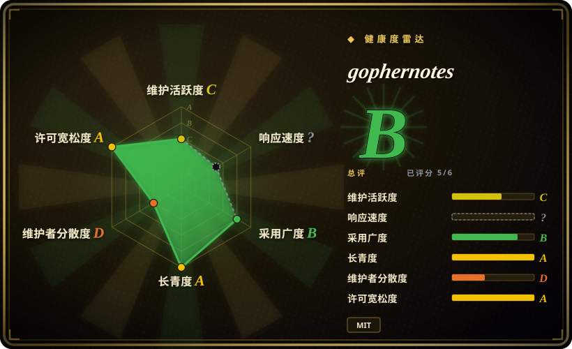
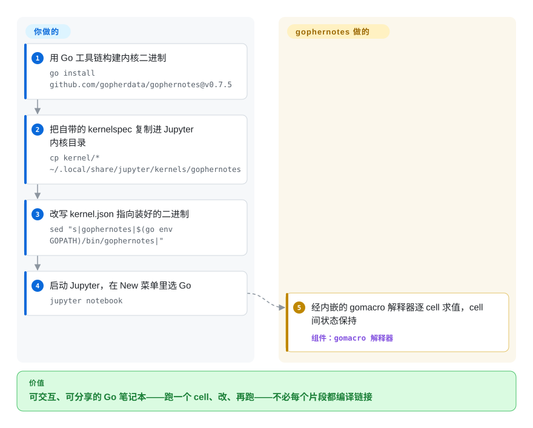

# gophernotes

Jupyter 笔记本说的是 Python，而你交付的是 Go，也想在真正用的那门语言里逐 cell 探索。gophernotes 注册一个 Go 内核，让 Jupyter/nteract 经一个内嵌解释器直接跑 Go cell——不必每个片段编译链接——cell 之间状态持续保留。

## 何时使用

你习惯用 Go 思考，又想要一个笔记本。你在探索一份数据集、勾勒一个算法，或者写一份教学文档，想要 Jupyter 给 Python 用户的那种文学化编程工作流——跑一个 cell、看结果、改、再跑，把散文和代码交织起来——但用你真正交付的语言。你把 gophernotes 装成 Jupyter 内核，打开笔记本，选“Go”，于是每个 cell 都求值 Go：在一个 cell 里声明变量，在下一个里用它，import 一个包，把输出内联打印。对于交互式 Go 探索、原型，或把一份可运行的 Go 教程做成笔记本，它把 Go 接进了你（或你的读者）已经在用的 Jupyter 生态。

当你想要**可分享、可执行的 Go 文档**——一份把讲解和别人能重跑的活 Go cell 混在一起的笔记本——而非一个静态 `.go` 文件加一份 README 时，你也会选它。它依托一个 Go 解释器，所以 cell 运行不必每个片段都做完整的编译链接，这正是让笔记本感觉交互而非批处理的原因。

## 怎么用起来

两个进程分担工作。Jupyter 前端通过 **Jupyter 内核协议**（ZeroMQ 消息——每个语言内核都实现的同一份契约）和 gophernotes 对话，gophernotes 再用内嵌的 **gomacro** 解释器求值你的 Go：它是一个维持着活跃会话的 Go 解释器，所以 cell 1 里声明的变量到 cell 4 还在，无需任何重新编译。因为 cell 是被解释而非编译链接的，毫秒级就能返回——代价是保真度：部分语义被模拟或根本不支持（泛型边界情况、cgo、`unsafe.Pointer` 转换、只实现了一半的 `goto`；README 的 Limitations 清单才是真实契约）。它替你做的：协议管线、解释器，外加一个可直接交给 Jupyter 的现成 `kernel/` spec 目录。留在你那儿的：Go 工具链、`go install` 装二进制，以及一步手工操作——把 kernelspec 复制进 Jupyter 的数据目录、改写 `kernel.json` 指向二进制路径（README 给了确切的 `cp` + `sed` 命令）。

<!-- flow-steps:begin (generated from flows/gophernotes.json by tools/flow_card.py — do not edit) -->

流程文字版

1. **你**：用 Go 工具链构建内核二进制 — `go install github.com/gopherdata/gophernotes@v0.7.5`
2. **你**：把自带的 kernelspec 复制进 Jupyter 内核目录 — `cp kernel/* ~/.local/share/jupyter/kernels/gophernotes`
3. **你**：改写 kernel.json 指向装好的二进制 — `sed "s|gophernotes|$(go env GOPATH)/bin/gophernotes|"`
4. **你**：启动 Jupyter，在 New 菜单里选 Go — `jupyter notebook`
5. **gophernotes**：经内嵌的 gomacro 解释器逐 cell 求值，cell 间状态保持 — 组件：`gomacro 解释器`

**价值**：可交互、可分享的 Go 笔记本——跑一个 cell、改、再跑——不必每个片段都编译链接

<!-- flow-steps:end -->

## 何时不用

- **维护史是「休眠后复活」——依赖前先核实。** v0.7.5 发布于 2022 年，仓库随后沉寂到 **2026-09**，才靠一次 gomacro 依赖刷新提交（2026-09-09）和 v0.7.6（2026-09-23）复活——那是一个数据点，不是已证实的节奏。README 的安装片段甚至还钉在 v0.7.5。对着现代 Go 发布仍可能有兼容缺口，在它之上构建前请确认它在你当前 Go 版本上能用。[推断：复活是否持续无先例可验]
- **你需要完整、标准的 Go 语义。** 它通过**解释器**（gomacro 血统）而非标准编译器跑 Go，所以某些语言特性、泛型边界情况、cgo 或某些包可能表现不同或不工作。这是探索，不是生产执行。[未验证]
- **你的数据科学工作流是 Python 形状的。** 如果你的栈是 pandas/NumPy/matplotlib，Go 内核给不了你那个生态；Python 内核加 Go 当微服务的拆分往往更实用。
- **你想要开箱即用的丰富笔记本绘图 / widget。** Go 的笔记本体验比 Python 薄得多（绘图有限、显示集成更少）；别指望和 IPython/Jupyter-widget 等同。
- **生产或 CI 执行。** 笔记本当管线加解释器跑的 Go 不适合可复现的生产作业——那里要编译并运行真正的 Go 二进制。

## 横向对比

| 替代品 | 是否收录 | 我们的评价 | 取舍 |
|---|---|---|---|
| Python（IPython）内核 | 未收录 | 并非必须用 Go，而是想要阻力最低的 Jupyter／数据科学生态时，选 Python 内核。 | 生态完整、默认支持强，但它不教学或执行 Go。 |
| gomacro（REPL） | 未收录 | 终端里的交互式 Go 已经足够，笔记本 UI 反而多余时，选 gomacro。 | 它是 gophernotes 依托的解释器血统，但自身不是 Jupyter 内核体验。 |
| Go Playground / `go run` | 未收录 | 只想快速跑一次性片段，不需要持久笔记本状态时，选 Go Playground 或 `go run`。 | 适合片段，不适合代码和文字交织的文档，也没有跨 cell 状态。 |
| Jupyter 多语言内核（如 Rust/JS 的） | 未收录 | 真正需求是把 Rust、JavaScript 或其他语言放进 notebook 时，选对应 Jupyter 语言内核。 | 思路与 gophernotes 相同，但各语言内核的维护度和完整度不同。 |
| Tour of Go / 交互文档 | 未收录 | 目标是跟随式学习，而不是运行自己的探索性 notebook 代码时，选 Tour of Go。 | 它是精选交互内容，但不是可复用内核。 |

## 技术栈

- **语言：** Go；实现 **Jupyter 内核协议**（ZeroMQ 消息）以便 Jupyter/nteract 驱动它。
- **执行：** 经一个内嵌解释器（gomacro 血统）求值 Go，使 cell 不必每个片段编译链接即可运行，从而持久保留 cell 间状态。
- **集成：** 注册为 Jupyter 内核（kernelspec）；在 JupyterLab/Notebook 和 nteract 里工作。
- **分发：** 装成一个 Go 二进制加一步 Jupyter 内核注册。

## 依赖

- **运行时：** 一个 **Go 工具链**、**Jupyter**（或 nteract），以及注册为内核的 gophernotes 二进制；ZeroMQ 库支撑内核协议。
- **平台：** Go 和 Jupyter 能跑的 Linux/macOS/Windows；鉴于项目年龄，与当前 Go 的版本兼容性是实际约束。[未验证]
- **安装：** `go install` 这个二进制，然后把 kernelspec 复制/注册进 Jupyter。

## 运维难度

**低到中，且集中在安装阶段。** 没有要运维的服务——它是你注册一次的本地内核。摩擦在于搭建：装 Go 工具链、构建/安装二进制、把 kernelspec 接进 Jupyter，可能还要满足 ZeroMQ/原生构建的前置条件。鉴于项目停滞维护，现实的运维成本是**兼容性调试**——让一个较旧的内核对着你当前的 Go/Jupyter 版本跑起来——多于持续运营。一旦跑起来，日常使用就是开笔记本。

## 健康度与可持续性

- **响应速度**：无法计算——no_traffic。
- **维护（2026-09）。** v0.7.5（2022-05）之后一度休眠——最后 push 2023-11——随后**于 2026 年 9 月复活**：更新 gomacro/zmq4/uuid 的依赖刷新提交（2026-09-09）加 **v0.7.6** 发布（2026-09-23，“Update to latest gomacro: adds minimal support for go/types.Alias”，GitHub API）。截至今天重新活跃，但复活目前是一次提交加一个补丁发布，还算不上节奏。未归档。
- **治理 / bus factor。** 组织所有（`gopherdata`），有若干历史贡献者（dwhitena、cosmos72、SpencerPark、sbinet、mattn……）；2026 年的复活是 **cosmos72——上游 gomacro 解释器的作者——**完成的，而非原 gopherdata 班底。单人抢救：延续性现在押在一个人对他自家解释器仍可作为内核使用的兴趣上。[推断]
- **年龄与 Lindy 判断。** 2016-01 创建（约 10 年），但 Lindy 要求**年龄×仍活跃**，而它 2022–2026 处于休眠；2026-09 的复活只是勉强重新及格——长寿但休眠通不过 Lindy 测试，沉睡四年后醒来一次则是一注只有单个数据点的**新**赌注。[推断]
- **采用度。** 约 4.0k star 反映出它作为*那个* Go-in-Jupyter 内核的真实历史兴趣，但 Go 笔记本是小众工作流；真正的利好在解释器本身——gomacro 有 v0.7.6 拉入的 2026-09-01 更新，说明这台引擎即使外壳睡着时仍然活着。[推断]
- **风险标记。** 头号风险是**复活≠可靠**：一个睡了四年、醒了一次的项目可能再睡过去，叠加解释器对编译器的语义缺口和与新 Go 版本的可能摩擦。MIT 许可，所以没有 relicense/copyleft 顾虑。[推断]

## 存疑（未验证）

- [未验证] 截至 2026-09 约 4.0k star、264 fork、54 个 open issue——易变且对时间敏感；更像遗产人气加一点复活微涨，而非当前势头。
- [未验证] 复活的读法依据：依赖刷新提交 2026-09-09 + v0.7.6 发布 2026-09-23（GitHub API）——维护是否真正恢复常态未经确认，依赖前再查一次活动。
- [未验证] 与当前 Go 版本的兼容性未经确认，是主要实际风险；解释器（gomacro 血统）可能跟不上近期 Go 语言特性（v0.7.6 只注明“minimal support for go/types.Alias”）。
- [推断] Jupyter 内核协议 / ZeroMQ / gomacro 解释器的架构是从项目描述和标准 Jupyter 内核设计推断的，并非源码审计。
- [未验证] 相对标准 `go build` 语义的确切限制（泛型、cgo、特定包）这里未一一列出；请对照运行中的内核核实你需要的特性。
