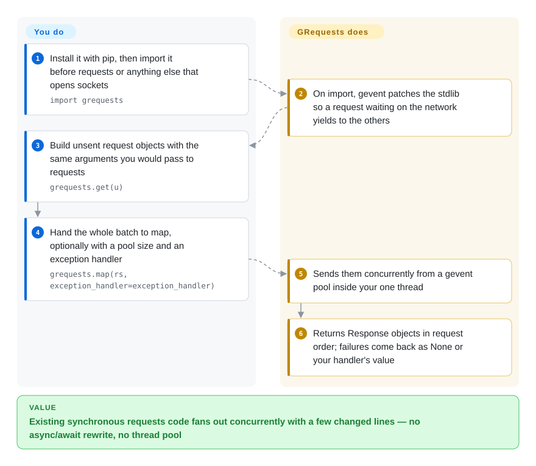

# GRequests

Requests + Gevent: send many HTTP requests concurrently with the familiar `requests` API, gathered through `map()`/`imap()` instead of writing async code.

## When to use

You're a data engineer maintaining an old-but-load-bearing Python 2/3 sync codebase that fans out to a few hundred URLs — scraping a list of pages, polling a batch of internal endpoints, or warming a cache — and the sequential `for url in urls: requests.get(url)` loop is the bottleneck. You don't want to rewrite the call sites against `asyncio`/`httpx`, learn `await`, or thread a connection pool by hand; you just want the same `requests` calls to happen in parallel. You build a list of unsent `grequests.get(u)` request objects, hand them to `grequests.map(reqs, size=10)`, and get back a list of `Response` objects in the same order — with an optional `exception_handler` so a single timeout doesn't sink the batch. Because gevent does cooperative greenlet scheduling under the hood, you get I/O concurrency without touching `threading` or rewriting your logic as coroutines.

You reach for it specifically when the surrounding stack is already gevent-based (or you're fine with gevent's monkeypatching) and the win is "make my existing synchronous `requests` code concurrent with the least diff." For order-insensitive streaming you use `imap()` / `imap_enumerated()` to consume responses as they finish.

## How it works

grequests is one small Python module that glues two libraries together. `requests` still does every actual HTTP call; gevent supplies **greenlets** — lightweight "green threads" that take turns inside one OS thread, handing control to each other whenever one is waiting on the network. **The moment you `import grequests`, it monkeypatches the standard library** (swaps the blocking socket and ssl functions for gevent versions that yield while waiting), which is why it must be imported before `requests`. **Your part is to describe the requests, not to send them**: `grequests.get(u)` returns an unsent request object with the same keyword arguments as `requests.get`. Then `grequests.map(...)` hands the whole list to a gevent pool (`size` caps how many are in flight), waits for all of them, and returns ordinary `Response` objects in the original order — a failed request becomes `None`, or whatever your `exception_handler` returns. It is like handing a stack of letters to one clerk who drops each in the mailbox and opens replies as they arrive, instead of waiting at the counter for each answer.

<!-- flow-steps:begin (generated from flows/grequests.json by tools/flow_card.py — do not edit) -->

Text version of the flow

1. **You**: Install it with pip, then import it before requests or anything else that opens sockets — `import grequests`
2. **GRequests**: On import, gevent patches the stdlib so a request waiting on the network yields to the others
3. **You**: Build unsent request objects with the same arguments you would pass to requests — `grequests.get(u)`
4. **You**: Hand the whole batch to map, optionally with a pool size and an exception handler — `grequests.map(rs, exception_handler=exception_handler)`
5. **GRequests**: Sends them concurrently from a gevent pool inside your one thread
6. **GRequests**: Returns Response objects in request order; failures come back as None or your handler's value

**Value**: Existing synchronous requests code fans out concurrently with a few changed lines — no async/await rewrite, no thread pool

<!-- flow-steps:end -->

## When NOT to use

- **Greenfield async code.** For new projects, native `asyncio` with `httpx` or `aiohttp` is the better-supported, more actively maintained path — grequests exists to retrofit *existing* sync code, not to be your async HTTP stack.
- **You can't tolerate gevent monkeypatching.** importing grequests runs gevent's `patch_all(thread=False, select=False)`, patching the stdlib (sockets, ssl and more — threading and select are deliberately left alone) at import time; this can collide with other libraries, and the README warns you often must import grequests **before** `requests` and others. In codebases mixing native asyncio, multiprocessing, or C extensions that don't expect patched I/O, this is a real footgun. [未验证]
- **CPU-bound or true-parallelism needs.** Greenlets are cooperative single-thread concurrency — they help I/O wait, not CPU work. For parallel CPU you still need processes.
- **You need HTTP/2, modern TLS features, or streaming-first APIs.** It's a thin wrapper over classic `requests`; it inherits requests' feature set and limits.
- **You want a heavily maintained dependency.** Release cadence is slow (see Health) — fine for a stable utility, but weigh it if you need responsive upstream fixes.

## Comparison

| Alternative | In index | Our verdict | Tradeoff |
|---|---|---|---|
| httpx | 未收录 | Choose httpx for new code that can use a modern sync/async client and wants HTTP/2 support. | Better long-term path for concurrent HTTP, but async concurrency requires `async`/`await` rather than drop-in `requests` calls. |
| aiohttp | 未收录 | Choose aiohttp when the app is already asyncio-native or also needs an async HTTP server stack. | Mature async ecosystem, but a different programming model than drop-in `requests`. |
| requests-futures | 未收录 | Choose requests-futures when you want `requests` compatibility with real threads and no gevent monkeypatching. | Simpler integration for some apps, but thread-pool concurrency has different scaling and blocking tradeoffs. |
| `requests` + `concurrent.futures` | 未收录 | Choose plain `requests` plus stdlib futures when an explicit small thread/process pool is clearer than another dependency. | No extra dep and no monkeypatching, with slightly more boilerplate than `grequests.map()`. |

## Tech stack

- **Language:** Python.
- **Core deps:** `requests` (the HTTP layer and `Response` objects) and `gevent` (greenlet-based cooperative concurrency via libev/libuv and stdlib monkeypatching).
- **API surface:** unsent request objects (`grequests.get/post/...`), plus `map()`, `imap()`, `imap_enumerated()` to dispatch them concurrently with an optional `size` (pool) and `exception_handler`.

## Dependencies

- **Runtime:** Python plus `requests` and `gevent` (the latter pulls in `greenlet` and compiled event-loop backends). [未验证]
- **Services/infra:** none — it's a client library, no servers or datastores.
- **Import-order constraint:** because gevent monkeypatches, the README says to import grequests before other libraries, especially `requests`; this is an operational dependency on *how* you wire imports, not a package.

## Ops difficulty

**Low** as a library — `pip install grequests` and call it. The real operational cost is the gevent monkeypatching: getting import order right, and verifying it doesn't conflict with the rest of your stack (other async frameworks, native threads, certain C extensions). Once that's settled it's just function calls; there's nothing to deploy or operate.

## Health & viability

- **Responsiveness**: Cannot be scored — no_traffic.
- **Maintenance (2026-10).** Last release v0.7.0 (2023-06); last commit 2024-08-08, nothing since. Releases are infrequent and the recent gap is long — this reads as a **stable, low-activity** utility coasting on a small stable surface rather than actively developed. Not archived. [推断]
- **Governance / bus factor.** Owner is a **User** account (spyoungtech) who took over the project; original commits trace to Kenneth Reitz (the `requests` author). Effectively single-maintainer — a bus-factor flag. [推断]
- **Age & Lindy.** Created 2012; ~14 years old and still installed widely. The age plus a narrow, stable scope is a moderate Lindy signal — but Lindy needs *still-active*, and activity here is low, so weight it as "stable legacy," not "vibrantly maintained." [推断]
- **Adoption.** ~4.6k stars and long-standing PyPI presence indicate real historical adoption; much of the ecosystem has since moved toward asyncio clients (httpx/aiohttp) for new work. [未验证]
- **Risk flags.** Single-maintainer + slow cadence + a hard dependency on gevent's monkeypatching behavior are the main risks; BSD-2-Clause is permissive with no relicense history found. [推断]

## Caveats (unverified)

- [未验证] ~4.6k GitHub stars as of 2026-10; star counts are date-sensitive and unreliable, indicative only.
- [未验证] Supported Python versions are not asserted here — the README shows a version badge but the exact matrix tracks gevent/requests support and shifts release-to-release; verify against current packaging metadata.
- [推断] "Low-activity / coasting" is inferred from release dates (v0.7.0 in 2023, push in 2024), not a maintainer statement.
- [未验证] gevent import-order and monkeypatching conflicts are described in the README and general gevent behavior; the precise failure modes in your stack are environment-specific and not verified here.
- [推断] Single-maintainer bus-factor is inferred from the User-type owner and contributor history, not a governance document.
