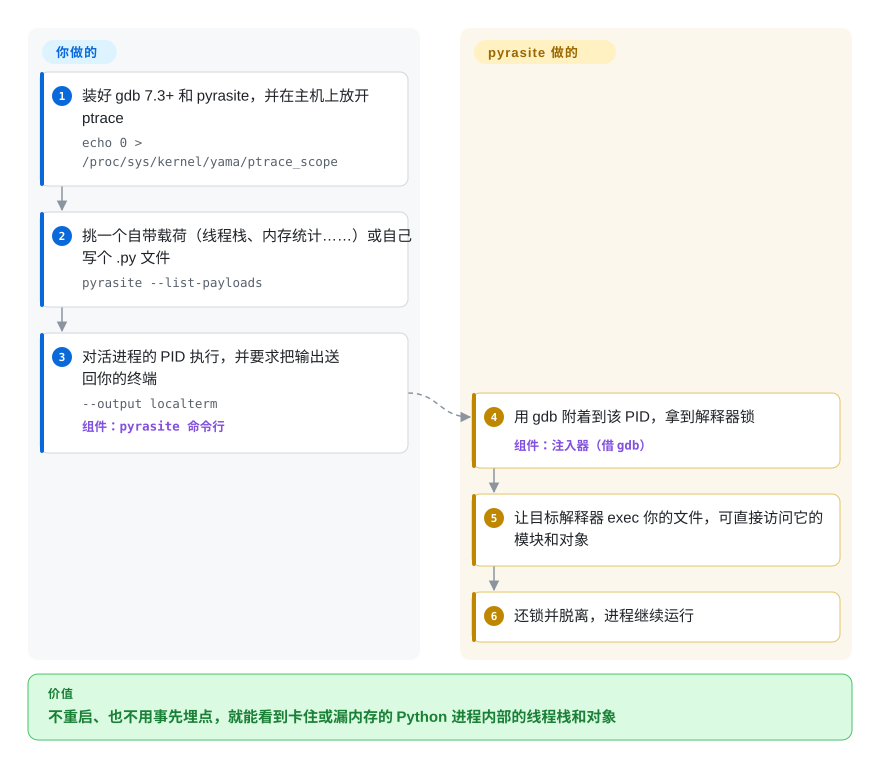

# pyrasite

一个把任意 Python 代码注入**正在运行**的 Python 进程的工具——通过 gdb 挂到一个活的 PID 上，跑诊断片段、dump 对象，或开一个反向 shell，全程不重启目标。

## 何时使用

你有一个长期运行的 Python 进程出了问题——一个漏内存的守护进程、一个卡死的 worker、一个不能重启（因为它持有重启就会丢的状态）的服务——而你的日志没法告诉你它内部*此刻*在发生什么。你不想加 print 语句再重新部署。用 pyrasite，你把它指向那个活 PID，注入一段在*那个进程内部*运行的片段：按类型 dump 活对象计数找漏点、打印所有线程栈看它卡在哪，或者掉进一个挂在运行中解释器上的交互 shell。你原地检查、甚至轻推一个生产进程，然后 detach 让它继续跑。

当替代方案——杀掉重启再加更多埋点——不可接受、而普通调试器 attach 又不够（因为你想在目标上下文里*执行代码*：遍历它的对象图、调它的模块、给状态拍快照）时，你会专门拿出它。对于一个卡死或漏内存的 Python 服务做事故现场的内省，它是一把锋利、狭窄的工具。

## 怎么用起来

pyrasite 不是给你开一个要手动操作的调试会话；它只是借 **gdb**——标准调试器，只要内核的 **ptrace** 权限（允许一个进程控制另一个进程的机制）放行，就能附着到任何运行中的程序——调用几下就松手。它以批处理模式跑 `gdb -p <PID>`，拿到 **GIL**（全局解释器锁——CPython 线程执行 Python 代码必须持有的那把锁），让目标自己的解释器 `exec` 你指定的文件，再把锁还回去。**注入的管道是 pyrasite 的活，跑的代码是你的**：要么是它自带的载荷（打印所有线程栈、统计对象内存占用、强制垃圾回收、开反向 shell），要么是你自己写的任意 `.py` 文件，它在目标里运行，能直接访问目标的模块和对象。输出默认打到目标进程自己的 stdout/stderr；加 `--output localterm` 就送回你的终端。想交互式操作就用 `pyrasite-shell <PID>`，它注入一个反向 Python shell，你在提示符里敲的每一行都在那个活进程内部执行。

<!-- flow-steps:begin (generated from flows/pyrasite.json by tools/flow_card.py — do not edit) -->

流程文字版

1. **你**：装好 gdb 7.3+ 和 pyrasite，并在主机上放开 ptrace — `echo 0 > /proc/sys/kernel/yama/ptrace_scope`
2. **你**：挑一个自带载荷（线程栈、内存统计……）或自己写个 .py 文件 — `pyrasite --list-payloads`
3. **你**：对活进程的 PID 执行，并要求把输出送回你的终端 — `--output localterm` — 组件：`pyrasite 命令行`
4. **pyrasite**：用 gdb 附着到该 PID，拿到解释器锁 — 组件：`注入器（借 gdb）`
5. **pyrasite**：让目标解释器 exec 你的文件，可直接访问它的模块和对象
6. **pyrasite**：还锁并脱离，进程继续运行

**价值**：不重启、也不用事先埋点，就能看到卡住或漏内存的 Python 进程内部的线程栈和对象

<!-- flow-steps:end -->

## 何时不用

- **在生产里不理解爆炸半径就用。** 经 gdb 往活进程注入代码可能让它崩溃、损坏状态或触发安全控制。这是事故/诊断工具，不是常规埋点——把每次注入都当作可能对目标致命来对待。
- **跑不了 gdb、或不能 ptrace 目标的地方。** 它需要 **gdb 7.3+** 才能附着；macOS 上要用签过名的 gdb，而限制 ptrace 的主机（Ubuntu 的 `ptrace_scope`、Fedora 的 `deny_ptrace` SELinux 开关、没给 ptrace 能力的容器、加固过的生产机）会直接挡住它。如果能提前规划，就在服务里预先嵌入 **manhole** 或远程 pdb，事后就不用附着。
- **做日常调试。** 普通开发里，`pdb`/`breakpoint()`、`py-spy` 或 profiler 更安全且为此而生。pyrasite 是给你没法停掉进程那种情况用的。
- **当你需要一个有维护、推进快的工具时。** 项目基本**休眠**——最近的真实发布（2.0）是很多年前的；它仍偶有修复但并非活跃开发。依赖前请核实它在你当前 Python/gdb 上能用。[未验证]
- **做采样式 profiling / 火焰图。** 想要低开销地“我的 Python 时间花在哪”，**py-spy** 不注入代码就能读取目标，是更现代、更安全的选择。

## 横向对比

| 替代品 | 是否收录 | 我们的评价 | 取舍 |
|---|---|---|---|
| py-spy | 未收录 | 只观察式采样已经足够，且首要目标是避免代码注入时，选 py-spy。 | 对“时间在哪／为何卡住”很好，但不能在目标进程里跑任意代码。 |
| pyrasite 对 gdb + python-gdb | 未收录 | 想要手工 attach／inspect 控制权，并能自己接好注入链路时，选裸 gdb 加 CPython helper。 | pyrasite 把“注入并跑片段”这套工作流打包好了；裸 gdb 更底层也更手工。 |
| manhole / remote pdb | 未收录 | 可以事先嵌入调试 shell，而不是事后挂载时，选 manhole 或 remote pdb。 | 更干净也更安全，但对没有预埋、已经卡死的进程没用。 |
| Austin | 未收录 | 任务是低开销帧栈 profiling，而不是活体执行代码时，选 Austin。 | 只观察且活跃维护，是 profiling 替代品，不是代码注入器。 |
| 加日志后 reload/重启 | 未收录 | 保留活状态不如走安全运维路径重要时，选重启加日志。 | 安全，但会丢掉 pyrasite 想检查的当下症状。 |

## 技术栈

- **语言：** Python，驱动 **gdb** 挂到目标进程并在运行中的 CPython 解释器内执行注入的载荷（`pyrasite/injector.py`：`PyGILState_Ensure` → `PyRun_SimpleString` → `PyGILState_Release`）。
- **机制：** 用 ptrace/gdb 暂停进程、调进去并运行注入代码；附带一个载荷运行 harness 和几个现成工具（对象 dump、线程栈、反向 shell）。
- **接口：** 一个 CLI（`pyrasite <pid> <payload>`）、交互式的 `pyrasite-shell <pid>`，以及放在独立仓库 `lmacken/pyrasite-gui` 里的 GUI。
- **目标：** 允许 gdb attach 的 CPython 进程（README 写的是 Python 2.4 及以上，2 与 3 之间可以互相注入）——主要是 Linux；macOS 要用签过名的 gdb。

## 依赖

- **运行时：** 带 Python 支持的 **gdb**，加一个 CPython 解释器；主机上必须允许 ptrace（内核 `yama/ptrace_scope`、容器 capability）。
- **可选：** 历史 `pyrasite-gui` 需要 GTK/GObject 栈。
- **安装：** 一个可 pip 安装的包；真正的约束是 gdb/ptrace 前置条件，而非 Python 安装本身。

## 运维难度

**中——不是因为部署，而是因为操作风险。** 没有要当服务跑的东西；你装好按需调用。难度在于（1）**环境**：在目标主机上让 gdb attach 被允许（加固生产和容器经常封 ptrace），以及（2）**风险**：一次注入可能让你想救的那个进程失稳或崩溃，所以需要谨慎，最好先在非关键副本上演练。它的年龄也意味着你可能撞上与当前 Python/gdb 版本的兼容摩擦。它是短暂使用的精密工具，不是常驻基础设施。

## 健康度与可持续性

- **响应速度**：无法计算——no_traffic。
- **维护（2026-10）。** 最后一次提交在 2025-04-07，此后没有新提交；在那之前有零星合并活动（2025 和 2023 各几个 PR），但最近的真实发布标签（**2.0**）是很多年前的——最好读作**低节奏 / 近休眠维护**，是吃老本而非废弃。未归档。[推断]
- **治理 / bus factor。** **User** 所有、单作者项目（`lmacken`/Luke Macken），加少数偶尔的贡献者——对这种敏感度的工具而言是明显的单维护者 bus-factor 风险。[推断]
- **年龄与 Lindy 判断。** 2011-09 创建（约 14 年）⇒寿命长，但 Lindy 要求年龄**×仍活跃**；这里活跃度极低，所以判断是“老资格但在吃老本”——它存活下来了，但别把它的年龄当作持续投入的信号。[推断]
- **采用度。** 约 2.9k star 反映出它作为*那个* Python 活进程注入工具的长期认可，但注意力已转向不注入的只观察工具（py-spy）；把 star 当历史而非当前势头。[未验证]
- **风险标记。** **GPL-3.0** copyleft（若你要 vendor/再分发它则相关）；近休眠维护加单一维护者加本质危险的机制是真正的标记——依赖前先核实它在你的栈上还能用。[推断]

## 存疑（未验证）

- [未验证] 截至 2026-06 约 2.9k star、220 fork、46 个 open issue——易变且对时间敏感；这里很可能反映历史人气多于当前活跃度。
- [未验证] 最新发布标签是 2.0（旧）；近期仓库活动是偶尔的 PR 合并（2025-04、2023-10）而非新发布——“近休眠”是从该节奏推断的，并非维护者声明。
- [未验证] gdb 7.3+ 的要求和 `ptrace_scope`／`deny_ptrace` 的说明来自 README 与 `docs/Installing.rst`；容器 capability 下的表现、`injector.py` 里的 Windows 注入路径是否仍可用，都没有实测。
- [推断] 自带载荷（线程栈、内存统计、反向 shell）是从 `docs/Payloads.rst` 读到的，没在当前 CPython 上跑过——即便注入本身能成功，载荷也可能在新解释器上出错。
- [未验证] 鉴于项目年龄，与当前 CPython 和 gdb 版本的兼容性未经确认；事故中依赖前请先测试。
