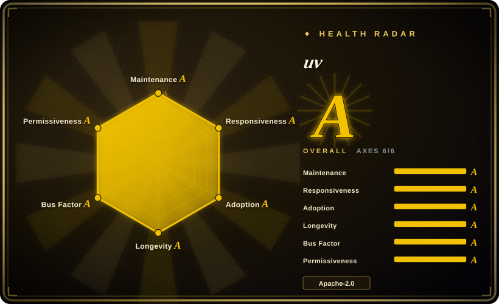
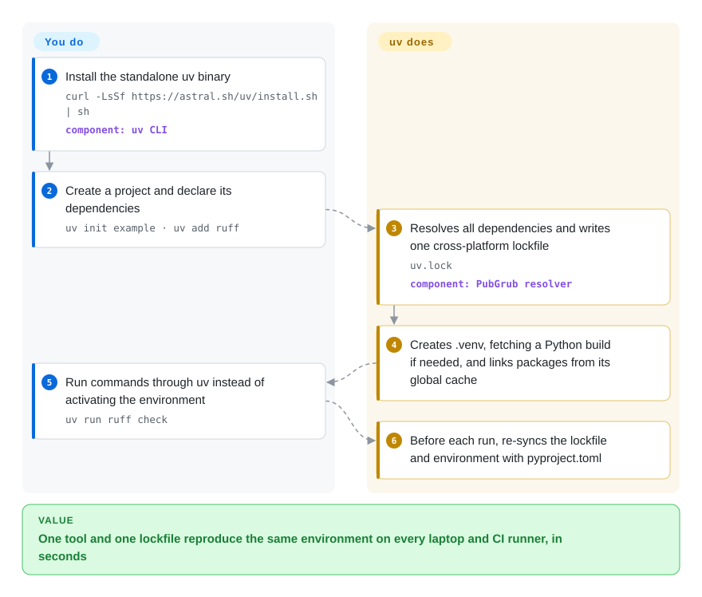

# uv

A Python project usually needs four or five tools glued together — pip to install, pip-tools or Poetry to lock, pyenv to get the right Python, pipx for CLIs — and a fresh `pip install` on CI can take minutes. uv is one Rust binary that does all of those jobs from one `pyproject.toml` and one lockfile, and installs from a shared cache so a repeat install takes seconds.

## When to use

You maintain a Python service and its CI. A new teammate's setup doc is a page long: install pyenv, build Python 3.12, create a virtualenv, `pip install -r requirements.txt`, then `pip-compile` whenever a dependency changes — and someone's laptop still resolves a different `urllib3` than CI does. Every CI job spends a couple of minutes in `pip install` before a single test runs. You want one command that fetches the right Python, resolves once into a lockfile that is valid on macOS, Linux and Windows alike, and recreates the exact environment anywhere.

That is uv: `uv init`, `uv add requests`, `uv run pytest`. It replaces pip, pip-tools, virtualenv, pipx and pyenv with one standalone binary, writes a cross-platform `uv.lock`, and reuses a global cache so repeated installs are near-instant. Pick it over pip + pip-tools when you want a lockfile and Python-version management without assembling them yourself; over Poetry when install speed, Python-version management and running ad-hoc scripts/tools matter more than Poetry's plugin ecosystem; and over Conda when your dependencies are ordinary PyPI wheels rather than non-Python native libraries.

## How it works

You describe the project in a standard `pyproject.toml`; uv does the rest from there. On `uv add` or `uv lock` it resolves every dependency with PubGrub (a solver that either finds a consistent set of versions or explains exactly which requirements conflict) and writes `uv.lock`, a *universal* lockfile — one file that already contains the right pins for every platform and Python version the project supports. Before every `uv run`, it checks that the lockfile and the project's `.venv` match `pyproject.toml` and quietly fixes whichever has drifted, so "did you remember to reinstall?" stops being a question. Packages are downloaded once into a global cache and linked into each environment, which is where most of the speed comes from. If the required Python is missing, uv downloads a managed build of it. For existing projects there is also a `uv pip` interface that keeps your `requirements.txt` workflow but swaps in uv's resolver and installer.

<!-- flow-steps:begin (generated from flows/uv.json by tools/flow_card.py — do not edit) -->

Text version of the flow

1. **You**: Install the standalone uv binary — `curl -LsSf https://astral.sh/uv/install.sh | sh` — component: `uv CLI`
2. **You**: Create a project and declare its dependencies — `uv init example · uv add ruff`
3. **uv**: Resolves all dependencies and writes one cross-platform lockfile — `uv.lock` — component: `PubGrub resolver`
4. **uv**: Creates .venv, fetching a Python build if needed, and links packages from its global cache
5. **You**: Run commands through uv instead of activating the environment — `uv run ruff check`
6. **uv**: Before each run, re-syncs the lockfile and environment with pyproject.toml

**Value**: One tool and one lockfile reproduce the same environment on every laptop and CI runner, in seconds

<!-- flow-steps:end -->

## When NOT to use

- **You need non-Python native libraries managed for you** (GDAL, CUDA toolkit, MKL, R, compilers). uv only installs Python packages from PyPI-style indexes. Use Conda/Mamba, or Pixi (which combines conda packages with uv's PyPI resolver), instead.
- **Your build relies on Poetry plugins or a Poetry-specific workflow.** uv reads standard PEP 621 metadata and has its own build backend (`uv_build`, pure-Python projects only) plus `uv publish`, but Poetry's plugin ecosystem has no equivalent. Stay on Poetry until those plugins are replaced.
- **Your package has C/C++/Rust extension modules and you want uv's own build backend.** `uv_build` does not build extensions; keep scikit-build-core, maturin, setuptools or meson-python as the build backend (uv can still drive them).
- **You cannot accept a single-vendor roadmap.** uv is governed by Astral, a VC-funded company that OpenAI announced on 2026-03-19 it would acquire. If vendor neutrality is a hard requirement, use pip + pip-tools or PDM, which are community-governed.
- **You need a frozen interface for years of unattended scripts.** uv is still versioned 0.x and bumps the minor version (0.11 → 0.12 on 2026-07-28) for breaking changes. Pin the uv version in CI, or stay on pip whose CLI changes slowly.
- **The team has no budget to change habits.** For a stable legacy project, `uv pip install` gives most of the speed with no workflow change; the full `uv run`/`uv lock` model is the part that requires retraining.

## Comparison

| Alternative | In index | Our verdict | Tradeoff |
| --- | --- | --- | --- |
| pip + pip-tools | 未收录 | Keep pip + pip-tools for legacy projects or environments that only allow the PyPA reference tools; move to uv when CI install time or lockfile drift hurts. | pip is the default and community-governed but slow and needs separate tools for locking, virtualenvs and Python versions; uv folds them into one fast binary owned by one vendor. |
| Poetry | 未收录 | Stay on Poetry if your build or release relies on Poetry plugins; pick uv for new projects where speed and Python-version management matter more. | Poetry has a mature plugin ecosystem and long publish track record; uv installs far faster, manages Python itself and runs scripts/tools, but has no plugin system. |
| PDM | 未收录 | Choose PDM when you want a standards-based project manager that is community-maintained rather than vendor-owned; choose uv when raw speed and an all-in-one binary matter more. | PDM follows the same PEP standards and supports plugins; uv is much faster and also replaces pyenv and pipx, at the cost of single-vendor governance. |
| Conda / Mamba | 未收录 | Use Conda/Mamba when you need non-Python binaries (CUDA toolkit, GDAL, R) solved together with Python; use uv when everything you need ships as PyPI wheels. | Conda manages any native package across languages but its environments are heavier and slower; uv is Python-only and lighter. |
| Pixi | 未收录 | Pick Pixi when a project mixes conda-forge binaries with PyPI packages and you still want a lockfile; pick uv for pure-PyPI projects. | Pixi wraps conda packages and uses uv's resolver for PyPI dependencies; uv alone has no conda channel support. |

## Tech stack

- **Rust** — the whole tool is a standalone Rust binary (no Python needed to run uv itself); v0.12.23 as of 2026-10-03.
- **PubGrub** — the dependency resolution algorithm (via the `pubgrub` crate).
- **Cargo-derived Git implementation** — for Git dependencies.
- **Python packaging standards** — PEP 517 build backends (including its own `uv_build`), PEP 621 project metadata, PEP 723 inline script metadata.
- **Managed Python builds** — downloads standalone CPython/PyPy builds for `uv python install`.

## Dependencies

- A supported platform: macOS, Linux and Windows (see uv's platform-support page for tiers and architectures).
- Nothing else to install uv itself: standalone installer via `curl`/PowerShell, or `pip install uv` / `pipx install uv`.
- Network access to PyPI or your private index, and to Astral-hosted Python builds if you let uv install Python (can be pointed at mirrors).
- A Rust toolchain only if you build uv from source on a platform without prebuilt wheels.

## Ops difficulty

**Low.** A single binary with no daemon or background service; `uv self update` updates the standalone install. The real costs are elsewhere: pin the uv version in CI because breaking changes ship in minor releases, decide where the global cache lives on CI runners (and cache it), configure private indexes and authentication once, and budget for migrating `requirements.txt`/Poetry projects and retraining the team.

## Health & viability

- **Maintenance (2026-10-08): extremely active.** Patch releases every few days (0.12.19 → 0.12.23 between 2026-09-25 and 2026-10-03), commits daily, issue first responses typically within hours (radar median 7.8 hours across 37 qualifying issues).
- **Governance: broad contributor base, single owner.** 145 active maintainers in the trailing 12 months with top-3 share 63.9%, so the code does not hinge on one person — but the roadmap belongs to Astral, a single VC-backed company that OpenAI announced on 2026-03-19 it would acquire.
- **Age / Lindy: young but past the hype test.** Created in October 2023 (~3 years). Usage grew very quickly, but the Lindy prior is weaker than for pip (~18 years).
- **Adoption: very high.** 127,754,131 PyPI downloads in the last month, ~670M release-asset downloads and ~538k Homebrew installs in 90 days.
- **Risk flags:** Dual MIT / Apache-2.0, so a fork is always possible; the open questions are vendor direction after the OpenAI deal and any future commercial layer from Astral. Still 0.x with breaking changes in minor releases.

## Caveats (unverified)

- [未验证] The 10–100x speedup over pip is Astral's own benchmark (warm cache, specific projects); real gains depend on cache state, network and build steps.
- [未验证] Whether the OpenAI acquisition of Astral has closed, and what it changes for uv's roadmap, could not be confirmed; coverage found only describes the 2026-03-19 announcement as pending regulatory approval.
- [推断] Astral or its new owner may add commercial services or feature-gating around uv; nothing like that is visible in the repository today.
- [未验证] Pixi's use of uv for PyPI resolution and PDM's plugin support are stated from general knowledge of those projects, not re-checked in this pass.
