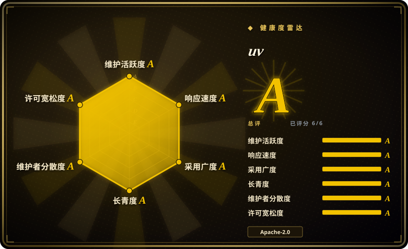
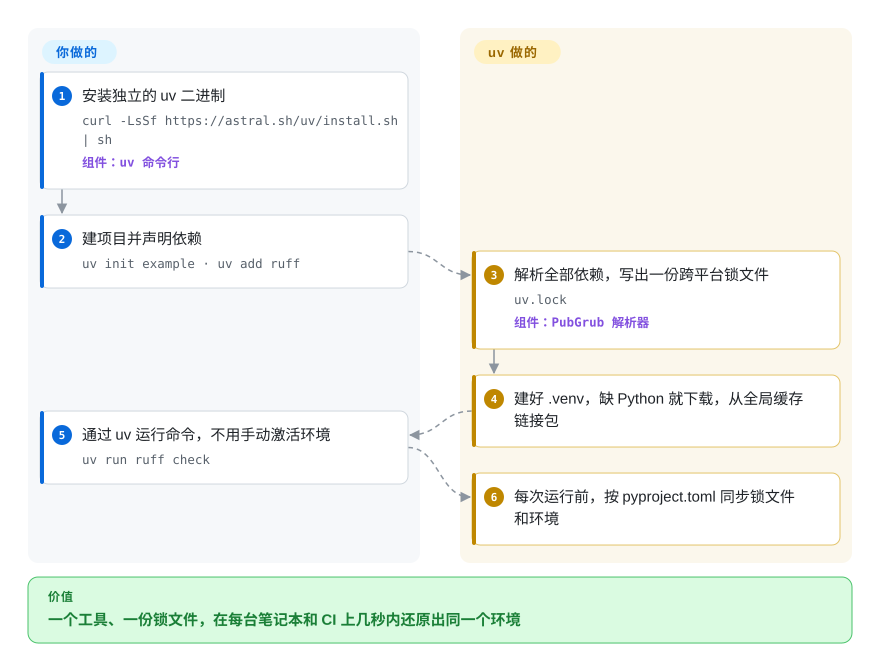

# uv

一个 Python 项目往往要拼四五个工具——pip 装包、pip-tools 或 Poetry 锁版本、pyenv 装对 Python、pipx 装命令行工具——CI 上一次全新 `pip install` 还要等好几分钟。uv 是一个 Rust 写的单文件程序，从一份 `pyproject.toml` 和一个锁文件出发把这些活全包了，并从共享缓存安装，重复安装只要几秒。

## 何时使用

你维护一个 Python 服务和它的 CI。新同事的环境搭建文档有一整页：装 pyenv、编译 Python 3.12、建虚拟环境、`pip install -r requirements.txt`，依赖一改还得跑 `pip-compile`——结果某人笔记本解析出的 `urllib3` 版本还是和 CI 不一样。每个 CI 任务跑测试前都要先在 `pip install` 上耗掉一两分钟。你想要一条命令：拉对 Python 版本，一次解析出在 macOS、Linux、Windows 上都成立的锁文件，然后在任何机器上还原出一模一样的环境。

这就是 uv：`uv init`、`uv add requests`、`uv run pytest`。它用一个独立二进制替掉 pip、pip-tools、virtualenv、pipx 和 pyenv，写出跨平台的 `uv.lock`，并复用全局缓存让重复安装几乎瞬间完成。想要锁文件和 Python 版本管理、又不想自己拼工具时，选它而不是 pip + pip-tools；安装速度、Python 版本管理和随手跑脚本或工具比 Poetry 的插件生态更重要时，选它而不是 Poetry；依赖都是普通 PyPI wheel、而不是非 Python 的原生库时，选它而不是 Conda。

## 怎么用起来

你用标准的 `pyproject.toml` 描述项目，剩下的交给 uv。执行 `uv add` 或 `uv lock` 时，它用 PubGrub（一种求解器：要么找出一组彼此兼容的版本，要么明确告诉你是哪几条要求冲突）解析全部依赖，写出 `uv.lock`——一个*通用*锁文件，一份文件里已经为项目支持的每个平台和 Python 版本记好了该用的版本。每次 `uv run` 之前，它都会检查锁文件和项目的 `.venv` 是否还对得上 `pyproject.toml`，哪边落后就悄悄补齐，“你重装依赖了吗”这个问题从此不存在。包只下载一次进全局缓存，再链接到各个环境里，速度主要就来自这里。缺少所需的 Python 时，uv 会自己下载一份托管的 Python 构建。老项目还可以用 `uv pip` 接口：保留 `requirements.txt` 的工作方式，只把解析和安装换成 uv。

<!-- flow-steps:begin (generated from flows/uv.json by tools/flow_card.py — do not edit) -->

流程文字版

1. **你**：安装独立的 uv 二进制 — `curl -LsSf https://astral.sh/uv/install.sh | sh` — 组件：`uv 命令行`
2. **你**：建项目并声明依赖 — `uv init example · uv add ruff`
3. **uv**：解析全部依赖，写出一份跨平台锁文件 — `uv.lock` — 组件：`PubGrub 解析器`
4. **uv**：建好 .venv，缺 Python 就下载，从全局缓存链接包
5. **你**：通过 uv 运行命令，不用手动激活环境 — `uv run ruff check`
6. **uv**：每次运行前，按 pyproject.toml 同步锁文件和环境

**价值**：一个工具、一份锁文件，在每台笔记本和 CI 上几秒内还原出同一个环境

<!-- flow-steps:end -->

## 何时不用

- **你需要它替你管理非 Python 的原生库**（GDAL、CUDA 工具包、MKL、R、编译器）。uv 只从 PyPI 风格的索引安装 Python 包。改用 Conda/Mamba，或 Pixi（它把 conda 包和 uv 的 PyPI 解析器结合在一起）。
- **你的构建依赖 Poetry 插件或 Poetry 特有的流程。** uv 读取标准的 PEP 621 元数据，有自己的构建后端（`uv_build`，只支持纯 Python 项目）和 `uv publish`，但没有对应 Poetry 插件生态的东西。插件没替换掉之前，继续用 Poetry。
- **你的包含 C/C++/Rust 扩展模块，又想用 uv 自带的构建后端。** `uv_build` 不构建扩展；构建后端请继续用 scikit-build-core、maturin、setuptools 或 meson-python（uv 仍可以驱动它们）。
- **你不能接受单一厂商掌控路线图。** uv 由 Astral 主导，这是一家风投支持的公司，OpenAI 于 2026-03-19 宣布将收购它。如果厂商中立是硬要求，改用社区治理的 pip + pip-tools 或 PDM。
- **你需要一个多年不变、无人值守脚本可以依赖的接口。** uv 仍是 0.x 版本，破坏性变更通过升次版本号发布（2026-07-28 从 0.11 升到 0.12）。CI 里锁定 uv 版本，或者继续用命令行变化很慢的 pip。
- **团队没有预算改习惯。** 稳定的老项目用 `uv pip install` 就能拿到大部分速度，工作方式不用变；需要重新培训的是完整的 `uv run` / `uv lock` 模式。

## 横向对比

| 替代品 | 是否收录 | 我们的评价 | 取舍 |
| --- | --- | --- | --- |
| pip + pip-tools | 未收录 | 老项目或只允许 PyPA 官方工具的环境，继续用 pip + pip-tools；CI 安装耗时或锁文件漂移开始伤人时，换成 uv。 | pip 是默认工具、社区治理，但慢，锁版本、虚拟环境、Python 版本都要另配工具；uv 把这些收进一个快速二进制，代价是归单一厂商所有。 |
| Poetry | 未收录 | 构建或发布依赖 Poetry 插件就留在 Poetry；新项目更看重速度和 Python 版本管理时选 uv。 | Poetry 插件生态成熟、发布流程久经考验；uv 安装快得多、自己管 Python、能跑脚本和工具，但没有插件机制。 |
| PDM | 未收录 | 想要遵循标准、由社区而非厂商维护的项目管理器时选 PDM；纯速度和一体化二进制更重要时选 uv。 | PDM 遵循同样的 PEP 标准并支持插件；uv 快得多，还能顶替 pyenv 和 pipx，代价是单一厂商治理。 |
| Conda / Mamba | 未收录 | 需要把非 Python 二进制（CUDA 工具包、GDAL、R）和 Python 一起求解时用 Conda/Mamba；所需的一切都有 PyPI wheel 时用 uv。 | Conda 能管跨语言的任意原生包，但环境更重、更慢；uv 只管 Python，更轻。 |
| Pixi | 未收录 | 项目同时混用 conda-forge 二进制和 PyPI 包、又想要锁文件时选 Pixi；纯 PyPI 项目选 uv。 | Pixi 封装 conda 包，并用 uv 的解析器处理 PyPI 依赖；单独的 uv 不支持 conda 频道。 |

## 技术栈

- **Rust**——整个工具是一个独立的 Rust 二进制（运行 uv 本身不需要 Python）；截至 2026-10-03 为 v0.12.23。
- **PubGrub**——依赖解析算法（通过 `pubgrub` crate）。
- **源自 Cargo 的 Git 实现**——用于 Git 依赖。
- **Python 打包标准**——PEP 517 构建后端（含自家的 `uv_build`）、PEP 621 项目元数据、PEP 723 脚本内联元数据。
- **托管 Python 构建**——`uv python install` 会下载独立的 CPython/PyPy 构建。

## 依赖

- 受支持的平台：macOS、Linux、Windows（分级和架构见 uv 的平台支持页面）。
- 安装 uv 本身不需要别的东西：用 `curl`/PowerShell 独立安装脚本，或 `pip install uv` / `pipx install uv`。
- 需要能访问 PyPI 或你的私有索引；如果让 uv 安装 Python，还要能访问 Astral 托管的 Python 构建（可改指镜像）。
- 只有在没有预编译 wheel 的平台上从源码构建 uv 时，才需要 Rust 工具链。

## 运维难度

**低。** 一个二进制，没有守护进程或后台服务；独立安装的版本用 `uv self update` 升级。真正的成本在别处：因为破坏性变更会在次版本里发布，CI 要锁定 uv 版本；要决定 CI runner 上全局缓存放哪、怎么缓存；私有索引和认证要一次配好；还要为迁移 `requirements.txt` / Poetry 项目和团队培训留出时间。

## 健康度与可持续性

- **维护（2026-10-08）：极其活跃。** 每隔几天一个补丁版本（2026-09-25 到 2026-10-03 从 0.12.19 发到 0.12.23），每天都有提交，issue 首次响应通常在几小时内（雷达中位数 7.8 小时，覆盖 37 个合格 issue）。
- **治理：贡献者广，归属单一。** 近 12 个月有 145 位活跃维护者，前三贡献者占 63.9%，代码不系于一人——但路线图属于 Astral 这一家风投支持的公司，OpenAI 已于 2026-03-19 宣布将收购它。
- **年龄 / Lindy：年轻，但已过了炒作期的考验。** 2023 年 10 月创建（约 3 年）。使用量增长很快，但 Lindy 先验仍弱于 pip（约 18 年）。
- **采用：非常高。** PyPI 近一个月下载量 127,754,131 次，release 资产下载约 6.7 亿次，Homebrew 90 天安装约 53.8 万次。
- **风险信号：** MIT / Apache-2.0 双许可，随时可以 fork；悬而未决的是 OpenAI 收购后的厂商方向，以及 Astral 将来是否推出商业层。仍是 0.x，次版本里会有破坏性变更。

## 存疑（未验证）

- [未验证] 比 pip 快 10–100 倍是 Astral 自己的基准测试（热缓存、特定项目）；实际收益取决于缓存状态、网络和构建步骤。
- [未验证] OpenAI 对 Astral 的收购是否已完成、会给 uv 路线图带来什么，均无法确认；查到的报道只描述了 2026-03-19 的宣布，称尚待监管批准。
- [推断] Astral 或其新东家可能围绕 uv 推出商业服务或功能分级；目前仓库里看不到这类迹象。
- [未验证] Pixi 用 uv 解析 PyPI 依赖、PDM 支持插件，这两点出自对这些项目的一般了解，本次未回到其仓库复核。
