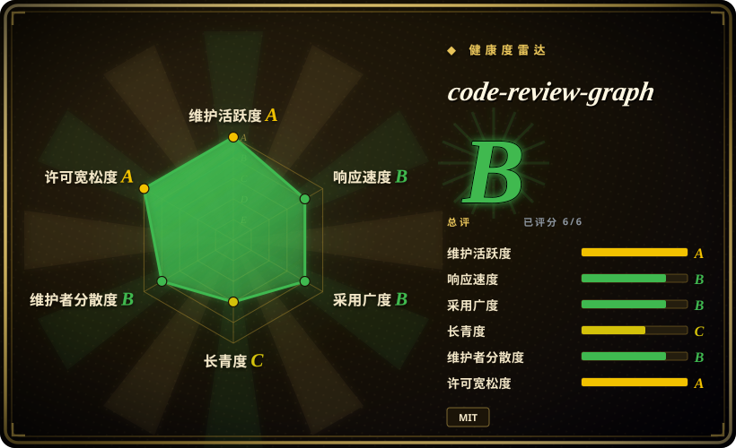
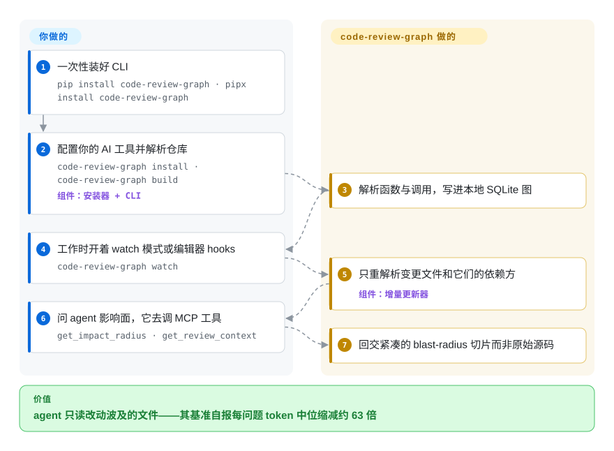

# code-review-graph

你的 AI 编码助手回答一个评审问题就要重读半个仓库（在 Flask 全语料上是 143,594 个 token），还常漏掉两跳之外的调用方。code-review-graph 用 Tree-sitter（把文件解析成函数、类、调用边的增量解析器）把代码库一次性解析成本地的结构图，保存时自动保持新鲜，再通过 MCP 只把改动真正波及的文件喂给 agent。

## 何时使用

你是一名开发者，在一个中到大型仓库里和 AI 编码助手（Claude Code、Cursor、Codex、Gemini CLI、Copilot、OpenCode——安装器能自动探测 16 个平台）结对，而你总是眼睁睁看着它为了回答“这个改动影响什么？”而反复重读文件烧上下文。每个评审任务都让 token 账单膨胀，agent 却仍然漏掉一个间接调用方。你装上 code-review-graph（`pip install code-review-graph`，再 `code-review-graph install` 和 `build`——约 3000 文件的仓库冷构建实测约 40 秒），从此 agent 调用 `get_impact_radius`、`get_review_context` 这类 MCP 工具：图会追踪某个变更文件的调用方、依赖方和测试，回交一片紧凑的结构切片，而不是原始源码。在它自己基准里的 6 个仓库上，它自报每问题 token 缩减中位数约 63 倍（fastapi 上最高 358 倍），且在约 3000 文件的项目里改两个文件，经 hooks/watch 增量重建约需 2.5 秒。

当你想在 *CI 里做风险评分的 PR 评审、且不把代码发往任何地方*时，它同样合适：同一套分析作为复合 GitHub Action 运行，完全在你的 runner 上构建并查询图，贴出带风险评分函数和测试缺口的 sticky 评论，并能通过 `fail-on-risk` 卡合并。如果你住在 monorepo 里、想要一个后台守护进程（`crg-daemon`）持续保持多个仓库的图新鲜，这也开箱自带。

## 怎么用起来

它*连同*服务层一起交付——你只需安装一次，然后继续写代码。`build` 用 Tree-sitter 扫描每个源文件，把节点（函数、类、import、测试）和边（调用、继承、导入）记进 `.code-review-graph/` 下的本地 SQLite 文件；可选的后处理会补上框架感知的边和社区聚类。随后 hooks、git pre-commit 钩子、watch 模式或 `crg-daemon` 对变更文件做 diff，只重解析失效部分，并沿图的 import/调用边找出依赖方。你的 AI 工具与常驻的 MCP server 对话（约 30 个工具、5 个工作流 prompt 模板），“我改 X 会碰坏什么”从一场 grep 风暴变成一次返回几千 token 的 `get_impact_radius` 调用。仍然归你的：agent 是否真的去查图（它经平台的规则文件被要求这么做，但偷懒的 agent 仍可能直接 grep）、影响分析偏保守带来的误报，以及你对项目自报基准数字押多少信任。

<!-- flow-steps:begin (generated from flows/code-review-graph.json by tools/flow_card.py — do not edit) -->

流程文字版

1. **你**：一次性装好 CLI — `pip install code-review-graph · pipx install code-review-graph`
2. **你**：配置你的 AI 工具并解析仓库 — `code-review-graph install · code-review-graph build` — 组件：`安装器 + CLI`
3. **code-review-graph**：解析函数与调用，写进本地 SQLite 图
4. **你**：工作时开着 watch 模式或编辑器 hooks — `code-review-graph watch`
5. **code-review-graph**：只重解析变更文件和它们的依赖方 — 组件：`增量更新器`
6. **你**：问 agent 影响面，它去调 MCP 工具 — `get_impact_radius · get_review_context`
7. **code-review-graph**：回交紧凑的 blast-radius 切片而非原始源码

**价值**：agent 只读改动波及的文件——其基准自报每问题 token 中位缩减约 63 倍

<!-- flow-steps:end -->

## 何时不用

- **你想要一个通用图数据库，而非代码上下文层。** 这是一条固定的代码智能流水线（AST → SQLite → blast-radius），不是可让你在其上构建应用的可查询图存储。要真正的属性/Cypher 图数据库，用 [FalkorDB](../structured-retrieval/falkordb.zh.md)。
- **琐碎 / 单文件改动。** 维护者自己的限制说明指出，对小改动，图上下文可能*超过*直接读文件——结构元数据是开销，直到改动跨多个文件才赚回来。
- **你今天就需要可信的 recall 数字。** "recall 1.0" 被明确指为**循环**——ground truth 来自预测器所走的同一张图——而诚实的标题数字已变成 0.69 的平均影响 F1。co-change 模式（拿 git 历史而非图做判分）在 2026-08-02 的抓取里对每个受评 commit 都返回 `predicted_files = 0`，尚不是可用测量。[推断] 把影响准确率当作方向性参考，而非保证。
- **超出 Python/PHP 的跨文件调用解析。** 入口点/流程检测被文档记为对 Python 与 PHP/Laravel 最强，JS 与 Go 的流程检测和关键词搜索排序被明述为待改进（早前版本那种 “约 33% recall / MRR 0.35” 的具体数字已不再发布）。
- **巴士因子 / 成熟度风险。** 这是一个单一维护者（“Tirth”）、Beta 分级、v2.3.9 的个人仓库项目（首次 commit 2026-02），且默认分支当前是 `staging`。如今有了官网和 Discord，但路线图背后依然没有团队或基金会。把 GitHub Action pin 到某个 tag 是一种缓解，但对其 `.code-review-graph/` SQLite 格式和 MCP 工具面的锁定是真实的。
- **你需要对散文做纯文档/段落 RAG。** 它索引的是代码结构而非任意文档——要层级文档检索看 [PageIndex](../structured-retrieval/pageindex.zh.md)。

## 横向对比

| 替代品 | 是否收录 | 我们的评价 | 取舍 |
|---|---|---|---|
| [FalkorDB](../structured-retrieval/falkordb.zh.md) | ✅ | 需要真正基于 Redis、带 Cypher 和向量搜索的属性图数据库时，选 FalkorDB。 | 一个真正基于 Redis 的属性图数据库，带 Cypher + 向量搜索，你直接查询它；是*底座*而非开箱即用的代码上下文工具。code-review-graph 给你整条 AST→图→MCP 流水线，但建在它自己固定的 SQLite 存储上。 |
| [graphify](graphify.zh.md) | ✅ | 需要另一个面向 agent 检索的代码库建图工具时，选 graphify。 | 同样把代码库变成图供 agent 检索；意图有重叠。code-review-graph 重压在 blast-radius/评审 + 一个 MCP server、宽语言覆盖和一个 CI Action 上。请直接对比 scope/成熟度。 |
| [PageIndex](../structured-retrieval/pageindex.zh.md) | ✅ | 需要面向文档的推理式层级检索时，选 PageIndex。 | 面向*文档*（PDF、长文本）的、基于推理的层级检索，无向量库；输入领域不同——散文而非源码 AST。 |
| [Sourcegraph](sourcegraph.zh.md) / [SCIP](scip.zh.md) | ✅ | 需要成熟、规模化的多仓库代码智能时，选 Sourcegraph 或 SCIP。 | 成熟、规模化的多仓库代码智能与索引；基础设施更重，不是面向 agent token 预算的本地单二进制 MCP 上下文压缩器。 |
| Serena (MCP) | 未收录 | 需要面向 agent 的 LSP 语义代码 MCP server 时，选 Serena。 | 面向 agent 的、基于 LSP 的语义代码 MCP server；以符号/LSP 驱动，而非带 blast-radius + 社区/风险分析的持久化 Tree-sitter 图。 |
| GraphRAG (Microsoft) | 未收录 | 需要 LLM 构建的实体/社区图来做文档 RAG 时，选 GraphRAG。 | LLM 构建的实体/社区图，用于文档 RAG；面向非结构化语料，而非确定性的 AST 派生代码图。 |

## 技术栈

- **语言：** Python（≥ 3.10，classifier 标到 3.13）。
- **解析：** Tree-sitter，经 `tree-sitter` + `tree-sitter-language-pack`；宽语言覆盖（Python、JS/TS/TSX、Go、Rust、Java/Spring、C/C++、C#、Ruby、Kotlin、Swift、PHP/Laravel、Scala、Solidity、Dart、配置即加的 Erlang 等）加 Jupyter/Databricks `.ipynb`。自定义语言可经 `.code-review-graph/languages.toml` 添加，无需 fork。
- **图/存储：** `.code-review-graph/` 下的本地 SQLite，带 FTS5 全文搜索；`networkx` 跑图算法；社区检测经 Leiden（可选 `igraph`）。
- **服务：** MCP server（`mcp` + `fastmcp`）暴露 30 个工具和 5 个 prompt 模板（评审、架构、调试、上手、合并前）；CLI（`code-review-graph`）与守护进程（`crg-daemon`）。
- **可选：** 向量 embedding，经 sentence-transformers / Google Gemini / 任意 OpenAI 兼容端点；Python 调用解析增强经 Jedi；D3.js 交互可视化；导出到 GraphML / Neo4j Cypher / Obsidian / SVG。
- **CI：** 复合 GitHub Action，做风险评分的 PR 评论。项目官网在 code-review-graph.com。

## 依赖

- **运行时：** Python ≥ 3.10。经 `pip install code-review-graph`（或 `pipx`/`uvx`）安装。
- **必需 Python 依赖（v2.3.9）：** `mcp` ≥ 1.0（< 3）、`fastmcp` ≥ 3.2.4（< 4）、`anyio` ≥ 4（< 5）、`tree-sitter` ≥ 0.23（< 1）、`tree-sitter-language-pack` ≥ 0.3（< 1）、`pyyaml` ≥ 6（< 7）、`networkx` ≥ 3.2（< 4）、`watchdog` ≥ 4（< 7）（Python < 3.11 加 `tomli`）。
- **核心存储：** 本地 SQLite 文件——核心图**不需要外部数据库或云服务**。
- **可选分组：** `[embeddings]`（sentence-transformers、numpy）、`[google-embeddings]`（google-genai）、`[communities]`（igraph）、`[enrichment]`（jedi）、`[eval]`（matplotlib）、`[wiki]`（ollama），或 `[all]`。
- **外部服务仅 opt-in：** 云端 embedding 需要显式出网确认；CI Action 完全在你自己的 runner 上运行，不外发源码。

## 运维难度

**低。** 单条 `pip`/`pipx`/`uvx` 安装，加一条 `install` 命令自动探测受支持的 AI 工具并写入其 MCP 配置；`build` 一次，之后 hooks/watch/daemon 保持新鲜。没有数据库要跑，没有云账号，状态住在本地 SQLite 文件里。升到**低到中**的场景：开启语义 embedding（模型下载、可选云出网和 API key）、跑多仓库守护进程、或把 GitHub Action 用 `fail-on-risk` 接成合并门。可选依赖矩阵（embeddings/communities/enrichment）是版本摩擦最可能冒头的地方。

## 健康度与可持续性

- **响应速度**：Grade B——中位首次响应时间约 376 小时，基于 31 个 qualifying issues/PRs。
- **维护（2026-09）：** 最后 push 在 2026-09-18，最新 release v2.3.9 同日——**活跃**，但从 v2.3.6（6 月）到 9 月这条线的间隔比春天的节奏慢了。[推断] 对这么年轻的项目，节奏是把双刃剑：API/格式面仍在演化。
- **治理 / 巴士因子：** **单一维护者、`User` 所有**（`tirth8205/code-review-graph`），Beta 分级，打包元数据里作者为 “Tirth”。自上次核查以来出现了项目官网（code-review-graph.com）和 Discord——是投入的迹象，但路线图背后依然没有团队或基金会。这仍是一个真实的**巴士因子标记**：约 32k star 挂在个人仓库上，是热度远远跑赢机构背书。[推断]
- **年龄与 Lindy（创建于 2026-02，约 0.6 年）：** **年轻且被热捧——Lindy 先验失败。** 没有记录、未证明多年存活；star 数说明的是关注度而非持久度。把延续性当作未被验证，并把 GitHub Action pin 到某个 tag。[推断]
- **采用 / 生态：** 宽语言覆盖、16 个自动探测的编辑器平台与 MCP + CI 面拉动采用信号（PyPI 下载量高；GitHub dependents 仍约为 0），而自报基准（约 63 倍 / 358 倍那些数字、0.69 F1）的 co-change 部分未发布、本页未复现。[未验证]
- **风险标记：** MIT（无重新许可风险）；主导风险是**废弃 / 巴士因子**（单一维护者、不到 1 年、默认分支当前为 `staging`）与格式锁定，而非许可。[推断]

## 存疑（未验证）

- [未验证] 最新 release v2.3.9 发布于 2026-09-18；仓库创建于 2026-02-26；最后 push 2026-09-18（据 `gh` 元数据 2026-09-28）。默认分支自 6 月以来从 `main` 移到了 `staging`——为什么（发布流程？）README 未解释。
- [未验证] star 数约 31.8k（据 `gh` 2026-09-28）——GitHub star 不可靠且对时间敏感，仅供参考。
- [未验证] 所有 token 缩减数字（中位数约 63 倍、最大 358 倍、约 3000 文件冷构建约 40 秒、增量约 2.5 秒）都是项目自己在 6 个自选仓库上的基准，附有 docs/REPRODUCING.md 复现指南，但本页未独立复现。
- [推断] 影响 "recall 1.0" 被自述为循环（图派生的 ground truth）；诚实的 co-change 模式在最新公开抓取里返回 0 预测，故真实世界的影响 precision/recall 未知。
- [未验证] 所述语言覆盖、30 个 MCP 工具、16 个受支持编辑器平台均来自 README；确切工作集可能随版本变动。
- [未验证] 许可为 MIT（据 `gh licenseInfo` 与 `pyproject.toml`）；单一维护者（“Tirth”），打包 classifier 标注为 Beta 开发状态。
