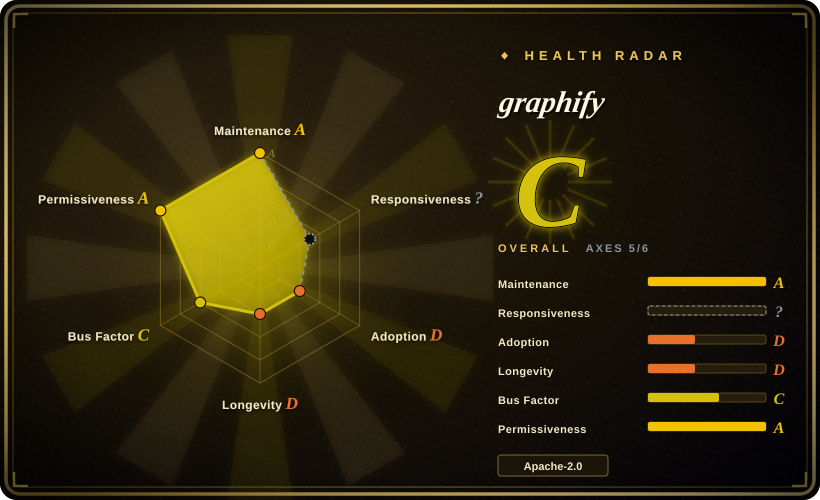
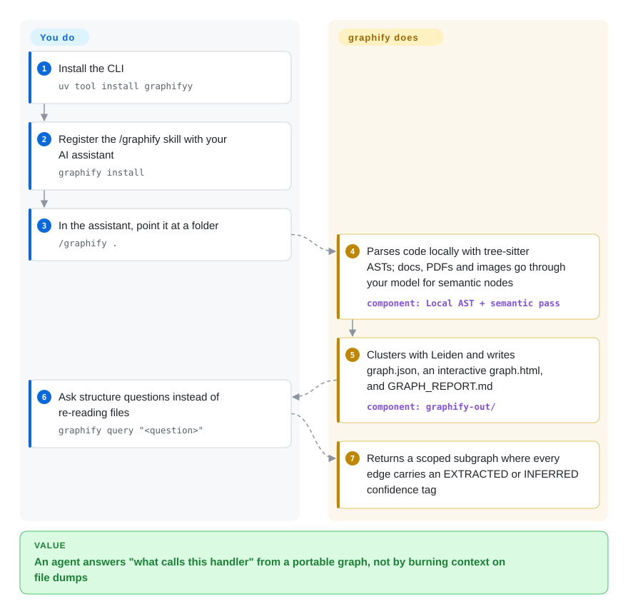

# graphify

A Python CLI + MCP server (also packaged as an AI-coding-assistant skill) that turns a folder of code, schemas, scripts, docs and media into a portable, queryable knowledge graph an agent can ask instead of grepping.

## When to use

You're a coding agent (or the engineer wiring one) dropped into an unfamiliar mid-to-large repo, and the user keeps asking cross-cutting questions — "what calls this auth handler", "where does this SQL table get written", "which module owns config loading". Plain `grep`/ripgrep gives you string hits with no structure: you burn context re-reading files to reconstruct call flow and ownership. graphify extracts an AST graph locally with tree-sitter (37 grammars), sends non-code files (docs, PDFs, images) to an LLM for semantic nodes, runs Leiden community detection to cluster the result into architectural "communities", and writes a portable `graph.json` plus an interactive `graph.html` and a `GRAPH_REPORT.md`. You then run `graphify query "question"` or hit it as an MCP server, getting structured answers (with `EXTRACTED`/`INFERRED`/`AMBIGUOUS` confidence labels) instead of raw file dumps.

It fits especially well when the graph spans more than just app code — graphify deliberately ingests SQL schemas, infra (Terraform/HCL), package manifests, R/shell scripts and docs into one graph, so an agent can reason about app-code + database + infrastructure together. Because it installs as a `/graphify` skill across many agents (Claude Code, Codex, Cursor, Gemini CLI, OpenCode, Aider and more) and ships an MCP mode, it slots into an existing agent loop without you building bespoke retrieval plumbing.

## How it works

graphify runs where your code lives. Its parser turns every code file into an AST with tree-sitter and resolves cross-file `calls`/`imports`/`inherits` edges across ~40 languages — deterministic, no LLM, nothing leaves your machine. Non-code material (docs, PDFs, images, video) goes through your assistant's model or a configured API key for a semantic pass that adds entity nodes. Leiden community detection then groups the graph into architectural "communities", and everything lands in `graphify-out/`: a portable `graph.json`, an interactive `graph.html`, and a `GRAPH_REPORT.md` of highlights. What you do: install the CLI once (`uv tool install graphifyy`), register the skill with `graphify install`, then build with `/graphify .` and ask — `graphify query "<question>"` returns a scoped subgraph where each edge carries an `EXTRACTED` (read directly) or `INFERRED` (derived by resolution) confidence tag; for repeated tool-call access you can serve the same graph as an MCP server (`python -m graphify.serve graphify-out/graph.json`, stdio or shared HTTP). What stays yours: the model backend and its cost for non-code files, version pinning (releases move fast), and keeping the graph fresh (`/graphify . --update`, or `graphify hook install` to rebuild on commit).

<!-- flow-steps:begin (generated from flows/graphify.json by tools/flow_card.py — do not edit) -->

Text version of the flow

1. **You**: Install the CLI — `uv tool install graphifyy`
2. **You**: Register the /graphify skill with your AI assistant — `graphify install`
3. **You**: In the assistant, point it at a folder — `/graphify .`
4. **graphify**: Parses code locally with tree-sitter ASTs; docs, PDFs and images go through your model for semantic nodes — component: `Local AST + semantic pass`
5. **graphify**: Clusters with Leiden and writes graph.json, an interactive graph.html, and GRAPH_REPORT.md — component: `graphify-out/`
6. **You**: Ask structure questions instead of re-reading files — `graphify query "<question>"`
7. **graphify**: Returns a scoped subgraph where every edge carries an EXTRACTED or INFERRED confidence tag

**Value**: An agent answers "what calls this handler" from a portable graph, not by burning context on file dumps

<!-- flow-steps:end -->

## When NOT to use

- **You want a persistent, multi-writer graph database.** graphify's native store is a one-shot `graph.json` (with a 512 MiB default cap); it does Cypher *export* to Neo4j/FalkorDB but is not itself a transactional graph DB. If you need a live, queryable, concurrently-updated graph backend, use [FalkorDB](../structured-retrieval/falkordb.md) or Neo4j directly.
- **Huge monorepos / very large graphs.** The README's own troubleshooting flags graph HTML above ~5000 nodes as too large to open in a browser; beyond that you work with raw JSON, and the `graph.json` default size cap of 512 MiB must be raised via `GRAPHIFY_MAX_GRAPH_BYTES`. Extraction over a massive tree also means many LLM calls for non-code files (cost + latency).
- **You need deterministic, offline-only extraction.** Code AST extraction is local, but semantic nodes for docs/PDFs/images require an LLM backend (your assistant's model, or a configured Anthropic/OpenAI/Gemini/DeepSeek/Kimi/Ollama/Bedrock/etc. key) — that means API keys, cost, non-determinism, and sending file contents to a model unless you skip non-code files.
- **You want a stable, frozen API.** Releases are very frequent (v0.9.71 shipped 2026-09-28, with a v1.0.0 tag already cut; multiple releases per week as of 2026-09, GitHub API); this is fast-moving software — pin versions and expect churn in commands/output format.
- **Pure document RAG over prose with no code.** If your corpus is articles/PDFs and you want passage retrieval (not a code/entity graph), a document-structure or vector approach like [PageIndex](../structured-retrieval/pageindex.md) is a more direct fit.
- **You only need code-review-specific graphs.** For PR/diff-scoped review graphs, [code-review-graph](code-review-graph.md) targets that narrower workflow.

## Comparison

| Alternative | In index | Our verdict | Tradeoff |
|---|---|---|---|
| [FalkorDB](../structured-retrieval/falkordb.md) | ✅ | Pick FalkorDB when you need a persistent graph database, not one-shot repo extraction. | A real persistent graph database (Redis-based, Cypher); graphify can *push* to it. Use FalkorDB when you need a live multi-query graph store, graphify when you want one-shot extraction + agent-facing query. |
| [PageIndex](../structured-retrieval/pageindex.md) | ✅ | Pick PageIndex when the problem is long-document/PDF structure retrieval rather than code/entity graph extraction. | Reasoning-based document-structure indexing for RAG over long docs/PDFs; no code AST or call-graph. Different problem: prose retrieval vs code/entity graph. |
| [code-review-graph](code-review-graph.md) | ✅ | Pick code-review-graph when you only need the narrow PR/code-review graph workflow. | Narrow PR/code-review graph workflow; graphify is whole-repo + multi-language + multi-modal and broader in scope. |
| [Sourcegraph](sourcegraph.md) / [SCIP](scip.md) | ✅ | Pick Sourcegraph/SCIP when you need precise cross-repo code intelligence backed by language servers. | Industrial-grade precise code intelligence (cross-repo, language servers); heavier infra and not agent-skill-shaped. graphify is lighter, LLM-augmented, drops into an agent loop. |
| GitHub `code2graph` / tree-sitter scripts | 未收录 | Pick roll-your-own AST scripts when control matters more than bundled query, clustering, visualization, and agent integration. | Roll-your-own AST graphs; more control, but you build query, clustering, viz, and agent integration yourself. |

## Tech stack

- **Language:** Python (100% per repo statistics, 2026-09).
- **Parsing:** tree-sitter with 37 bundled grammar parsers covering ~40 languages (Python, TS/JS, Go, Rust, Java, C/C++/CUDA/Metal, C#, Kotlin, Ruby, PHP, Swift, Scala, Zig, Lua, SQL, Terraform/HCL, Shell, Pascal, OCaml, Dart, Vue/Svelte/Astro, and more).
- **Graph analysis:** Leiden community detection (optional extra; graspologic backend on Python < 3.13, native backend on 3.13+ as of 2026-09).
- **Outputs:** `graph.json` (full graph), `graph.html` (interactive viz), `GRAPH_REPORT.md`, under `graphify-out/`.
- **Interfaces:** CLI (`graphify extract|query|path|install|hook|export`), MCP server (`python -m graphify.serve graphify-out/graph.json`, stdio or shared HTTP transport), and a `/graphify` skill installed into many agents.
- **LLM backends (for non-code semantic nodes):** the host assistant's own model by default, or a configured Anthropic/OpenAI/Gemini/DeepSeek/Kimi/Azure OpenAI/Bedrock key, or local Ollama.

## Dependencies

- **Runtime:** Python >= 3.10 (verified from `pyproject.toml` `requires-python`, 2026-09); install via `uv tool install graphifyy` (recommended), `pipx install graphifyy`, or `pip install graphifyy`. Note the PyPI package is **`graphifyy`** (double-y) while the CLI command is `graphify`.
- **Optional extras (pip):** `pdf`, `office` (DOCX/XLSX), `google` (Google Sheets), `video` (faster-whisper + yt-dlp), `mcp`, `neo4j`, `falkordb`, `postgres`, `sql`, `terraform`, `svg`, `leiden`, `ollama`, `openai`/`gemini`/`anthropic`/`bedrock`/`azure`, `dm`, `pascal`, `ocaml`.
- **External services:** a model backend (host assistant's model, cloud API key, or local Ollama) is required to graph non-code files; pure code-AST extraction is local. Optional downstream graph DBs: Neo4j, FalkorDB, PostgreSQL introspection.
- **Graph size:** `graph.json` defaults to a 512 MiB cap, overridable via `GRAPHIFY_MAX_GRAPH_BYTES`.
- **Security note (historical):** v0.8.49 (2026-06) bumped `starlette` to address CVE-2026-48818 and CVE-2026-54283 (per release notes at the time; see Caveats).

## Ops difficulty

**Low-to-medium.** The happy path is a single CLI install plus `graphify extract .` / `graphify query`, or a one-line skill install into an existing agent — no server to run for basic use, output is a portable JSON file. It rises to **medium** once you add an LLM backend (key management, per-file cost/latency, sending contents to a model), run the MCP server as a long-lived process, push to Neo4j/FalkorDB, or work past the HTML/node and 512 MiB graph ceilings on large repos. The very high release cadence also means version pinning is part of ops hygiene here.

## Health & viability

- **Responsiveness — unknown this pass.** The radar's responsiveness axis went `A → ?` (no qualifying issue/PR window signal on 2026-09-28; the 2026-09-22 run measured a 6.3-hour median first response across 6 issues). With ~1.5k open issues on a 122k-star repo, expect queue pressure either way. [推断：队列压力由 open-issue 数推断，未实测响应]
- **Maintenance — extremely active.** Last push 2026-09-28, not archived; v0.9.71 shipped the same day and a v1.0.0 tag is already cut (GitHub API, 2026-09-28). Activity is not the worry; churn is — the same velocity that signals "alive" means CLI surface and output schema move between minor versions, so pin a version.
- **Governance / bus factor — commercializing, but young (radar C).** The repo moved from `safishamsi/graphify` (personal) to the **Graphify-Labs** organization (created 2026-06-28, ~2 public repos, homepage graphify.com) — read as the author standing up a company around the project, not as an independent foundation. The scorer still puts ~61% of 12-month commits in one author's hands. If that founder stops, both the org and the project stall. [推断：组织背后是创始人一人还是小团队，未从成员名单验证——org 成员不公开]
- **Age & Lindy — very young (radar D; created 2026-04-03, ~6 months old).** Star velocity is extreme (~73k → 122k in three months, GitHub API snapshots 2026-06/09) — treat that as hype signal, not a track record. No Lindy prior earned yet.
- **Adoption — radar graded D this run.** The scorer's release-download signal is thin (≈7.2k per release, tier D); the previous run's PyPI download figure (~789k/month for `graphifyy`, 2026-09-22) would read much stronger, but a heavy install count on a hype-driven repo is not proof of production use. [未验证：PyPI 下载数的采用含义]
- **Risk flags — a relicense already happened, plus churn and LLM dependency.** The project **relicensed MIT → Apache-2.0 on 2026-07-22** (verified in commit history: "chore: relicense from MIT to Apache-2.0") — permissive-to-permissive, so low harm, but a young project changing its license once is a precedent. Non-code extraction sends file contents to a model backend; the historical v0.8.49 `starlette` CVE bumps (2026-06) show dependency pressure.

## Caveats (unverified)

- [未验证] Stars ~122.0k, forks ~11.7k, open issues ~1.5k as of 2026-09-28 (GitHub API) — the counts are API-verified, but their adoption *meaning* is unverified; star velocity on a months-old repo is indicative only.
- [推断] The Graphify-Labs org being the founder's company (rather than a multi-founder or institutionally funded structure) is inferred from the transfer timing (org created 2026-06-28) and the homepage; org membership is not public.
- [未验证] The ~5000-node HTML ceiling is the README's own troubleshooting heuristic; the 512 MiB `graph.json` cap is a documented default (`GRAPHIFY_MAX_GRAPH_BYTES` overrides). Real limits depend on machine memory and graph density.
- [未验证] Security CVE fixes (starlette, v0.8.49, 2026-06) were cited from release notes at the previous verification; not independently confirmed against an advisory database, and the current README no longer mentions them.
- [推断] "Multiple releases per week" is based on tags/releases observed across two verification passes (2026-06 and 2026-09), not a full release-log audit.
- [推断] graphify is best classified as a `tool` (CLI + MCP server) rather than a pure skill-pack, since it has a real tech stack, dependencies and ops surface beyond a prompt bundle.
