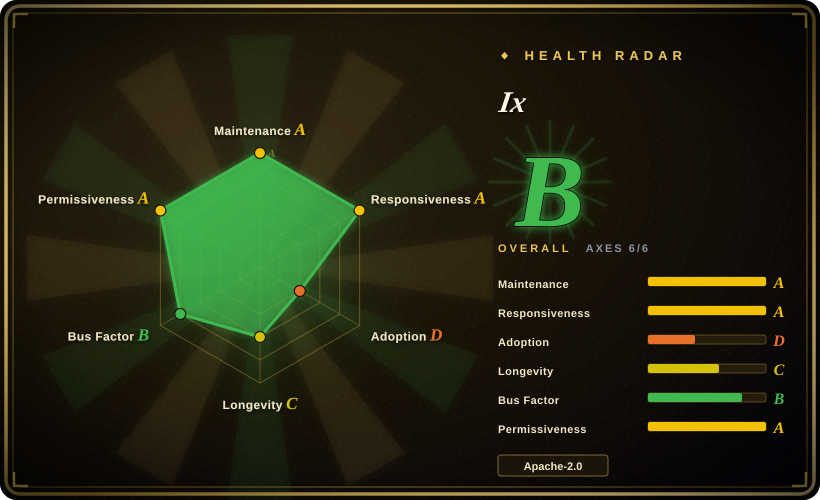
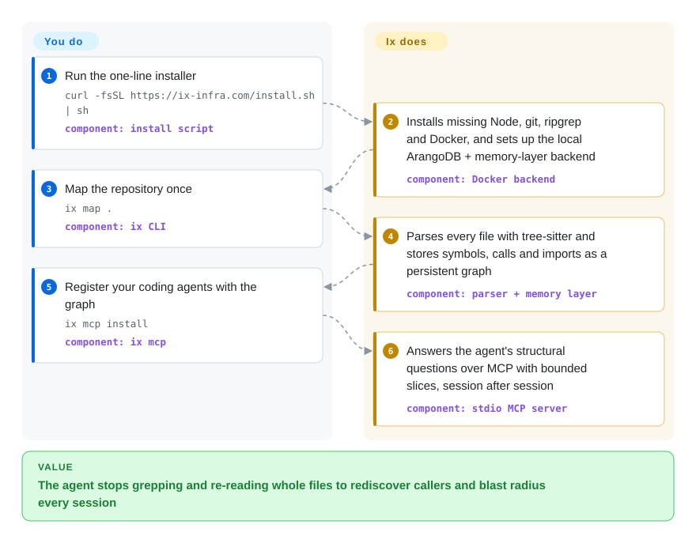

# Ix

Your coding agent answers "what breaks if I change `verify_token`?" by grepping, opening a dozen files and still missing a caller two hops away — then does it all again next session. Ix parses the repo once into a graph of who-calls-what and who-imports-what, keeps it in a local database, and lets the agent ask for one symbol's neighbourhood instead of reading files.

## When to use

You are a developer on a mid-sized or large repository — often polyglot: a TypeScript front end, a Python service, some Go, a Terraform folder — working through Claude Code, Codex, Cursor or opencode. Every structural question costs the agent the same ritual: `rg verify_token`, open six files, open the files they import, paste 40,000 tokens into the context, and answer with "this appears to be called from…". The next session starts from zero. You want the call and import structure computed once, kept between sessions, and handed to the agent in bounded slices: `ix explain AuthService` returns the symbol and its immediate relationships, `ix impact verify_token` returns the blast radius, `ix trace user_login_flow` follows a flow up and down.

You pick Ix over its nearest neighbours for three reasons: its extractor covers 27 languages (including SAS, R, HCL/Terraform and CUDA kernel launches) with no LLM in the mapping step; one command (`ix mcp install`) registers it with seven agent clients at once; and the graph lives in a real graph database with a watcher (`ix watch`) and a visualizer (`ix view`). The price is that the database side is not a single file: you run Docker, and the service that stores and answers queries is a vendor binary whose source you cannot read. If you want the same idea as a pip-installable tool with a SQLite file, code-review-graph is the closer fit.

## How it works

Ix is two halves. The half in this repository is the `ix` command-line tool: it walks your files with tree-sitter — a parser library that turns source text into a syntax tree for each language — pulls out every function, class, call and import, and sends them as batches to a backend on your machine. The other half is that backend: an ArangoDB graph database plus Ix's "memory layer" HTTP service, run for you by Docker on `127.0.0.1`, which stores the graph and answers queries. Think of it as the difference between a surveyor and the map office: the CLI walks the ground, the backend keeps the map and answers "what is connected to this?". You run the installer, map each repo once and register your agent clients; after that the agent calls Ix tools over MCP (the protocol coding agents use to call external tools) and gets short, token-lean answers (`--format llm`), while `ix watch` or the editor plugins keep the graph fresh as files change.

<!-- flow-steps:begin (generated from flows/ix.json by tools/flow_card.py — do not edit) -->

Text version of the flow

1. **You**: Run the one-line installer — `curl -fsSL https://ix-infra.com/install.sh | sh` — component: `install script`
2. **Ix**: Installs missing Node, git, ripgrep and Docker, and sets up the local ArangoDB + memory-layer backend — component: `Docker backend`
3. **You**: Map the repository once — `ix map .` — component: `ix CLI`
4. **Ix**: Parses every file with tree-sitter and stores symbols, calls and imports as a persistent graph — component: `parser + memory layer`
5. **You**: Register your coding agents with the graph — `ix mcp install` — component: `ix mcp`
6. **Ix**: Answers the agent's structural questions over MCP with bounded slices, session after session — component: `stdio MCP server`

**Value**: The agent stops grepping and re-reading whole files to rediscover callers and blast radius every session

<!-- flow-steps:end -->

## When NOT to use

- **You cannot run, or will not trust, a closed binary.** The graph store and query engine (`ghcr.io/ix-infrastructure/ix-memory-layer`) are built from a private repo; `ix-memory-layer-dist` explicitly "contains no source code", and CONTRIBUTING sends backend changes to a repo outsiders cannot clone (issue #574). If auditing the whole stack matters — regulated code, air-gapped review — use [code-review-graph](code-review-graph.md) (MIT, everything in one Python package on SQLite) or [graphify](graphify.md) instead.
- **Docker is not an option on the machine.** Ix needs Docker + Compose, Node 22+, git and ripgrep, and two long-running containers holding ports 8529 and 8090. On a locked-down laptop, a thin CI runner, or a machine that forbids Docker Desktop's license, pick [code-review-graph](code-review-graph.md), which needs only Python.
- **Several people or several repos share one backend and you expect isolation.** The repo's own CLAUDE.md warns that `ix reset` is global — it wipes *every* workspace's graph in the shared backend, and the CLI exposes no per-workspace reset. For multi-repo code intelligence served to a whole team, [Sourcegraph](sourcegraph.md) with [SCIP](scip.md) indexes is the heavier but properly multi-tenant route.
- **You need precise, compiler-grade resolution.** The graph is tree-sitter extraction, not type checking: open issues in 2026-09 include `--path` behaving three different ways (#636), keyword search silently dropping matches (#647), PHP files missing architecture ancestry (#629) and constants never materialising after an upgrade (#709). For exact go-to-definition and references use an LSP-backed tool such as Serena, or precise SCIP indexes from [SCIP](scip.md).
- **You want planning, decisions and task tracking in the same tool.** `plan`, `task`, `workflow`, `decide`, `goal`, `truth`, `bug` and `briefing` are registered as stubs that print "requires Ix Pro"; they come from a separate, unpublished package. Plan the free tier around structural queries only, or keep project memory in a dedicated tool from the [agent-memory](../../agent-memory/INDEX.md) category.
- **You need questions about prose — docs, meeting notes, design rationale — answered.** Ix's own skill says it "does not answer prose or history questions". For a graph over code *and* docs, use [graphify](graphify.md) or [Understand-Anything](understand-anything.md); for long documents, [PageIndex](../structured-retrieval/pageindex.md).
- **You need a long track record.** Ix is seven months old (created 2026-03-03), at v0.x, and shipped 16 release candidates for v0.10 in six days (2026-08-16 to 08-21) — the command and flag surface is still moving. Pin a version and expect to re-map after upgrades.

## Comparison

| Alternative | In index | Our verdict | Tradeoff |
|---|---|---|---|
| [code-review-graph](code-review-graph.md) | ✅ | If you want a code graph served to your agent over MCP with nothing but `pip install` and a SQLite file, pick code-review-graph; pick Ix when you want a real graph database, 27-language extraction and one-command registration across seven agent clients. | code-review-graph is fully MIT and self-contained but single-maintainer and Python-only at runtime; Ix adds Docker, a closed backend and global-reset caveats in exchange for a daemon-style graph store, a watcher and a visualizer. |
| [graphify](graphify.md) | ✅ | Pick graphify when the graph must include docs, schemas, PDFs and media alongside code; pick Ix when the questions are strictly structural (callers, impact, traces) and you do not want an LLM in the mapping step. | graphify needs an LLM backend for non-code files and pays tokens to build the graph; Ix's mapping is deterministic tree-sitter work, but it cannot answer anything about prose. |
| [Understand-Anything](understand-anything.md) | ✅ | Choose Understand-Anything when the goal is an explorable dashboard a teammate can open from a committed graph with only Node; choose Ix when the goal is an agent querying a live, watched graph during work. | Understand-Anything uses an LLM for summaries and Q&A and commits its graph to the repo; Ix keeps the graph out of the repo in a local database that every session and client shares. |
| [Sourcegraph](sourcegraph.md) / [SCIP](scip.md) | ✅ | For a team that needs precise cross-repository navigation and code search served centrally, choose Sourcegraph with SCIP indexes; choose Ix for a single developer's machine where the consumer is a coding agent. | Sourcegraph/SCIP give compiler-grade references and multi-user serving but are heavy to operate (and the indexed Sourcegraph repo is an archived public snapshot); Ix is a laptop tool with lighter, less precise tree-sitter edges. |
| Serena | not indexed | Pick Serena when the agent needs exact symbol lookup and edits through real language servers; pick Ix when you want a persisted whole-repo graph with blast-radius and ranking queries. Not added in this tab-intake batch. | Serena drives LSP servers per language, so its answers are precise but depend on each language server being installed and healthy; Ix precomputes one graph for all languages but with syntax-level accuracy. |
| GitNexus | not indexed | Consider GitNexus when you want a code-intelligence graph that runs with no server process at all; Ix needs its Docker backend running. Not added in this tab-intake batch. | GitNexus advertises a zero-server design; Ix trades that simplicity for a database backend that persists across sessions and clients. Licensing and feature depth were not reviewed here. |

## Tech stack

- **CLI (`ix-cli/`, package `@ix/cli`):** TypeScript on Node.js ≥ 22, `commander` for commands, `@modelcontextprotocol/sdk` for the stdio MCP server (`ix mcp`), `zod`, `yaml`, `chalk`; tests with vitest.
- **Parser (`core-ingestion/`):** node `tree-sitter` bindings with 14 bundled grammars plus 14 optional ones (R, HCL, Lua, XML, Zig, Bash, CSS, Elixir, Haskell, HTML, Kotlin, Make, SAS, Swift); CUDA is parsed with the C++ grammar. The SAS grammar is the org's own `tree-sitter-sas` (MIT).
- **Backend (not in this repo):** ArangoDB 3.12.11 (pinned, vector index enabled) plus `ix-memory-layer`, a Scala/JVM HTTP API on port 8090 distributed as a Docker image and a JAR from a private source repo.
- **Clients of the graph:** the CLI, the MCP server, and Compass, a web visualizer delivered through `ix upgrade` from a separate distribution repo.
- **Packaging:** `curl … install.sh | sh` / PowerShell installer downloading pre-built CLI tarballs (Apple Silicon, Linux x86-64/arm64, Windows x86-64); Homebrew formula for Intel Macs; per-client plugins in separate repos (Claude Code, Codex, OpenClaw, Gemini, OpenCode, Cursor).

## Dependencies

- **Required on the machine:** Node.js ≥ 22, git ≥ 2, ripgrep ≥ 13 (powers `ix text`), Docker ≥ 20 with Compose v2. The macOS/Linux installer installs missing pieces itself (Homebrew, NodeSource, `get.docker.com`, and adds your user to the `docker` group); on Windows you install Node and Docker Desktop yourself first.
- **Running services:** two containers — `arangodb:3.12.11` on `127.0.0.1:8529` (started with `ARANGO_NO_AUTH=1`) and `ix-memory-layer:latest` on `127.0.0.1:8090`. Both bind to localhost only; the database has no password, so anything local can read the graph.
- **Network at install time:** api.github.com, github.com, raw.githubusercontent.com, ghcr.io, plus Node/Docker/Homebrew download hosts (full list in `docs/prerequisites.md`). Docker Hub's anonymous pull limit can bite on shared IPs.
- **Network at run time:** the mapping and query path talks to the local backend; `ix ingest` can also pull GitHub issues/PRs when you ask it to. No LLM API key is needed. [推断] A code search of the repo found no telemetry client, but the closed backend's outbound behaviour cannot be checked from source.
- **Disk/state:** `~/.ix/` (config, CLI, Compose file; relocatable via `IX_HOME`) and a Docker volume holding the ArangoDB data.

## Ops difficulty

**Medium.** Installing is one command, but what it installs is a small service stack: two always-on containers with `restart: unless-stopped`, a database volume, and a backend you upgrade by pulling a `latest` image. Failure modes are real and documented in the repo itself: an unpinned ArangoDB pull once left the database refusing to start in a crash loop (#614, fixed by pinning 3.12.11), a large ingest could livelock on a held write lock (#615), `ix upgrade` wipes the Compass assets, and `ix reset` clears every workspace at once. Day to day you mostly run `ix map` after a branch switch and `ix doctor` when a command says the backend is unreachable; the memory layer answers HTTP 500 for both a saturated database and a rejected patch, so diagnosing slow maps means reading `docker stats` yourself.

## Health & viability

- **Maintenance (2026-09-28):** very active but bursty — last push the same day, v0.11.0 on 2026-09-26, 54 releases since 2026-03 clustered in March (16) and August (28), with no releases in May or July; v0.10.0 went through 16 release candidates between 2026-08-16 and 08-21. Bug reports get fixed within days; several issues filed on 2026-09-06 closed the same day.
- **Governance / bus factor:** owned by the `ix-infrastructure` GitHub organisation (copyright Ix Infrastructure Inc.), with four humans carrying most commits (≈140–250 each) — a better spread than a solo project. The roadmap and the backend are the company's; outside contributors can only touch the CLI, parser and docs.
- **Backing & longevity:** a young startup (repo created 2026-03-03, ~7 months) that also sells Kartr, an alpha agent platform "built on the same memory engine". Fails the Lindy prior by age; [推断] continuity of the free backend depends on the company's commercial direction, which nothing in the repo commits to.
- **Adoption:** ~1.0k stars and 78 forks (2026-09-28), a Discord, and plugins for six agent clients; no dependent-package signal because the CLI ships as tarballs, not an npm package.
- **Risk flags:** open-core by construction — the Apache-2.0 repo depends on a closed-source backend image and hides Pro commands behind stubs; the backend image is pulled as `latest`; the ArangoDB container runs without authentication. No relicense history (the project is too young to have one).

## Caveats (unverified)

- [未验证] The "30–99.7% fewer tokens" figure is the maintainers' own internal measurement, stated in the README as "not a published benchmark"; not reproduced here.
- [未验证] Source availability and license of the memory-layer backend: the dist repo carries an Apache-2.0 LICENSE file but no source, so what that license grants for the binary, and whether the image contains anything else, could not be verified without the private repo.
- [推断] No telemetry: a GitHub code search for `telemetry` found only lockfile hits in the open code; the closed backend's network behaviour is unknown.
- [未验证] 27-language support is the README's claim; per-language edge quality varies (e.g. PHP ancestry issue #629) and was not tested here.
- [推断] Compass (`ix view`) appears to be built from a non-public pipeline (`ix-compass-dist` is a distribution-only repo); its license was not confirmed.
- [未验证] `--semantic` search uses vector embeddings; where they are computed (presumably in the backend) and with which model is not documented in the open repo.
- [未验证] Serena and GitNexus tradeoffs are summarised from their repo descriptions only; their licences were not reviewed for this page.
- [未验证] Star/fork counts and release dates as of 2026-09-28 via `gh api`; volatile.
