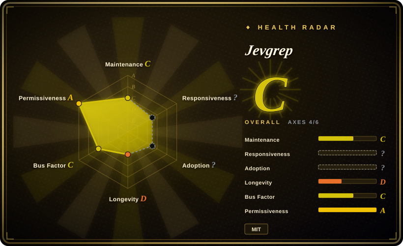
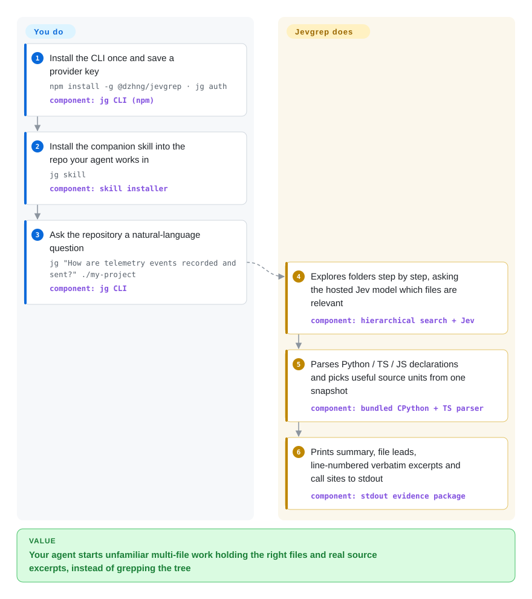

# Jevgrep

Your coding agent's first minutes in an unfamiliar repo are orientation tax: `rg telemetry`, open nine files, paste thousands of tokens, still miss the dispatcher two folders away. Jevgrep turns that into one question — a CLI (`jg`) that walks the tree folder by folder, has a small hosted model judge what each piece of code does, and prints the right files plus verbatim, line-numbered excerpts to stdout.

## When to use

You work through Claude Code, Codex or OpenCode on a repository nobody has indexed — a client's codebase, a fork you inherited, your own project after six months away. Every new task starts the same way: the agent greps a guessed token, opens a pile of files, and the context window fills before the real work begins. You reach for `jg` instead: `jg "Where is authentication checked before a request reaches a handler?" .` and the agent gets, in one stdout block, a compact file list, reading leads, and verbatim source excerpts with line references — evidence it reads before touching anything.

You pick this over its graph-building neighbours ([Ix](ix.md), [Repowise](repowise.md), [graphify](graphify.md)) because there is nothing to build or keep fresh — no index, no database, no Docker; each question walks the repository fresh. And you pick it over plain text search because its relevance judgments come from **Jev**, a hosted evaluator model (TypeSafe AI's "System One" line, reached through Vercel AI Gateway, TypeSafe's native endpoint, OpenRouter or OpenCode Zen): it ranks folders, files and declarations by what the code *does*, not by which tokens it contains — questions like "how are retry timeouts handled" that `rg` can only answer if you already know the function's name. The price for that convenience is structural: candidate source leaves your machine toward a paid API on every search, and the parser understands declarations only in Python and TypeScript/JavaScript.

## How it works

Jevgrep is a CLI and a hosted model, and the split is simple. You do three one-time things — `npm install -g @dzhng/jevgrep`, pick a provider and save its key with `jg auth`, and install the bundled agent skill into your repo with `jg skill` — after which the agent invokes `jg "<question>" <path>` like any shell command. The project then does the search: it traverses the repository the way a human would, using directory metadata and short content previews to decide which branches are worth descending (the whole tree is never uploaded up front), and asks Jev — not a chat model, but a small evaluator that takes structured state plus typed questions and returns choices, scores and boolean probabilities — whether each folder, file and declaration is relevant to the question. Qualifying files are read from one immutable snapshot of your tree; declarations are parsed for Python via a bundled CPython (Pyodide, so you never install Python) and for TypeScript/JavaScript via the bundled TS compiler, and stdout comes back in a fixed order: summary and compact file list, verbatim excerpts with line references, then detailed declaration and call locations. There is no persistent index between searches — only classifier answers are cached — and the tool is explicit that returned paths are reading leads and incomplete results are possible; your agent owns the reading, implementation and verification.

<!-- flow-steps:begin (generated from flows/jevgrep.json by tools/flow_card.py — do not edit) -->

Text version of the flow

1. **You**: Install the CLI once and save a provider key — `npm install -g @dzhng/jevgrep · jg auth` — component: `jg CLI (npm)`
2. **You**: Install the companion skill into the repo your agent works in — `jg skill` — component: `skill installer`
3. **You**: Ask the repository a natural-language question — `jg "How are telemetry events recorded and sent?" ./my-project` — component: `jg CLI`
4. **Jevgrep**: Explores folders step by step, asking the hosted Jev model which files are relevant — component: `hierarchical search + Jev`
5. **Jevgrep**: Parses Python / TS / JS declarations and picks useful source units from one snapshot — component: `bundled CPython + TS parser`
6. **Jevgrep**: Prints summary, file leads, line-numbered verbatim excerpts and call sites to stdout — component: `stdout evidence package`

**Value**: Your agent starts unfamiliar multi-file work holding the right files and real source excerpts, instead of grepping the tree

<!-- flow-steps:end -->

## When NOT to use

- **Code cannot leave the machine.** Searches upload eligible previews and source to your chosen hosted provider by design, and the repo itself states the default filters (ignore files, hidden/dependency/build, binary, "obvious credential" files) "are not a guarantee" — choose a search root you intend to send. Regulated or air-gapped codebases want [Repowise](repowise.md) (keyless local index) or Serena (local LSP servers) instead.
- **You are on Windows.** The published npm package pins `"os": ["darwin","linux"]` and Windows support is an open issue (#31). Until it lands, use [ripgrep](../../dev-utilities/data-tools/ripgrep.md) directly or run under WSL.
- **You need exact references, not leads.** Declaration parsing covers only Python and TypeScript/JavaScript — everything else degrades to bounded text chunks — and the output is deliberately evidence for an agent, not a reference database. For compiler-grade definitions/references across a whole repo, use [SCIP](scip.md)-based indexing or an LSP-backed tool such as Serena.
- **Every query must cost zero.** Each search spends paid tokens — Jev is $0.042 per 1M input tokens on Vercel AI Gateway (verified 2026-09-28) — and spend scales with how much of the repo gets previewed. No key on the box, or no per-query budget: [ripgrep](../../dev-utilities/data-tools/ripgrep.md) (free, offline) or [Repowise](repowise.md) (local, keyless) do the orientation without a meter.
- **Sessions must share one up-to-date picture of the repo.** Jevgrep keeps no persistent graph; it re-explores per question and caches only classifier answers. If several agents over weeks need callers, blast radius and history from one maintained index, use [Ix](ix.md), [code-review-graph](code-review-graph.md) or [graphify](graphify.md).
- **Completeness is the deliverable** — a security sweep ("every read of user input"), a deprecation migration inventory. Jevgrep is a search: unread descendants and failed classifications stay unknown and are reported as such, with no negative-path inventory. Script exhaustive passes with `rg`/ast-grep or a real symbol index.
- **You cannot absorb a two-day-old v0.x CLI.** Created 2026-09-26, v0.1.0→v0.4.3 in three days, one account holding 160 of 161 listed contributions, no `jg upgrade` (upgrade npm, then rerun `jg skill`). Pin the version and expect the flag surface to move.

## Comparison

| Alternative | In index | Our verdict | Tradeoff |
|---|---|---|---|
| [Ix](ix.md) | ✅ | Pick this page's project when orientation questions are episodic and you refuse to run Docker plus a persistent graph for them; pick Ix when the same repo is queried session after session and you want deterministic structural answers (callers, impact) with no LLM in the mapping step. | jevgrep: zero setup state but per-query spend and source egress, and tree-sitter-grade structure only inside Python/TS-JS; Ix: local graph store keeps answers free and egress-free after one map, at the cost of a Docker backend with a closed query service. |
| [Repowise](repowise.md) | ✅ | Choose Repowise when nothing may leave the laptop — a keyless local index over MCP; choose jevgrep when the question is behavioural ("where is X recorded and sent") rather than structural, and you accept a hosted evaluator in the loop. | Repowise stays local and free per query but is AGPL vendor tooling answering graph/git questions; jevgrep answers prose-shaped questions but metered and with previews/source uploaded per search. |
| [ripgrep](../../dev-utilities/data-tools/ripgrep.md) | ✅ | If you already know the literal token — `rg retry_backoff` — ripgrep answers instantly, free, offline, and stays the right first move; reach for jevgrep when the symptom is a described behaviour with no known token, which is exactly when grep starts guessing. | rg returns every literal match with zero ranking; jevgrep returns a model-ranked subset with excerpts — but only as good as its budget, its egress policy and the search root you pick. |
| Serena | not indexed | Pick Serena when the agent needs precise symbol navigation and edits through real language servers, locally and for free per query; pick jevgrep when you want one-shot "what should I read first" for questions phrased as behaviour, with no language-server setup. Not added in this tab-intake batch. | Serena depends on each language server being installed and healthy but its answers are LSP-precise; jevgrep needs only Node plus an API key but its non-Python/TS fallback is text chunks, judged by a hosted model. |
| grepai | not indexed | Consider grepai when you want the same natural-language-over-your-repo ergonomics but must control the embedding backend (local or self-hosted), e.g. on air-gapped CI; jevgrep trades that control for a purpose-built hosted evaluator. Not added in this tab-intake batch. | grepai indexes once and reuses embeddings across queries (no per-query model bill, but an index to rebuild); jevgrep re-judges every question (no index to stale, but pay-and-egress per search). |

## Tech stack

- **Runtime and distribution:** TypeScript monorepo (Bun workspaces + Turborepo in development), published as npm package `@dzhng/jevgrep` with `bin.jg`; the published package requires Node.js ≥ 22 and pins `"os"` to `darwin` + `linux`.
- **Model layer:** Vercel AI SDK (`ai` 7.0.107, `@ai-sdk/typesafe-ai` 3.0.8); the evaluator is **Jev** (`typesafe-ai/jev`) — TypeSafe AI's hosted "System One" evaluation model for structured decisions, reached via Vercel AI Gateway, a native TypeSafe endpoint, OpenRouter or OpenCode Zen; it returns typed choices/scores rather than prose.
- **Parsing and filtering:** bundled `typescript` 5.9.3 for TS/JS declarations; `pyodide` 0.25.1 (CPython 3.11.3) in an isolated Node child process runs the unchanged Python AST helpers; `ignore` 7.0.5 applies gitignore-style eligibility filtering.

## Dependencies

- **On the machine:** Node.js ≥ 22 on macOS or Linux — the README states no separate Python, Bun or ripgrep install is needed (Python parsing ships as Pyodide).
- **An account and a key:** one paid provider — Vercel AI Gateway, TypeSafe, OpenRouter or OpenCode Zen — saved by `jg auth` to `$XDG_CONFIG_HOME/jevgrep/credentials.json` (owner-only); environment keys and endpoint overrides are deliberately ignored, and there is no per-search fallback.
- **Network per search:** eligible previews and source are sent to the saved provider, where Jev ranks them; Jev is priced from $0.042 per 1M input tokens (Vercel AI Gateway listing, 2026-09-28), with a default cap of 32 concurrent requests.
- **For the skill step:** `jg skill` delegates to the [skills CLI](https://github.com/vercel-labs/skills) — npm/npx plus network access.
- **Local state:** classifier-answer cache and config under the same directory; the CLI writes only stdout and creates no report files.

## Ops difficulty

**Low.** One global npm package, no daemon, no index to build or refresh; `jg doctor` validates the saved provider with synthetic input, and `--concurrency` / `--no-cache` tune flaky or expensive runs. What you own instead: per-query API spend that scales with how much of the repo gets previewed (returned source also re-enters your coding agent's own context bill), a two-step upgrade (npm, then rerun `jg skill`, since there is no `jg upgrade`), and version pinning through v0.x churn — four releases in the repo's first three days.

## Health & viability

- **Maintenance (2026-09-28):** maximal — repo created 2026-09-26, pushed the same day it is scored, v0.1.0→v0.4.3 released 2026-09-26→2026-09-28 (npm shows ~10 versions in three days); issues are being triaged (Windows request #31, parser-swap proposal #27, custom-provider #28 all open with early maintainer activity). Two days of history is not a cadence.
- **Governance / bus factor:** a personal GitHub account (dzhng, "David Zhang") holds 160 of the 161 listed contributions; no organisation, no CODEOWNERS / CONTRIBUTING / SECURITY files in the tree. One maintainer sits between you and the tool.
- **Backing & longevity:** no corporate backing on this repo; the maintainer has a genuine track record of widely-used personal projects (his `deep-research` had ~19.7k stars as of 2026-09-28). It fails the Lindy prior on age — two days old, v0.x — and 1.2k stars in two days is a hype signal, not a durability signal. [推断：依据是仓库创建时间与 star 增速，无更长的观测窗口]
- **Adoption:** 1,412 npm downloads in the week it first shipped (2026-09-21→2026-09-27, registry count); no dependent-package or ecosystem evidence yet; useless without a third-party proprietary model (TypeSafe AI's Jev) whose pricing and availability no MIT license in this repo governs.
- **Risk flags:** source egress is the design, not a side effect, and the repo says its credential/binary filters "are not a guarantee"; provider and parser direction are visibly still moving (open issues #27, #28); API keys live in a plaintext owner-only config; the cost-savings headline is self-benchmarked and the repo itself labels the tasks "tuned development tasks, not a holdout".

## Caveats (unverified)

- [未验证] The "8/10 tasks solved, ~30% lower cost" (and 25.8% including Jev) figures are the authors' own evals under evals/results/ — methodology is published and unusually honest about limits, but nothing was reproduced here.
- [未验证] Even the authors' totals have an incomplete cost side: full Jev charges for the eval cohort were "unknown" (observed ≥ $1.57), so net savings are bounded below by an unmeasured input.
- [未验证] This page's author did not run `jg` against a real repository (it requires a paid provider key); retrieval-quality judgments come from docs, eval artifacts and source reading only.
- [未验证] The cause of 1,183 stars in two days was not investigated (launch channel, follower effect); treated as an unexplained popularity anomaly, which the index's heuristics call a risk flag rather than proof.
- [推断] Bundled-CPython-via-Pyodide is assembled from `package.json` dependency `pyodide@0.25.1`, `scripts/licenses/` (CPython/Pyodide/Emscripten notices) and `specs/done/jevgrep/assets/python-runtime.md`; the runtime path itself was not executed here.
- [未验证] The Serena and grepai rows summarise those repos' own descriptions only; their licenses, activity and feature depth were not reviewed for this page.
- [未验证] All stars/forks/downloads/release dates were measured 2026-09-28 via `gh api` and the npm registry; at this age they move daily.
- [未验证] Maintainer identity and "founded a few companies" come from the GitHub profile's self-declared fields.
