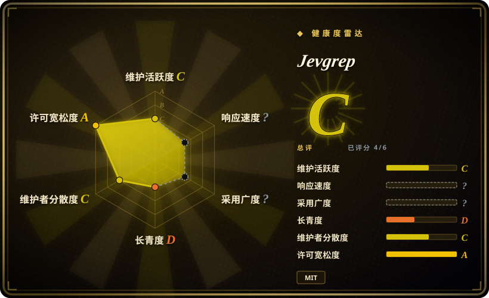
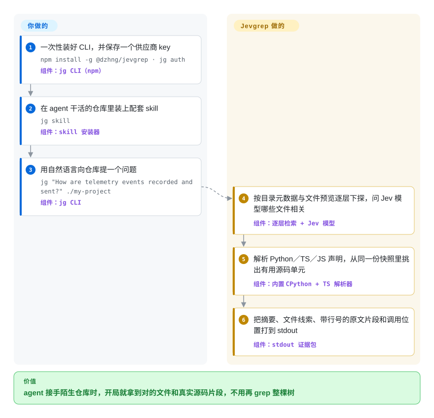

# Jevgrep

编码 agent 进了陌生仓库，头几分钟全花在摸路上：`rg telemetry`、打开九个文件、往上下文里塞几万个 token，最后还是漏掉隔两层目录的分发器。Jevgrep 把这套摸路压缩成一个问题——命令行 `jg` 逐层走仓库，让一个托管的小模型判断每段代码在干什么，然后把该读的文件和带行号的原文片段直接打到 stdout。

## 何时使用

你平时通过 Claude Code、Codex 或 OpenCode 干活，接手的仓库没人建过索引——客户的代码库、继承来的 fork、或者自己半年没碰的项目。每个新任务的开场都一样：agent 猜一个词去 grep，打开一堆文件，还没进入正题上下文就满了。这时你改用 `jg "请求到达 handler 之前，鉴权是在哪里检查的？" .`，agent 在一段 stdout 里拿到紧凑的文件清单、阅读线索和带行号引用的逐字源码片段——先读这些，再动手。

选它而不是那几个建图邻居（[Ix](ix.zh.md)、[Repowise](repowise.zh.md)、[graphify](graphify.zh.md)），理由是没有需要提前搭建或保鲜的东西——不建索引、不跑数据库、不开 Docker，每个问题现走一遍仓库。选它而不是纯文本搜索，理由是其相关性判断来自 **Jev**：一个托管的评测型小模型（TypeSafe AI 的“System One”产品线，经 Vercel AI Gateway、TypeSafe 原生端点、OpenRouter 或 OpenCode Zen 访问）。它按代码*做什么*给目录、文件、声明排序，而不是按包含哪些词——“重试超时的处理逻辑在哪”这种问题，`rg` 只有在你已经知道函数名时才答得了。这份省事的定价也是结构性的：每次搜索，候选源码都会发向付费 API，离开你的机器；而且解析器只认 Python 与 TypeScript/JavaScript 的声明，其余语言退化成文本块。

## 怎么用起来

Jevgrep 是一个 CLI 加一个托管模型，分工很清楚。你只做三件一次性的事——`npm install -g @dzhng/jevgrep`、用 `jg auth` 选定供应商并存好 key、用 `jg skill` 把自带的 agent skill 装进仓库——之后 agent 就像调普通 shell 命令一样执行 `jg "<问题>" <路径>`。项目负责剩下的搜索：它像人一样遍历仓库，用目录元数据和短内容预览决定哪条分支值得往下走（绝不先把整棵树上传），然后问 Jev——这不是聊天模型，而是一个吃结构化状态加类型化问题、返回选项／分数／布尔概率的小评测器——判断每个目录、文件、声明与问题是否相关。入选的文件从你仓库的同一份不可变快照里读出；Python 声明由内置的 CPython（Pyodide，所以你永远不用装 Python）解析，TypeScript/JavaScript 由内置的 TS 编译器解析；stdout 按固定顺序返回：摘要与文件清单、带行号引用的逐字片段、然后是声明与调用的详细位置。两次搜索之间不留持久索引——只缓存评测器的答案——并且工具明说返回的路径是阅读线索而非清单、结果可能不完整；读什么、怎么改、怎么验证，仍然归你的 agent 管。

<!-- flow-steps:begin (generated from flows/jevgrep.json by tools/flow_card.py — do not edit) -->

流程文字版

1. **你**：一次性装好 CLI，并保存一个供应商 key — `npm install -g @dzhng/jevgrep · jg auth` — 组件：`jg CLI（npm）`
2. **你**：在 agent 干活的仓库里装上配套 skill — `jg skill` — 组件：`skill 安装器`
3. **你**：用自然语言向仓库提一个问题 — `jg "How are telemetry events recorded and sent?" ./my-project` — 组件：`jg CLI`
4. **Jevgrep**：按目录元数据与文件预览逐层下探，问 Jev 模型哪些文件相关 — 组件：`逐层检索 + Jev 模型`
5. **Jevgrep**：解析 Python／TS／JS 声明，从同一份快照里挑出有用源码单元 — 组件：`内置 CPython + TS 解析器`
6. **Jevgrep**：把摘要、文件线索、带行号的原文片段和调用位置打到 stdout — 组件：`stdout 证据包`

**价值**：agent 接手陌生仓库时，开局就拿到对的文件和真实源码片段，不用再 grep 整棵树

<!-- flow-steps:end -->

## 何时不用

- **代码不能出机器。** 搜索在设计上就会把合格的预览与源码发给你选定的托管供应商，仓库自己也写明默认过滤（ignore 文件、隐藏／依赖／构建目录、二进制、“明显凭证”文件）“不是保证”——要自己挑准搜索根目录。受监管或离线的代码库改用 [Repowise](repowise.zh.md)（无 key 的本机索引）或 Serena（本地语言服务器）。
- **你在 Windows 上。** 发布的 npm 包把 `"os"` 钉死为 `darwin` 和 `linux`，Windows 支持还挂在 open issue（#31）。在它落地之前，直接用 [ripgrep](../../dev-utilities/data-tools/ripgrep.zh.md)，或者跑在 WSL 里。
- **你要的是精确引用，不是线索。** 声明解析只覆盖 Python 与 TypeScript/JavaScript——其他语言退化成有界的文本块——而且输出刻意只是给 agent 看的证据，不是引用数据库。要编译器级的全仓库定义／引用跳转，用基于 [SCIP](scip.zh.md) 的索引，或 Serena 这类 LSP 工具。
- **每次查询都必须零成本。** 每次搜索都花真金白银——Jev 在 Vercel AI Gateway 上每 100 万输入 token 起价 $0.042（2026-09-28 查证）——而且花费随被预览的仓库规模增长。机器上不能有 key、不能按次计费：用 [ripgrep](../../dev-utilities/data-tools/ripgrep.zh.md)（免费、离线）或 [Repowise](repowise.zh.md)（本机、无 key）完成摸路。
- **多个会话要共用一张保鲜的仓库图。** Jevgrep 不留持久索引，每个问题重新探索，只缓存评测器答案。如果多个 agent 在数周里要同一张维护好的调用图／影响面，用 [Ix](ix.zh.md)、[code-review-graph](code-review-graph.zh.md) 或 [graphify](graphify.zh.md)。
- **交付要求“查全”**——安全排查（“所有读取用户输入的位置”）、废弃接口的迁移清单。Jevgrep 是搜索器：没读到的子孙目录、分类失败的文件都保持未知并如实上报，不提供反向路径清单。这类穷举用 `rg`／ast-grep 脚本或真正的符号索引来做。
- **你消化不了一个出生两天的 v0.x CLI。** 2026-09-26 建库，三天内 v0.1.0→v0.4.3，161 个列名贡献里 160 个来自同一个账号，也没有 `jg upgrade`（升级要 npm 重装、再重跑 `jg skill`）。锁好版本，并预期参数面还会动。

## 横向对比

| 替代品 | 是否收录 | 我们的评价 | 取舍 |
|---|---|---|---|
| [Ix](ix.zh.md) | ✅ | 摸路问题只是偶发、又不愿为它养一套 Docker 加持久图，选本页项目；同一仓库被反复问、想要不经过大模型的确定性结构答案（调用方、影响面），选 Ix。 | jevgrep 零常驻状态，但按次付费、源码外发，结构精度只在 Python/TS-JS 里有；Ix 建一次图之后查询免费且不出机器，代价是 Docker 后端加一个闭源的查询服务。 |
| [Repowise](repowise.zh.md) | ✅ | 什么都不能离开这台笔记本时选 Repowise——无 key 的本机 MCP 索引；问题是行为式的（“X 在哪被记录、被发送”）、并且接受托管评测器在环，选 jevgrep。 | Repowise 本机、按次免费，但它是 AGPL 厂商工具，答的是图／git 类结构问题；jevgrep 答得出散文式的问题，但要按次付钱、把预览和源码发出去。 |
| [ripgrep](../../dev-utilities/data-tools/ripgrep.zh.md) | ✅ | 已经知道字面量时——`rg retry_backoff`——ripgrep 即时、免费、离线地给答案，仍是第一选择；只知道症状描述、说不出 token 时才轮到 jevgrep，因为那正是 grep 开始靠猜的地方。 | rg 把所有字面命中原样吐出、不做排序；jevgrep 给模型排过序的带片段子集——但质量受预算、外发策略和你选的搜索根目录约束。 |
| Serena | 未收录 | agent 需要经真正的语言服务器做精确符号查找和编辑、且本机免费按次查询时，选 Serena；要一次拿到“先读哪几个文件”的行为式答案、不想配语言服务器时，选 jevgrep。本批 tab-intake 未新增。 | Serena 依赖每种语言的服务器装好且正常，但答案是 LSP 级的精确；jevgrep 只要 Node 加一个 API key，可 Python/TS 之外只剩文本块，相关性由托管模型代判。 |
| grepai | 未收录 | 想要同样的自然语言仓库检索、但必须自己控制嵌入后端（本机或自托管），比如离线 CI，可以考虑 grepai；jevgrep 用这份控制权换来了专门的托管评测模型。本批 tab-intake 未新增。 | grepai 一次建索引、后续查询复用嵌入（不按次付模型钱，但索引要重建保鲜）；jevgrep 每个问题现判（没有会过期的索引，但按次付费加外发）。 |

## 技术栈

- **运行时与分发：** TypeScript monorepo（开发用 Bun workspaces + Turborepo），以 npm 包 `@dzhng/jevgrep` 发布，`bin` 是 `jg`；发布包要求 Node.js ≥ 22，并把 `"os"` 钉在 `darwin` 和 `linux`。
- **模型层：** Vercel AI SDK（`ai` 7.0.107、`@ai-sdk/typesafe-ai` 3.0.8）；评测器是 **Jev**（`typesafe-ai/jev`）——TypeSafe AI 的托管“System One”结构化决策模型——经 Vercel AI Gateway、TypeSafe 原生端点、OpenRouter 或 OpenCode Zen 访问，返回类型化的选项／分数而非散文。
- **解析与过滤：** 内置 `typescript` 5.9.3 解析 TS/JS 声明；`pyodide` 0.25.1（CPython 3.11.3）在隔离的 Node 子进程里跑原封不动的 Python AST 辅助脚本；`ignore` 7.0.5 做 gitignore 语义的资格过滤。

## 依赖

- **机器上：** Node.js ≥ 22，macOS 或 Linux——README 明说不需要另装 Python、Bun 或 ripgrep（Python 解析随包内置 Pyodide）。
- **一个账号和 key：** 四选一——Vercel AI Gateway、TypeSafe、OpenRouter 或 OpenCode Zen——由 `jg auth` 存进 `$XDG_CONFIG_HOME/jevgrep/credentials.json`（仅属主可读）；环境变量 key 和端点覆盖被刻意忽略，也没有按次回退。
- **每次搜索的网络：** 合格的预览与源码发往已存供应商，由 Jev 做相关性判断；Jev 每 100 万输入 token 起价 $0.042（2026-09-28 的 Vercel AI Gateway 标价），默认并发上限 32 路。
- **装 skill 那一步：** `jg skill` 委托给 [skills CLI](https://github.com/vercel-labs/skills)，需要 npm/npx 和外网。
- **本机状态：** 评测答案缓存和配置都在同一目录；CLI 只写 stdout，不生成报告文件。

## 运维难度

**低。** 一个全局 npm 包，没有守护进程，没有要保鲜的索引；`jg doctor` 用合成输入验证已存的供应商配置，网络不稳或想省钱时用 `--concurrency` 和 `--no-cache` 调节。你要另外承担的是：随预览规模增长的按次 API 开销（返回的源码还会再进编码 agent 自己的上下文账单）、两步升级（npm 重装后重跑 `jg skill`，因为没有 `jg upgrade`），以及在 v0.x 的高速变动里锁定版本——仓库头三天就发了四个版本。

## 健康度与可持续性

- **维护（2026-09-28）：** 强度拉满——2026-09-26 建库，打当天即有推送，v0.1.0→v0.4.3 发布于 2026-09-26 至 09-28（npm 显示三天约 10 个版本）；issue 在被认真分诊（Windows 需求 #31、解析器替换提案 #27、自定义供应商 #28 都有早期维护者活动）。但两天的历史撑不起“节奏”这个词。
- **治理与巴士因子：** 个人 GitHub 账号（dzhng，“David Zhang”）承担 161 个列名贡献里的 160 个；没有组织，文件树里也没有 CODEOWNERS／CONTRIBUTING／SECURITY。你和这件工具之间只站着一个人。
- **背后力量与寿命：** 本仓库没有公司背书；维护者的个人项目履历是真的（他的 `deep-research` 到 2026-09-28 约 19.7k star）。但按年龄它完全不满足 Lindy 先验——出生两天、v0.x；两天 1.2k star 是热度信号，不是耐久信号。[推断：依据是仓库创建时间与 star 增速，缺更长的观测窗口]
- **采用情况：** 首发当周 npm 下载 1,412 次（2026-09-21 至 09-27，registry 计数）；还没有下游依赖或生态信号；离了第三方闭源模型（TypeSafe AI 的 Jev）它就不可用，而模型定价与可用性不受本仓库任何 MIT 许可的约束。
- **风险信号：** 源码外发是设计而非副作用，仓库自己说凭证／二进制的过滤“不是保证”；供应商与解析器方向明显还在动（open issues #27、#28）；API key 存放于仅属主可读的明文配置；省钱数字全部来自作者自评，仓库自己把任务标成“调过的开发任务，不是留出集”。

## 存疑（未验证）

- [未验证] “10 题解 8 题、成本约省三成”（算上 Jev 后为 25.8%）这些数字来自作者在 evals/results/ 下的自评测——方法论公开且异常坦白其局限，但本页没有复现。
- [未验证] 连作者自己的总账都有不完整的一侧：评测批次里 Jev 的完整扣费“未知”（观测到 ≥ $1.57），所以“净省了多少”的下界本身就压着一个没测准的输入。
- [未验证] 本页没有把 `jg` 跑在真实仓库上（需要一个付费供应商 key）；对检索质量的判断全部来自文档、评测工件和源码阅读。
- [未验证] 两天 1,183 star 的成因没有调查（发布渠道、粉丝效应）；按本索引的启发式，这属于热度异常的风险信号而非证明。
- [推断] “内置 CPython 走 Pyodide”是从 `package.json` 的 `pyodide@0.25.1` 依赖、`scripts/licenses/`（CPython/Pyodide/Emscripten 许可附件）和 `specs/done/jevgrep/assets/python-runtime.md` 拼出来的；运行时路径本身没有在本页执行过。
- [未验证] Serena 与 grepai 两行只依据它们各自的仓库描述概括；许可、活跃度和功能深度没有为本页审查。
- [未验证] star/fork、npm 下载、发布日期都测于 2026-09-28（`gh api` 与 npm registry）；这个年龄的项目一天一个数。
- [未验证] 维护者身份与“创办过几家公司”仅来自其 GitHub 主页的自述字段。
