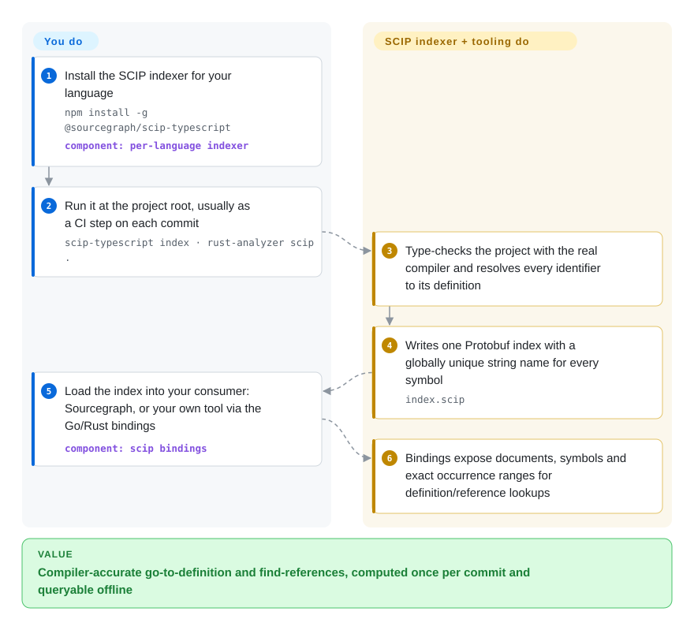

# SCIP

Text search and tree-sitter graphs guess: `grep handleRequest` returns the definition, three unrelated methods with the same name and a comment, and nothing tells you which call actually resolves where. SCIP is a file format plus tooling for *compiler-accurate* code indexes — a per-language indexer type-checks your code and writes down, for every identifier, exactly which definition it refers to, so tools can answer "go to definition" and "find references" precisely, even across repositories.

## When to use

You are building developer tooling — a code-search service, a code-review bot, an internal "who calls this?" dashboard, or a retrieval layer that feeds a coding agent — and you need precise cross-references for a large polyglot codebase. Running a language server per language per request is slow and stateful; tree-sitter graphs are fast but miss anything that needs type information (overloads, interface dispatch, re-exports), so your tool sometimes says a function has zero callers when it has twenty. You want to index each commit once in CI and query the result offline.

SCIP is the interchange format for exactly that: run a SCIP indexer for each language (`scip-typescript index`, `scip-python index`, `scip-java`, `rust-analyzer scip`, `scip-clang`…), get one `index.scip` Protobuf file per project, and read it with the Go/Rust bindings, the `scip` CLI or a consumer like Sourcegraph. Pick it over tree-sitter-based graph tools when correctness of references matters more than zero-setup; over LSIF because SCIP is its successor (Sourcegraph has removed LSIF support) with human-readable string symbol IDs and a smaller encoding; over Kythe or Glean when you want a lightweight file format with maintained indexers for mainstream languages instead of a whole indexing platform.

## How it works

A SCIP index is one Protobuf file (Protobuf is Google's compact binary serialization format) describing a project's documents, the symbols defined in them and every occurrence of each symbol with its exact source range. Each symbol gets a globally unique, human-readable string name — package manager, package name, version and descriptor path — so a reference in one repository can be matched to a definition in another without a shared database. The heavy work is done by per-language **indexers**, separate projects that reuse the language's real compiler or type checker; this repository provides the schema (`scip.proto`), Go and Rust bindings (plus generated TypeScript, Haskell, Java, Kotlin and .NET bindings), and the `scip` CLI to lint, print, snapshot-test, report stats on and experimentally convert indexes to SQLite. You choose and run the indexers (usually in CI), store the files and build or deploy the consumer that answers queries; SCIP itself never runs a server.

<!-- flow-steps:begin (generated from flows/scip.json by tools/flow_card.py — do not edit) -->

Text version of the flow

1. **You**: Install the SCIP indexer for your language — `npm install -g @sourcegraph/scip-typescript` — component: `per-language indexer`
2. **You**: Run it at the project root, usually as a CI step on each commit — `scip-typescript index · rust-analyzer scip .`
3. **SCIP**: Type-checks the project with the real compiler and resolves every identifier to its definition
4. **SCIP**: Writes one Protobuf index with a globally unique string name for every symbol — `index.scip`
5. **You**: Load the index into your consumer: Sourcegraph, or your own tool via the Go/Rust bindings — component: `scip bindings`
6. **SCIP**: Bindings expose documents, symbols and exact occurrence ranges for definition/reference lookups

**Value**: Compiler-accurate go-to-definition and find-references, computed once per commit and queryable offline

<!-- flow-steps:end -->

## When NOT to use

- **You want ready-to-use code search or navigation, not a format.** SCIP gives you index files; something still has to serve queries. For an agent that should ask structural questions today, use [code-review-graph](code-review-graph.md) or [graphify](graphify.md) (lower precision, but turnkey MCP tools), or a hosted Sourcegraph instance (not a repo).
- **Your language has no maintained SCIP indexer.** Coverage depends entirely on separate indexer projects (Java/Scala/Kotlin, TypeScript/JavaScript, Python, Rust, C/C++, Ruby, C#/VB, Dart, PHP listed upstream). For other languages use tree-sitter-based graphs or live language servers instead.
- **Your code must be indexed without building it.** Indexers need the project to type-check (dependencies installed, `tsconfig`/build files resolvable); broken or partial checkouts produce partial indexes. Tree-sitter tools such as [code-review-graph](code-review-graph.md) work on unbuildable code.
- **You need live, as-you-type answers in an editor.** SCIP indexes are snapshots per commit. For interactive editing use the language server (LSP) directly.
- **You need a semantic/natural-language retrieval layer.** SCIP knows symbols and references, not meaning; pair it with an embedding index such as [FAISS](../vector-search/faiss.md) rather than expecting it to answer "where do we handle retries?".
- **You want a vendor-neutral standard body.** Governance is a Core Steering Committee that Sourcegraph financially sponsors and can appoint members to; if neutrality is a hard constraint, Kythe (Google) or Glean (Meta) are the alternatives, with their own single-sponsor caveats.

## Comparison

| Alternative | In index | Our verdict | Tradeoff |
|---|---|---|---|
| LSIF | not indexed | Do not start new work on LSIF; choose SCIP, its successor, because Sourcegraph — the main LSIF consumer — has removed LSIF support. | LSIF is a graph-shaped JSON format closely tied to LSP requests; SCIP uses string symbol IDs and Protobuf, giving smaller files and indexers that are easier to debug. |
| Kythe | not indexed | Choose Kythe when you already run Bazel and want Google's full cross-reference graph pipeline; choose SCIP when you want per-language indexers that run without a build-system integration. | Kythe models richer semantic edges but needs its extractor/serving pipeline; SCIP is just a file per project with simpler tooling. |
| Glean | not indexed | Pick Glean when you need a queryable fact database with its own query language at very large scale; pick SCIP for a portable file format consumed by lightweight tools. | Glean is a full storage and query system to operate; SCIP leaves storage and querying to you. |
| [code-review-graph](code-review-graph.md) | ✅ | For an agent-facing blast-radius tool you can install in minutes, pick code-review-graph; for compiler-accurate references across a large polyglot codebase, pick SCIP indexes. | Tree-sitter parsing works on any checkout with no build, but misses type-resolved calls; SCIP needs a working build per language and gives exact references. |
| [Sourcegraph](sourcegraph.md) | ✅ | Treat the archived public Sourcegraph snapshot only as a reference for how SCIP is consumed; use SCIP directly when you are building your own consumer. | Sourcegraph is the main SCIP consumer and sponsor, but its current product is closed and the indexed public repo is archived; SCIP itself stays Apache-2.0. |

## Tech stack

- **Schema:** Protocol Buffers (`scip.proto`), managed with `buf`.
- **CLI and core bindings:** Go (`scip` CLI v0.10.0 as of 2026-09-03) and Rust (`scip` crate on crates.io); generated bindings for TypeScript, Haskell, Java, Kotlin and .NET.
- **Indexers (separate repos):** scip-java, scip-typescript, scip-python, scip-clang, scip-ruby, scip-dotnet (mostly under `sourcegraph/`), rust-analyzer's built-in `scip` command, and community indexers for Dart and PHP.
- **Build/dev:** Go modules, Nix flake.

## Dependencies

- **To produce indexes:** the indexer for each language plus that language's toolchain and installed project dependencies (e.g. Node 22/24 and `npm install` for scip-typescript).
- **To consume indexes:** the Go or Rust bindings, any Protobuf toolchain for other languages, or the `scip` CLI binary from GitHub releases (or `go build ./cmd/scip`).
- **No runtime service:** SCIP has no server or database; storage and query serving belong to whatever consumer you build or deploy.

## Ops difficulty

**Medium overall, low for SCIP itself.** The CLI and bindings are a single binary or library. The real cost is the indexing pipeline: wiring one indexer per language into CI, keeping each project buildable so the indexer can type-check it, tracking indexer versions independently, storing an index per commit, and building or running the consumer that serves queries. Indexing large monorepos can take as long as a full type-check.

## Health & viability

- **Maintenance (2026-10-08): active.** Regular releases (v0.7.0 in March to v0.10.0 on 2026-09-03), commits within the last day, and the main Sourcegraph indexers also pushed this week.
- **Governance: concentrated, now formalized.** Moved from `sourcegraph/scip` to the `scip-code` organization (created 2026-01) with a published governance model: a Core Steering Committee that Sourcegraph financially sponsors and can appoint members to. Recent commits are dominated by a couple of maintainers (radar: top-1 share 91.2%), so the bus factor is low.
- **Age / Lindy: moderate.** Created May 2022 (~4.4 years), and it replaced LSIF as Sourcegraph's format; still young for a protocol, but continuously maintained.
- **Adoption: high via Rust.** 2,663,285 crates.io downloads in the last month and 139 dependent repos, largely because rust-analyzer emits SCIP; beyond Sourcegraph and rust-analyzer, independent consumers are fewer.
- **Risk flags:** Apache-2.0, no relicensing. The ecosystem depends on Sourcegraph-maintained indexers and sponsorship; Sourcegraph's own product has moved to a private monorepo (the public snapshot is archived).

## Caveats (unverified)

- [推断] The motive for moving the repository to the `scip-code` organization is not stated on the project site; this page records the move and the governance document, not the reason.
- [推断] The large crates.io download count is attributed to rust-analyzer depending on the `scip` crate; the download breakdown was not checked.
- [未验证] Indexer quality and maintenance for community indexers (scip-dart, scip-php, debian-lsp) were not checked individually.
- [未验证] Comparative claims about Kythe and Glean (Bazel coupling, operational weight) come from general knowledge of those projects, not re-read in this pass.
