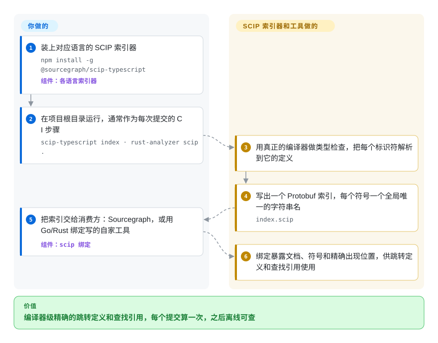

# SCIP

文本搜索和 tree-sitter 图都是在猜：`grep handleRequest` 会同时返回定义、三个同名但无关的方法和一行注释，没有任何东西告诉你哪次调用真正指向哪里。SCIP 是一种文件格式加配套工具，用来存放*编译器级精确*的代码索引——每种语言的索引器先对代码做类型检查，再为每个标识符记下它到底指向哪个定义，于是工具能精确回答“跳到定义”“查找引用”，甚至跨仓库。

## 何时使用

你在做开发者工具——代码搜索服务、代码评审机器人、内部的“谁调用了它”看板，或者给编码 agent 喂上下文的检索层——需要为一个大型多语言代码库提供精确的交叉引用。每次请求为每种语言起一个语言服务器又慢又有状态；tree-sitter 图虽然快，但凡是需要类型信息的地方（重载、接口分派、重新导出）都会漏，于是你的工具有时会说某个函数没有调用方，实际却有二十个。你希望每个提交在 CI 里索引一次，之后离线查询结果。

SCIP 正是为此而生的交换格式：每种语言跑对应的 SCIP 索引器（`scip-typescript index`、`scip-python index`、`scip-java`、`rust-analyzer scip`、`scip-clang`……），每个项目得到一个 `index.scip` Protobuf 文件，再用 Go/Rust 绑定、`scip` 命令行或 Sourcegraph 这类消费方读取。引用的正确性比零配置更重要时，选它而不是基于 tree-sitter 的图工具；选它而不是 LSIF，因为 SCIP 是 LSIF 的继任者（Sourcegraph 已移除 LSIF 支持），符号 ID 是人能读的字符串，编码也更小；想要一个轻量文件格式、主流语言都有人维护的索引器，而不是一整套索引平台时，选它而不是 Kythe 或 Glean。

## 怎么用起来

一个 SCIP 索引就是一个 Protobuf 文件（Protobuf 是 Google 的紧凑二进制序列化格式），描述项目里的文档、其中定义的符号，以及每个符号每次出现的精确源码位置。每个符号都有一个全局唯一、人能读懂的字符串名——包管理器、包名、版本、描述路径——所以一个仓库里的引用不需要共享数据库，就能对上另一个仓库里的定义。重活由各语言的**索引器**完成，它们是独立项目，复用该语言真正的编译器或类型检查器；本仓库提供的是格式定义（`scip.proto`）、Go 和 Rust 绑定（外加自动生成的 TypeScript、Haskell、Java、Kotlin、.NET 绑定），以及 `scip` 命令行，用来检查、打印、快照测试、统计索引，并能实验性地把索引转成 SQLite。选哪些索引器、在哪跑（通常在 CI 里）、文件存哪、用什么消费方回答查询，都由你决定；SCIP 本身从不运行任何服务。

<!-- flow-steps:begin (generated from flows/scip.json by tools/flow_card.py — do not edit) -->

流程文字版

1. **你**：装上对应语言的 SCIP 索引器 — `npm install -g @sourcegraph/scip-typescript` — 组件：`各语言索引器`
2. **你**：在项目根目录运行，通常作为每次提交的 CI 步骤 — `scip-typescript index · rust-analyzer scip .`
3. **SCIP**：用真正的编译器做类型检查，把每个标识符解析到它的定义
4. **SCIP**：写出一个 Protobuf 索引，每个符号一个全局唯一的字符串名 — `index.scip`
5. **你**：把索引交给消费方：Sourcegraph，或用 Go/Rust 绑定写的自家工具 — 组件：`scip 绑定`
6. **SCIP**：绑定暴露文档、符号和精确出现位置，供跳转定义和查找引用使用

**价值**：编译器级精确的跳转定义和查找引用，每个提交算一次，之后离线可查

<!-- flow-steps:end -->

## 何时不用

- **你要的是开箱即用的代码搜索或导航，而不是一个格式。** SCIP 只给你索引文件，还得有东西来响应查询。想让 agent 今天就能问结构性问题，改用 [code-review-graph](code-review-graph.zh.md) 或 [graphify](graphify.zh.md)（精度更低，但现成就是 MCP 工具），或托管的 Sourcegraph（非仓库）。
- **你的语言没有在维护的 SCIP 索引器。** 覆盖面完全取决于独立的索引器项目（上游列出的有 Java/Scala/Kotlin、TypeScript/JavaScript、Python、Rust、C/C++、Ruby、C#/VB、Dart、PHP）。其他语言改用基于 tree-sitter 的图或实时语言服务器。
- **代码必须在不构建的情况下被索引。** 索引器需要项目能通过类型检查（依赖已安装、`tsconfig` 或构建文件能解析）；坏掉或残缺的检出只会产出残缺的索引。[code-review-graph](code-review-graph.zh.md) 这类 tree-sitter 工具在构建不了的代码上也能用。
- **你要在编辑器里边打字边得到答案。** SCIP 索引是按提交生成的快照。交互式编辑请直接用语言服务器（LSP）。
- **你需要语义或自然语言检索。** SCIP 懂符号和引用，不懂含义；要回答“我们在哪里处理重试”，请把它和 [FAISS](../vector-search/faiss.zh.md) 这类向量索引配合使用，而不是指望它单独做到。
- **你要求一个厂商中立的标准组织。** 治理机构是核心指导委员会，由 Sourcegraph 出资赞助并可随时任命成员；如果中立是硬约束，可选 Kythe（Google）或 Glean（Meta），但它们同样各有单一赞助方的问题。

## 横向对比

| 替代品 | 是否收录 | 我们的评价 | 取舍 |
|---|---|---|---|
| LSIF | 未收录 | 不要再基于 LSIF 开新工作；选它的继任者 SCIP，因为 LSIF 的主要消费方 Sourcegraph 已经移除了 LSIF 支持。 | LSIF 是与 LSP 请求紧密绑定的图状 JSON 格式；SCIP 用字符串符号 ID 和 Protobuf，文件更小，索引器也更容易调试。 |
| Kythe | 未收录 | 已经在用 Bazel、想要 Google 那套完整交叉引用图流水线时选 Kythe；想要不依赖构建系统集成就能跑的各语言索引器时选 SCIP。 | Kythe 建模的语义关系更丰富，但需要它的提取和服务流水线；SCIP 只是每个项目一个文件，工具更简单。 |
| Glean | 未收录 | 需要超大规模、带自有查询语言的可查询事实库时选 Glean；需要一个可移植、轻量工具就能消费的文件格式时选 SCIP。 | Glean 是一整套要运维的存储和查询系统；SCIP 把存储和查询都留给你。 |
| [code-review-graph](code-review-graph.zh.md) | ✅ | 想要几分钟就能装好、面向 agent 的影响面工具，选 code-review-graph；要在大型多语言代码库上得到编译器级精确的引用，选 SCIP 索引。 | tree-sitter 解析在任何检出上都能跑、不用构建，但会漏掉需要类型解析的调用；SCIP 每种语言都要能构建，换来精确引用。 |
| [Sourcegraph](sourcegraph.zh.md) | ✅ | 已归档的 Sourcegraph 公开快照只当作“SCIP 如何被消费”的参考；自己做消费方时直接用 SCIP。 | Sourcegraph 是 SCIP 的主要消费方和赞助方，但它现在的产品是闭源的，已收录的公开仓库已归档；SCIP 本身仍是 Apache-2.0。 |

## 技术栈

- **格式定义：** Protocol Buffers（`scip.proto`），用 `buf` 管理。
- **命令行与核心绑定：** Go（截至 2026-09-03 为 `scip` CLI v0.10.0）和 Rust（crates.io 上的 `scip` crate）；另有自动生成的 TypeScript、Haskell、Java、Kotlin、.NET 绑定。
- **索引器（独立仓库）：** scip-java、scip-typescript、scip-python、scip-clang、scip-ruby、scip-dotnet（大多在 `sourcegraph/` 下），rust-analyzer 内置的 `scip` 子命令，以及社区维护的 Dart、PHP 索引器。
- **构建与开发：** Go modules、Nix flake。

## 依赖

- **生成索引：** 每种语言的索引器，加上该语言的工具链和已安装的项目依赖（例如 scip-typescript 需要 Node 22/24 和 `npm install`）。
- **消费索引：** Go 或 Rust 绑定，其他语言用任意 Protobuf 工具链生成代码，或者 GitHub release 里的 `scip` 命令行二进制（也可 `go build ./cmd/scip`）。
- **没有运行时服务：** SCIP 没有服务器或数据库；存储和查询服务属于你构建或部署的消费方。

## 运维难度

**整体中等，SCIP 本身很低。** 命令行和绑定就是一个二进制或一个库。真正的成本在索引流水线：每种语言接一个索引器进 CI，保证每个项目都能构建以便索引器做类型检查，各索引器的版本要分别跟踪，每个提交存一份索引，还要构建或运行负责响应查询的消费方。给大型单体仓库建索引，耗时可能和一次完整类型检查差不多。

## 健康度与可持续性

- **维护（2026-10-08）：活跃。** 定期发版（3 月的 v0.7.0 到 2026-09-03 的 v0.10.0），一天内有提交，Sourcegraph 维护的主要索引器本周也都有推送。
- **治理：集中，但已成文。** 仓库从 `sourcegraph/scip` 迁到了 `scip-code` 组织（2026-01 创建），并发布了治理模型：核心指导委员会由 Sourcegraph 出资赞助，Sourcegraph 可随时任命成员。近期提交集中在少数几位维护者手里（雷达：第一贡献者占 91.2%），bus factor 低。
- **年龄 / Lindy：中等。** 2022 年 5 月创建（约 4.4 年），已取代 LSIF 成为 Sourcegraph 的格式；作为协议还算年轻，但一直持续维护。
- **采用：经由 Rust 很高。** crates.io 近一个月下载量 2,663,285 次，139 个依赖仓库，主要因为 rust-analyzer 会输出 SCIP；除 Sourcegraph 和 rust-analyzer 之外，独立消费方不多。
- **风险信号：** Apache-2.0，没有改协议。生态依赖 Sourcegraph 维护的索引器和赞助；Sourcegraph 自家产品已迁到私有单体仓库（公开快照已归档）。

## 存疑（未验证）

- [推断] 项目网站没有说明仓库为何迁到 `scip-code` 组织；本页只记录迁移事实和治理文档，不推测原因。
- [推断] crates.io 下载量很大，归因于 rust-analyzer 依赖 `scip` crate；未核对下载量构成。
- [未验证] 社区索引器（scip-dart、scip-php、debian-lsp）的质量和维护状况未逐个核查。
- [未验证] 关于 Kythe 和 Glean 的对比说法（与 Bazel 的耦合、运维负担）出自对这些项目的一般了解，本次未重新阅读。
