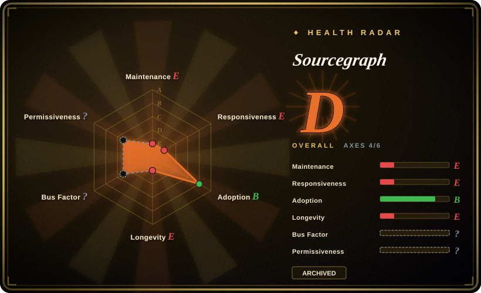
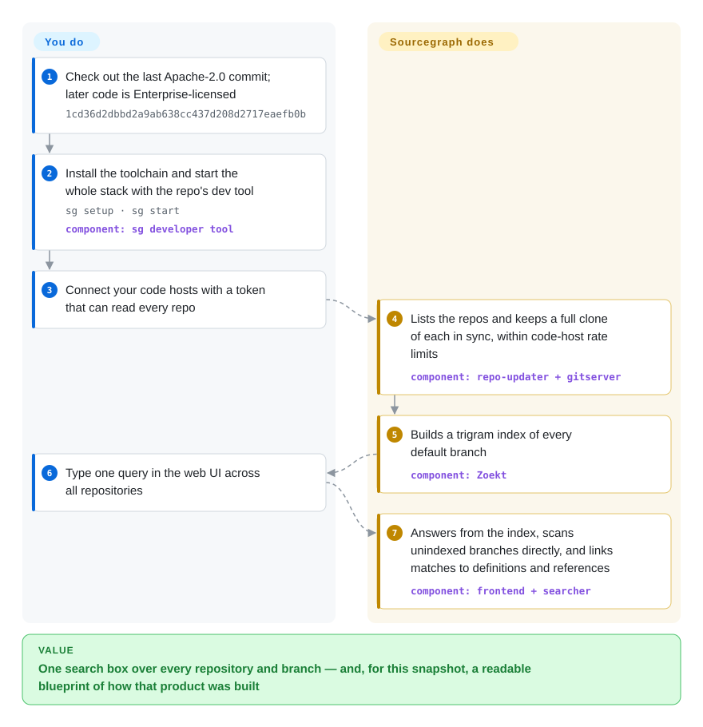

# Sourcegraph

Your engineers cannot answer "who still calls this function?" across a few hundred repositories, because the code host searches one repo at a time, skips branches, and chokes on regex. Sourcegraph cloned every repository into one server and indexed it so a single query searched all of them — but this repository is the **archived public snapshot** of that product, mostly under a non-open-source license, so read it as a reference design, not something to deploy.

## When to use

You're a platform or developer-tools engineer about to build — or choose — code search for a company with hundreds of repositories, or a retrieval backend that lets an agent look things up across all of them. Before committing to a design you want to see how a system that ran at that scale actually split the problem: how it kept clones in sync without tripping code-host rate limits, why it indexed only default branches, what it did for a query on a branch nobody indexed, and how "go to definition" differed between regex guesses and compiler-grade indexes. Sourcegraph's public snapshot is the one place where all of that sits in a single readable tree, with its own architecture docs (`doc/dev/background-information/architecture/`) explaining the trade-offs.

So you clone it to *read* it — or, if you need a code-search server you can legally modify and run, you fork the last Apache-2.0 commit (`1cd36d2`, 2023-06-13) and accept that you now own a frozen 2023 monorepo. Pick it over Zoekt or Hound when the question is "how does the whole product fit together", not "which engine should I run": those are maintained and runnable, but they show you only the search engine, not repo syncing, permissions, precise code navigation, batch changes and the web app around it.

## How it works

Sourcegraph is a set of cooperating services rather than one program. **It does the heavy lifting for you**: `repo-updater` lists the repositories on each code host you connect and keeps `gitserver` — a sharded store of full git clones — up to date while respecting rate limits; **Zoekt** builds a *trigram index* (a lookup of every three-character sequence, so a query only opens files that can match) of each repository's default branch; for anything not indexed, such as other branches, `searcher` scans the files directly. Search results double as "search-based code navigation" — regex guesses at definitions and references — and repositories that upload **SCIP** indexes (compiler-generated symbol data, see [SCIP](scip.md)) get precise navigation instead. **Your part** is to deploy the stack (PostgreSQL, Redis and the Go services), connect code hosts, and type queries in the web UI or the `src` CLI. With the snapshot, "deploy" means building it yourself: the repo's own quickstart uses the `sg` developer tool, and the binaries you would produce are frozen at whatever commit you check out.

<!-- flow-steps:begin (generated from flows/sourcegraph.json by tools/flow_card.py — do not edit) -->

Text version of the flow

1. **You**: Check out the last Apache-2.0 commit; later code is Enterprise-licensed — `1cd36d2dbbd2a9ab638cc437d208d2717eaefb0b`
2. **You**: Install the toolchain and start the whole stack with the repo's dev tool — `sg setup · sg start` — component: `sg developer tool`
3. **You**: Connect your code hosts with a token that can read every repo
4. **Sourcegraph**: Lists the repos and keeps a full clone of each in sync, within code-host rate limits — component: `repo-updater + gitserver`
5. **Sourcegraph**: Builds a trigram index of every default branch — component: `Zoekt`
6. **You**: Type one query in the web UI across all repositories
7. **Sourcegraph**: Answers from the index, scans unindexed branches directly, and links matches to definitions and references — component: `frontend + searcher`

**Value**: One search box over every repository and branch — and, for this snapshot, a readable blueprint of how that product was built

<!-- flow-steps:end -->

## When NOT to use

- **You just want self-hosted code search running this week.** Run **Zoekt** (not indexed; Apache-2.0, maintained, the very engine Sourcegraph used for indexed search), **Hound** (not indexed; MIT, simpler) or **OpenGrok** (not indexed) instead — each is a live project you can upgrade, not a frozen snapshot you must build from a monorepo.
- **You need an open-source license for production use.** Everything after commit `1cd36d2` (2023-06-13) is under the **Sourcegraph Enterprise License**: production use requires a paid subscription, and even your own patches remain usable only with one. Only that last Apache-2.0 commit is safely forkable — and it is more than three years behind.
- **You want a supported Sourcegraph.** The current product lives in a private monorepo and is sold as Sourcegraph Cloud or self-hosted Enterprise (not a repo); its own docs mark self-hosted deployment as "Supported on Enterprise plans". Buy it, rather than resurrecting this snapshot.
- **You need security fixes.** The repository is archived and read-only; nothing has been fixed here since 2024-08, and a multi-service web app with auth and code-host credentials is exactly the kind of thing that needs them.
- **You only need precise symbol data for your own tool.** Use [SCIP](scip.md) and its per-language indexers directly — they stay Apache-2.0 and maintained.
- **A few repositories on one machine.** [ripgrep](../../dev-utilities/data-tools/ripgrep.md) over local checkouts is enough; an index server only pays off once many people search a large shared corpus all day.
- **You want an agent to ask structural questions about a codebase.** Use [code-review-graph](code-review-graph.md) or [graphify](graphify.md), which expose a code graph as MCP tools, instead of standing up a full Sourcegraph stack.

## Comparison

| Alternative | In index | Our verdict | Tradeoff |
|---|---|---|---|
| Zoekt | not indexed | When you need indexed code search you can run and upgrade today, pick Zoekt; read the Sourcegraph snapshot only to see the product that was built around it. | Apache-2.0 and actively maintained, and it is the engine Sourcegraph itself used — but you get the search engine and a basic web UI, not repo syncing, permissions or code navigation. |
| Sourcebot | not indexed | When you want a maintained, Sourcegraph-like self-hosted app with an AI chat layer, pick Sourcebot over reviving this snapshot, provided its source-available license fits. | Builds on a Zoekt fork (`vendor/zoekt` submodule) and is actively developed, but licensed FSL-1.1-ALv2 (source-available, each release converting to Apache-2.0 later) with an `ee/` directory under a separate license. |
| OpenGrok | not indexed | When you want a long-lived, maintained source browser with cross-references and history, pick OpenGrok; it is a running project rather than a frozen snapshot. | Java web app with its own indexing; mature and Oracle-hosted, but a different, older UI model than Sourcegraph's multi-host search. |
| Hound | not indexed | When a small team wants fast regex search across a modest set of repos with almost no ops, pick Hound. | MIT, tiny and easy to run, but no code navigation, permissions or large-scale sharding — the opposite end of the complexity scale. |
| [SCIP](scip.md) | ✅ | When you are building your own code-intelligence consumer, pick SCIP for precise symbol data; use the Sourcegraph snapshot only as a reference for how SCIP gets consumed. | Apache-2.0 format with maintained indexers, but it is only a file format — you still have to build the query and UI side yourself. |

## Tech stack

- **Backend:** Go (`go.mod` module `github.com/sourcegraph/sourcegraph`, Go 1.22), split into services under `cmd/` — `frontend`, `gitserver`, `repo-updater`, `searcher`, `symbols`, `worker`, `precise-code-intel-worker`, `executor`, `embeddings`, `cody-gateway`, and a single-container `server` bundle.
- **Search:** Zoekt (`sourcegraph/zoekt`) for trigram-indexed search of default branches; `searcher` for unindexed search; a Rust `syntect`-based `syntax-highlighter` service.
- **Data:** PostgreSQL (main database plus separate `codeintel-db` and `codeinsights-db` images), Redis (`redis-cache`, `redis-store`), and a `blobstore` service.
- **Clients:** TypeScript/React web app (`client/web`), browser extensions, VS Code and JetBrains plugins, and the separate `src` CLI.
- **Build and ops:** Bazel (`WORKSPACE`, `BUILD.bazel`), the `sg` developer tool, and a bundled Prometheus/Grafana/Jaeger observability stack.

## Dependencies

- **To run it:** PostgreSQL and Redis, persistent disk for every repository clone (gitserver) plus the Zoekt index, and network access to your code hosts with tokens that can read every repository you want searchable.
- **To build it from the snapshot:** a Go toolchain, Node.js, Rust (for the highlighter), Bazel and the `sg` tool; the quickstart assumes `sg setup` installs these. Whether every external fetch the build makes still resolves for a 2023–2024 snapshot is untested.
- **Optional:** executors (for batch changes and auto-indexing), the observability stack, and — for Cody features — LLM provider access through `cody-gateway`.
- **License:** a production deployment of anything past commit `1cd36d2` needs a Sourcegraph Enterprise subscription.

## Ops difficulty

**High.** Even when it was a maintained product, a self-hosted Sourcegraph meant a dozen-plus services, two databases' worth of state, disk that grows with every repository you clone, and code-host tokens to rotate; the vendor's own docs steer self-hosters to Kubernetes Helm or Docker Compose for that reason. With the snapshot it is worse: nothing built from this repository will ever be published again, so you build everything yourself from a frozen tree, patch dependencies and CVEs alone, and cannot upgrade toward the current product. Budget it as adopting a large codebase, not as installing a tool.

## Health & viability

- **Maintenance (2026-10).** Archived and read-only. The last release tag is v5.6.185 (2024-08-08) and the last commit (2024-08-22) only added the "moved to a private monorepo" notice. No fixes will land here.
- **Governance.** Owned by Sourcegraph Inc., which moved development to a private monorepo in 2024; the public repository exists only as a snapshot, so there is no community governance and no path for outside contributions.
- **Age & Lindy.** The repository dates from 2015-08 and its public history runs to 2024, but age only counts while a project is still active — here the public line has ended, so the long history is a reason to read the code, not to bet on it.
- **Adoption.** Historically wide: around ten thousand stars and many dependent Go modules, and Sourcegraph-originated pieces (Zoekt, SCIP and its indexers) remain in active use — but that adoption belongs to the product and those components, not to this snapshot.
- **Risk flags.** Relicensed from Apache-2.0 to the Sourcegraph Enterprise License in 2023 (production use needs a subscription); archived; a security-sensitive multi-service app with no further patches.

## Caveats (unverified)

- [未验证] Whether the snapshot (or commit `1cd36d2`) still builds today was not tested — `sg setup` fetches tools and dependencies from external URLs that may have moved or vanished since 2024.
- [推断] The relicensing date is taken from the README's note that `1cd36d2` (committed 2023-06-13) is "the last one made under an Apache License"; the exact switch-over commit was not traced.
- [未验证] Some subdirectories carry their own license files (e.g. `client/browser`, `client/vscode`, `client/jetbrains`, `docker-images/syntax-highlighter`); which of them remain permissively licensed after 2023 was not checked file by file.
- [未验证] OpenGrok's and Hound's feature claims in the comparison come from general knowledge of those projects, not a fresh read of their docs; their maintenance status was only checked via the GitHub API on 2026-10-08.
- [推断] The archive date is assumed to be around GitHub's `pushed_at` of 2024-09-02; GitHub does not expose the archive timestamp directly.
