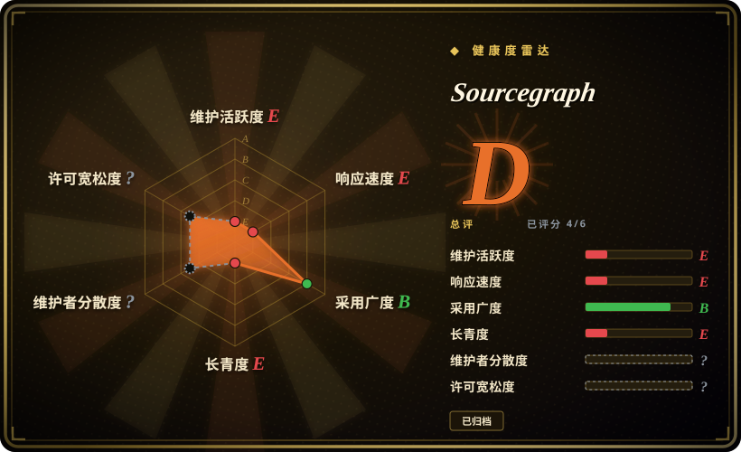
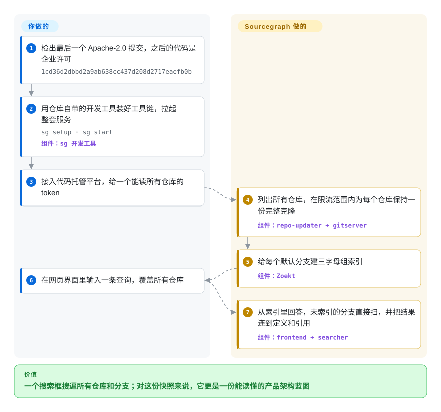

# Sourcegraph

你们有几百个仓库，想知道“这个函数还有谁在调”却查不出来：代码托管平台一次只搜一个仓库、不搜其他分支、正则一复杂就超时。Sourcegraph 的做法是把所有仓库克隆到一台服务器上建好索引，一条查询搜遍全部；但这个仓库只是该产品**已归档的公开快照**，大部分代码不是开源许可，应当当作参考设计来读，而不是拿来部署。

## 何时使用

你是平台或开发者工具工程师，要给一家有几百个仓库的公司自建（或选型）代码搜索，或者要做一个让 agent 跨所有仓库查代码的检索后端。定方案之前，你想看看一个真在这种规模上跑过的系统是怎么拆问题的：怎么让克隆保持同步又不撞上代码平台的限流，为什么只给默认分支建索引，没人建索引的分支来了查询怎么办，“跳到定义”靠正则猜和靠编译器级索引差在哪。Sourcegraph 的公开快照是唯一一个把这些都放在同一棵可读代码树里的地方，还附带它自己的架构文档（`doc/dev/background-information/architecture/`）讲清楚取舍。

所以你克隆它是为了*读*；或者，如果你需要一个可以合法修改和运行的代码搜索服务，就 fork 最后一个 Apache-2.0 提交（`1cd36d2`，2023-06-13），并接受从此由你自己维护一个冻结在 2023 年的大仓库。和 Zoekt、Hound 相比，当你的问题是“整个产品怎么拼起来”而不是“该跑哪个引擎”时选它：那些项目在维护、能直接跑，但只给你看搜索引擎本身，看不到外围的仓库同步、权限、精确代码导航、批量改动和网页应用。

## 怎么用起来

Sourcegraph 不是一个程序，而是一组协作的服务。**重活都是它干的**：`repo-updater` 列出你接入的每个代码平台上的仓库，让 `gitserver`（按分片存放完整 git 克隆的服务）在不超限流的前提下保持最新；**Zoekt** 给每个仓库的默认分支建*三字母组索引*（记下每个连续三字符出现在哪些文件里，查询时只打开可能命中的文件）；没建索引的内容，比如其他分支，由 `searcher` 直接扫文件。搜索结果顺带提供“基于搜索的代码导航”——用正则猜定义和引用；上传了 **SCIP** 索引（编译器生成的符号数据，见 [SCIP](scip.zh.md)）的仓库则得到精确导航。**你要做的**是部署这套栈（PostgreSQL、Redis 和一堆 Go 服务）、接入代码平台，然后在网页界面或 `src` 命令行里查询。对这份快照来说，“部署”就意味着自己构建：仓库自带的上手文档用的是 `sg` 开发工具，而你构建出的程序永远停留在你检出的那个提交。

<!-- flow-steps:begin (generated from flows/sourcegraph.json by tools/flow_card.py — do not edit) -->

流程文字版

1. **你**：检出最后一个 Apache-2.0 提交，之后的代码是企业许可 — `1cd36d2dbbd2a9ab638cc437d208d2717eaefb0b`
2. **你**：用仓库自带的开发工具装好工具链，拉起整套服务 — `sg setup · sg start` — 组件：`sg 开发工具`
3. **你**：接入代码托管平台，给一个能读所有仓库的 token
4. **Sourcegraph**：列出所有仓库，在限流范围内为每个仓库保持一份完整克隆 — 组件：`repo-updater + gitserver`
5. **Sourcegraph**：给每个默认分支建三字母组索引 — 组件：`Zoekt`
6. **你**：在网页界面里输入一条查询，覆盖所有仓库
7. **Sourcegraph**：从索引里回答，未索引的分支直接扫，并把结果连到定义和引用 — 组件：`frontend + searcher`

**价值**：一个搜索框搜遍所有仓库和分支；对这份快照来说，它更是一份能读懂的产品架构蓝图

<!-- flow-steps:end -->

## 何时不用

- **你只想这周就跑起一个自托管代码搜索。** 改用 **Zoekt**（未收录；Apache-2.0，持续维护，正是 Sourcegraph 自己做索引搜索用的引擎）、**Hound**（未收录；MIT，更简单）或 **OpenGrok**（未收录）——它们都是还活着、能升级的项目，不是要你从大仓库里自己构建的冻结快照。
- **你需要能用于生产的开源许可。** `1cd36d2`（2023-06-13）之后的所有代码都适用 **Sourcegraph Enterprise License**：生产使用需要付费订阅，连你自己写的补丁也只能在有订阅时使用。只有最后那个 Apache-2.0 提交可以放心 fork，而它已经落后三年多。
- **你想要有人支持的 Sourcegraph。** 现行产品在私有大仓库里开发，以 Sourcegraph Cloud 或自托管企业版的形式出售（非仓库）；它自己的文档把自托管部署标注为“Supported on Enterprise plans”。该买就买，而不是去复活这份快照。
- **你需要安全修复。** 仓库已归档、只读，2024-08 之后这里不会再有任何修复；而一个带登录和代码平台凭据的多服务网页应用，恰恰最需要修复。
- **你只需要给自己的工具提供精确符号数据。** 直接用 [SCIP](scip.zh.md) 及其各语言索引器——它们仍是 Apache-2.0 且在维护。
- **一台机器上的少数几个仓库。** 对本地检出跑 [ripgrep](../../dev-utilities/data-tools/ripgrep.zh.md) 就够了；只有很多人整天搜同一个大型共享代码库时，索引服务器才划算。
- **你想让 agent 对代码库问结构性问题。** 用 [code-review-graph](code-review-graph.zh.md) 或 [graphify](graphify.zh.md)，它们把代码图谱做成 MCP 工具，而不必拉起一整套 Sourcegraph。

## 横向对比

| 替代品 | 是否收录 | 我们的评价 | 取舍 |
|---|---|---|---|
| Zoekt | 未收录 | 需要今天就能跑、以后能升级的索引式代码搜索时选 Zoekt；Sourcegraph 快照只用来看围绕这个引擎搭出来的整套产品。 | Apache-2.0、持续维护，而且就是 Sourcegraph 自己用的引擎；但你得到的是搜索引擎和一个简单网页界面，没有仓库同步、权限和代码导航。 |
| Sourcebot | 未收录 | 想要一个在维护、形态接近 Sourcegraph、还带 AI 问答的自托管应用时，只要许可能接受，就选 Sourcebot，而不是复活这份快照。 | 基于 Zoekt 的分叉（`vendor/zoekt` 子模块）构建、开发活跃；但许可是 FSL-1.1-ALv2（源码可见，每个版本过一段时间才转为 Apache-2.0），`ee/` 目录另有单独许可。 |
| OpenGrok | 未收录 | 想要一个长寿、在维护、带交叉引用和历史的源码浏览器时选 OpenGrok；它是仍在运转的项目，不是冻结快照。 | Java 网页应用，自带索引；成熟、由 Oracle 托管，但界面模型更老，和 Sourcegraph 的跨平台搜索不是一回事。 |
| Hound | 未收录 | 小团队要在不多的仓库里做快速正则搜索、又几乎不想运维时选 Hound。 | MIT，小巧好跑；但没有代码导航、权限和大规模分片，处在复杂度的另一端。 |
| [SCIP](scip.zh.md) | ✅ | 自己做代码智能的消费端时，选 SCIP 拿精确符号数据；Sourcegraph 快照只当作“SCIP 是怎么被消费的”参考。 | Apache-2.0 格式、索引器在维护；但它只是文件格式，查询和界面都得你自己做。 |

## 技术栈

- **后端：** Go（`go.mod` 模块名 `github.com/sourcegraph/sourcegraph`，Go 1.22），拆成 `cmd/` 下的多个服务——`frontend`、`gitserver`、`repo-updater`、`searcher`、`symbols`、`worker`、`precise-code-intel-worker`、`executor`、`embeddings`、`cody-gateway`，以及单容器打包的 `server`。
- **搜索：** Zoekt（`sourcegraph/zoekt`）对默认分支做三字母组索引搜索；`searcher` 负责未索引搜索；另有基于 Rust `syntect` 的 `syntax-highlighter` 语法高亮服务。
- **数据：** PostgreSQL（主库，外加单独的 `codeintel-db` 和 `codeinsights-db` 镜像）、Redis（`redis-cache`、`redis-store`），以及一个 `blobstore` 服务。
- **客户端：** TypeScript/React 网页应用（`client/web`）、浏览器扩展、VS Code 和 JetBrains 插件，以及独立仓库的 `src` 命令行。
- **构建与运维：** Bazel（`WORKSPACE`、`BUILD.bazel`）、`sg` 开发工具，以及打包好的 Prometheus／Grafana／Jaeger 可观测性组件。

## 依赖

- **运行：** PostgreSQL 和 Redis；持久磁盘，用来放每个仓库的完整克隆（gitserver）和 Zoekt 索引；能访问你的代码平台的网络，以及能读取所有待搜索仓库的 token。
- **从快照构建：** Go 工具链、Node.js、Rust（高亮服务要用）、Bazel 和 `sg` 工具；上手文档假定 `sg setup` 会把这些装好。对一份 2023–2024 年的快照，构建时要拉取的外部资源是否都还在，没有实测。
- **可选：** executor（批量改动和自动建索引要用）、可观测性组件，以及 Cody 功能经 `cody-gateway` 访问的大模型服务。
- **许可：** `1cd36d2` 之后的任何代码，用于生产部署都需要 Sourcegraph 企业订阅。

## 运维难度

**高。** 即使在它还是受维护产品的时候，自托管 Sourcegraph 也意味着十几个服务、两三个数据库的状态、随克隆仓库数量增长的磁盘，以及要定期轮换的代码平台 token；厂商自己的文档也因此把自托管用户引向 Kubernetes Helm 或 Docker Compose。换成快照只会更难：这个仓库再也不会发布任何构建产物，所有东西都得你从冻结的代码树自己构建，依赖和 CVE 也只能自己修，而且没法朝现行产品升级。请按“接手一个大型代码库”来估成本，而不是“装一个工具”。

## 健康度与可持续性

- **维护（2026-10）。** 已归档、只读。最后一个发布标签是 v5.6.185（2024-08-08），最后一次提交（2024-08-22）只是加上“已迁到私有大仓库”的说明。这里不会再有修复。
- **治理。** 归 Sourcegraph Inc. 所有，它在 2024 年把开发迁进私有大仓库；公开仓库只剩一份快照，没有社区治理，外部贡献也无处可提。
- **年龄与 Lindy。** 仓库创建于 2015-08，公开历史一直延续到 2024 年；但年龄只有在项目仍然活跃时才算数——这里公开的那条线已经结束，所以长历史是读代码的理由，不是押注它的理由。
- **采用度。** 历史上很广：约一万颗星、大量依赖它的 Go 模块；源自 Sourcegraph 的组件（Zoekt、SCIP 及其索引器）至今仍在活跃使用——但这些采用属于产品和那些组件，不属于这份快照。
- **风险标记。** 2023 年从 Apache-2.0 改为 Sourcegraph Enterprise License（生产使用需要订阅）；已归档；一个安全敏感的多服务应用，不会再有补丁。

## 存疑（未验证）

- [未验证] 没有实测这份快照（或 `1cd36d2` 提交）今天还能不能构建——`sg setup` 要从外部地址拉工具和依赖，2024 年以来这些地址可能已经变了或没了。
- [推断] 改许可的时间取自 README 里的说明：`1cd36d2`（提交于 2023-06-13）是“最后一个在 Apache 许可下的提交”；具体切换发生在哪个提交没有追查。
- [未验证] 一些子目录带有自己的许可文件（例如 `client/browser`、`client/vscode`、`client/jetbrains`、`docker-images/syntax-highlighter`）；2023 年之后其中哪些仍是宽松许可，没有逐个核对。
- [未验证] 对比表里 OpenGrok 和 Hound 的功能描述来自对这两个项目的一般了解，没有重新读它们的文档；它们的维护状态只在 2026-10-08 通过 GitHub API 查过。
- [推断] 归档时间按 GitHub 的 `pushed_at`（2024-09-02）前后估计；GitHub 不直接提供归档时间戳。
