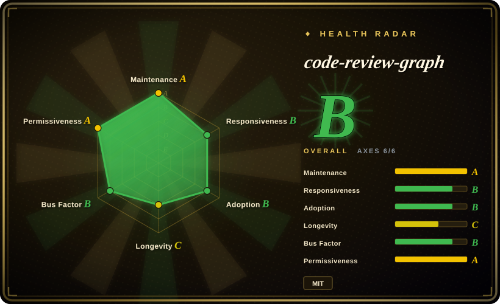
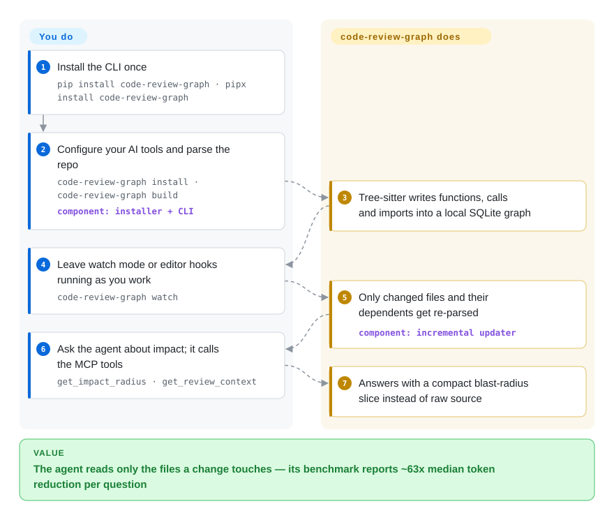

# code-review-graph

Your AI coding assistant re-reads half the repo to answer one review question — 143k tokens on Flask's corpus — and still misses a caller two hops away. code-review-graph parses the codebase into a local structural graph once with Tree-sitter (the incremental parser that maps files to functions, classes, and call edges), keeps it fresh on save, and serves the agent only the files a change actually touches over MCP.

## When to use

You're a developer pairing with an AI coding assistant (Claude Code, Cursor, Codex, Gemini CLI, Copilot, OpenCode — the installer auto-detects 16 platforms) on a medium-to-large repo, and you keep watching it burn context re-reading files just to answer "what does this change affect?". Every review task balloons the token bill and the agent still misses an indirect caller. You install code-review-graph (`pip install code-review-graph`, then `code-review-graph install` and `build` — a cold build of a ~3,000-file repo measured at ~40 s), and from then on the agent calls MCP tools like `get_impact_radius` and `get_review_context`: the graph traces callers, dependents, and tests of a changed file and hands back a compact structural slice instead of raw source. On the 6 repos in its own benchmark it reports a median ~63x per-question token reduction (358x max on fastapi), and a two-file edit on a ~3,000-file project re-indexes in about 2.5 s via hooks/watch.

It's also a fit when you want risk-scored PR review *in CI without sending code anywhere*: the same analysis runs as a composite GitHub Action that builds and queries the graph entirely on your runner, posts a sticky comment with risk-scored functions and test gaps, and can gate merges via `fail-on-risk`. If you live in a monorepo and want a background daemon (`crg-daemon`) keeping multiple repos' graphs fresh, that ships in-box too.

## How it works

The tool *and* the serving layer ship with it — you only install once and keep coding. `build` walks every source file with Tree-sitter and records nodes (functions, classes, imports, tests) and edges (calls, inheritance, imports) into a local SQLite file under `.code-review-graph/`; optional post-processing adds framework-aware edges and community clustering. Hooks, a git pre-commit hook, watch mode, or `crg-daemon` then diff changed files and re-parse only what's stale, following the graph's import/call edges to find dependents. Your AI tool talks to the resident MCP server (~30 tools, 5 workflow prompt templates), and "what breaks if I change X" becomes one `get_impact_radius` call returning a few thousand tokens instead of a grep storm. What stays yours: whether the agent actually consults the graph (it's instructed to via the platform's rules file, but a lazy agent can still grep), the conservative false positives of impact analysis, and any trust you place in the project's self-reported benchmarks.

<!-- flow-steps:begin (generated from flows/code-review-graph.json by tools/flow_card.py — do not edit) -->

Text version of the flow

1. **You**: Install the CLI once — `pip install code-review-graph · pipx install code-review-graph`
2. **You**: Configure your AI tools and parse the repo — `code-review-graph install · code-review-graph build` — component: `installer + CLI`
3. **code-review-graph**: Tree-sitter writes functions, calls and imports into a local SQLite graph
4. **You**: Leave watch mode or editor hooks running as you work — `code-review-graph watch`
5. **code-review-graph**: Only changed files and their dependents get re-parsed — component: `incremental updater`
6. **You**: Ask the agent about impact; it calls the MCP tools — `get_impact_radius · get_review_context`
7. **code-review-graph**: Answers with a compact blast-radius slice instead of raw source

**Value**: The agent reads only the files a change touches — its benchmark reports ~63x median token reduction per question

<!-- flow-steps:end -->

## When NOT to use

- **You want a general-purpose graph database, not a code-context layer.** This is a fixed code-intelligence pipeline (AST → SQLite → blast-radius), not a queryable graph store you build apps on. For an actual property/Cypher graph DB use [FalkorDB](falkordb.md).
- **Trivial / single-file changes.** The maintainer's own limitations note that graph context can *exceed* a naive file read for small edits — the structural metadata is overhead you don't recoup until changes span multiple files.
- **You need trustworthy recall numbers today.** The "recall 1.0" figure is explicitly **circular** — ground truth is derived from the same graph the predictor walks — and the honest headline is now 0.69 average impact F1. The co-change mode (graded against git history instead of the graph) returned `predicted_files = 0` on every graded commit in the 2026-08-02 capture, so it is not yet a usable measurement. [推断] Treat impact accuracy as directional, not a guarantee.
- **Cross-file call resolution beyond Python/PHP.** Entry-point/flow detection is documented as strongest for Python and PHP/Laravel, with JavaScript and Go flow detection and keyword-search ranking stated as needing work (the earlier release's specific "~33% recall / MRR 0.35" figures are no longer published).
- **Bus-factor / maturity risk.** It is a single-maintainer ("Tirth"), Beta-classified project at v2.3.9 on a personal repo (first commit 2026-02), and the default branch is currently `staging`. A website and Discord now exist, but there is still no team or foundation behind the roadmap; pinning the GitHub Action to a tag is a mitigation, and lock-in to its `.code-review-graph/` SQLite format and MCP tool surface is real.
- **You need pure document/passage RAG over prose.** This indexes code structure, not arbitrary documents — for hierarchical document retrieval see [PageIndex](pageindex.md).

## Comparison

| Alternative | In index | Our verdict | Tradeoff |
|---|---|---|---|
| [FalkorDB](falkordb.md) | ✅ | Choose FalkorDB when you need a real Redis-based property graph DB with Cypher and vector search. | A real Redis-based property graph DB with Cypher + vector search you query directly; a *substrate*, not a turnkey code-context tool. code-review-graph gives you the whole AST→graph→MCP pipeline out of the box but on its own fixed SQLite store. |
| [graphify](graphify.md) | ✅ | Choose graphify when you need another codebase-to-graph tool for agent retrieval. | Also turns a codebase into a graph for agent retrieval; overlapping intent. code-review-graph leans hard into blast-radius/review + an MCP server, broad language coverage, and a CI Action. Compare scope/maturity directly. |
| [PageIndex](pageindex.md) | ✅ | Choose PageIndex when you need reasoning-based hierarchical retrieval over documents. | Reasoning-based hierarchical retrieval over *documents* (PDFs, long text), no vector DB; different input domain — prose, not source ASTs. |
| [Sourcegraph](sourcegraph.md) / [SCIP](scip.md) | ✅ | Choose Sourcegraph or SCIP when you need mature multi-repo code intelligence at scale. | Mature, multi-repo code intelligence and indexing at scale; heavier infra, not a local single-binary MCP context-reducer aimed at agent token budgets. |
| Serena (MCP) | 未收录 | Choose Serena when you need an LSP-backed semantic code MCP server for agents. | LSP-backed semantic code MCP server for agents; symbol/LSP-driven rather than a persisted Tree-sitter graph with blast-radius + community/risk analysis. |
| GraphRAG (Microsoft) | 未收录 | Choose GraphRAG when you need an LLM-built entity/community graph for document RAG. | LLM-built entity/community graph for document RAG; aimed at unstructured corpora, not deterministic AST-derived code graphs. |

## Tech stack

- **Language:** Python (≥ 3.10, classifiers through 3.13).
- **Parsing:** Tree-sitter via `tree-sitter` + `tree-sitter-language-pack`; broad language coverage (Python, JS/TS/TSX, Go, Rust, Java/Spring, C/C++, C#, Ruby, Kotlin, Swift, PHP/Laravel, Scala, Solidity, Dart, Erlang via config, and more) plus Jupyter/Databricks `.ipynb`. Custom languages addable via `.code-review-graph/languages.toml`, no fork.
- **Graph/storage:** local SQLite in `.code-review-graph/` with FTS5 full-text search; `networkx` for graph algorithms; community detection via Leiden (optional `igraph`).
- **Serving:** MCP server (`mcp` + `fastmcp`) exposing 30 tools and 5 prompt templates (review, architecture, debug, onboard, pre-merge); CLI (`code-review-graph`) and daemon (`crg-daemon`).
- **Optional:** vector embeddings via sentence-transformers / Google Gemini / any OpenAI-compatible endpoint; Jedi-based Python call enrichment; D3.js interactive visualization; export to GraphML / Neo4j Cypher / Obsidian / SVG.
- **CI:** composite GitHub Action for risk-scored PR comments. Project site at code-review-graph.com.

## Dependencies

- **Runtime:** Python ≥ 3.10. Install via `pip install code-review-graph` (or `pipx`/`uvx`).
- **Required Python deps (v2.3.9):** `mcp` ≥ 1.0 (< 3), `fastmcp` ≥ 3.2.4 (< 4), `anyio` ≥ 4 (< 5), `tree-sitter` ≥ 0.23 (< 1), `tree-sitter-language-pack` ≥ 0.3 (< 1), `pyyaml` ≥ 6 (< 7), `networkx` ≥ 3.2 (< 4), `watchdog` ≥ 4 (< 7) (and `tomli` on Python < 3.11).
- **Core storage:** local SQLite file — **no external database or cloud service required** for the core graph.
- **Optional groups:** `[embeddings]` (sentence-transformers, numpy), `[google-embeddings]` (google-genai), `[communities]` (igraph), `[enrichment]` (jedi), `[eval]` (matplotlib), `[wiki]` (ollama), or `[all]`.
- **External services are opt-in only:** cloud embeddings require explicit egress acknowledgement; the CI Action runs entirely on your own runner with no source sent out.

## Ops difficulty

**Low.** Single `pip`/`pipx`/`uvx` install plus one `install` command that auto-detects supported AI tools and writes their MCP config; `build` once, then hooks/watch/daemon keep it fresh. No database to run, no cloud account, state lives in a local SQLite file. It climbs to **low-to-medium** when you opt into semantic embeddings (model downloads, optional cloud egress and API keys), run the multi-repo daemon, or wire the GitHub Action with `fail-on-risk` as a merge gate. The optional dependency matrix (embeddings/communities/enrichment) is the main place version friction can surface.

## Health & viability

- **Responsiveness**: Grade B — median first-response time ~376 hours across 31 qualifying issues/PRs.
- **Maintenance (2026-09):** last push 2026-09-18, latest release v2.3.9 the same day — **active**, though the ~1-month gap from v2.3.6 (June) to the September line is slower than the spring cadence. [推断] For a project this young, cadence cuts both ways: an evolving API/format surface.
- **Governance / bus factor:** **single-maintainer, `User`-owned** (`tirth8205/code-review-graph`), Beta-classified, author "Tirth" per packaging metadata. A project website (code-review-graph.com) and Discord appeared since the last check — signs of investing, but there is still no team or foundation behind the roadmap. This remains a real **bus-factor flag**: ~32k stars on a personal repo is hype far outrunning institutional backing. [推断]
- **Age & Lindy (created 2026-02, ~0.6yr):** **young and hyped — fails the Lindy prior.** No track record, no proven multi-year survival; the star count says attention, not durability. Treat continuity as unproven and pin the GitHub Action to a tag. [推断]
- **Adoption / ecosystem:** broad language coverage, 16 auto-detected editor platforms, and an MCP + CI surface drive adoption signals (PyPI downloads are high; GitHub dependents remain ~0). Self-reported benchmarks (the ~63x/358x figures, 0.69 F1) are unpublished-for-co-change and not independently reproduced here. [未验证]
- **Risk flags:** MIT (no relicense risk); the dominant risks are **abandonment / bus-factor** (single maintainer, <1yr old, default branch currently `staging`) and format lock-in, not licensing. [推断]

## Caveats (unverified)

- [未验证] Latest release v2.3.9 published 2026-09-18; repo created 2026-02-26; pushed 2026-09-18 (per `gh` metadata 2026-09-28). The default branch moved from `main` to `staging` at some point since June — why (release flow?) is unexplained in the README.
- [未验证] Star count ~31.8k (per `gh` 2026-09-28) — GitHub stars are unreliable and date-sensitive; treat as indicative only.
- [未验证] All token-reduction figures (~63x median, 358x max, ~40 s cold build of ~3,000 files, ~2.5 s incremental) are the project's own benchmark numbers on 6 self-selected repos, with a docs/REPRODUCING.md guide but no independent reproduction here.
- [推断] Impact "recall 1.0" is self-described as circular (graph-derived ground truth); the honest co-change mode returned 0 predictions in the latest published capture, so real-world impact precision/recall is unknown.
- [未验证] Stated language coverage, 30 MCP tools, and the 16 supported editor platforms come from the README; the exact working set may shift release-to-release.
- [未验证] License is MIT per both `gh licenseInfo` and `pyproject.toml`; single-maintainer ("Tirth"), Beta development status per packaging classifiers.
