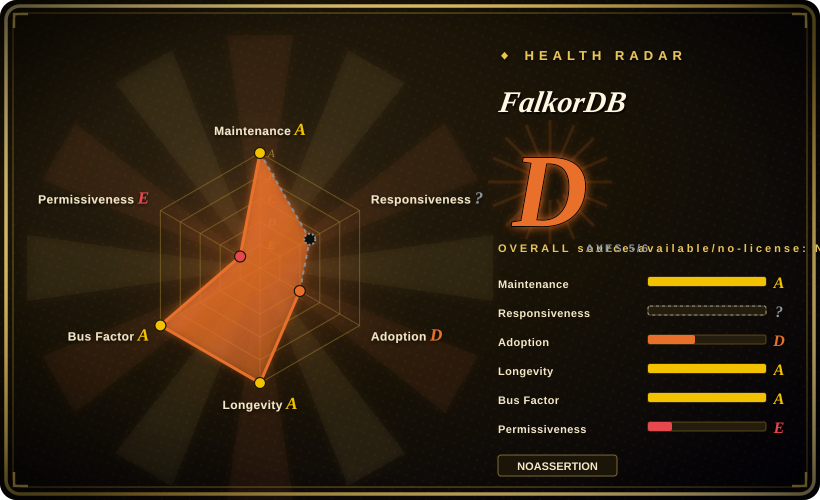
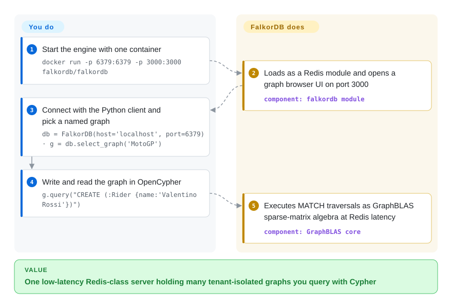

# FalkorDB

Your GraphRAG app needs vector similarity *and* multi-hop traversal over the same facts, but a graph service next to your cache means two servers and copied data. FalkorDB is a property-graph database that loads as a Redis module, speaks OpenCypher, and keeps vector and full-text indexes inside one memory-fast engine.

## When to use

You're building a GraphRAG pipeline: you've extracted entities and relationships from a corpus into a knowledge graph, and at query time you want to combine vector similarity ("find chunks near this question") with multi-hop graph traversal ("now walk from those entities to related facts and cite the path"). A pure vector store can't do the traversal, and a general-purpose graph database means standing up a separate, heavier service alongside your existing cache. FalkorDB resolves this by living inside Redis as a module: you load it, write OpenCypher to create graphs and vector / full-text / range indexes (documented at docs.falkordb.com), and run hybrid retrieval from one low-latency engine. Its GraphBLAS sparse-matrix core makes the linear-algebra-style traversals fast, and you can keep many named graphs on one server (`GRAPH.QUERY mygraph ...`) for per-tenant or per-document isolation — the README leads with "Ultra-fast, Multi-tenant Graph Database".

You're also a good fit if you came from RedisGraph and need somewhere to land after Redis discontinued that module (end-of-life 2025-01-31 per FalkorDB's own docs) — FalkorDB picks up the OpenCypher-on-Redis model and ships a documented migration path, plus an official Python GraphRAG-SDK (a separate Apache-2.0 repo, ~1k stars, still active in 2026-09) that wires LLM-driven graph construction and retrieval on top, so you don't have to hand-build the ingestion loop.

## How it works

You point clients at one Redis-protocol port; everything else is Cypher. The engine loads into Redis as the `falkordb` module and stores each graph as a set of **GraphBLAS sparse adjacency matrices** — nodes and edges become non-zero entries, so "find everything two hops from this entity" runs as matrix multiplication over linear algebra instead of pointer-chasing (the "queryable sparse-matrix graph database" claim). Named graphs partition one server per tenant or document; `GRAPH.QUERY` (or a client SDK) takes OpenCypher and returns tabular results. Vector and full-text indexes ride alongside the graph so a single query can mix vector ANN lookups, text match, and traversal. Since mid-2026 the default branch is a **Rust implementation** of this module (the long-standing C engine is maintained on the `master` branch), and the published Docker images now bundle it. What stays yours: entity extraction into the graph (or the GraphRAG-SDK + an LLM doing it), Redis-class memory sizing and RDB/AOF persistence, and choosing which engine build your deployment pins.

<!-- flow-steps:begin (generated from flows/falkordb.json by tools/flow_card.py — do not edit) -->

Text version of the flow

1. **You**: Start the engine with one container — `docker run -p 6379:6379 -p 3000:3000 falkordb/falkordb`
2. **FalkorDB**: Loads as a Redis module and opens a graph browser UI on port 3000 — component: `falkordb module`
3. **You**: Connect with the Python client and pick a named graph — `db = FalkorDB(host='localhost', port=6379) · g = db.select_graph('MotoGP')`
4. **You**: Write and read the graph in OpenCypher — `g.query("CREATE (:Rider {name:'Valentino Rossi'})")`
5. **FalkorDB**: Executes MATCH traversals as GraphBLAS sparse-matrix algebra at Redis latency — component: `GraphBLAS core`

**Value**: One low-latency Redis-class server holding many tenant-isolated graphs you query with Cypher

<!-- flow-steps:end -->

## When NOT to use

- **You need a copyleft-free / permissively-licensed core.** FalkorDB's server is **SSPL-1.0** (per the LICENSE and README; GitHub's license detector reports NOASSERTION) — not OSI-approved, and its "offer the software as a service" clause is hostile to building a managed service around it. If your org bans SSPL/AGPL-class licenses, this is a hard stop. (The GraphRAG-SDK client is Apache-2.0, but the database itself is SSPL.)
- **You need a settled engine binary right now.** The repository is in a **C → Rust transition**: the default branch `main` is the Rust implementation ("This repository is the Rust implementation of FalkorDB"), the C engine lives on `master` and is still patched, and the published Docker `:latest` only moved to the Rust image in 2026-09 per release CI commits. Parity fixes are still landing on both branches, so pin an explicit version tag rather than `:latest` if behavior reproducibility matters. [推断]
- **You want a horizontally-sharded graph across many machines.** It runs as a Redis module; scale-out is Redis-style (replication, multi-graph-per-node), not automatic graph sharding. Very large single graphs are bounded by one node's RAM. [推断]
- **Your data doesn't fit in memory.** Like Redis, the working set is memory-resident with RDB/AOF persistence; it is not a disk-first OLAP graph engine for petabyte stores. [推断]
- **You only need vector search.** If there's no graph/traversal value — just nearest-neighbor over embeddings — a dedicated vector store (or pgvector) is simpler and avoids a graph engine you'll underuse.
- **You want the de-facto-standard graph ecosystem.** Neo4j has far larger tooling, Bolt drivers, GDS algorithms, and hiring pool; FalkorDB is younger and OpenCypher-compatible but not a drop-in for Neo4j-specific features.
- **You can't tolerate Redis-module operational coupling.** You inherit a Redis 8.x host (the current images pin Redis 8.10.2), module loading, and a heavier source build than before: GraphBLAS + LAGraph + RediSearch must be built first, with a clang-22/libomp toolchain.

## Comparison

| Alternative | In index | Our verdict | Tradeoff |
|---|---|---|---|
| [graphify](graphify.md) | ✅ | Pick graphify when you need lightweight code/document graph construction, not the graph database itself. | Lightweight code/document-to-graph builder; FalkorDB is the storage+query engine, graphify is upstream graph construction — complementary, not a substitute. |
| [code-review-graph](code-review-graph.md) | ✅ | Pick code-review-graph when you need a domain-specific PR/code-review graph tool. | Domain-specific (code-review) graph tool; FalkorDB is a general graph DB you'd build such a tool on. |
| [PageIndex](pageindex.md) | ✅ | Pick PageIndex when the retrieval primitive is a reasoning document tree rather than a property graph database. | Reasoning-based document tree / retrieval index, not a graph database — different retrieval primitive (hierarchical index vs. property graph). |
| Neo4j | 未收录 | Pick Neo4j when the largest property-graph ecosystem matters more than Redis embedding or sparse-matrix speed. | Industry-standard property graph with the largest ecosystem (Bolt, GDS, APOC); heavier, GPLv3/commercial. FalkorDB is faster on sparse-matrix traversals and Redis-embedded but younger and SSPL. |
| Memgraph | 未收录 | Pick Memgraph when you want an in-memory Cypher graph DB without the Redis-module operating model. | In-memory, Cypher-compatible, streaming-focused graph DB; BSL-licensed. Overlaps FalkorDB's in-memory niche without the Redis-module model. |
| Neptune (AWS) | 未收录 | Pick Neptune when you want a managed AWS graph service and accept cloud lock-in over self-hosting. | Managed, multi-model (Gremlin/openCypher/SPARQL) graph service; no self-host, AWS lock-in. FalkorDB is self-hostable OSS-adjacent. |

## Tech stack

- **Language:** Rust (current default branch `main` — "This repository is the Rust implementation of FalkorDB"), building the `falkordb` Redis module (`libfalkordb.{so,dylib}`); the legacy C engine is maintained on `master`. GitHub's language stats: Rust ~4.9 MB, C ~1 MB, Python/Gherkin for tests.
- **Graph engine:** [GraphBLAS](https://github.com/DrTimothyAldenDavis/GraphBLAS) sparse adjacency-matrix representation (+ LAGraph); query execution expressed as linear algebra; RediSearch is vendored as a submodule for search indexing.
- **Host:** Redis module (loaded via `loadmodule` / `MODULE LOAD`); published images pin Redis 8.10.2 as of v4.20.7.
- **Query language:** OpenCypher with proprietary extensions; indexing: vector (similarity), full-text, range (docs.falkordb.com).
- **Build:** Cargo (`cargo build`), plus prebuilt GraphBLAS/LAGraph (`./graphblas.sh`) and RediSearch (`./redisearch.sh`); clang-22 + libomp toolchain.
- **Clients (official):** Java, Python, Node.js, Rust, Go, C#; community SDKs (Ruby, PHP, Elixir, etc.).
- **Higher-level:** GraphRAG-SDK (separate Apache-2.0 Python repo) for LLM-driven graph construction/retrieval.

## Dependencies

- **Runtime:** a Redis host process (8.x line; current images pin 8.10.2) with the FalkorDB module loaded; Docker bundles both.
- **From source:** `git clone --recurse-submodules`, build GraphBLAS + LAGraph + RediSearch first, a clang/OpenMP toolchain, then `cargo build`; dev-container is the recommended setup.
- **Easiest path:** official Docker image (`docker run -p 6379:6379 -p 3000:3000 -it --rm -v ./data:/var/lib/falkordb/data falkordb/falkordb`) bundling the engine + browser UI on port 3000.
- **For GraphRAG use:** the Python GraphRAG-SDK plus an LLM provider for entity/relationship extraction.

## Ops difficulty

**Low-to-medium.** Docker makes single-node trivial — one container gives you the engine, persistence, and a web UI. Day-to-day ops are essentially Redis ops: RDB/AOF persistence, `maxmemory` tuning, replication. Difficulty rises to **medium** when you (a) compile from source for a custom platform — the Rust build now needs GraphBLAS/LAGraph/RediSearch staged first and a pinned clang-22/libomp toolchain, (b) need HA/replication topologies, or (c) push large graphs against a single node's RAM ceiling, since there's no built-in horizontal graph sharding. During the C → Rust engine transition, treating Docker tags as immutable pins is an operational duty, not a nicety. Memory sizing remains the main capacity-planning concern.

## Health & viability

- **Responsiveness**: Grade `?` — no qualifying issue/PR signal in the current measurement window (the axis stays in the denominator; the radar shows 5/6 axes scored). The 2026-06 snapshot measured hour-class medians on a responsive tracker, so treat this as a coverage gap, not a regression — re-check next sync. [推断]
- **Maintenance (2026-09):** last push 2026-09-28, current release v4.20.7 (2026-09-24) with eight v4.20.x point releases since July, and the legacy C branch on `master` still receiving fixes (2026-09-26) — **very active** on both engine lines. The open-issue count reads as engagement on a busy project, not neglect.
- **Governance / backing:** organization-owned (`FalkorDB/FalkorDB`) by the FalkorDB company — a single-vendor commercial-OSS project, not a foundation. [推断] Roadmap and license are vendor-controlled; bus factor is institutional rather than single-maintainer, but the vendor's business model (FalkorDB Cloud) shapes direction. A full engine rewrite (C → Rust) landing as the default branch is the vendor putting its weight behind the codebase — also a parity-risk window.
- **Age & Lindy (created 2023-07, ~3.2yr):** moderately young but continuously active, and it inherits credibility as the **RedisGraph successor** (OpenCypher-on-Redis lineage, stated in its own docs; RedisGraph EOL 2025-01-31). [推断] Past the abandoned-young failure mode; not yet a long-proven Lindy bet — call it an established-but-not-old engine mid-rewrite.
- **Adoption / ecosystem:** ~6.3k stars, up ~35% since June (volatile, see Caveats); official multi-language clients, a GraphRAG-SDK (~1k stars, active), and heavy Docker pull counts help adoption, but it competes against Neo4j's vastly larger ecosystem and hiring pool. [未验证]
- **Risk flags:** **SSPL-1.0 — the load-bearing flag.** Not OSI-approved; the "offer as a service" clause is hostile to building a managed service on it, and orgs that ban SSPL/AGPL-class licenses must stop here. This is a deliberate single-vendor licensing posture, not a relicense surprise. [推断] Second flag: the dual-engine transition (which binary your tag contains, and for how long `master`/C stays patched) is a live selection risk through 2026.

## Caveats (unverified)

- [未验证] Stars ~6.3k as of 2026-09-28 (GitHub stars are unreliable and date-sensitive; indicative only).
- [未验证] Which engine the v4.20.x release tags contain is not fully resolved from the outside: tags compare "diverged" against both `main` (Rust) and `master` (C); a 2026-09 CI commit states Docker Hub `:latest` moved to the Rust image. Verify the build behind the exact tag you deploy.
- [推断] FalkorDB is the successor of RedisGraph after Redis discontinued that module; FalkorDB's own docs state the team lineage and RedisGraph's 2025-01-31 end-of-life — but the two are separate projects, so don't assume bug-for-bug compatibility.
- [推断] Single-node RAM ceiling and lack of automatic graph sharding are inferred from the Redis-module architecture, not a quoted limitation; verify against current docs for your scale.
- [推断] In-memory working set with RDB/AOF persistence is inferred from the Redis-module model; the README does not spell out the storage architecture.
- [未验证] Language byte split (Rust > C > Python/Gherkin) is from the GitHub language breakdown at verification time and will shift as the C tree is retired.
- [未验证] The set of official client SDKs and indexing features (vector / full-text / range) is from docs.falkordb.com at verification time; check the current docs for your version.
