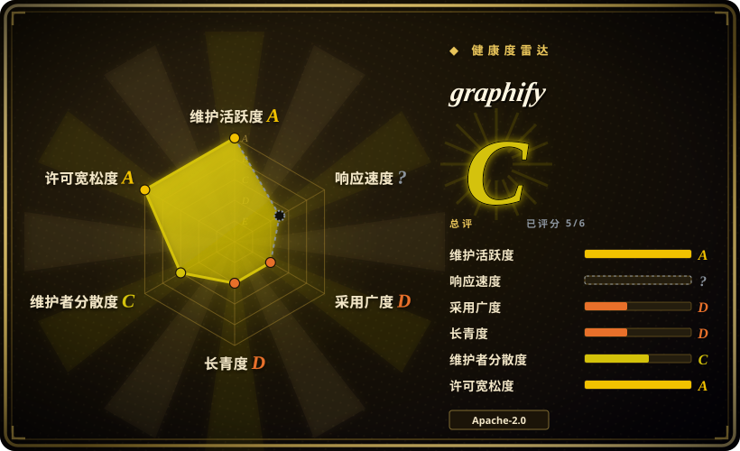
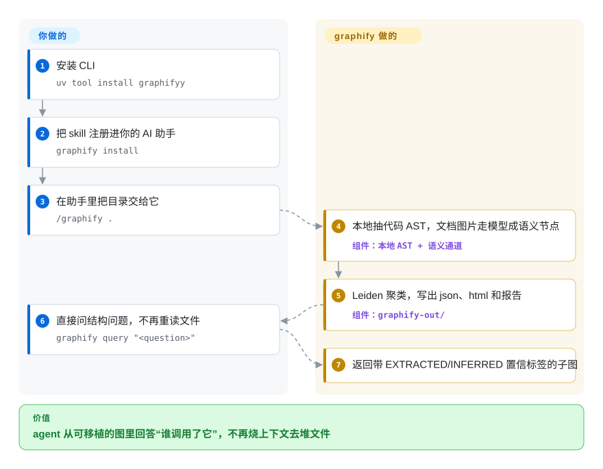

# graphify

一个 Python CLI + MCP server（同时打包成 AI 编程助手 skill），把一整个目录的代码、schema、脚本、文档和媒体抽成一张可移植、可查询的知识图谱，让 agent 用“问图”代替“grep”。

## 何时使用

你是一个 coding agent（或正在给 agent 接线的工程师），被丢进一个陌生的中大型仓库，而用户不断抛来跨切面的问题——“谁调用了这个 auth handler”“这张 SQL 表在哪里被写入”“哪个模块负责加载配置”。纯 `grep`/ripgrep 只给你一堆无结构的字符串命中：你得反复重读文件，人肉重建调用链和归属关系，白白烧掉上下文。graphify 用 tree-sitter（37 种语法）在本地抽出 AST 图，把非代码文件（文档、PDF、图片）交给 LLM 生成语义节点，再跑 Leiden 社区检测把结果聚成架构“社区”，最后产出可移植的 `graph.json`，外加交互式 `graph.html` 和 `GRAPH_REPORT.md`。之后你用 `graphify query "问题"`，或把它当 MCP server 接入，得到的是带 `EXTRACTED`/`INFERRED`/`AMBIGUOUS` 置信标签的结构化答案，而不是原始文件堆。

当图谱要跨越的不只是应用代码时，它尤其合适——graphify 有意把 SQL schema、基础设施（Terraform/HCL）、包清单、R/shell 脚本和文档一起喂进同一张图，于是 agent 能把应用代码 + 数据库 + 基础设施放在一起推理。因为它能作为 `/graphify` skill 装进很多 agent（Claude Code、Codex、Cursor、Gemini CLI、OpenCode、Aider 等），还自带 MCP 模式，它能直接嵌进现有 agent 循环，而不必你自己搭一套检索管线。

## 怎么用起来

graphify 跑在你的代码所在地。它的解析器用 tree-sitter 把每个代码文件抽成 AST，并在约 40 种语言之间解析跨文件的 `calls`/`imports`/`inherits` 边——确定性、不动用 LLM、内容不出本机。非代码材料（文档、PDF、图片、视频）走你助手的模型或配置好的 API key 做一遍语义处理，补上实体节点。随后 Leiden 社区检测把图聚成一个个架构“社区”，产物全部落进 `graphify-out/`：可移植的 `graph.json`、可交互的 `graph.html`，以及一份高亮汇总 `GRAPH_REPORT.md`。你要做的只有：装一次 CLI（`uv tool install graphifyy`），用 `graphify install` 注册 skill，然后 `/graphify .` 建图、开口就问——`graphify query "<问题>"` 返回一个局部子图，每条边带着 `EXTRACTED`（源文件里直接读到）或 `INFERRED`（由解析推导）的置信标签；需要反复以工具调用访问时，把同一张图作为 MCP server 暴露（`python -m graphify.serve graphify-out/graph.json`，stdio 或共享 HTTP）。仍然归你管的：非代码文件的模型后端及其成本、版本 pin（发版很快），以及保持图的新鲜度（`/graphify . --update`，或 `graphify hook install` 在提交时自动重建）。

<!-- flow-steps:begin (generated from flows/graphify.json by tools/flow_card.py — do not edit) -->

流程文字版

1. **你**：安装 CLI — `uv tool install graphifyy`
2. **你**：把 skill 注册进你的 AI 助手 — `graphify install`
3. **你**：在助手里把目录交给它 — `/graphify .`
4. **graphify**：本地抽代码 AST，文档图片走模型成语义节点 — 组件：`本地 AST + 语义通道`
5. **graphify**：Leiden 聚类，写出 json、html 和报告 — 组件：`graphify-out/`
6. **你**：直接问结构问题，不再重读文件 — `graphify query "<question>"`
7. **graphify**：返回带 EXTRACTED/INFERRED 置信标签的子图

**价值**：agent 从可移植的图里回答“谁调用了它”，不再烧上下文去堆文件

<!-- flow-steps:end -->

## 何时不用

- **你要的是持久化、多写入方的图数据库。** graphify 的原生存储是一次性的 `graph.json`（默认 512 MiB 上限）；它能把图 *导出* 成 Cypher 推到 Neo4j/FalkorDB，但自身不是事务型图数据库。如果你需要一个常驻、可查询、可并发更新的图后端，直接用 [FalkorDB](falkordb.zh.md) 或 Neo4j。
- **超大 monorepo / 超大图。** README 的故障排查一节自己承认：超过约 5000 节点的图 HTML 在浏览器里打不开；超过后只能用原始 JSON，而 `graph.json` 默认 512 MiB 的大小上限要靠 `GRAPHIFY_MAX_GRAPH_BYTES` 手工抬高。在巨大目录树上抽取也意味着对非代码文件发起大量 LLM 调用（成本 + 延迟）。
- **你需要确定性、纯离线的抽取。** 代码 AST 抽取是本地的，但文档/PDF/图片的语义节点需要 LLM 后端（你助手自身的模型，或配置好的 Anthropic/OpenAI/Gemini/DeepSeek/Kimi/Ollama/Bedrock 等 key）——这意味着 API key、成本、非确定性，以及把文件内容发给模型（除非你干脆跳过非代码文件）。
- **你想要稳定、冻结的 API。** 发版非常频繁（v0.9.71 发布于 2026-09-28，且已切出 v1.0.0 tag；截至 2026-09 每周多次，GitHub API）；这是快速迭代的软件——请 pin 版本，并预期命令/输出格式会变动。
- **纯文档 RAG（只有散文、没有代码）。** 如果你的语料是文章/PDF，想要段落级检索（而非代码/实体图），用面向文档结构或向量的方案如 [PageIndex](pageindex.zh.md) 更直接。
- **你只需要面向 code-review 的图。** 针对 PR/diff 范围的评审图，[code-review-graph](code-review-graph.zh.md) 面向那个更窄的工作流。

## 横向对比

| 替代品 | 是否收录 | 我们的评价 | 取舍 |
|---|---|---|---|
| [FalkorDB](falkordb.zh.md) | ✅ | 需要持久化图数据库，而不是一次性仓库抽取时，选 FalkorDB。 | 真正的持久化图数据库（基于 Redis、Cypher）；graphify 可以往它 *推送*。需要常驻多查询图存储时用 FalkorDB，需要一次性抽取 + 面向 agent 查询时用 graphify。 |
| [PageIndex](pageindex.zh.md) | ✅ | 问题是长文档/PDF 的结构化检索，而不是代码/实体图抽取时，选 PageIndex。 | 面向长文档/PDF 的、基于推理的文档结构索引做 RAG；没有代码 AST 或调用图。是不同的问题：散文检索 vs 代码/实体图。 |
| [code-review-graph](code-review-graph.zh.md) | ✅ | 只需要窄域 PR/code-review 图工作流时，选 code-review-graph。 | 窄域的 PR/code-review 图工作流；graphify 是全仓库 + 多语言 + 多模态，范围更广。 |
| [Sourcegraph](sourcegraph.zh.md) / [SCIP](scip.zh.md) | ✅ | 需要由 language server 支撑的跨仓库精确代码智能时，选 Sourcegraph/SCIP。 | 工业级精确代码智能（跨仓库、language server）；基础设施更重，且不是 agent-skill 形态。graphify 更轻、由 LLM 增强、能直接嵌进 agent 循环。 |
| GitHub `code2graph` / 自写 tree-sitter 脚本 | 未收录 | 控制权比现成查询、聚类、可视化和 agent 集成更重要时，选自写 AST 图。 | 自己搭 AST 图；更可控，但查询、聚类、可视化和 agent 集成都得自己写。 |

## 技术栈

- **语言：** Python（仓库统计 100%，2026-09）。
- **解析：** tree-sitter，内置 37 种语法解析器，覆盖约 40 种语言（Python、TS/JS、Go、Rust、Java、C/C++/CUDA/Metal、C#、Kotlin、Ruby、PHP、Swift、Scala、Zig、Lua、SQL、Terraform/HCL、Shell、Pascal、OCaml、Dart、Vue/Svelte/Astro 等）。
- **图分析：** Leiden 社区检测（可选 extra；2026-09 起 Python < 3.13 用 graspologic 后端，3.13+ 用原生后端）。
- **产物：** `graphify-out/` 下的 `graph.json`（完整图）、`graph.html`（交互可视化）、`GRAPH_REPORT.md`。
- **接口：** CLI（`graphify extract|query|path|install|hook|export`）、MCP server（`python -m graphify.serve graphify-out/graph.json`，stdio 或共享 HTTP transport），以及装进多种 agent 的 `/graphify` skill。
- **LLM 后端（用于非代码语义节点）：** 默认用宿主助手自身的模型，或配置 Anthropic/OpenAI/Gemini/DeepSeek/Kimi/Azure OpenAI/Bedrock key，或本地 Ollama。

## 依赖

- **运行时：** Python >= 3.10（由 `pyproject.toml` 的 `requires-python` 核实，2026-09）；通过 `uv tool install graphifyy`（推荐）、`pipx install graphifyy` 或 `pip install graphifyy` 安装。注意 PyPI 包名是 **`graphifyy`**（双 y），而 CLI 命令是 `graphify`。
- **可选 extras（pip）：** `pdf`、`office`（DOCX/XLSX）、`google`（Google Sheets）、`video`（faster-whisper + yt-dlp）、`mcp`、`neo4j`、`falkordb`、`postgres`、`sql`、`terraform`、`svg`、`leiden`、`ollama`、`openai`/`gemini`/`anthropic`/`bedrock`/`azure`、`dm`、`pascal`、`ocaml`。
- **外部服务：** 给非代码文件建图需要模型后端（宿主助手的模型、云 API key 或本地 Ollama）；纯代码 AST 抽取是本地的。可选的下游图数据库：Neo4j、FalkorDB、PostgreSQL 内省。
- **图大小：** `graph.json` 默认 512 MiB 上限，可用 `GRAPHIFY_MAX_GRAPH_BYTES` 覆盖。
- **安全提示（历史）：** v0.8.49（2026-06）升级了 `starlette` 以修复 CVE-2026-48818 和 CVE-2026-54283（引自当时的 release notes，见存疑）。

## 运维难度

**低到中。** 顺路径是一次 CLI 安装加 `graphify extract .` / `graphify query`，或一行 skill 安装进现有 agent——基础用法无需跑服务，产物是可移植的 JSON 文件。当你接入 LLM 后端（key 管理、按文件计的成本/延迟、把内容发给模型）、把 MCP server 当常驻进程跑、推送到 Neo4j/FalkorDB，或在大仓库上撞到 HTML/节点和 512 MiB 图上限时，难度升到**中**。极高的发版节奏也意味着 pin 版本是这里运维卫生的一部分。

## 健康度与可持续性

- **响应速度——本轮未知。** 雷达的响应轴从 A 变为 ?（2026-09-28 重跑没有落在窗口内的 qualifying issue/PR；2026-09-22 那轮测得 6 个 issue 上中位首响 6.3 小时）。122k star 的仓库挂着约 1.5k open issue，无论如何都该预期排队压力。[推断：队列压力由 open-issue 数推断，未实测响应]
- **维护——极其活跃。** 最后一次 push 在 2026-09-28，未归档；v0.9.71 当天发布，且已切出 v1.0.0 tag（GitHub API，2026-09-28）。这里的担忧不是活跃度，而是 churn：同样的速度既证明“活着”，也意味着 CLI 表面和输出 schema 会在 minor 版本间变动，所以要 pin 版本。
- **治理 / bus factor——正在公司化，但很年轻（雷达 C）。** 仓库从 `safishamsi/graphify`（个人）转移到了 **Graphify-Labs** 组织（org 创建于 2026-06-28，约 2 个公开仓库，主页 graphify.com）——应读作作者围绕项目立了公司，而不是独立的基金会。评分器统计近 12 个月约 61% 的提交出自同一作者。若这位创始人停手，组织和项目会一起停滞。[推断：组织背后是创始人一人还是小团队，未从成员名单验证——org 成员不公开]
- **年龄与 Lindy——非常年轻（雷达 D；创建于 2026-04-03，约 6 个月）。** Star 增速极端（三个月内约 73k → 122k，GitHub API 两次快照 2026-06/09）——这是热度信号，不是履历。Lindy 先验尚未挣到。
- **采用度——雷达本轮给 D。** 评分器的发布下载信号偏薄（每次发布约 7.2k 次下载，tier D）；上一轮的 PyPI 数字（2026-09-22 测得 `graphifyy` 月下载约 78.9 万）会强得多，但热度驱动的仓库上安装量大并不等于生产采用。[未验证：PyPI 下载数的采用含义]
- **风险标志——已经发生过一次 relicense，外加 churn 与 LLM 依赖。** 项目在 **2026-07-22 从 MIT 改为 Apache-2.0**（提交历史逐字可查：“chore: relicense from MIT to Apache-2.0”）——宽松到宽松，危害低，但年轻项目改过一次许可本身是个先例。非代码抽取会把文件内容发给模型后端；历史上的 v0.8.49 `starlette` CVE 升级（2026-06）说明依赖有压力。

## 存疑（未验证）

- [未验证] 截至 2026-09-28 约 122.0k star、约 11.7k fork、约 1.5k open issue（GitHub API）——计数经 API 核实，但其“采用度”含义未经核实；几个月大仓库上的 star 增速仅供参考。
- [推断] Graphify-Labs 组织是创始人的公司（而非多创始人或机构资助的结构）——从转移时机（org 创建于 2026-06-28）与主页推断，org 成员名单不公开。
- [未验证] ~5000 节点的 HTML 上限是 README 故障排查一节的自述经验值；512 MiB 的 `graph.json` 上限是文档化默认值（`GRAPHIFY_MAX_GRAPH_BYTES` 可覆盖）。真实上限取决于机器内存和图密度。
- [未验证] 安全 CVE 修复（starlette，v0.8.49，2026-06）引自上一轮验证时的 release notes；未对照漏洞公告库独立确认，且当前 README 已不再提及。
- [推断] “每周多次发版”基于两轮验证（2026-06 与 2026-09）观察到的 tag/release 节奏，不是完整发布日志审计。
- [推断] graphify 更适合归类为 `tool`（CLI + MCP server）而非纯 skill-pack，因为它有真实的技术栈、依赖和运维面，不只是一个 prompt 包。
