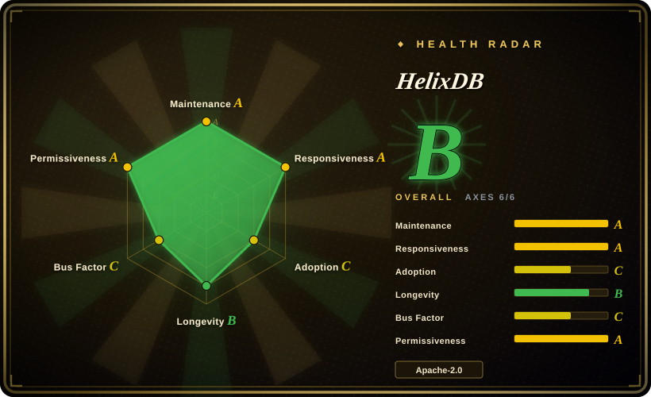
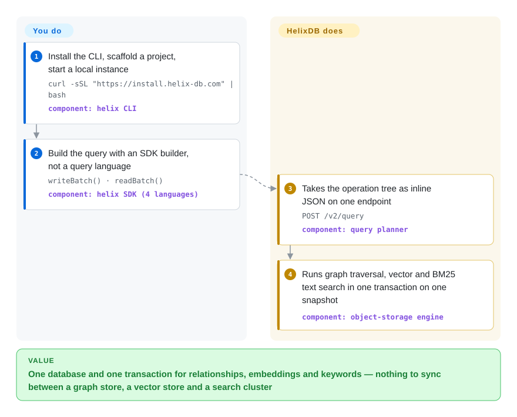

# HelixDB

Your retrieval layer has quietly become three databases — a graph store for entities and their relationships, a vector index for embeddings, a search engine for exact terms — plus the glue that keeps all three agreeing about what was just deleted. HelixDB puts them behind one engine and one transaction: entities, the edges between them, and the embeddings and text hanging off them are a single property graph (nodes and edges, each carrying typed fields), queried in one request.

## When to use

You are building the retrieval layer of an AI product — a company knowledge base, an agent that must remember users and documents, a people-search tool — and the entities in it are genuinely connected: people to teams, chunks to the document they came from. You want both kinds of question answered in one breath: *find the chunks that sound like this question, walk out to the people and projects they mention, and keep only the ones whose `status` is active.* Assembling that from three systems means three copies of the same corpus and a reconciliation job; the reconciliation is where it breaks — you delete a document, and one of the three stores still returns its chunks.

Reach for HelixDB when keeping those three in one engine is worth more than the last 20% of per-engine polish. A vector index or a BM25 text index here is just an access path over a property that already lives on a node or an edge (an index works on edges too, not only nodes), and every request is one serializable transaction over one snapshot, so a graph hop, an ANN lookup and a keyword match cannot disagree. Pick it over [FalkorDB](falkordb.md) when you want the OSS core to be permissively licensed (Apache-2.0, not SSPL) and durability to live in object storage rather than in one Redis node's RAM; pick it over [Milvus](milvus.md) or pgvector when the traversal is the point rather than a filter bolted on top. You pay for that with youth: the v3 engine was open-sourced in July 2026, self-hosted HA is not on the menu yet, and cold reads inherit object-storage latency.

## Q&A

**Is there a query language to learn?**
No. v3 has none: you build an operation tree with an SDK builder and send it as JSON to `POST /v2/query`. If a tutorial mentions HelixQL, it is describing v1 — that language is archived (`docs/legacy/hql.mdx`) and the engine it ran on was a different, LMDB-based database.

**6.1k stars — does that mean it is mature?**
No. Most of those stars accumulated while the public repo held the v1 project and during the YC launch; the engine you would actually adopt moved into this repo in July 2026. Read `Health & viability` below before treating popularity as proof.

## How it works

HelixDB is a server you run, not a client library: it owns the storage, the index maintenance and the transaction, and you reach it three ways — a local container, in-process ("embedded"), or their managed Cloud — with the same queries in all three. You describe a query with an SDK builder (Rust, TypeScript, Go or Python) instead of query text: you chain calls that say "start from nodes labelled `User`, filter by this property, then search the embedding property on the results", and the SDK serializes that into a JSON operation tree. The tree is posted to one endpoint and planned and executed against a single committed snapshot, so a graph hop, an approximate-nearest-neighbour vector lookup (ANN — "closest by distance", not an exhaustive scan) and a BM25 keyword match (a classic relevance ranking that weights rare terms higher) either commit together or fail together. Underneath, the durable copy of everything lives in object storage — the key-value engine is SlateDB, an LSM store that HelixDB forks — with RAM and SSD acting as caches, while a laptop can run the same code against memory or a local directory. The division of labour: you define the data model, the indexes and the query; HelixDB keeps the indexes consistent, runs the transaction, and scales read replicas. Analogy: most RAG stacks are three filing cabinets and a clerk who copies every new document into all three; this is one cabinet with three ways to look inside it.

<!-- flow-steps:begin (generated from flows/helix-db.json by tools/flow_card.py — do not edit) -->

Text version of the flow

1. **You**: Install the CLI, scaffold a project, start a local instance — `curl -sSL "https://install.helix-db.com" | bash` — component: `helix CLI`
2. **You**: Build the query with an SDK builder, not a query language — `writeBatch() · readBatch()` — component: `helix SDK (4 languages)`
3. **HelixDB**: Takes the operation tree as inline JSON on one endpoint — `POST /v2/query` — component: `query planner`
4. **HelixDB**: Runs graph traversal, vector and BM25 text search in one transaction on one snapshot — component: `object-storage engine`

**Value**: One database and one transaction for relationships, embeddings and keywords — nothing to sync between a graph store, a vector store and a search cluster

<!-- flow-steps:end -->

## When NOT to use

- **Every read must be sub-millisecond.** HelixDB's own Tradeoffs page says cache hits are fast but cold reads take an object-storage round trip. Use [Milvus](milvus.md) or [FAISS](faiss.md) instead, because an in-process or memory-resident index answers from RAM with no network hop.
- **You need exhaustive vector search (100% recall).** Search here is approximate (ANN); the docs pair a "over 90% recall" claim with that limitation. Use [FAISS](faiss.md) with a flat/brute-force index instead when exactness is non-negotiable and the corpus is small.
- **You must self-host a production HA cluster.** Self-hosting means the single-node local server; the HA topology (3+ gateways, auto-scaling readers) exists only in Helix Cloud, whose availability and SLA the docs send you to the founders to negotiate, and "supporting non-HA clusters" is still listed on the roadmap. Use [FalkorDB](falkordb.md) behind Redis Sentinel/Cluster instead, because it scales as an ordinary Redis deployment you can operate today. [推断]
- **Write throughput has to scale horizontally.** One writer process serializes every commit; batching raises throughput but not the single-node ceiling. Use a sharded store instead (or Postgres, see [Supabase](../databases/database-engines/supabase.md)), because HelixDB trades write scale-out for a simplicity it wants to keep.
- **You only need vector search.** With no traversal and no properties on edges, you would pay for a graph engine you never use. Use pgvector via [Supabase](../databases/database-engines/supabase.md) or [Milvus](milvus.md) instead.
- **You need versions and APIs you can pin against.** The engine is roughly two months old as OSS and its pieces version independently — database releases are v3.x, the CLI has its own version line, the server image is tagged `v0.0.6`, and the SDKs sit at Rust 3.0.0 / TypeScript 3.2.0 / Python 0.3.4 / Go 0.3.x. Use [FalkorDB](falkordb.md) or a Postgres-based stack instead if you cannot absorb that churn. [推断]
- **You are already running v1.** HelixQL and its LMDB engine are archived, and v3 is described as "a fundamentally different architecture", so treat this as a migration project, not a version bump. Plan the rewrite, or keep the v1 deployment frozen and move to a store with a stable line such as [FalkorDB](falkordb.md).

## Comparison

| Alternative | In index | Our verdict | Tradeoff |
|---|---|---|---|
| [FalkorDB](falkordb.md) | ✅ | Choose FalkorDB when a Redis-embedded Cypher graph with a multi-year track record beats object-storage durability; choose HelixDB when permissive licensing and a dataset that outgrows one machine's RAM matter more. | FalkorDB is older, OpenCypher-compatible and memory-bound under an SSPL server; HelixDB is Apache-2.0, object-storage-backed, and much younger. |
| [Milvus](milvus.md) | ✅ | Choose Milvus when the job is vector ANN at cluster scale and relationships are not part of the query; choose HelixDB when the traversal, the vector search and the keyword filter must run in one transaction. | Milvus is the deeper vector platform (more index families, distributed scale); HelixDB trades vector depth for graph + BM25 in one engine. |
| [Supabase](../databases/database-engines/supabase.md) | ✅ | Choose Supabase's Postgres + pgvector when your corpus already lives in Postgres and SQL joins plus "good enough" recall beat adopting a new database; choose HelixDB when multi-hop traversal and BM25 ranking are first-class query primitives. | Postgres is the lowest-ops, most-reversible default and keeps retrieval in the same transaction as the rest of your data; you give up graph-native traversal, ANN index variety and object-storage economics. |
| Neo4j | 未收录 | Choose Neo4j when the Bolt driver ecosystem, GDS algorithms and hiring pool outweigh running the store on object storage; choose HelixDB when cost per GB at scale is the deciding constraint. | Neo4j is the property-graph incumbent (GPLv3 Community / commercial Enterprise) and stores on local disk or memory. A real repository left unindexed in this batch to keep the change scoped — Neo4j's ecosystem is large enough to deserve its own page later. |
| Pinecone | 非仓库 | Choose Pinecone when you want managed ANN with no self-hosting at all; it is a hosted service, so it is out of scope for this index rather than a missing entry. | Managed, closed-source, vector-only and priced per vector; no self-host path, and no graph traversal or BM25. |

## Tech stack

- **Language:** Rust (edition 2024) for the engine, CLI and server; TypeScript, Python, Go and Shell for SDKs, packaging and tests.
- **Workspace crates:** `ast` (operation tree), `planner`, `db`, `server`, `cli`, `graph-algorithms`, `metrics`, `value-semantics`, `db-testkit`; native bindings via `bindings/uniffi`.
- **Storage:** `slatedb` — HelixDB's own fork, pinned by git revision — an LSM key-value engine over `object_store` with `foyer` cache tiers and `rkyv`/`sonic-rs` encoding.
- **Search:** `tantivy` for BM25 full-text; in-house ANN vector indexes; equality and lexicographic range secondary indexes in the `db` crate.
- **Query model:** a typed operation-tree AST planned by `helix-planner` and shipped as inline JSON to `POST /v2/query`; no build or deploy step.
- **SDKs:** Rust (`helix-db` crate, also usable embedded), TypeScript (`@helix-db/helix-db` + `@helix-db/helix-db-embedded`), Python (`helix-db`), Go (`sdks/go`).
- **Build:** Cargo workspace on a pinned Rust 1.97.1 (`rust-toolchain.toml`), clippy + rustfmt gates, 14 GitHub Actions workflows including DB production-coverage and cross-SDK query-parity jobs.

## Dependencies

- **Local server:** Docker or Podman — the standalone server is distributed as `ghcr.io/helixdb/helixdb:v0.0.6` and driven by the `helix` CLI, not run as a bare binary.
- **Storage, pick one:** memory (the default, discarded by `helix stop`), a mounted directory (`HELIX_DATA_DIR`), or S3-compatible object storage (MinIO, LocalStack, Ceph, AWS S3) — the S3 path needs exported `AWS_ACCESS_KEY_ID` / `AWS_SECRET_ACCESS_KEY`.
- **Embedded mode:** no server; the SDK's embedded runtime package (`helix-db --features embedded`, `@helix-db/helix-db-embedded`, `helix-db-embedded`).
- **Cloud mode:** a WorkOS session in the CLI (`helix auth login`) plus workspace/project linking; application keys come from the console.
- **Building from source:** Rust 1.97.1 and a C toolchain (`ring`/`aws-lc-sys` compile C); system OpenSSL headers are not required.
- **For RAG use:** an embedding model, run elsewhere — HelixDB stores and searches vectors, it does not produce them.

## Ops difficulty

**Low for local development, medium-to-high to self-host production.** `helix init local` then `helix start dev` gives you a single-node instance behind Docker in minutes, and since Cloud exposes the same `POST /v2/query` contract, application code does not change when you deploy. The burden appears when you want durability or scale yourself: you own the object store (or MinIO), the cache budgets (in-memory, SSD, vector memory, full-text), and the single writer's ceiling — and there is no self-hosted HA topology to deploy, so read scale-out is a Cloud feature. Cache settings are fixed when a handle opens, so tuning means a restart. Managed Cloud removes the storage and HA work but puts a per-database token bucket in front of the endpoint (Idea/Startup/Growth plans at 5/10/20 requests per second, shared across all your API keys).

## Health & viability

- **Maintenance (2026-09-24):** strong. Latest release `v3.3.0` on 2026-09-20, up from `v3.0.7` on 2026-07-02 — roughly monthly — with pushes to `main` on 2026-09-23 and 14 CI workflows, including DB production-coverage and cross-SDK query-parity jobs.
- **Age / Lindy — the load-bearing signal.** The repo dates from 2024-11-23 and shows 6.1k stars, but the v3 engine moved into it only in July 2026 ("the engine moved out of `helix-hyperscale` into the public, modular `helix-db` workspace"); before that, this repo held a different database (LMDB + HelixQL) and the current engine was private. The code you would adopt is therefore ~2 months old as open source. Treat the star count as attention, not a track record. [推断] The health card's `longevity` axis scores repository age (670 days at verification), so it does not capture this gap either — read the card and this bullet together.
- **Governance / bus factor:** owned by the `HelixDB` organization, not a foundation and not a lone maintainer — but commit concentration is extreme: `xav-db` accounts for 2,583 of roughly 4.4k sampled contributor commits, against 299 for the next contributor, and the org is a small startup. Institutional backing with one dominant author is a continuity risk worth pricing in. [推断]
- **Backing & business model:** HelixDB Inc., commercially behind Helix Cloud (closed, managed, HA). The engine itself is plain Apache-2.0 with no relicense history in the repo, so the open-core risk here is feature gating — HA and multi-tenancy live in the managed product — rather than a licensing trap.
- **Adoption & ecosystem:** 369 forks, and 25,124 npm downloads in the last month for `@helix-db/helix-db`; SDKs are published to npm (11 versions since 2026-05-21), PyPI (10 releases) and crates.io (9.5k downloads, latest 3.0.0). Docs are unusually agent-friendly (`llms.txt`, `llms-full.txt`, an OpenAPI spec, an MCP endpoint), but there is no `SECURITY.md`, `GOVERNANCE.md`, `CHANGELOG.md` or `CODEOWNERS`, and the contributing guide lives in a file named `CONTRIBUTORS.md`.
- **Risk flags:** development velocity is genuine — fixes land within days of being filed, and tickets are self-filed as `fix(...)`/`feat(...)` internal work items. That also means the small open-issue count (13) measures their own backlog, not external responsiveness. [推断] v1 → v3 was a rewrite with an archived query language, so precedent exists for wide breaking shifts inside a short history.

## Caveats (unverified)

- [未验证] "Over 90% recall" for vector search is the project's own claim in `docs/database/helix-db/start-here/introduction.mdx`; no independent benchmark or reproduction was read.
- [未验证] The Helix Cloud rate limits (5/10/20 requests per second by plan) and the 512-entity active-text mutation ceiling come from current docs and are described there as runtime policy, not fixed limits; re-check before capacity planning.
- [推断] Self-hosted production HA is unavailable: `run-modes.mdx` describes self-hosting as the single-node local server, HA appears only in the Cloud section, and the roadmap still lists "Supporting non-HA clusters" as in progress. No sentence explicitly states self-hosted HA is impossible, so this is inference from absence.
- [推断] Bus-factor and continuity risk is inferred from contributor commit shares, which GitHub's contributors endpoint reports over a rolling window and which ignore review/issue work by other maintainers.
- [未验证] Whether the object-storage engine's cold-read latency is acceptable for any specific workload; the docs describe the tradeoff qualitatively and no benchmark was run.
- [未验证] Actual production adoption — stars and forks are attention signals; no public list of production users was found.
- [推断] The Docker image tag (`v0.0.6`) and the SDK version lines (Rust 3.0.0, TypeScript 3.2.0, Python 0.3.4, Go 0.3.x) are independently released and drift; the README's own "Version names" section addresses the confusion, which suggests it is a real support cost.
