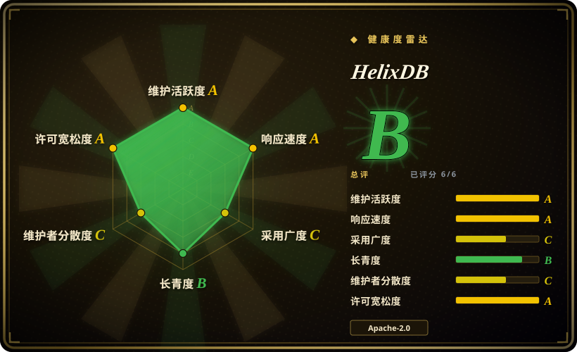
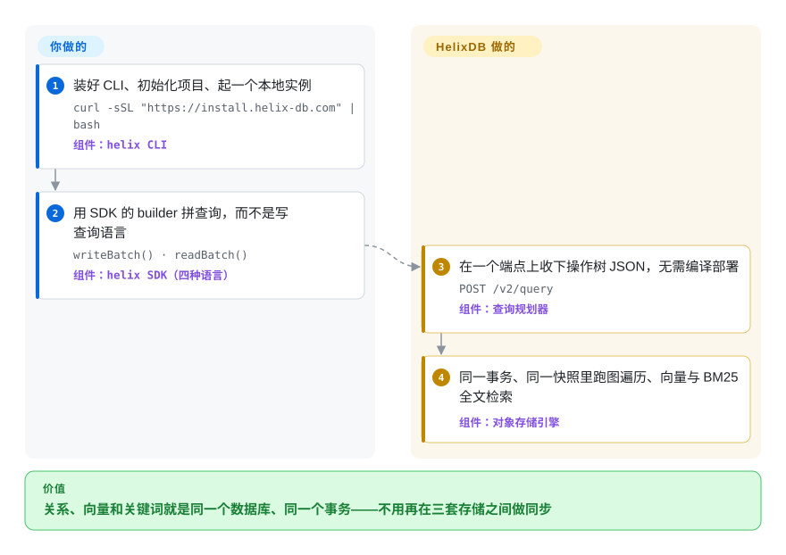

# HelixDB

你在给 RAG 攒检索层，攒着攒着发现手上已经是三套库——实体关系一套图库、embedding 一套向量库、精确命中一套搜索引擎——外面还得糊一层胶水，让三边对「刚删掉的那份文档」保持一致。HelixDB 把这三件事收进同一个引擎、同一个事务：实体、实体之间的关系、以及挂在它们身上的 embedding 和正文，本来就是一整张属性图（点和边，各自带类型化字段），一次请求查完。

## 何时使用

你正在搭一个 AI 产品的检索层——企业知识库、要记住用户和文档的智能体、人员搜索工具——而且里面的实体是真的连着的：人和团队连着，分块和它出自的那份文档连着。你想一口气问出两类问题：*找出跟这句话语义最近的几个分块，顺着它们走到提到的人和项目，最后只留下 `status` 还是 active 的那些。* 用三套系统拼这件事，意味着同一份语料存三份再加一个对账任务，而问题就出在对账上——你删了一份文档，三套里总有一套还在返回它的分块。

当「把这三件事放进一个引擎」比「每个引擎各自再精进 20%」更值钱时，就是它了。这里的向量索引和 BM25 全文索引只是「挂在点和边已有属性上的一条访问路径」（索引对边也生效，不只是点），而每个请求都是单快照上的一个可串行化事务，所以图上的跳转、ANN 检索和关键词命中不可能互相打架。比起 [FalkorDB](falkordb.zh.md)，它的取舍是：开源核心用宽松许可（Apache-2.0，不是 SSPL），持久层落在对象存储上而不是压在一个 Redis 节点的内存里。比起 [Milvus](milvus.zh.md) 或 pgvector，它的取舍是：图上的遍历是主角，而不是事后加的一层过滤。代价是年轻：v3 引擎 2026 年 7 月才开源，自建 HA 还没进菜单，冷读要付对象存储的延迟。

## 快问快答

**要学一门查询语言吗？**
不用。v3 没有查询语言：你用 SDK 的 builder 拼出一棵操作树，以 JSON 发到 `POST /v2/query`。如果某篇教程提到 HelixQL，那讲的是 v1——那门语言已归档（`docs/legacy/hql.mdx`），它当年跑的引擎也是另一套基于 LMDB 的数据库。

**6.1k star，说明它成熟吗？**
不说明。这些 star 主要攒在公开仓库还装着 v1 项目、以及 YC 发布的那段时间；你真正要采用的这套引擎，2026 年 7 月才搬进这个仓库。别把人气当背书，先看下面的「健康度与可持续性」。

## 怎么用起来

HelixDB 是你要运行的服务器，不是一个客户端库：存储、索引维护和事务都归它，你有三种接入方式——本地容器、同进程「嵌入式」、以及它家的托管 Cloud——三者的查询完全一样。你用 SDK 的 builder（Rust、TypeScript、Go、Python）而不是查询文本来描述查询：链式调用说出「从标着 `User` 的点出发，按这个属性过滤，再在结果上搜 embedding 属性」，SDK 把这棵操作树序列化成 JSON。这份 JSON 发到同一个端点，规划后在单个已提交快照上执行，于是图上的跳转、近似最近邻向量检索（ANN，即「按距离找最近的」，不是全量扫描）和 BM25 关键词匹配（经典的词频相关度排序，罕见词权重更高）要么一起提交，要么一起失败。底下一切数据的长久副本放在对象存储上——键值引擎是 SlateDB，一个 LSM 存储，HelixDB 自己维护了它的分支——内存和 SSD 只当缓存；笔记本上同一套代码也可以跑在内存或本地目录上。分工是：你定义数据模型、索引和查询；HelixDB 负责让索引保持一致、跑事务、扩读副本。打个比方：多数 RAG 栈是三个文件柜加一个文员，每来一份新文档就往三个柜子里各抄一遍；这里是同一个柜子，只是有三种翻法。

<!-- flow-steps:begin (generated from flows/helix-db.json by tools/flow_card.py — do not edit) -->

流程文字版

1. **你**：装好 CLI、初始化项目、起一个本地实例 — `curl -sSL "https://install.helix-db.com" | bash` — 组件：`helix CLI`
2. **你**：用 SDK 的 builder 拼查询，而不是写查询语言 — `writeBatch() · readBatch()` — 组件：`helix SDK（四种语言）`
3. **HelixDB**：在一个端点上收下操作树 JSON，无需编译部署 — `POST /v2/query` — 组件：`查询规划器`
4. **HelixDB**：同一事务、同一快照里跑图遍历、向量与 BM25 全文检索 — 组件：`对象存储引擎`

**价值**：关系、向量和关键词就是同一个数据库、同一个事务——不用再在三套存储之间做同步

<!-- flow-steps:end -->

## 何时不用

- **每次读都要亚毫秒。** 它自己的 Tradeoffs 页面写着：命中缓存很快，但冷读要走一次对象存储往返。这种场景改用 [Milvus](milvus.zh.md) 或 [FAISS](faiss.zh.md)，因为它们常驻内存、直接从 RAM 作答，不走网络。
- **需要 100% 精确的向量召回。** 这里是近似检索（ANN），文档在给出「召回率 90% 以上」这个说法的同时也写明了这个限制。精确性不可让步、语料又不大时，改用 [FAISS](faiss.zh.md) 的暴力检索索引。
- **必须自建生产级 HA 集群。** 自建指的是单节点的 local server；HA 拓扑（3 个以上网关、自动扩缩的读节点）只存在于 Helix Cloud，文档让你就可用性与 SLA 去联系创始人谈，而 roadmap 里「支持非 HA 集群」还在进行中。要今天就自己运维高可用，改用 [FalkorDB](falkordb.zh.md) 配 Redis Sentinel／Cluster，因为它按普通 Redis 部署扩缩，你现在就能操作。 [推断]
- **写吞吐必须横向扩。** 单写进程串行化所有提交，批量提交能提高吞吐，但抬不高单节点的天花板。需要写横向扩展时改用分片存储（或 Postgres，见 [Supabase](../databases/database-engines/supabase.zh.md)），因为 HelixDB 是拿写扩展性换掉了它想保留的那份简单性。
- **你只需要向量检索。** 没有遍历、边上也没有属性时，你会为一个用不上的图引擎付费。这种场景改用 pgvector（经 [Supabase](../databases/database-engines/supabase.zh.md)）或 [Milvus](milvus.zh.md)。
- **需要能把版本和 API 钉死的环境。** 这套引擎作为开源项目只有约两个月，而且各部件独立发版——数据库是 v3.x，CLI 有自己的版本线，服务端镜像的标签是 `v0.0.6`，SDK 则停在 Rust 3.0.0／TypeScript 3.2.0／Python 0.3.4／Go 0.3.x。吸收不了这种变动的话，改用 [FalkorDB](falkordb.zh.md) 或基于 Postgres 的一套。 [推断]
- **你已经在跑 v1。** HelixQL 和它背后的 LMDB 引擎都已归档，v3 被描述为「一个从根本上不同的架构」，所以这是迁移项目，不是版本升级。要么安排重写，要么把 v1 冻结不动、换到版本线稳定的存储（例如 [FalkorDB](falkordb.zh.md)）。

## 横向对比

| 替代品 | 是否收录 | 我们的评价 | 取舍 |
|---|---|---|---|
| [FalkorDB](falkordb.zh.md) | ✅ | 想要一个在 Redis 里跑、有多年积累、说 Cypher 的图引擎时选 FalkorDB；想要宽松许可、且数据集能长到超过单机内存时选 HelixDB。 | FalkorDB 更老、兼容 OpenCypher，但受限于内存且服务端是 SSPL；HelixDB 是 Apache-2.0、数据落在对象存储上，但年轻得多。 |
| [Milvus](milvus.zh.md) | ✅ | 任务就是集群规模的向量 ANN、查询里不含关系时选 Milvus；遍历、向量检索和关键词过滤必须在同一个事务里跑完时选 HelixDB。 | Milvus 是更深的向量平台（索引种类多、可分布式扩展）；HelixDB 拿向量深度换来「图 + BM25 同引擎」。 |
| [Supabase](../databases/database-engines/supabase.zh.md) | ✅ | 语料本来就在 Postgres 里、SQL 关联加「召回够用」胜过引入新数据库时，选 Supabase 的 Postgres + pgvector；把多跳遍历和 BM25 排序当一等查询原语时选 HelixDB。 | Postgres 是运维最轻、最可回退的默认解，还能让检索和其他数据同事务；代价是没有图原生遍历、没有多样的 ANN 索引、也没有对象存储的成本结构。 |
| Neo4j | 未收录 | Bolt 驱动生态、GDS 算法库和招人池比「把存储放到对象存储上」更重要时选 Neo4j；每 GB 成本是决定性约束时选 HelixDB。 | Neo4j 是属性图的老牌选手（社区版 GPLv3／企业版商业授权），数据落在本地磁盘或内存。它是真实存在的仓库，本次刻意未收录以控制改动范围——它的生态体量值得日后单独出一页。 |
| Pinecone | 非仓库 | 想要完全不自托管的托管式 ANN 时选 Pinecone；它是托管服务，按形态就不属于本索引的收录范围，而不是遗漏。 | 闭源托管、只有向量、按向量量计价；没有自托管路径，也没有图遍历和 BM25。 |

## 技术栈

- **语言：** 引擎、CLI 和服务端是 Rust（edition 2024）；SDK、打包和测试用到 TypeScript、Python、Go、Shell。
- **工作区 crate：** `ast`（操作树）、`planner`、`db`、`server`、`cli`、`graph-algorithms`、`metrics`、`value-semantics`、`db-testkit`；原生绑定在 `bindings/uniffi`。
- **存储：** `slatedb`——HelixDB 自己维护的分支，按 git revision 锁定——一个跑在 `object_store` 之上的 LSM 键值引擎，配 `foyer` 做多级缓存，`rkyv`／`sonic-rs` 做编解码。
- **检索：** 全文用 `tantivy`（BM25）；向量是在内部实现的 ANN 索引；等值和字典序范围二级索引在 `db` crate 里。
- **查询模型：** 类型化的操作树 AST，由 `helix-planner` 规划，以内联 JSON 发到 `POST /v2/query`，没有编译或部署步骤。
- **SDK：** Rust（`helix-db` crate，也可嵌入式使用）、TypeScript（`@helix-db/helix-db` 加 `@helix-db/helix-db-embedded`）、Python（`helix-db`）、Go（`sdks/go`）。
- **构建：** Cargo workspace，Rust 固定 1.97.1（`rust-toolchain.toml`），有 clippy 和 rustfmt 门禁，14 条 GitHub Actions 工作流，其中包括 DB production-coverage 和跨 SDK 查询对等性测试。

## 依赖

- **本地服务端：** 需要 Docker 或 Podman——服务端以 `ghcr.io/helixdb/helixdb:v0.0.6` 镜像分发，由 `helix` CLI 驱动，不是直接跑的裸二进制。
- **存储，三选一：** 内存（默认，`helix stop` 即丢）、挂载目录（`HELIX_DATA_DIR`）、或 S3 兼容对象存储（MinIO、LocalStack、Ceph、AWS S3）——走 S3 需要导出 `AWS_ACCESS_KEY_ID`／`AWS_SECRET_ACCESS_KEY`。
- **嵌入模式：** 不需要服务端，但要装 SDK 对应的嵌入运行时包（`helix-db --features embedded`、`@helix-db/helix-db-embedded`、`helix-db-embedded`）。
- **Cloud 模式：** CLI 里要有 WorkOS 会话（`helix auth login`）并关联 workspace／project；应用密钥从控制台取。
- **从源码构建：** Rust 1.97.1 加一套 C 工具链（`ring`／`aws-lc-sys` 要编译 C）；不需要系统的 OpenSSL 头文件。
- **用于 RAG 时：** 还需要一个在别处运行的 embedding 模型——HelixDB 存取和检索向量，不生产向量。

## 运维难度

**本地开发低，自建生产中到高。** `helix init local` 再 `helix start dev`，几分钟就能在 Docker 后面拿到一个单节点实例；由于 Cloud 暴露同一套 `POST /v2/query` 契约，部署时应用代码不用改。负担出现在你想自己扛持久化或规模的时候：对象存储（或 MinIO）、各项缓存预算（内存、SSD、向量内存、全文）、以及单写节点的上限都归你，而且没有可自建的 HA 拓扑——读节点的横向扩展是 Cloud 才有的能力。缓存配置在句柄打开时就固定，调参意味着重启。托管 Cloud 免掉了存储和 HA 的活，代价是端点前面多了一个按数据库计量的令牌桶（Idea／Startup／Growth 三档分别为每秒 5／10／20 个请求，且在你所有 API key 之间共享）。

## 健康度与可持续性

- **维护（2026-09-24）：** 强劲。最新发布 `v3.3.0`（2026-09-20），上一个已知版本是 2026-07-02 的 `v3.0.7`，大致每月一版；`main` 上 2026-09-23 还有推送，14 条 CI 工作流，含 DB production-coverage 和跨 SDK 查询对等性测试。
- **年龄／Lindy——最吃重的一条信号。** 仓库建于 2024-11-23、显示 6.1k star，但 v3 引擎是 2026 年 7 月才搬进来的（发布说明原文：「引擎从 `helix-hyperscale` 搬进了公开的模块化 `helix-db` workspace」）；在此之前这个仓库装的是另一套数据库（LMDB + HelixQL），当前引擎是私有的。所以你真正要采用的代码，作为开源只有约两个月。把 star 数当关注度看，别当历史记录。 [推断] 健康度雷达的 `longevity` 轴量的是仓库年龄（验证时为 670 天），也反映不出这个落差——两处要一起看。
- **治理／巴士系数：** 归 `HelixDB` 组织所有，不是基金会，也不是单人项目——但提交集中度极高：抽样贡献者提交里 `xav-db` 占 2,583 次，第二名的 299 次；组织本身是一家小创业公司。有机构背书、同时有一个绝对主导作者，这个连续性风险要算进成本。 [推断]
- **背书与商业模式：** HelixDB 公司，商业侧是 Helix Cloud（闭源、托管、带 HA）。引擎本体是干净的 Apache-2.0，仓库里没有改许可的历史，所以这里的 open-core 风险是功能门禁——HA 和多租户只存在于托管产品里——而不是许可陷阱。
- **采用与生态：** 369 个 fork；`@helix-db/helix-db` 在 npm 上上月下载量 25,124 次。SDK 已发到 npm（2026-05-21 起 11 个版本）、PyPI（10 个发布）和 crates.io（9.5k 次下载，最新 3.0.0）。文档对智能体异常友好（`llms.txt`、`llms-full.txt`、OpenAPI 规范、MCP 端点），但没有 `SECURITY.md`、`GOVERNANCE.md`、`CHANGELOG.md` 和 `CODEOWNERS`，贡献指南放在一个叫 `CONTRIBUTORS.md` 的文件里。
- **风险旗标：** 开发速度是真实的——修复通常在提交后几天内合入，工单以 `fix(...)`／`feat(...)` 的形式由他们自己建来当内部待办。这也意味着很少的 open issue 数（13 个）衡量的是他们自己的 backlog，而不是对外部反馈的响应速度。 [推断] v1 → v3 是一次带查询语言归档的重写，说明短历史内已经有过大幅破坏性变更的先例。

## 存疑（未验证）

- [未验证] 向量检索「召回率 90% 以上」是项目方在 `docs/database/helix-db/start-here/introduction.mdx` 里的自述；没有读到独立基准测试或复现实验。
- [未验证] Helix Cloud 的限流（按套餐每秒 5／10／20 个请求）和 512 个实体的 active-text 变更上限来自当前文档，且文档自称是运行时策略而非固定上限；做容量规划前请重新核对。
- [推断] 自建生产级 HA 不可用：`run-modes.mdx` 把自建描述为单节点 local server，HA 只出现在 Cloud 一节，roadmap 也仍把「支持非 HA 集群」列为进行中。没有任何一句话明确断言自建 HA 做不到，这是从缺失做的推断。
- [推断] 巴士系数与连续性风险由贡献者提交占比推出，而 GitHub 的 contributors 接口按滚动窗口统计，且不计入其他维护者做的评审和 issue 工作。
- [未验证] 对象存储引擎的冷读延迟对具体业务是否可接受——文档只做了定性描述，本次没有跑基准测试。
- [未验证] 真实的生产采用情况——star 和 fork 只是关注度信号，没有找到公开的生产用户清单。
- [推断] 服务端镜像标签（`v0.0.6`）与各 SDK 版本线（Rust 3.0.0、TypeScript 3.2.0、Python 0.3.4、Go 0.3.x）独立发布、会互相漂移；README 专门写了「Version names」一节来解释这种混乱，说明它确实是个真实的支持成本。
