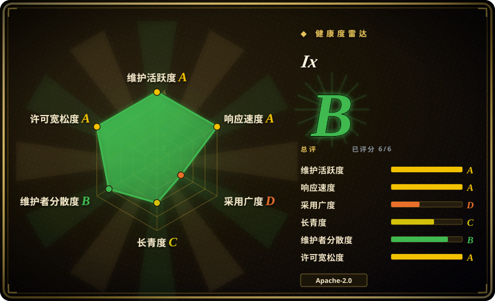
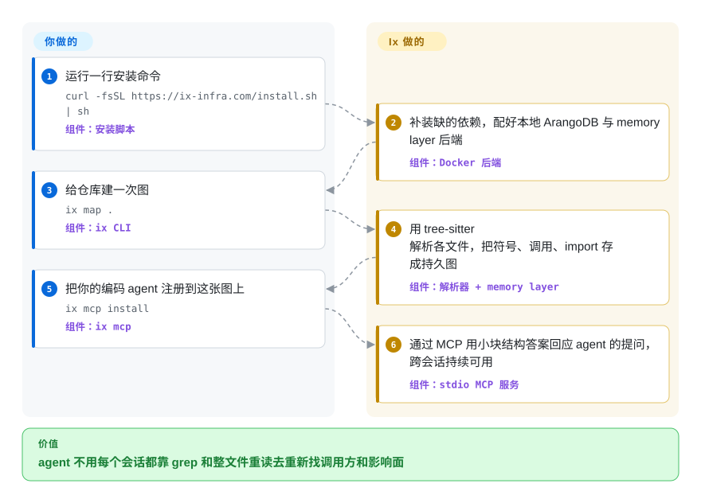

# Ix

你问编码 agent“改了 `verify_token` 会坏哪里”，它就去 grep、打开十几个文件，最后还是漏掉隔两层的调用方——下个会话再从头来一遍。Ix 把仓库一次性解析成“谁调用谁、谁引用谁”的关系图，存进本机数据库，agent 只需问某个符号周围连着什么，不用再逐个读文件。

## 何时使用

你在一个中大型仓库上干活，而且多半是多语言混合：前端 TypeScript、一个 Python 服务、一些 Go、一个 Terraform 目录，平时用 Claude Code、Codex、Cursor 或 opencode 写代码。每个结构性问题，agent 都要走同一套流程：`rg verify_token`，打开六个文件，再打开它们 import 的文件，往上下文里塞四万 token，最后回答一句“看起来是从……调用的”。下一个会话又从零开始。你希望调用和引用结构只算一次、跨会话保留，并按小块递给 agent：`ix explain AuthService` 返回这个符号和它直接相连的关系，`ix impact verify_token` 返回改动的波及范围，`ix trace user_login_flow` 顺着一条流程上下追踪。

选 Ix 而不是它最近的几个邻居，理由有三条：它的解析覆盖 27 种语言（包括 SAS、R、HCL/Terraform 和 CUDA 核函数调用），建图这一步不调用任何大模型；一条 `ix mcp install` 就能把它同时注册进七种 agent 客户端；图存在真正的图数据库里，还带文件监听（`ix watch`）和可视化（`ix view`）。代价是数据库那一侧不是一个文件：你得跑 Docker，而负责存储和回答查询的服务是厂商发布的二进制，源码看不到。如果你想要同样的思路、但只要 `pip install` 加一个 SQLite 文件，code-review-graph 更合适。

## 怎么用起来

Ix 分成两半。本仓库里的那一半是 `ix` 命令行工具：它用 tree-sitter（一个把各种语言源码解析成语法树的解析库）遍历你的文件，抽出每个函数、类、调用和 import，分批发给本机上的后端。另一半就是那个后端：一个 ArangoDB 图数据库，加上 Ix 自己的“memory layer”HTTP 服务，由 Docker 在 `127.0.0.1` 上替你跑起来，负责存图和回答查询。可以把它想成测绘员和地图局：CLI 负责实地走一遍，后端负责保管地图、回答“这个东西连着哪些东西”。你要做的是跑安装脚本、每个仓库建一次图、注册 agent 客户端；之后 agent 通过 MCP（编码 agent 调用外部工具的协议）调用 Ix 的工具，拿到简短、省 token 的回答（`--format llm`），而 `ix watch` 或编辑器插件会在文件变动时保持图是新的。

<!-- flow-steps:begin (generated from flows/ix.json by tools/flow_card.py — do not edit) -->

流程文字版

1. **你**：运行一行安装命令 — `curl -fsSL https://ix-infra.com/install.sh | sh` — 组件：`安装脚本`
2. **Ix**：补装缺的依赖，配好本地 ArangoDB 与 memory layer 后端 — 组件：`Docker 后端`
3. **你**：给仓库建一次图 — `ix map .` — 组件：`ix CLI`
4. **Ix**：用 tree-sitter 解析各文件，把符号、调用、import 存成持久图 — 组件：`解析器 + memory layer`
5. **你**：把你的编码 agent 注册到这张图上 — `ix mcp install` — 组件：`ix mcp`
6. **Ix**：通过 MCP 用小块结构答案回应 agent 的提问，跨会话持续可用 — 组件：`stdio MCP 服务`

**价值**：agent 不用每个会话都靠 grep 和整文件重读去重新找调用方和影响面

<!-- flow-steps:end -->

## 何时不用

- **你跑不了、或不愿信任闭源二进制。** 图存储和查询引擎（`ghcr.io/ix-infrastructure/ix-memory-layer`）是从一个私有仓库构建的；`ix-memory-layer-dist` 明写“不含任何源码”，CONTRIBUTING 让人去一个外部人员克隆不了的仓库改后端（issue #574）。如果需要审计整条链路——受监管的代码、离线审查——改用 [code-review-graph](code-review-graph.zh.md)（MIT，一个 Python 包加 SQLite 全部搞定）或 [graphify](graphify.zh.md)。
- **这台机器上不能用 Docker。** Ix 需要 Docker + Compose、Node 22+、git 和 ripgrep，还要两个常驻容器占着 8529 和 8090 端口。锁死的公司笔记本、很薄的 CI 机器，或者不允许用 Docker Desktop 许可的环境，选只要 Python 的 [code-review-graph](code-review-graph.zh.md)。
- **多人或多个仓库共用一个后端，并且你期望彼此隔离。** 仓库自己的 CLAUDE.md 警告：`ix reset` 是全局的——它会清掉共享后端里**所有**工作区的图，而 CLI 不提供按工作区重置。要给整个团队提供跨仓库的代码智能，[Sourcegraph](sourcegraph.zh.md) 配 [SCIP](scip.zh.md) 索引更重，但才是真正的多租户方案。
- **你需要编译器级的精确解析。** 这张图是 tree-sitter 抽取出来的，不做类型检查：2026-09 仍开着的 issue 有 `--path` 在三处含义不一致（#636）、关键词搜索悄悄丢结果（#647）、PHP 文件缺架构归属（#629）、升级后常量一直不出现（#709）。要精确的跳转定义和引用，用基于语言服务器（LSP）的 Serena，或者 [SCIP](scip.zh.md) 的精确索引。
- **你希望规划、决策、任务跟踪也在同一个工具里。** `plan`、`task`、`workflow`、`decide`、`goal`、`truth`、`bug`、`briefing` 在开源版里只是占位命令，运行时打印“requires Ix Pro”；真正的实现在一个不公开的包里。免费版只按结构查询来规划，项目记忆交给 [agent-memory](../agent-memory/INDEX.zh.md) 分类里的专门工具。
- **你要问的是文字类内容——文档、会议记录、设计理由。** Ix 自带的 skill 明说它“不回答文字或历史类问题”。要把代码**和**文档一起建成图，用 [graphify](graphify.zh.md) 或 [Understand-Anything](understand-anything.zh.md)；长文档检索用 [PageIndex](pageindex.zh.md)。
- **你需要长期的可靠记录。** Ix 才七个月大（2026-03-03 创建），还在 v0.x，v0.10 在六天里（2026-08-16 到 08-21）发了 16 个候选版——命令和参数面还在变。锁定版本，并预期升级后要重新建图。

## 横向对比

| 替代品 | 是否收录 | 我们的评价 | 取舍 |
|---|---|---|---|
| [code-review-graph](code-review-graph.zh.md) | ✅ | 如果你想把代码图通过 MCP 给 agent 用，而且只接受 `pip install` 加一个 SQLite 文件，选 code-review-graph；想要真正的图数据库、27 种语言解析、一条命令注册七种 agent 客户端，选 Ix。 | code-review-graph 全部 MIT、自包含，但只有一位主要维护者、运行时只有 Python；Ix 多出 Docker、闭源后端和全局重置这些负担，换来常驻的图存储、文件监听和可视化。 |
| [graphify](graphify.zh.md) | ✅ | 图里必须同时有文档、schema、PDF 和多媒体时选 graphify；问题严格是结构性的（调用方、影响面、调用链），又不想在建图时用大模型，选 Ix。 | graphify 处理非代码文件要接大模型，建图本身花 token；Ix 的建图是确定性的 tree-sitter 工作，但对文字内容什么也答不了。 |
| [Understand-Anything](understand-anything.zh.md) | ✅ | 目标是一个队友只装 Node 就能打开、图随仓库提交的可浏览看板，选 Understand-Anything；目标是 agent 在干活时查询一张实时监听的图，选 Ix。 | Understand-Anything 用大模型做摘要和问答，并把图提交进仓库；Ix 把图放在仓库之外的本地数据库里，所有会话和客户端共用。 |
| [Sourcegraph](sourcegraph.zh.md) / [SCIP](scip.zh.md) | ✅ | 团队需要集中提供精确的跨仓库跳转和代码搜索时，选 Sourcegraph 配 SCIP 索引；只在单个开发者机器上、给编码 agent 用，选 Ix。 | Sourcegraph/SCIP 给编译器级的引用和多用户服务，但运维很重（本索引收录的 Sourcegraph 仓库是已归档的公开快照）；Ix 是笔记本上的工具，tree-sitter 抽出来的边更轻、也更不精确。 |
| Serena | 未收录 | agent 需要通过真正的语言服务器做精确的符号查找和编辑时选 Serena；需要一张持久化的全仓库图来查影响面和排序时选 Ix。本批 tab intake 未收录。 | Serena 按语言驱动 LSP 服务器，答案精确，但依赖每种语言的服务器都装好且正常；Ix 为所有语言预先算好一张图，精度停在语法层。 |
| GitNexus | 未收录 | 想要完全不跑服务进程的代码智能图，可以考虑 GitNexus；Ix 需要 Docker 后端一直在跑。本批 tab intake 未收录。 | GitNexus 主打零服务器设计；Ix 放弃这种简单，换来跨会话、跨客户端持久保存的数据库后端。本页没有审查它的许可和功能深度。 |

## 技术栈

- **CLI（`ix-cli/`，包名 `@ix/cli`）：** TypeScript，运行在 Node.js ≥ 22 上；命令用 `commander`，stdio MCP 服务（`ix mcp`）用 `@modelcontextprotocol/sdk`，另有 `zod`、`yaml`、`chalk`；测试用 vitest。
- **解析器（`core-ingestion/`）：** node 版 `tree-sitter` 绑定，内置 14 种语法、另有 14 种可选语法（R、HCL、Lua、XML、Zig、Bash、CSS、Elixir、Haskell、HTML、Kotlin、Make、SAS、Swift）；CUDA 用 C++ 语法解析。SAS 语法是该组织自己的 `tree-sitter-sas`（MIT）。
- **后端（不在本仓库）：** ArangoDB 3.12.11（锁定版本，开启向量索引），加上 `ix-memory-layer`——一个跑在 8090 端口的 Scala/JVM HTTP API，以 Docker 镜像和 JAR 形式从私有源码仓库发布。
- **读图的客户端：** CLI、MCP 服务，以及 Compass——一个通过 `ix upgrade` 从单独分发仓库拉下来的网页可视化工具。
- **分发：** `curl … install.sh | sh` 或 PowerShell 安装脚本，下载预编译的 CLI 包（Apple Silicon、Linux x86-64/arm64、Windows x86-64）；Intel Mac 走 Homebrew 源码构建；各客户端插件在单独仓库里（Claude Code、Codex、OpenClaw、Gemini、OpenCode、Cursor）。

## 依赖

- **机器上必须有：** Node.js ≥ 22、git ≥ 2、ripgrep ≥ 13（`ix text` 靠它）、Docker ≥ 20 和 Compose v2。macOS/Linux 安装脚本会自己装缺的东西（Homebrew、NodeSource、`get.docker.com`，并把你的用户加进 `docker` 组）；Windows 要先手动装好 Node 和 Docker Desktop。
- **常驻服务：** 两个容器——`arangodb:3.12.11` 跑在 `127.0.0.1:8529`（以 `ARANGO_NO_AUTH=1` 启动），`ix-memory-layer:latest` 跑在 `127.0.0.1:8090`。两者只绑本机；数据库没有密码，本机上任何进程都能读这张图。
- **安装时的网络：** api.github.com、github.com、raw.githubusercontent.com、ghcr.io，以及 Node/Docker/Homebrew 的下载站（完整列表见 `docs/prerequisites.md`）。共用出口 IP 时可能撞上 Docker Hub 匿名拉取限额。
- **运行时的网络：** 建图和查询只走本地后端；`ix ingest` 在你要求时还能拉 GitHub issue/PR。不需要大模型 API key。[推断] 在仓库里按代码搜索没找到遥测客户端，但闭源后端的外连行为无法从源码核实。
- **磁盘和状态：** `~/.ix/`（配置、CLI、Compose 文件；可用 `IX_HOME` 挪位置），外加一个保存 ArangoDB 数据的 Docker 卷。

## 运维难度

**中等。** 安装只要一条命令，但装下去的是一个小型服务栈：两个带 `restart: unless-stopped` 的常驻容器、一个数据库卷，以及一个靠拉 `latest` 镜像来升级的后端。故障模式真实存在，而且仓库自己就记录了：一次没锁版本的 ArangoDB 拉取让数据库启动即崩、反复重启（#614，靠锁定 3.12.11 修复）；大仓库导入会因写锁没释放而卡死（#615）；`ix upgrade` 会清掉 Compass 资源；`ix reset` 一次清空所有工作区。日常主要是切分支后跑 `ix map`，命令报后端不可达时跑 `ix doctor`；memory layer 对“数据库忙不过来”和“补丁被拒”都回 HTTP 500，所以建图变慢时得自己去看 `docker stats`。

## 健康度与可持续性

- **维护（2026-09-28）：** 非常活跃但呈爆发式——当天仍有推送，2026-09-26 发了 v0.11.0；自 2026-03 起共 54 个发布，集中在 3 月（16 个）和 8 月（28 个），5 月和 7 月没有发布；v0.10.0 在 2026-08-16 到 08-21 之间发了 16 个候选版。bug 报告几天内就修，2026-09-06 提的好几个 issue 当天关闭。
- **治理与巴士因子：** 归 `ix-infrastructure` GitHub 组织所有（版权方 Ix Infrastructure Inc.），四个人承担了大部分提交（各约 140–250 次）——比单人项目分散。路线图和后端都在公司手里；外部贡献者只能改 CLI、解析器和文档。
- **背后力量与寿命：** 一家年轻创业公司（仓库 2026-03-03 创建，约七个月），同时在卖 Kartr——一个“基于同一套记忆引擎”的 alpha 阶段 agent 平台。按年龄不满足 Lindy 先验；[推断] 免费后端能否延续取决于公司的商业方向，仓库里没有任何承诺。
- **采用情况：** 约 1.0k star、78 fork（2026-09-28），有 Discord，六种 agent 客户端各有插件；CLI 以 tarball 分发而非 npm 包，所以没有下游依赖数据。
- **风险信号：** 从结构上就是 open-core——Apache-2.0 的仓库依赖一个闭源后端镜像，Pro 命令用占位命令藏起来；后端镜像按 `latest` 拉取；ArangoDB 容器不开认证。没有改许可证的历史（项目还太年轻）。

## 存疑（未验证）

- [未验证] “token 用量减少 30–99.7%”是维护者自己的内部测量，README 明说“不是公开基准”；本页没有复现。
- [未验证] memory layer 后端的源码与许可：分发仓库里有一份 Apache-2.0 LICENSE 文件但没有源码，这份许可对二进制授予了什么、镜像里是否还有别的东西，没有私有仓库就无法核实。
- [推断] 没有遥测：在开源代码里用 GitHub 代码搜索 `telemetry` 只命中 lockfile；闭源后端的网络行为未知。
- [未验证] 27 种语言支持是 README 的说法；各语言的边质量有差异（如 PHP 归属问题 #629），本页未实测。
- [推断] Compass（`ix view`）看起来是从不公开的流水线构建的（`ix-compass-dist` 只是分发仓库）；其许可未确认。
- [未验证] `--semantic` 搜索使用向量嵌入；嵌入在哪里计算（推测在后端）、用什么模型，开源仓库里没有写明。
- [未验证] Serena 和 GitNexus 的取舍只依据它们的仓库简介；本页没有审查它们的许可。
- [未验证] star/fork 数和发布日期来自 2026-09-28 的 `gh api`，会变动。
