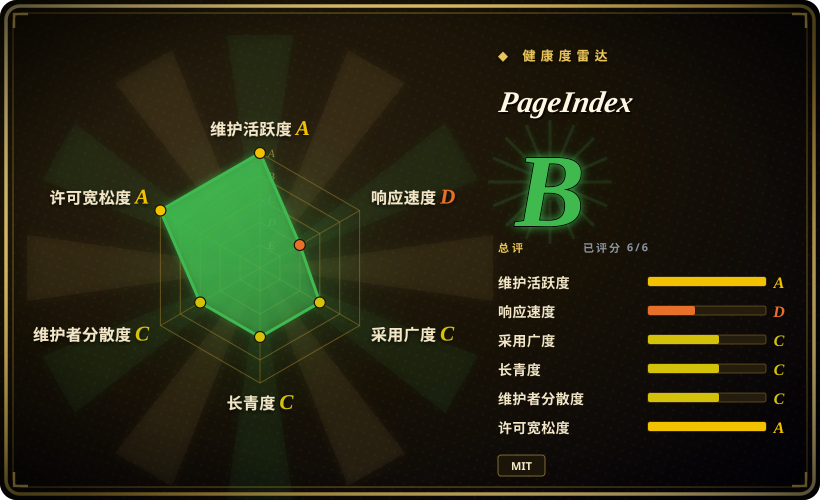
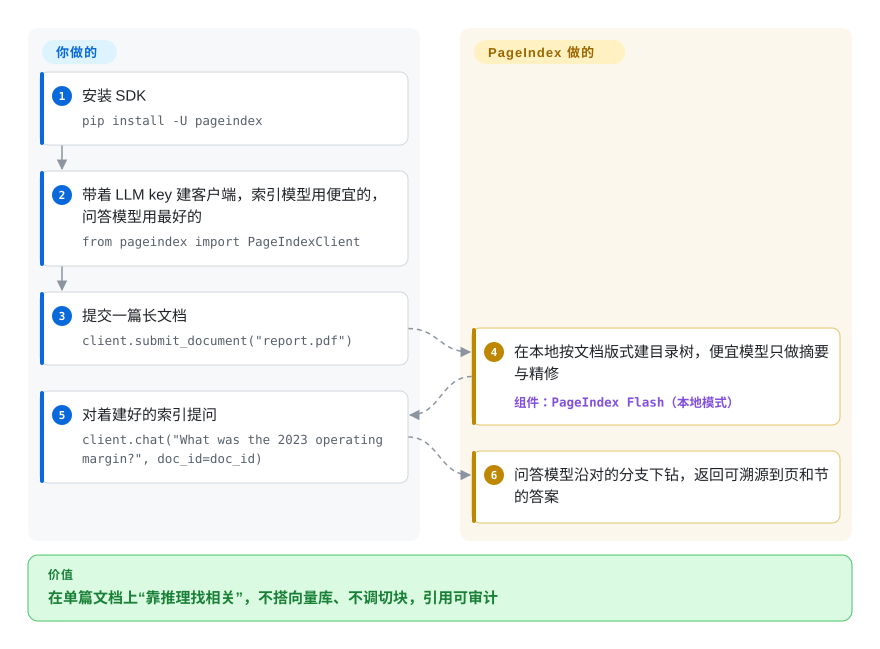

# PageIndex

在财报、手册、教材这类长专业文档上，向量 RAG 常召回与问题“相似”却并不“相关”的片段，答案还脱离出处。PageIndex 把每篇文档按版式建成一棵目录树，查询时让 LLM 沿树“推理”到正确的章节：不嵌入、不搭向量库，答案能溯源到页码。

## 何时使用

你在为一小批长而有结构的文档——财报、监管 PDF、技术手册、研究论文——构建问答或 agent，而你已经亲眼看到向量 RAG 在一个具体地方翻车：它召回的 chunk 和问题“语义上接近”，但其实并不“相关”；同时领域专家不敢信任那些和出处脱节的答案。你希望检索像人类分析师那样翻到正确的章节，并且每条答案都标注具体的页/节，从而可审计。PageIndex 用这个思路解决问题：把文档解析成层级树（章、节、节点摘要），在查询时让 LLM 去*导航*这棵树——读摘要、推理该往哪个分支下钻——而不是比对嵌入向量。无需搭建向量库，无需调 chunk 大小，也无需托管嵌入模型；索引就是文档自身的结构。

当“相似 ≠ 相关”正是你的真实痛点、且语料规模有限到能负担每次查询的 LLM 树遍历时，它非常合适。项目自报在 FinanceBench 文档问答基准上达到 98.7% 准确率 [未验证]；自 2026-08 起，开源仓库真有了 SDK（`pip install -U pageindex`）：用你自己的 LLM key 在本机完成索引、检索、问答，也可把同一个客户端指向 PageIndex Cloud。官方文档示范把 PageIndex 工具接进 OpenAI Agents SDK 或 Claude Agent SDK，于是你可以把一篇长 PDF 交给一个能就其结构推理的 agent，返回带页码锚点、可溯源的引用。

## 怎么用起来

PageIndex 一次只服务一篇文档。建索引时生成一棵层级树——章、节、每个节点的摘要——而当前 SDK 里树的*骨架*直接来自文档版式、不动用 LLM：便宜模型只负责摘要与精修节点（README 的原话建议：`index=` 用便宜模型，`chat=` 用你负担得起的最好模型）。检索则与向量搜索相反：问答模型读节点摘要、决定往哪个分支下钻，一路走到相关章节——所以答案引用的是一页真实的页/节，而不是漂浮的片段。本地模式在你机器上跑，花的是你自己 key 的额度（README 自估本地索引约每页 $0.001）；2026-08 起，面向文本 PDF 的快速建树器 PageIndex Flash 是本地默认。仍然归你管的：模型 key 与每次查询的 token 预算、模型选型，以及跨出单文档之后的部分——扫描件与图片型 PDF、块级引用、文件夹、MCP server、百万文档级的“File System”语料索引，都是 Cloud 的能力，不在开源库里。

<!-- flow-steps:begin (generated from flows/pageindex.json by tools/flow_card.py — do not edit) -->

流程文字版

1. **你**：安装 SDK — `pip install -U pageindex`
2. **你**：带着 LLM key 建客户端，索引模型用便宜的，问答模型用最好的 — `from pageindex import PageIndexClient`
3. **你**：提交一篇长文档 — `client.submit_document("report.pdf")`
4. **PageIndex**：在本地按文档版式建目录树，便宜模型只做摘要与精修 — 组件：`PageIndex Flash（本地模式）`
5. **你**：对着建好的索引提问 — `client.chat("What was the 2023 operating margin?", doc_id=doc_id)`
6. **PageIndex**：问答模型沿对的分支下钻，返回可溯源到页和节的答案

**价值**：在单篇文档上“靠推理找相关”，不搭向量库、不调切块，引用可审计

<!-- flow-steps:end -->

## 何时不用

- **面向数百万短文档的大规模 / web 级检索。** 每次查询都做 LLM 树遍历，每次查找都要花 token 和延迟；对一个巨大扁平集合做广度优先检索时，嵌入 + ANN 向量库（Qdrant / pgvector，未收录）便宜得多也快得多。OSS 仓库面向单文档树；语料级的 **PageIndex File System** 在 README 里明确标注为 Cloud-only，不在开源库内。
- **你要一套自带闭环、零 LLM 账单的系统。** 树的*骨架*由版式推得，但建索引时的节点摘要与每次查询的树导航都要过模型，没有“完全不碰模型”的模式。
- **短文档、无结构或扁平文档。** 全部价值都在那棵目录树上。一篇没有有意义章节层级的文档（聊天记录、扁平 CSV、一页备忘）给推理器无可导航之物；普通切块就够了。
- **你想要生产级的“Cloud / MCP / API”管线，而非这个仓库。** README 自带的本地/云对比表把 MCP server、块级引用、扫描件 OCR、文件夹与元数据都标为 Cloud-only；Vectify 主推托管版 PageIndex 平台（App、托管 API、VPC/本地部署）。OSS 仓库是索引内核加本地 SDK，不是那套服务。
- **你需要图数据库或跨语料的多跳实体遍历。** PageIndex 索引的是单篇文档的结构，不是知识图谱。要做跨语料的实体/关系遍历，见 [FalkorDB](falkordb.zh.md) 或下面的图构建工具。
- **你需要定型的 1.0 表面。** 当前是 v0.2.x 线（v0.2.19 发布于 2026-09-21），v0.3.0 的 dev 预览版已经挂出；SDK 参数与模型命名约定仍可能变。

## 横向对比

| 替代品 | 是否收录 | 我们的评价 | 取舍 |
|---|---|---|---|
| [FalkorDB](falkordb.zh.md) | ✅ | 需要 GraphRAG 的持久化属性图，而不是单文档推理树时，选 FalkorDB。 | 面向 GraphRAG 的属性图数据库（向量 + 多跳遍历）；PageIndex 是单文档推理树，不是图存储——检索原语不同。 |
| [graphify](graphify.zh.md) | ✅ | 目标是代码/文档知识图谱，而不是单篇文档的目录树时，选 graphify。 | 从代码/文档构建知识图谱；PageIndex 为单篇文档构建层级目录树并在其上推理——没有实体图。 |
| [code-review-graph](code-review-graph.zh.md) | ✅ | 目标是专门的 code-review 图时，选 code-review-graph。 | 专做 code-review 的图工具；与文档树检索正交。 |
| [LlamaIndex](../agent-frameworks/workflow-builders/llamaindex.zh.md) | ✅ | 需要包含多种索引类型的通用 RAG 框架，而不是单一无向量推理索引时，选 LlamaIndex。 | 通用 RAG 框架，含多种索引（包括树/摘要索引）；覆盖广得多且以嵌入为中心，而 PageIndex 是聚焦的无向量推理索引。 |
| RAPTOR | 未收录 | 需要递归聚类 + 摘要树，并在查询时仍走嵌入检索时，选 RAPTOR。 | 递归聚类 + 摘要构建检索树，但查询时仍靠嵌入检索；PageIndex 改为用 LLM 推理导航这棵树，而非向量搜索。 |
| pgvector / Qdrant | 未收录 | 经典嵌入 + ANN 向量检索已经足够、且更重视规模成本时，选向量库。 | 经典的嵌入 + ANN 向量检索；在规模与广度上更便宜，但正是 PageIndex 要规避的“相似 ≠ 相关”失败模式。 |

## 技术栈

- **语言：** Python。
- **建索引：** 把 PDF / Markdown 解析成层级树（章、节、节点摘要），形如一份目录；SDK 本地模式下树骨架由版式直接推得（不动用 LLM），2026-08 起文本 PDF 默认用快速建树器 PageIndex Flash。
- **检索：** 在树上做 LLM 推理（导航并下钻），而非向量相似度——无嵌入模型、无 ANN 索引。
- **LLM 接入：** 默认 OpenAI（`OPENAI_API_KEY`）。`litellm` 仍钉在 `requirements.txt` 里，但 README 已不再描述多家路由。[未验证]
- **入口：** SDK（`pip install -U pageindex`、`from pageindex import PageIndexClient`）；旧 CLI `run_pageindex.py` 仍在仓库根目录。
- **相邻物料：** `cookbook/` 与 `examples/` 目录；官方文档示范把 PageIndex 工具接进 OpenAI Agents SDK 或 Claude Agent SDK。

## 依赖

- **运行时：** Python >= 3.10（PyPI `requires-python`，2026-09）；`pip install -U pageindex`，或克隆仓库并按钉死的 `requirements.txt`（openai、litellm、PyPDF2/pypdfium2、openai-agents、mcp）安装。
- **必需：** 一个 LLM API key——开箱即用是 `OPENAI_API_KEY`；若把同一个客户端指向 PageIndex Cloud，则换成 PageIndex 的 API key。
- **无基础设施：** 没有向量数据库、没有嵌入服务、没有需要运维的独立数据存储——索引就是描述这棵树的文件/JSON。
- **成本依赖：** 节点摘要与每次查询都内在地消耗 LLM token（不是可以拿掉的可选基础设施）；README 自估本地索引约每页 $0.001。

## 运维难度

**低。** 几乎没有基础设施要跑：`pip install -U pageindex`、设好 API key、提交一个 PDF，就得到一棵可查询的树——没有向量库要供给、调优或备份。真正的运维关注点不是服务器，而是 **LLM 成本与延迟**：每次查询都用模型调用在树上推理，所以每次查询的 token 花费和响应时间才是你的扩展上限，你要预算并观测 API 用量，而非内存或磁盘。可复现性与质量还系于所选模型，这是个会变动的依赖。至于托管/MCP/VPC 管线，运维转移到托管产品上，超出 OSS 仓库范围。

## 健康度与可持续性

- **响应速度——雷达降到 D。** 中位首响恶化（雷达 D，2026-09-28；2026-09-22 那轮还是 C，7 个 issue 中位约 558 小时）。上百个 open issue 的排队处理要预期偏慢。
- **维护——活跃，且从此有版本可 pin。** 最后一次 push 在 2026-09-24，未归档。旧的“完全没有打 tag 的 release”已成历史：**现有 17 个 GitHub release，最新稳定版 v0.2.19（2026-09-21），PyPI 上还挂了 v0.3.0.dev 预览**，包名 `pageindex`——从此 pin 版本号而不是 commit。但 pre-1.0 的活跃开发仍意味着你跟的是移动靶；README 自估的本地索引约每页 $0.001 也只是它自己的数字。
- **治理 / 背书——单一厂商（Vectify AI）。** 仓库为 **Organization** 所有（`VectifyAI/PageIndex`），约 35.9k star（GitHub API，2026-09-28）。路线图由厂商驱动，开源仓库是更大商业产品的*索引内核*——README 自带的本地/云对比表把 OCR、块级引用、MCP server、文件夹与语料级 File System 都划到了托管侧。这是一条写开了的 open-core 边界，最好的能力落在托管层，风险照旧。
- **年龄与 Lindy——约 1.5 年（创建于 2025-04-01）。** 够久到跑出了真实基准（98.7% FinanceBench，自报）并沉淀出 v0.2.x 发布线，但还不够久到成为 Lindy 意义上的安全选择。当作有潜力的年轻库，而非已定型的标准。
- **采用度——雷达 C。** PyPI 包 `pageindex` 月下载约 5.5 万（评分器，2026-09-28），依赖图信号弱；“无向量 RAG”的提法有可见的心智占有，但 star 数不是生产采用的证明。MIT 许可证，未观察到 relicense——但在假定某能力在仓库里之前，先核实开源与托管的边界。

## 存疑（未验证）

- [未验证] 截至 2026-09-28 约 35.9k star、约 3.2k fork（GitHub API）——易变且对时间敏感；“采用度”含义未经核实。
- [未验证] 98.7% FinanceBench 准确率与“显著优于向量 RAG”是项目自报数字；基准结果依赖具体设置，本页未独立复现。
- [未验证] `litellm` 仍钉在 `requirements.txt`，但其多家路由在 README 已不再描述；OpenAI/Claude Agents SDK 的接法来自文档链接，未复现。依赖前请对照当前包核实。
- [推断] 响应轴降档（C→D）反映的是评分器近窗数据，未逐个 issue 实测响应时间。
- [未验证] 本地索引约每页 $0.001 是 README 自估；token 价格与文档密度会改变它。
- [未验证] 除 PDF/Markdown 外的确切支持格式来自验证时的 README 与仓库内容，可能变动。
