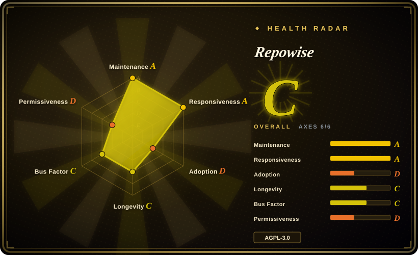
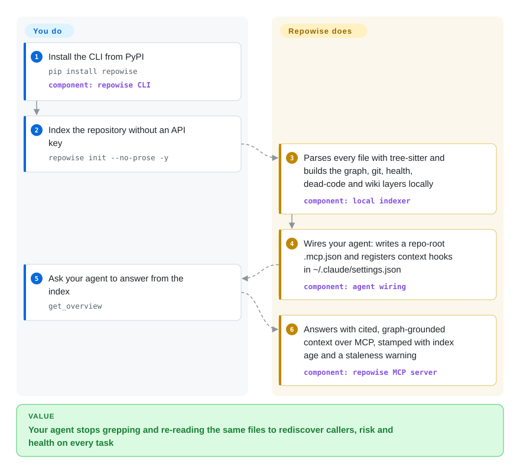

# Repowise

Your coding agent pays the same tax on every task — grep, open six files, still miss the caller two hops away, forget it all next session — and it can't tell you what breaks when you touch `src/auth.py`. Repowise indexes code, git history, tests, docs and decisions once on your machine, then serves cited answers, change risk, dead code and 1–10 file health scores to your agent over MCP, with no API key needed for the deterministic core.

## When to use

You work in a large, aging codebase through Claude Code, Codex or Cursor, and every structural question — *who calls this, what breaks if I change it, why is it written this way, which files are actually dangerous* — restarts the same exploration from zero: greps, file reads, tens of thousands of pasted tokens, an answer the agent is not sure of. You want that exploration computed once and kept fresh, and you want it to run without sending code to anyone: `repowise init --no-prose -y` parses 26 AST-parsed languages with tree-sitter, reads your git history, scores every file for defect risk / maintainability / performance with 51 deterministic detectors, finds dead code, and renders a wiki from the structure — zero LLM calls, one pip install, no Docker.

You pick Repowise over the nearer code-graph tools because of the surface area in that one local index: the graph plus git hotspots, bug-fix history, change-risk scoring for `main..HEAD`, test-impact lists, architectural decisions mined from your history (and optionally from your own agent transcripts), proactive hooks that push context into a Claude Code session instead of waiting to be asked, and auto-generated `CLAUDE.md`/`AGENTS.md`. Against Ix you also avoid Docker and a closed-source backend; against graphify you avoid an LLM in the build path. The price is a six-month-old v0.x project under AGPL-3.0 whose roadmap is steered by a small vendor team — see Health.

## How it works

One `pip`-installed Python process does both halves. `repowise init` parses every source file into ASTs with tree-sitter (a parser library that turns source text into a syntax tree per language), resolving imports and call edges with confidence stamps, while a git layer extracts hotspots, ownership, co-change and bug-fix history. From those raw layers it derives, deterministically, the wiki pages, the 1–10 health score, dead-code findings and change risk — think of it as surveying the ground once and keeping a map office, instead of re-walking the field for every question. You then index once, register `repowise update` (or a post-commit hook / file watcher) to keep the map current, and the `repowise mcp` server answers your agent's calls; the same index also feeds `repowise serve`'s local dashboard, the VS Code extension, and a hosted GitHub PR bot. Opt-in features — model-written wiki prose, semantic search, comment-archaeology decisions — call the provider you configure with your own key directly; the docs state nothing leaves your machine otherwise, and session-start/PostToolUse hooks read only the local SQLite index and git [未验证].

<!-- flow-steps:begin (generated from flows/repowise.json by tools/flow_card.py — do not edit) -->

Text version of the flow

1. **You**: Install the CLI from PyPI — `pip install repowise` — component: `repowise CLI`
2. **You**: Index the repository without an API key — `repowise init --no-prose -y`
3. **Repowise**: Parses every file with tree-sitter and builds the graph, git, health, dead-code and wiki layers locally — component: `local indexer`
4. **Repowise**: Wires your agent: writes a repo-root .mcp.json and registers context hooks in ~/.claude/settings.json — component: `agent wiring`
5. **You**: Ask your agent to answer from the index — `get_overview`
6. **Repowise**: Answers with cited, graph-grounded context over MCP, stamped with index age and a staleness warning — component: `repowise MCP server`

**Value**: Your agent stops grepping and re-reading the same files to rediscover callers, risk and health on every task

<!-- flow-steps:end -->

## When NOT to use

- **You only need a call graph and want it fast.** Repowise's own benchmarks put full-index time on `django` at 366.8 s versus 16.4 s for the graph-only tool CodeGraph (not indexed) — ~22×, ~135× with prose generation on; the project itself says "if a call graph is all you need, that is the right trade and you should take it." For a minimal pip-plus-SQLite blast-radius graph use [code-review-graph](code-review-graph.md); for a watched graph database use [Ix](ix.md).
- **You need compiler-grade symbol resolution.** The edges are tree-sitter inference, not type checking; Repowise measured its own call-edge precision at 84.8% — about one edge in seven is wrong — and concedes the highest-recall Go cells. For exact go-to-definition and edits through real language servers, use Serena (not indexed).
- **You plan to embed the engine in a product you ship.** AGPL-3.0 copyleft makes that a commercial-license conversation with the vendor. For a permissive path build on [SCIP](scip.md) indexes served by [Sourcegraph](sourcegraph.md), or MIT [code-review-graph](code-review-graph.md).
- **Your corpus is prose, not code.** Repowise indexes code, its own generated wiki, git history and decisions; questions over your PDFs, schemas or meeting notes are [graphify](graphify.md) territory, and long structured documents are [PageIndex](pageindex.md).
- **You want a centrally served cross-repository search for a whole org today.** Workspace/estate mode and the enterprise surfaces (RBAC, SSO, Helm, air-gap) are GA-to-planned per the vendor's own matrix, with several items "rolling out"; for a mature multi-tenant route use [Sourcegraph](sourcegraph.md).
- **You need to trust the numbers independently.** The savings and benchmark claims are author-run (admirably published with losing rows, but not reproduced by a third party); treat −31.6% tokens and 2.3× defect yield as vendor evidence, not neutral fact.
- **You need a five-year track record.** Six months old, v0.x, release every ~3 days, ~78% of listed-contributor commits from one person [推断] — pin a version and expect churn.

## Comparison

| Alternative | In index | Our verdict | Tradeoff |
|---|---|---|---|
| [code-review-graph](code-review-graph.md) | ✅ | If you want the smallest possible "give my agent a code graph" step — one pip install, one SQLite file, MIT — pick code-review-graph; pick Repowise when you want the graph plus git hotspots, health scores, change risk, dead code, decisions and proactive hooks in one index. | code-review-graph is minimal and permissively licensed but narrow (blast-radius files for a reviewer) and Python-runtime; Repowise is broad and local-first but AGPL and much heavier in surface. |
| [graphify](graphify.md) | ✅ | When the graph must cover docs, schemas, PDFs and media next to code, pick graphify; when the core answers must be deterministic — no LLM in the build path, no key — pick Repowise. | graphify pays tokens and model variance to ingest everything; Repowise buys zero-LLM determinism but only indexes code, its own wiki, git and decisions. |
| [Ix](ix.md) | ✅ | Pick Repowise when you will not run Docker or trust a closed backend — its whole analysis path is one AGPL Python package plus local SQLite/LanceDB; pick Ix when you want the graph in a real database (ArangoDB) with a watcher and visualizer and accept the vendor binary. | Ix spreads Apache-2.0 CLI over a closed Scala/ArangoDB backend; Repowise ships everything open but under copyleft, and its full index is slower than Ix's mapping. |
| Serena | not indexed | When the agent's job is precise symbol navigation and edits through real language servers, pick Serena; when the questions are relational — callers, blast radius, risk, hotspots, dead code — answered from one precomputed index, pick Repowise. Not added in this tab-intake batch. | Serena needs a working LSP per language and is exact where it answers; Repowise covers 26 languages without language servers but stamps its edges ~85% precise. |
| CodeScene | 非仓库 | A proprietary commercial code-health product (on-prem Docker distribution, no open source), so it is out of scope for this index by shape. When you want a polished vendor list of risky files with support, it is the incumbent; when you want self-hostable, inspectable health scoring served to agents, Repowise is the open path. | Repowise's own head-to-head (2,770 files) claims 2.3× CodeScene's defect yield at a 20% review budget while conceding CodeScene's shorter flag list is more precise (0.636 vs 0.580); the numbers are author-run. |

## Tech stack

- **Core (Python ≥ 3.11):** tree-sitter with ~20 bundled grammar packages plus `tree-sitter-language-pack`; `sqlglot` for SQL/dbt lineage; `networkx` + `scipy` (+ optional `graspologic` extra) for graph analysis; SQLAlchemy async + `aiosqlite` + `alembic` for the SQLite store (`.repowise/wiki.db`, optional Postgres via `pgvector`+`asyncpg` extra); LanceDB for vectors; FastAPI + uvicorn for the API; the `mcp` SDK for the stdio server; Click + Rich CLI; `watchdog` + APScheduler for sync; `gitpython` over the local git data.
- **LLM SDKs bundled in the base package:** `anthropic`, `openai`, `google-genai`, `litellm` — used only by opt-in prose/semantic/decision-minting features.
- **Frontend and editor surfaces:** Node ≥ 20 TypeScript monorepo (`packages/ui`, `web`, `api-client`, `vscode`) for the dashboard and the VS Code extension (Marketplace / Open VSX); Claude Code and Codex plugin content ships from `plugins/` in the same repo; distribution via the `repowise` wheel on PyPI (81 releases as of v0.53.0, 2026-09-24).

## Dependencies

- **On the machine:** Python 3.11+ and git. No API key, no Docker, no database server for the deterministic path; Node 20+ is needed only for the dashboard from source (otherwise `repowise serve` downloads a ~50 MB prebuilt frontend once and caches it in `~/.repowise/web/`, or you run the provided Docker image).
- **State:** a per-repo `.repowise/` directory (SQLite `wiki.db` + LanceDB vectors + config); machine-wide state in `~/.repowise/`.
- **Optional services:** Postgres + pgvector for team/server deployments (the enterprise topology runs API, workers, dashboard, Postgres and LanceDB containers); an embedder (any configured provider, or Ollama) for semantic search; an API key only for model-written wiki prose.
- **Network:** analysis reads only local files and git. The hosted PR bot (GitHub App) and repowise.dev are vendor cloud services — whether they touch code beyond public-repo snapshots was not audited [未验证]. The CLI ships anonymous, opt-out usage telemetry per its docs.

## Ops difficulty

**Low for the single-developer local path, Medium for the team/server path.** Locally it is `pip install`, `init`, `serve`, then `repowise update` or the post-commit hook / `repowise watch` daemon keeping the index current; `repowise doctor` diagnoses drift and `repowise uninstall --dry-run` lists exactly what the tool wrote (note `init` edits `~/.claude/settings.json` machine-wide by default — use `--no-editor-setup` on shared boxes). The heavier surfaces — multi-repo workspaces, hosted prose costs, the enterprise container topology — are young (workspace dashboards are "in development" on the vendor's own matrix) and the ~3-day release cadence on a v0.x means pin versions and re-index after upgrades.

## Health & viability

- **Maintenance (2026-09-28):** extremely active — pushed the same day; v0.53.0 released 2026-09-24, v0.46→v0.53 across one month (2026-08-27→09-24), 81 PyPI releases since 2026-03; 214 open vs ~340 closed issues, and fresh issues receive same-day comments.
- **Governance / bus factor:** the `repowise-dev` GitHub organization (created 2026-03-29, no foundation); the top listed contributor has 1,352 commits vs 151 for #2 — a vendor team with one dominant author. [推断] Roadmap control sits with that small team, per README's "a small team building this in the open".
- **Backing & longevity:** commercial dual-licensing (AGPL + paid enterprise) and a hosted SaaS at repowise.dev imply a company, though no legal entity is named in the repo. Six months old, so it fails the Lindy prior by age; the steep 0→7.1k stars makes durability, not track record, the open question.
- **Adoption (2026-09-28):** 7,075 stars, 748 forks; 14,010 PyPI downloads in the last month (measured for the health block); VS Code extension, Claude Code plugin, MCP registry entries, Discord; no independent production-user list verified.
- **Risk flags:** AGPL-3.0 + commercial dual license (embedding requires the vendor); all capability/benchmark claims are self-measured; heavy marketing README (call it out and read the published losing rows); v0.x churn; roadmap items (GHE/GitLab/Bitbucket, SSO/SCIM, RBAC, Helm, air-gap) still "rolling out" or "planned" per COMMERCIAL.md; prior same-author repo (skiplevel, 15 stars) shows no history of long-lived projects.

## Caveats (unverified)

- [未验证] Every number in README/docs/BENCHMARKS.md (−31.6% agent output tokens, 0.876 file coverage, 84.8% edge precision, 366.8 s django index, ROC AUC 0.737, 2.3× vs CodeScene) is author-run; not reproduced for this page, though the project publishes methodology and losing rows.
- [未验证] "Zero LLM calls / nothing uploaded" for the deterministic core is asserted in README, QUICKSTART and HOOKS.md; the source of every call path was not audited here.
- [未验证] Telemetry defaults (anonymous, opt-out) and the claim that optional LLM features talk directly to your provider ("Repowise does not proxy those calls") — from the Privacy section only.
- [未验证] Data handling of the hosted PR bot (GitHub App `repowise-bot`) and repowise.dev cloud — no published pipeline audit was found; the docs cover the self-hosted threat model instead.
- [推断] Bus factor ~1–2: computed from the first page of `gh api …/contributors` (1,352 vs 151 vs 68 commits, 2026-09-28), not a full-commit-history census.
- [推断] The 7.1k-stars-in-6-months curve is a popularity-hype signal to discount as a quality indicator; no third-party star-history data was checked for bot spikes.
- [未验证] The 26-AST-languages / five-rung support matrix and per-tier quality claims are the project's own tables; only the dependency list (grammar packages in pyproject.toml) corroborates breadth.
- [未验证] Stars/forks/issues/releases/downloads are volatile, as of 2026-09-28 via `gh api` and pypistats.org.
