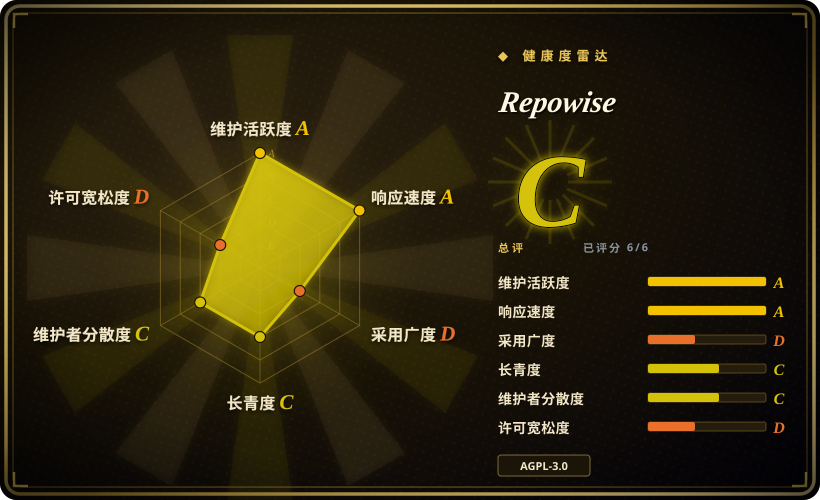
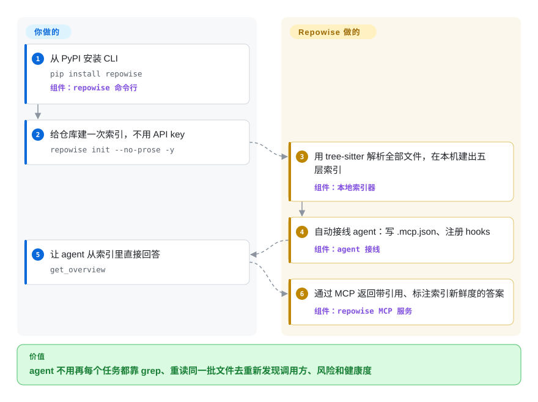

# Repowise

编码 agent 每个任务都在交同一笔税：grep、打开六个文件、照样漏掉隔两层的调用方，下个会话再来一遍；你问“改 `src/auth.py` 会坏什么”，它答不上来。Repowise 在你本机一次性把代码、git 历史、测试、文档和架构决策建成索引，再通过 MCP 把带引用的答案、变更风险、死代码和 1–10 的文件健康分喂给 agent——确定性核心不需要任何 API key。

## 何时使用

你在大而陈旧代码库上用 Claude Code、Codex 或 Cursor 干活，每个结构性问题——“谁调用这个函数、改它会坏什么、当年为什么这么写、哪些文件真正危险”——都要从零重走一遍探索：grep、翻文件、往上下文里塞几万 token，agent 对自己的答案也没把握。你想要的是把探索只算一次、保持新鲜，而且不把代码交给任何人：`repowise init --no-prose -y` 用 tree-sitter 解析 26 种 AST 语言、读你的 git 历史、用 51 个确定性检测器给每个文件打缺陷风险／可维护性／性能分、找死代码、从结构渲染出 wiki——零大模型调用，一条 pip 装完，不用 Docker。

选它而不是更近的几款代码图工具，理由是那一张本地图上的覆盖面：图之外还有 git 热点、修 bug 历史、`main..HEAD` 的变更风险评分、测试影响清单、从历史里挖出的架构决策（还可以选装：挖你自己的 agent 会话记录）、主动把上下文推进 Claude Code 会话的 hooks，以及自动生成 `CLAUDE.md`／`AGENTS.md`。对 Ix，你还免掉了 Docker 和闭源后端；对 graphify，建图路径里没有大模型。代价是：一个六个月大、v0.x、AGPL-3.0 的项目，路线图由一家小厂商团队掌舵——见健康度一节。

## 怎么用起来

一个 `pip` 装好的 Python 进程把两半都干了。`repowise init` 用 tree-sitter（一个把各种语言源码解析成语法树的解析库）把每个源文件解析成 AST，带置信度地解析 import 和调用边；git 层同时抽出热点、归属、共同变更和修 bug 历史。在这两层原始数据之上，它确定性地推导出 wiki 页面、1–10 健康分、死代码发现和变更风险——相当于实地测绘一次、之后开一个地图局，而不是每次提问都重新走一遍地形。你只需建一次索引，再挂上 `repowise update`（post-commit 钩子或文件守护进程）让地图保持最新，`repowise mcp` 服务就能回答 agent 的调用；同一张索引还喂给 `repowise serve` 的本地看板、VS Code 扩展和托管的 GitHub PR 机器人。可选项——模型撰写的 wiki 散文、语义检索、注释考古决策——用你自己配置的 key 直连你选的模型；文档声称其余时间没有任何东西离开本机，SessionStart／PostToolUse 钩子只读本地 SQLite 索引和 git [未验证]。

<!-- flow-steps:begin (generated from flows/repowise.json by tools/flow_card.py — do not edit) -->

流程文字版

1. **你**：从 PyPI 安装 CLI — `pip install repowise` — 组件：`repowise 命令行`
2. **你**：给仓库建一次索引，不用 API key — `repowise init --no-prose -y`
3. **Repowise**：用 tree-sitter 解析全部文件，在本机建出五层索引 — 组件：`本地索引器`
4. **Repowise**：自动接线 agent：写 .mcp.json、注册 hooks — 组件：`agent 接线`
5. **你**：让 agent 从索引里直接回答 — `get_overview`
6. **Repowise**：通过 MCP 返回带引用、标注索引新鲜度的答案 — 组件：`repowise MCP 服务`

**价值**：agent 不用再每个任务都靠 grep、重读同一批文件去重新发现调用方、风险和健康度

<!-- flow-steps:end -->

## 何时不用

- **你只想要一张调用图、而且要快。** Repowise 自己的基准给出 `django` 全量索引 366.8 秒，而纯建图的 CodeGraph（未收录）只要 16.4 秒——约 22 倍，开散文生成后约 135 倍；项目自己都承认“如果调用图就是你要的全部，这个取舍是对的”。要最小的“pip 加一个 SQLite 文件”式影响面图，用 [code-review-graph](code-review-graph.zh.md)；要带监听的图数据库，用 [Ix](ix.zh.md)。
- **你需要编译器级精度。** 这些边是 tree-sitter 推断，不是类型检查：Repowise 自评调用边精确率 84.8%——差不多每七条边就错一条——并且承认 Go 的最高召回格不是它。要通过真正的语言服务器做精确跳转定义和编辑，用 Serena（未收录）。
- **你打算把引擎嵌进自己要发布的产品。** AGPL-3.0 的传染条款让这条路变成和厂商谈商业授权。要走宽松许可，基于 [SCIP](scip.zh.md) 索引配 [Sourcegraph](sourcegraph.zh.md)，或 MIT 的 [code-review-graph](code-review-graph.zh.md)。
- **你的语料是文字材料而不是代码。** Repowise 索引的是代码、它自己生成的 wiki、git 历史和决策；问 PDF、schema、会议记录，该用覆盖文档多模态的 [graphify](graphify.zh.md)，长结构化文档用 [PageIndex](pageindex.zh.md)。
- **你要今天就有一个全组织集中服务的跨仓检索。** workspace／estate 模式和企业能力（RBAC、SSO、Helm、离线包）按厂商自己的矩阵还停在“滚动发布”或“计划中”；成熟的多租户路线用 [Sourcegraph](sourcegraph.zh.md)。
- **你需要独立可信的数字。** 省 token 和各种基准都是作者自己跑的（把输的行列也公开了，很难得，但没有第三方复现）；−31.6% token、2.3 倍缺陷捕获率都应按厂商证据对待，不是中立事实。
- **你需要五年以上的可靠记录。** 六个月大、v0.x、约每 3 天一个发布、列出的贡献者里约 78% 的提交出自一人 [推断]——锁版本，并接受接口会变。

## 横向对比

| 替代品 | 是否收录 | 我们的评价 | 取舍 |
|---|---|---|---|
| [code-review-graph](code-review-graph.zh.md) | ✅ | 想给 agent 一张代码图、只要一步装好——一个 pip、一个 SQLite 文件、MIT——选 code-review-graph；想一张索引里同时有图、git 热点、健康分、变更风险、死代码、决策和主动推送的 hooks，选 Repowise。 | code-review-graph 极小、许可宽松，但面窄（给评审器喂影响面文件）、运行时绑 Python；Repowise 覆盖广且本机自持，但 AGPL、体量重得多。 |
| [graphify](graphify.zh.md) | ✅ | 图里必须连文档、schema、PDF、媒体一起覆盖时选 graphify；核心答案必须确定性——建图路径里没有大模型、不要 key——选 Repowise。 | graphify 为“万物入库”付出 token 和模型波动；Repowise 换来零大模型的确定性，代价是只索引代码、自家 wiki、git 和决策。 |
| [Ix](ix.zh.md) | ✅ | 不能跑 Docker、也不接受闭源后端时选 Repowise——整条分析链就是一个 AGPL Python 包加本地 SQLite／LanceDB；想要图真正存在图数据库（ArangoDB）里、带监听和可视化、接受厂商二进制，选 Ix。 | Ix 是 Apache-2.0 前端配 Scala／ArangoDB 闭源后端；Repowise 全部开源但带传染条款，且全量建索引比 Ix 的建图慢。 |
| Serena | 未收录 | agent 的任务是借真实语言服务器做精确符号导航和编辑时选 Serena；问题是关系型的——调用方、影响面、风险、热点、死代码——要一张预先算好的索引来回答时选 Repowise。本批 tab intake 未收录。 | Serena 每种语言都要装好并跑好对应 LSP，答出来精确；Repowise 不用语言服务器覆盖 26 种语言，但边只自评约 85% 精确。 |
| CodeScene | 非仓库 | 它是专有商业代码健康产品（本地 Docker 发行、无开源），按形态就不在本索引范围。想要一份有厂商支持、精短的风险文件清单，它是老牌；想要可自持、可审计、通过 MCP 服务 agent 的健康评分，Repowise 是开源路线。 | Repowise 自己的对照（2,770 个文件）称在 20% 审查预算下捕获缺陷是 CodeScene 的 2.3 倍，同时承认 CodeScene 那份更短的标记清单精确率更高（0.636 对 0.580）；数字均为作者自测。 |

## 技术栈

- **核心（Python ≥ 3.11）：** tree-sitter 加约 20 个语法包和 `tree-sitter-language-pack`；SQL/dbt 血缘用 `sqlglot`；图分析用 `networkx` + `scipy`（可选 `graspologic` extra）；SQLite 存储（`.repowise/wiki.db`）用 SQLAlchemy async + `aiosqlite` + `alembic`，可选 Postgres（`pgvector` + `asyncpg` extra）；向量用 LanceDB；API 用 FastAPI + uvicorn；stdio MCP 服务用 `mcp` SDK；CLI 用 Click + Rich；同步靠 `watchdog` + APScheduler；git 数据走 `gitpython`。
- **基础包内捆绑的 LLM SDK：** `anthropic`、`openai`、`google-genai`、`litellm`——只被可选的散文／语义／决策落笔功能使用。
- **前端与编辑器面：** Node ≥ 20 的 TypeScript monorepo（`packages/ui`、`web`、`api-client`、`vscode`）承载看板和 VS Code 扩展（Marketplace／Open VSX）；Claude Code 与 Codex 的插件内容随同一仓库的 `plugins/` 发布；发行物是 PyPI 上的 `repowise` wheel（截至 v0.53.0 共 81 个发布，2026-09-24）。

## 依赖

- **机器上需要：** Python 3.11+ 和 git。确定性路线不需要 API key、Docker 或数据库服务；只有从源码起看板才要 Node 20+（否则 `repowise serve` 首次下载约 50 MB 预构建前端、缓存到 `~/.repowise/web/`，或改跑官方 Docker 镜像）。
- **状态：** 每个仓库一个 `.repowise/` 目录（SQLite `wiki.db` + LanceDB 向量 + 配置）；机器级状态在 `~/.repowise/`。
- **可选服务：** 团队／服务器部署可选 Postgres + pgvector（企业拓扑是 API、worker、看板、Postgres、LanceDB 多容器）；语义检索需要配一个 embedder（任意已配模型商，或本机 Ollama）；模型撰写 wiki 散文才需要 API key。
- **网络：** 分析只读本地文件和 git。托管 PR 机器人（GitHub App `repowise-bot`）与 repowise.dev 是厂商云服务——除公开仓库快照外是否触碰代码，未审计 [未验证]。按文档，CLI 默认带匿名、可关闭的使用遥测。

## 运维难度

**单人本机路线是低，团队／服务器路线是中。** 本机就是 `pip install`、`init`、`serve`，之后靠 `repowise update` 或 post-commit 钩子／`repowise watch` 守护进程保持索引最新；`repowise doctor` 诊断漂移，`repowise uninstall --dry-run` 列出工具写过的每个位置（注意 `init` 默认会改机器级 `~/.claude/settings.json`——公共机器上加 `--no-editor-setup`）。更重的面——多仓 workspace、托管散文的费用、企业容器拓扑——都还年轻（workspace 看板在厂商矩阵上标着“开发中”），而 v0.x 约每 3 天一发意味着锁版本、升级后重建索引。

## 健康度与可持续性

- **维护（2026-09-28）：** 极其活跃——当天仍在推送；v0.53.0 发布于 2026-09-24，v0.46→v0.53 只跨一个月（2026-08-27→09-24），自 2026-03 起 PyPI 已发 81 个版本；开放 issue 214 对约 340 已关闭，新 issue 当天就有人回复。
- **治理与巴士因子：** 属 `repowise-dev` GitHub 组织（2026-03-29 创建，非基金会）；列出的贡献者里第一名提交 1,352 次，第二名只有 151 次——一家作者高度集中的厂商团队。[推断] 路线图握在这支小队手里（README 自称“a small team building this in the open”）。
- **背后力量与寿命：** AGPL + 付费企业的双许可和 repowise.dev 托管服务指向一家公司，但仓库里没写法人实体。六个月大，按年龄不满足 Lindy 先验；0→7.1k star 的陡曲线说明要看的是存续性，不是履历。
- **采用情况（2026-09-28）：** 7,075 star、748 fork；PyPI 近一月下载 14,010（为健康度块实测）；有 VS Code 扩展、Claude Code 插件、MCP 目录条目和 Discord；未核实到独立的生产用户名单。
- **风险信号：** AGPL-3.0 + 商业双许可（嵌入产品要找厂商）；能力与基准数字全部为作者自测；README 营销浓度高（要读它公开的“输的行列”来对冲）；v0.x 高频变动；路线图项（GHE／GitLab／Bitbucket、SSO／SCIM、RBAC、Helm、离线包）按 COMMERCIAL.md 仍停在“滚动发布”或“计划中”；同作者前一个仓库（skiplevel，15 star）没有长寿项目的履历。

## 存疑（未验证）

- [未验证] README 与 docs/BENCHMARKS.md 里所有数字（−31.6% agent 输出 token、0.876 文件覆盖率、84.8% 边精确率、366.8 秒 django 索引、ROC AUC 0.737、对 CodeScene 2.3 倍）均为作者自测；本页未复现，尽管项目公布了方法和失利的行列。
- [未验证] “确定性核心零大模型调用／不上传”只有 README、QUICKSTART、HOOKS.md 的自述，本页未逐条审计源码调用路径。
- [未验证] 遥测默认值（匿名、可关闭）与“可选大模型功能直连你的模型商、Repowise 不代理”均出自 Privacy 一节，未验证实现。
- [未验证] 托管 PR 机器人（GitHub App `repowise-bot`）与 repowise.dev 云端的数据处理边界——未找到公开的流水线审计；文档给的是自托管威胁模型。
- [推断] 巴士因子约 1–2：依据 `gh api …/contributors` 第一页（1,352 对 151 对 68 次提交，2026-09-28），不是全量提交统计。
- [推断] 六个月 0→7.1k star 的陡增长应打折为热度信号而非质量信号；未查第三方 star 历史来排除刷量。
- [未验证] “26 种 AST 语言／五级阶梯”的支持矩阵和各层质量是项目自己的表格；本页仅用 pyproject.toml 里的语法包清单佐证了覆盖面。
- [未验证] star／fork／issue／发布日期与 PyPI 下载数都会变动，取自 2026-09-28 的 `gh api` 与 pypistats.org。
