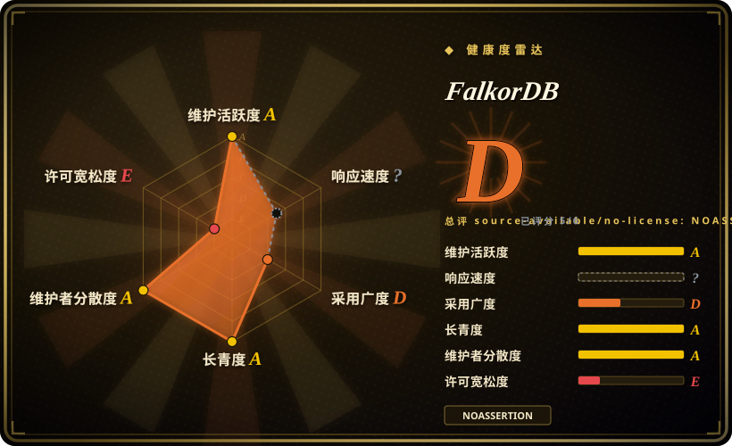
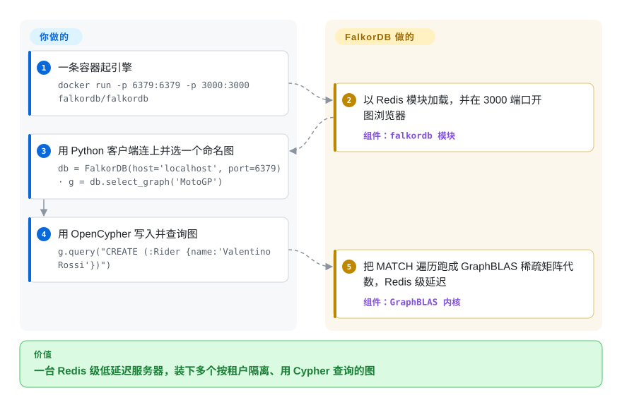

# FalkorDB

你的 GraphRAG 应用需要对同一批事实既做向量相似、又做多跳遍历，而在缓存旁边再立一个图服务意味着两台服务器和两份拷贝的数据。FalkorDB 是一个以 Redis 模块形态加载的属性图数据库，讲 OpenCypher，把向量与全文索引收在同一个内存级速度的引擎里。

## 何时使用

你正在搭一条 GraphRAG 管线：你已经从语料里抽出实体和关系、落进知识图谱，查询时你想把向量相似（“找出和这个问题相近的 chunk”）和多跳图遍历（“再从这些实体走到相关事实，并把路径引用出来”）结合起来。纯向量库做不了遍历，而一个通用图数据库又意味着在你已有的缓存旁边再立一个更重的独立服务。FalkorDB 用“住在 Redis 里、作为模块运行”来解决这个问题：你把它加载进来，用 OpenCypher 建图、建向量/全文/范围索引（见 docs.falkordb.com），然后在同一个低延迟引擎里跑混合检索。它的 GraphBLAS 稀疏矩阵内核让线性代数式的遍历很快，而且你可以在一台服务器上保留许多命名图（`GRAPH.QUERY mygraph ...`）做按租户或按文档的隔离——README 的开场白就是「Ultra-fast, Multi-tenant Graph Database」。

如果你来自 RedisGraph、在 Redis 停掉那个模块（FalkorDB 自家文档记其 EOL 为 2025-01-31）之后需要一个去处，你也很合适——FalkorDB 接过了“OpenCypher-on-Redis”这套模型，提供了文档化的迁移路径，还附带一个官方 Python GraphRAG-SDK（独立的 Apache-2.0 仓库，约 1k star，2026-09 仍在更新），在其上把 LLM 驱动的建图与检索接通，这样你不必手搓整条摄取循环。

## 怎么用起来

你把客户端指向一个 Redis 协议端口，其余全是 Cypher。引擎以 `falkordb` 模块的身份加载进 Redis，把每个图存成一组 **GraphBLAS 稀疏邻接矩阵**——节点和边就是非零元，于是“从这个实体出发找两跳内的一切”变成一次矩阵乘法式的线性代数运算，而不是指针追踪（“可查询的稀疏矩阵图数据库”这个卖点）。命名图把一台服务器按租户或文档切分；`GRAPH.QUERY`（或各语言 SDK）收 OpenCypher、回表格化结果。向量与全文索引寄生在同一张图旁边，一条查询里可以混着做向量 ANN、文本匹配和遍历。自 2026 年中起，默认分支 `main` 是这个模块的 **Rust 实现**（老牌 C 引擎在 `master` 分支继续维护），发布镜像也已换装 Rust 版。仍然归你的：把实体抽取进图（或让 GraphRAG-SDK 加一个 LLM 替你干）、Redis 级的内存容量规划和 RDB/AOF 持久化、以及决定你的部署 pin 哪个引擎的构建。

<!-- flow-steps:begin (generated from flows/falkordb.json by tools/flow_card.py — do not edit) -->

流程文字版

1. **你**：一条容器起引擎 — `docker run -p 6379:6379 -p 3000:3000 falkordb/falkordb`
2. **FalkorDB**：以 Redis 模块加载，并在 3000 端口开图浏览器 — 组件：`falkordb 模块`
3. **你**：用 Python 客户端连上并选一个命名图 — `db = FalkorDB(host='localhost', port=6379) · g = db.select_graph('MotoGP')`
4. **你**：用 OpenCypher 写入并查询图 — `g.query("CREATE (:Rider {name:'Valentino Rossi'})")`
5. **FalkorDB**：把 MATCH 遍历跑成 GraphBLAS 稀疏矩阵代数，Redis 级延迟 — 组件：`GraphBLAS 内核`

**价值**：一台 Redis 级低延迟服务器，装下多个按租户隔离、用 Cypher 查询的图

<!-- flow-steps:end -->

## 何时不用

- **你需要一个无 copyleft / 宽松许可的内核。** FalkorDB 的服务端是 **SSPL-1.0**（LICENSE 与 README 如此声明；GitHub 许可探测器报的是 NOASSERTION）——非 OSI 认可，其“以服务形式提供该软件”条款对围绕它做托管服务很不友好。如果你所在组织禁用 SSPL/AGPL 一类许可，这就是硬性阻断。（GraphRAG-SDK 客户端是 Apache-2.0，但数据库本身是 SSPL。）
- **你现在就要一个尘埃落定的引擎二进制。** 仓库正处于 **C → Rust 过渡期**：默认分支 `main` 是 Rust 实现（README 自述“This repository is the Rust implementation of FalkorDB”），C 引擎留在 `master` 且仍在打补丁，Docker Hub 的 `:latest` 直到 2026-09 才按发布 CI 提交切到 Rust 镜像。两条线的行为对齐修复还在落地，所以对行为可复现性有要求时，pin 明确的版本 tag 而不是 `:latest`。[推断]
- **你想要跨多机水平分片的图。** 它作为 Redis 模块运行；扩展是 Redis 式的（复制、单节点多图），而非自动图分片。非常大的单个图受限于单节点的内存。[推断]
- **你的数据装不进内存。** 和 Redis 一样，工作集常驻内存、以 RDB/AOF 持久化；它不是面向 PB 级存储、磁盘优先的 OLAP 图引擎。[推断]
- **你只需要向量检索。** 如果没有图/遍历价值——只是对 embedding 做最近邻——一个专用向量库（或 pgvector）更简单，也省得养一个用不充分的图引擎。
- **你想要事实标准的图生态。** Neo4j 的工具链、Bolt 驱动、GDS 算法和招聘人才池都大得多；FalkorDB 更年轻、兼容 OpenCypher，但并非 Neo4j 专有特性的即插即用替代。
- **你无法容忍 Redis 模块的运维耦合。** 你会继承 Redis 8.x 宿主（当前镜像 pin 到 8.10.2）、模块加载，以及比以前更重的源码构建：要先构建 GraphBLAS + LAGraph + RediSearch，还得配 clang-22/libomp 工具链。

## 横向对比

| 替代品 | 是否收录 | 我们的评价 | 取舍 |
|---|---|---|---|
| [graphify](../code-intelligence/graphify.zh.md) | ✅ | 需要轻量代码/文档建图，而不是图数据库本身时，选 graphify。 | 轻量的代码/文档转图构建器；FalkorDB 是存储+查询引擎，graphify 在其上游做建图——互补，而非替代。 |
| [code-review-graph](../code-intelligence/code-review-graph.zh.md) | ✅ | 需要专门的 PR/code-review 图工具时，选 code-review-graph。 | 领域专用（代码评审）图工具；FalkorDB 是你会拿来构建这类工具的通用图数据库。 |
| [PageIndex](pageindex.zh.md) | ✅ | 检索原语是推理文档树，而不是属性图数据库时，选 PageIndex。 | 基于推理的文档树 / 检索索引，不是图数据库——检索原语不同（层级索引 vs 属性图）。 |
| Neo4j | 未收录 | 最大属性图生态比 Redis 嵌入或稀疏矩阵速度更重要时，选 Neo4j。 | 业界标准的属性图，生态最大（Bolt、GDS、APOC）；更重，GPLv3/商业许可。FalkorDB 在稀疏矩阵遍历上更快、可嵌入 Redis，但更年轻且为 SSPL。 |
| Memgraph | 未收录 | 想要内存型 Cypher 图数据库，但不想继承 Redis 模块模型时，选 Memgraph。 | 内存型、兼容 Cypher、偏流式的图数据库；BSL 许可。和 FalkorDB 的内存型定位有重叠，但没有 Redis 模块这套模型。 |
| Neptune（AWS） | 未收录 | 想要 AWS 托管图服务，且接受云锁定胜过自托管时，选 Neptune。 | 托管的多模型（Gremlin/openCypher/SPARQL）图服务；不可自托管，绑定 AWS。FalkorDB 可自托管、贴近开源。 |

## 技术栈

- **语言：** Rust（当前默认分支 `main`——README 自述为 FalkorDB 的 Rust 实现），构建 `falkordb` Redis 模块（`libfalkordb.{so,dylib}`）；老牌 C 引擎在 `master` 分支继续维护。GitHub 语言统计：Rust 约 4.9 MB、C 约 1 MB，测试用 Python/Gherkin。
- **图引擎：** [GraphBLAS](https://github.com/DrTimothyAldenDavis/GraphBLAS) 稀疏邻接矩阵表示（外加 LAGraph）；查询执行表达为线性代数；RediSearch 以子模块 vendored 支撑搜索索引。
- **宿主：** Redis 模块（经 `loadmodule` / `MODULE LOAD` 加载）；自 v4.20.7 起发布镜像 pin Redis 8.10.2。
- **查询语言：** OpenCypher 加专有扩展；索引：向量（相似）、全文、范围（docs.falkordb.com）。
- **构建：** Cargo（`cargo build`），外加先构建 GraphBLAS/LAGraph（`./graphblas.sh`）与 RediSearch（`./redisearch.sh`）；clang-22 + libomp 工具链。
- **客户端（官方）：** Java、Python、Node.js、Rust、Go、C#；社区 SDK（Ruby、PHP、Elixir 等）。
- **上层：** GraphRAG-SDK（独立的 Apache-2.0 Python 仓库），做 LLM 驱动的建图/检索。

## 依赖

- **运行时：** 一个 Redis 宿主进程（8.x 线；当前镜像 pin 8.10.2）加载 FalkorDB 模块；Docker 两者打包在一起。
- **从源码：** `git clone --recurse-submodules`，先构建 GraphBLAS + LAGraph + RediSearch，配 clang/OpenMP 工具链，再 `cargo build`；官方推荐 dev-container 起步。
- **最省事路径：** 官方 Docker 镜像（`docker run -p 6379:6379 -p 3000:3000 -it --rm -v ./data:/var/lib/falkordb/data falkordb/falkordb`），打包引擎 + 浏览器 UI（3000 端口）。
- **用于 GraphRAG：** Python GraphRAG-SDK 加一个 LLM 提供方，做实体/关系抽取。

## 运维难度

**低到中。** Docker 让单节点变得很简单——一个容器就给你引擎、持久化和一个 Web UI。日常运维基本就是 Redis 运维：RDB/AOF 持久化、`maxmemory` 调参、复制。难度升到**中**的场景：（a）为自定义平台从源码编译——Rust 构建现在要求先备好 GraphBLAS/LAGraph/RediSearch，还要钉住 clang-22/libomp 工具链；（b）需要 HA/复制拓扑；或（c）把大图压向单节点内存上限——因为没有内置的水平图分片。在 C → Rust 引擎过渡期，把 Docker tag 当作不可变 pin 是一项运维义务，而非可选项。内存容量规划仍是主要的容量考量。

## 健康度与可持续性

- **响应速度**：Grade `?`——当前测量窗口里没有合格的 issue/PR 信号（该轴仍留在分母里；雷达显示 5/6 轴计分）。2026-06 的快照曾在响应活跃的 tracker 上量到小时级中位数，所以这更像覆盖缺口而非倒退——下次同步再查。[推断]
- **维护（2026-09）：** 最后 push 在 2026-09-28，当前 release v4.20.7（2026-09-24），自 7 月以来 v4.20.x 已发八个点版本，且 `master` 上的老 C 分支仍在收修复（2026-09-26）——两条引擎线都**非常活跃**。未关闭 issue 的数量读起来是繁忙项目上的参与度，而非疏于维护。
- **治理 / 背书：** 由 FalkorDB 公司以组织形式所有（`FalkorDB/FalkorDB`）——一个单一厂商的商业开源项目，而非基金会。[推断] 路线图与许可由厂商控制；巴士因子是机构级而非单一维护者，但厂商的商业模式（FalkorDB Cloud）会塑造方向。一场完整的引擎重写（C → Rust）落为默认分支，既是厂商给代码库加码的姿态，也是一个行为对齐的风险窗口。
- **年龄与 Lindy（创建于 2023-07，约 3.2 年）：** 偏年轻但持续活跃，并以 **RedisGraph 继任者**（OpenCypher-on-Redis 血缘，其官方文档自述；RedisGraph EOL 为 2025-01-31）身份继承了可信度。[推断] 已越过年轻即废弃的失败模式；但还不是长期被验证的 Lindy 赌注——可称为正处重写期的、已确立但不算老的引擎。
- **采用 / 生态：** 约 6.3k star，自 6 月以来涨了约 35%（易波动，见存疑）；官方多语言客户端、GraphRAG-SDK（约 1k star、活跃）与可观的 Docker 拉取量有助采用，但它要对抗 Neo4j 大得多的生态与招聘人才池。[未验证]
- **风险标记：** **SSPL-1.0——承重标记。** 非 OSI 认可；“以服务形式提供”条款对在其上构建托管服务很不友好，禁用 SSPL/AGPL 一类许可的组织必须止步于此。这是一种刻意的单一厂商许可姿态，而非意外的重新许可。[推断] 第二个标记：双引擎过渡期（你的 tag 里到底是哪个二进制、`master`/C 线还会被修多久）是 2026 年内真实的选型风险。

## 存疑（未验证）

- [未验证] 截至 2026-09-28 star 约 6.3k（GitHub star 不可靠且对时间敏感，仅供参考）。
- [未验证] v4.20.x 各 release tag 到底含哪个引擎，从外部没有完全钉死：tag 与 `main`（Rust）、`master`（C）比对均为“分叉”；2026-09 的一条 CI 提交声明 Docker Hub `:latest` 已切到 Rust 镜像。部署前请按你选的确切 tag 验证其构建。
- [推断] FalkorDB 是 RedisGraph 被 Redis 停止后的继任者；FalkorDB 自家文档声明了团队血缘与 RedisGraph 2025-01-31 的 EOL——但两者是独立项目，别假定逐 bug 兼容。
- [推断] 单节点内存上限与缺少自动图分片，是从 Redis 模块架构推断的，并非引自某条明示限制；按你的规模请对照当前文档核实。
- [推断] 内存工作集 + RDB/AOF 持久化，是从 Redis 模块模型推断的；README 并未拼出存储架构。
- [未验证] 语言字节占比（Rust > C > Python/Gherkin）来自核验时的 GitHub 语言统计，会随 C 树退役而继续变动。
- [未验证] 官方客户端 SDK 集合与索引特性（向量 / 全文 / 范围）来自核验时的 docs.falkordb.com；请按你的版本核对当前文档。
