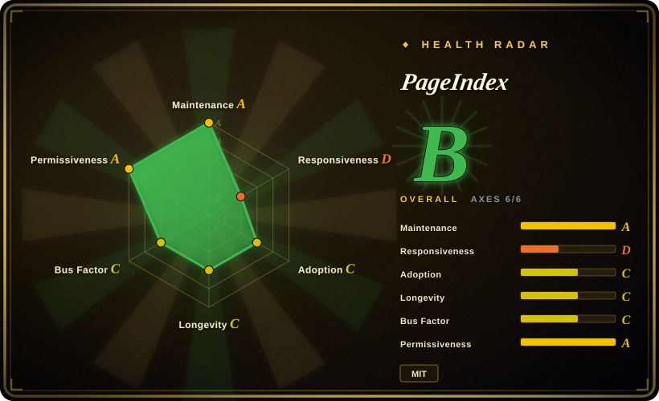
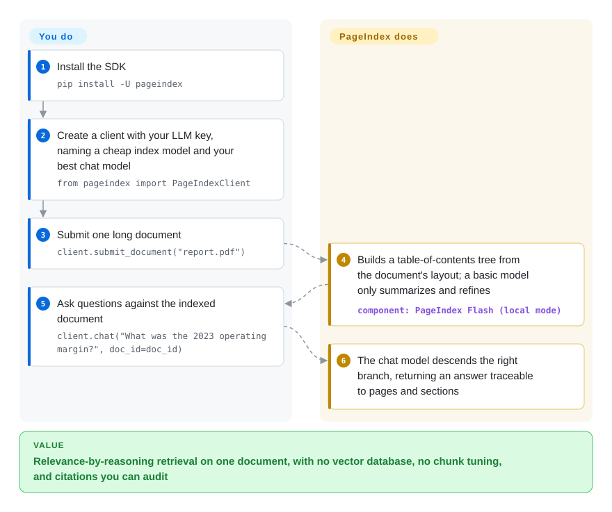

# PageIndex

On long professional documents — filings, manuals, textbooks — vector RAG returns chunks that are *similar* to your question but not actually *relevant*, and the answer arrives unanchored. PageIndex indexes each document as a table-of-contents tree built from its layout, and at query time an LLM *reasons* down that tree to the right section: no embeddings, no vector database, answers you can trace to a page.

## When to use

You're building a Q&A or agent over a small set of long, structured documents — financial filings, regulatory PDFs, technical manuals, research papers — and you've watched vector RAG fail in a specific way: it retrieves chunks that are *semantically near* the question but not actually *relevant* to it, and your domain experts can't trust answers that float free of where they came from. You want retrieval to behave like a human analyst flipping to the right section, and you want every answer to cite a concrete page/section so it's auditable. PageIndex resolves this by parsing the document into a hierarchical tree (sections, subsections, summaries) and, at query time, having an LLM *navigate* that tree — reading summaries and reasoning about which branch to descend — rather than comparing embeddings. There's no vector database to stand up, no chunk-size tuning, and no embedding model to host; the index is the document's own structure.

It's a strong fit when "similarity ≠ relevance" is your actual pain and your corpus is bounded enough that per-query LLM tree traversal is affordable. The project reports 98.7% accuracy on the FinanceBench document-QA benchmark [未验证], and since Aug 2026 the open repo ships a real SDK (`pip install -U pageindex`): index, retrieve, and chat entirely on your machine with your own LLM key, or point the same client at PageIndex Cloud. Its docs show dropping PageIndex tools into the OpenAI Agents SDK or the Claude Agent SDK, so you can hand a long PDF to an agent that reasons over its structure and returns grounded, page-anchored citations.

## How it works

PageIndex works one document at a time. Indexing builds a hierarchical tree — sections, subsections, per-node summaries — and in the current SDK the tree *structure* comes from the document's own layout without an LLM: a basic model is used only to summarize and refine nodes (the README's own guidance: cheap model for `index=`, your best model for `chat=`). Retrieval is then the opposite of vector search: the chat model reads node summaries, decides which branch to descend, and keeps going until it reaches the relevant section — so the answer cites a real page/section instead of floating free. Local mode runs on your machine against your API key (the README puts local indexing at roughly $0.001/page); PageIndex Flash, the fast tree builder for text PDFs, is the local default since Aug 2026. What stays yours: the model keys and the per-query token budget, model choice, and — beyond one document — the hosted tier: scanned/image PDFs, block-level citations, folders, the MCP server, and corpus-scale "File System" indexing are Cloud features, not the open library.

<!-- flow-steps:begin (generated from flows/pageindex.json by tools/flow_card.py — do not edit) -->

Text version of the flow

1. **You**: Install the SDK — `pip install -U pageindex`
2. **You**: Create a client with your LLM key, naming a cheap index model and your best chat model — `from pageindex import PageIndexClient`
3. **You**: Submit one long document — `client.submit_document("report.pdf")`
4. **PageIndex**: Builds a table-of-contents tree from the document's layout; a basic model only summarizes and refines — component: `PageIndex Flash (local mode)`
5. **You**: Ask questions against the indexed document — `client.chat("What was the 2023 operating margin?", doc_id=doc_id)`
6. **PageIndex**: The chat model descends the right branch, returning an answer traceable to pages and sections

**Value**: Relevance-by-reasoning retrieval on one document, with no vector database, no chunk tuning, and citations you can audit

<!-- flow-steps:end -->

## When NOT to use

- **Large-corpus / web-scale retrieval over millions of short docs.** Per-query LLM tree traversal costs tokens and latency on every lookup; for breadth-first search over a huge flat collection, an embedding + ANN vector store (Qdrant / pgvector, 未收录) is far cheaper and faster. The OSS repo targets per-document trees; the corpus-scale **PageIndex File System** is described in the README as Cloud-only, not part of the open library.
- **You need a turnkey, self-contained system with no LLM bill.** Tree *structure* is layout-derived, but node summaries at index time and every query at retrieval time go through a model. There is no zero-model mode.
- **Short, unstructured, or flat documents.** The whole value is the table-of-contents tree. A document with no meaningful section hierarchy (a chat log, a flat CSV, a one-page memo) gives the reasoner nothing to navigate; ordinary chunking is fine.
- **You want the production "Cloud / MCP / API" pipeline, not the repo.** The README's own Local-vs-Cloud table marks the MCP server, block-level citations, OCR for scanned PDFs, folders, and metadata as Cloud-only; Vectify markets a hosted PageIndex platform (App, managed API, VPC/on-prem). The OSS repo is the indexing core + local SDK, not that service.
- **You need a graph database or multi-hop entity traversal.** PageIndex indexes one document's structure; it is not a knowledge graph. For entity/relationship traversal across a corpus, see [FalkorDB](falkordb.md) or graph builders below.
- **You need a settled 1.0 surface.** The current line is v0.2.x (v0.2.19 released 2026-09-21) with v0.3.0 dev previews already published; SDK arguments and model-name conventions can still shift.

## Comparison

| Alternative | In index | Our verdict | Tradeoff |
|---|---|---|---|
| [FalkorDB](falkordb.md) | ✅ | Pick FalkorDB when you need a persistent property graph for GraphRAG, not a per-document reasoning tree. | Property-graph DB for GraphRAG (vector + multi-hop traversal); PageIndex is a per-document reasoning tree, not a graph store — different retrieval primitive. |
| [graphify](../code-intelligence/graphify.md) | ✅ | Pick graphify when the goal is a code/docs knowledge graph rather than one document's table-of-contents tree. | Builds a knowledge graph from code/docs; PageIndex builds a hierarchical ToC tree of one document and reasons over it — no entity graph. |
| [code-review-graph](../code-intelligence/code-review-graph.md) | ✅ | Pick code-review-graph when the target is a domain-specific code-review graph. | Domain-specific code-review graph; orthogonal to document tree retrieval. |
| [LlamaIndex](../../agent-frameworks/workflow-builders/llamaindex.md) | ✅ | Pick LlamaIndex when you need a broad RAG framework with many index types rather than one vectorless reasoning index. | General RAG framework with many indices incl. a tree/summary index; far broader and embedding-centric, where PageIndex is a focused vectorless reasoning index. |
| RAPTOR | 未收录 | Pick RAPTOR when recursive clustering plus summarization trees and embedding-time retrieval are the desired design. | Recursive clustering + summarization tree for retrieval, but still embedding-retrieved at query time; PageIndex navigates the tree by LLM reasoning instead of vector search. |
| pgvector / Qdrant | 未收录 | Pick a vector store when classic embedding + ANN retrieval is sufficient and cheaper at scale. | Classic embedding + ANN vector retrieval; cheaper at scale and breadth, but exactly the "similarity ≠ relevance" failure mode PageIndex is built to avoid. |

## Tech stack

- **Language:** Python.
- **Indexing:** parses PDF / Markdown into a hierarchical tree (sections, subsections, node summaries) resembling a table of contents; in SDK local mode the tree skeleton is layout-derived (no LLM) and PageIndex Flash is the default fast builder for text PDFs (since Aug 2026).
- **Retrieval:** LLM reasoning over the tree (navigate-and-descend), not vector similarity — no embedding model, no ANN index.
- **LLM access:** OpenAI by default (`OPENAI_API_KEY`). `litellm` is still pinned in `requirements.txt` but the README no longer documents multi-provider routing. [未验证]
- **Entry points:** SDK (`pip install -U pageindex`, `from pageindex import PageIndexClient`); the legacy CLI `run_pageindex.py` still sits in the repo root.
- **Adjacent:** `cookbook/` and `examples/` directories; docs show wiring PageIndex tools into the OpenAI Agents SDK or the Claude Agent SDK.

## Dependencies

- **Runtime:** Python >= 3.10 (PyPI `requires-python`, 2026-09); install `pip install -U pageindex`, or clone the repo with its pinned `requirements.txt` (openai, litellm, PyPDF2/pypdfium2, openai-agents, mcp).
- **Required:** an LLM API key — `OPENAI_API_KEY` out of the box; a PageIndex API key instead if you point the same client at PageIndex Cloud.
- **No infra:** no vector database, no embedding service, no separate datastore to operate — the index is files/JSON describing the tree.
- **Cost dependency:** token spend on the LLM is intrinsic to node summarization and every query (not optional infra you can drop); the README self-estimates local indexing at ~$0.001/page.

## Ops difficulty

**Low.** There is almost no infrastructure to run: `pip install -U pageindex`, set an API key, submit a PDF, and you get a tree you can query — no vector DB to provision, tune, or back up. The real operational concern is not servers but **LLM cost and latency**: every query reasons over the tree with model calls, so per-query token spend and response time are your scaling ceiling, and you must budget/observe API usage rather than memory or disk. Reproducibility and quality also hinge on the chosen model, which is a moving dependency. For the managed/MCP/VPC pipeline, ops shifts to the hosted product and is out of scope for the OSS repo.

## Health & viability

- **Responsiveness — D on the radar.** Median first-response has decayed (radar: Grade D, 2026-09-28; previously C at a ~558h median across 7 issues, 2026-09-22 run). Expect slow triage on the ~100 open issues.
- **Maintenance — active, and now versioned.** Last push 2026-09-24, not archived. The old "no tagged release" gap is closed: **17 GitHub releases exist, latest stable v0.2.19 (2026-09-21), with v0.3.0.dev previews on PyPI**, and the package is published as `pageindex` — pin a version instead of a commit. Active development on a pre-1.0 surface still means you track a moving target; the README's ~$0.001/page local-indexing cost is its own estimate.
- **Governance / backing — single vendor (Vectify AI).** **Organization**-owned (`VectifyAI/PageIndex`), ~35.9k stars (GitHub API, 2026-09-28). The roadmap is vendor-driven, and the open repo is the *indexing core* of a larger commercial offering — the README's own Local/Cloud table puts OCR, block-level citations, the MCP server, folders, and corpus-scale File System on the hosted side. That is an explicit open-core boundary now, with the usual risk that the best features live in the hosted tier.
- **Age & Lindy — ~1.5 years (created 2025-04-01).** Old enough to have shipped real benchmarks (98.7% FinanceBench, self-reported) and a v0.2.x release line, but not long enough to be a Lindy-safe bet. Treat as a promising young library, not a settled standard.
- **Adoption — C on the radar.** PyPI `pageindex` pulls ~55k/month (scorer, 2026-09-28) with a weak dependency-graph signal; the "vectorless RAG" framing has visible mindshare, but star count is not proof of production use. MIT-licensed, no relicense observed — but verify the OSS-vs-hosted boundary before assuming a feature ships in the repo.

## Caveats (unverified)

- [未验证] Stars ~35.9k, forks ~3.2k as of 2026-09-28 (GitHub API) — volatile, date-sensitive; adoption *meaning* unverified.
- [未验证] The 98.7% FinanceBench accuracy and "significantly outperforms vector RAG" claims are the project's own reported numbers; benchmark results depend on setup and were not independently reproduced here.
- [未验证] LiteLLM is pinned in `requirements.txt` but its multi-provider routing is no longer documented in the README; the OpenAI/Claude Agents SDK wirings are from docs links, not reproduced. Confirm against the current package before relying on them.
- [推断] The responsiveness grade drop (C→D) reflects the scorer's recent window; individual issue response times were not measured directly.
- [未验证] The ~$0.001/page local-indexing cost is the README's self-estimate; token prices and per-document density will move it.
- [未验证] Exact supported input formats beyond PDF/Markdown are from README and repo contents at verification time and may change.
