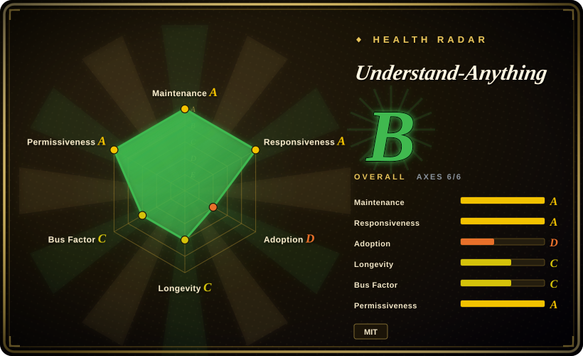

# Understand-Anything

A TypeScript tool that turns any codebase — or a docs/knowledge base, or a Figma design file — into an interactive, searchable knowledge graph an agent can query in plain English. It installs as a plugin across Claude Code, Cursor, Copilot, Codex, Gemini CLI and 12+ other assistants, and the resulting graph can be committed so teammates open the dashboard with only Node — no LLM, no API key.

## When to use

You're a developer just dropped onto a large, unfamiliar repo — hundreds of thousands of lines, no architecture doc, the one person who knew it has left. Your AI assistant keeps grepping and re-reading half the tree to answer "where does request auth actually happen", "what would break if I change this model", "which service owns billing", and it still misses callers two hops away while burning your token budget. You want an *explorable* map you (and the agent) can interrogate, not another wall of raw file dumps. You run Understand-Anything's installer (or add it as a Claude Code plugin), point it at the repo, and it parses the tree with Tree-sitter into a navigable graph with plain-English node summaries and semantic search; from then on your agent asks the graph structural questions instead of blindly reading files, and you get a visual map to orient yourself during onboarding.

It fits best when the same graph should serve *whatever agent you already use* — it ships as a native plugin/integration for Claude Code, Cursor, VS Code + Copilot, Copilot CLI, Codex, OpenCode, Gemini CLI and a long tail of others (Kiro, Trae, Cline, KIMI CLI, Vibe CLI, Antigravity, Pi Agent, OpenClaw, Hermes, Nanobot), so you wire it into an existing loop rather than building retrieval plumbing yourself. For privacy-sensitive or enterprise setups you can point the platform at a local model provider such as Ollama instead of a cloud API.

Beyond code it also covers two adjacent surfaces: `/understand-knowledge` parses a Karpathy-pattern LLM wiki into a force-directed graph with community clustering, and `/understand-figma` builds the same kind of navigable graph from a Figma file (pages → screens → components/variants, plus design-token edges). And because a generated graph is plain JSON under `.ua/`, you can commit it and let teammates who don't run any AI assistant open the read-only dashboard with just Node ≥ 18 — useful for onboarding, PR review context, and docs-as-code.

## When NOT to use

- **You want the more battle-tested code-graph sibling.** [graphify](graphify.md) does the same code→knowledge-graph job with a documented Python CLI + MCP server, 36 Tree-sitter grammars, Leiden community clustering, portable `graph.json`/`graph.html` outputs, and a Cypher export path — a more inspectable, more documented surface. Understand-Anything is younger and far less documented in the README; prefer graphify when you want a known quantity.
- **You specifically need PR/diff-scoped review with blast-radius + CI.** [code-review-graph](code-review-graph.md) is purpose-built for "what does this change affect", risk-scored PR comments as a GitHub Action, and a local SQLite store with no code leaving your runner. Understand-Anything is a general explore/query tool, not a review-gate pipeline.
- **Young, unproven, single-vendor.** Latest release v2.9.0 (2026-07), ~10 releases, ~846 commits and ~59 contributors on a repo first created 2026-03 — still only ~6 months of history. Integration breadth is broad but per-integration depth is unverified; treat it as early software and pin versions.
- **Suspicious popularity / trust signal.** ~83.3k stars and ~7.0k forks on a repo with ~846 commits and ~6 months of history: the count is API-verified, but its adoption/vetting meaning is unverified and should not be read as social proof — see Caveats. Do not pick this *because* of the star count.
- **You need fully offline, deterministic, no-LLM extraction.** Plain-English summaries and "ask questions" require an LLM backend: unless you run a local Ollama, that means API keys, cost, non-determinism, and sending code/doc contents to your model provider. Only the read-only *viewer* path is genuinely no-LLM (Node only). [未验证] the exact provider-egress behavior.
- **You're sending proprietary code you can't expose and won't run a local model.** The project's `SECURITY.md` states it is a local-only tool that does not phone home and gates the dashboard behind an access token and a path allowlist — but that is a self-attested claim, and the *analysis* step still sends source to whichever LLM provider you point it at. Verify the claim yourself (and use a local model) before pointing it at confidential repos.
- **Pure vector-RAG over prose/docs, no code graph.** If you want passage retrieval over long documents, [PageIndex](pageindex.md) (reasoning-over-ToC) is a better fit; if you want a real queryable graph DB to build on, use [FalkorDB](falkordb.md).

## Comparison

| Alternative | In index | Our verdict | Tradeoff |
|---|---|---|---|
| [graphify](graphify.md) | ✅ | Choose graphify when you need a documented Python CLI/MCP code-docs graph pipeline. | Closest sibling: code/docs → queryable graph for agents, but a documented Python CLI + MCP server, 36 grammars, Leiden clustering, portable JSON/HTML/Cypher outputs. More inspectable and better-documented; Understand-Anything is TypeScript, plugin-first, and younger/thinner on docs. |
| [code-review-graph](code-review-graph.md) | ✅ | Choose code-review-graph when you need a focused code-review/blast-radius pipeline. | Narrow code-review/blast-radius pipeline (AST→SQLite→MCP) with a risk-scoring CI Action and no-egress runner story. Understand-Anything is a general explore/query tool, not a PR-review gate. |
| [PageIndex](pageindex.md) | ✅ | Choose PageIndex when you need reasoning-based hierarchical retrieval over documents. | Reasoning-based hierarchical retrieval over *documents* (no code AST/call graph); different retrieval primitive — prose tree vs code/entity graph. |
| [FalkorDB](falkordb.md) | ✅ | Choose FalkorDB when you need a real persistent property-graph backend. | A real persistent property-graph DB (Redis module, OpenCypher, vector index) you build apps on; Understand-Anything is a turnkey extract-and-query tool, not a graph backend. |
| [Sourcegraph](sourcegraph.md) / [SCIP](scip.md) | ✅ | Choose Sourcegraph or SCIP when you need industrial precise code intelligence at scale. | Industrial precise code intelligence (cross-repo, language servers, scale); heavier infra, not an agent-plugin-shaped drop-in. Understand-Anything is lighter and LLM-augmented but unproven. |

## Tech stack

- **Language:** TypeScript (~59.6%), with JavaScript (~28.7%), Python (~8.0%) and Astro (~2.5%), plus small CSS/PowerShell/Shell portions, per GitHub language stats (2026-09).
- **Parsing:** Tree-sitter for static code parsing into a graph; a separate deterministic Figma REST API path for `/understand-figma` (design tokens, components, variants; `FIGMA_TOKEN` kept strictly in the request header).
- **Intelligence:** an LLM multi-agent pipeline — up to 7 agents (project-scanner, file-analyzer, architecture-analyzer, tour-builder, graph-reviewer, domain-analyzer, article-analyzer) — producing plain-English summaries, domain mapping and natural-language querying; can target a local provider (Ollama) for privacy. File analyzers run in parallel (up to 5 workers).
- **Frontend:** an Astro dashboard for the interactive graph view; a bundled local viewer (`understand-anything-viewer.tgz`) serves a committed graph read-only with only Node ≥ 18 and no LLM.
- **Build/test:** pnpm workspace; Vitest for tests.
- **Distribution:** install script (`install.sh` / `install.ps1`) plus per-platform plugin integrations across 17+ assistants (Claude Code plugin marketplace, Cursor, VS Code + Copilot, Copilot CLI, Codex, OpenCode, Gemini CLI, OpenClaw, Antigravity, Kiro, Trae, Cline, KIMI CLI, Vibe CLI, Pi Agent, Hermes, Nanobot). Not published to npm — `package.json` is `private`.

## Dependencies

- **Runtime:** Node.js — the read-only viewer documents `Node.js (>= 18)`; the analysis pipeline's minimum is not stated in the README. `[未验证]`
- **Install:** `curl -fsSL .../install.sh | bash` (or `install.ps1` on Windows) for most platforms; Claude Code via `/plugin marketplace add` — review the script before piping curl into bash, especially for confidential machines. Not distributed via npm.
- **LLM backend:** required for summaries and Q&A — a cloud model API (key + cost) or a local provider such as Ollama. No hosted Egonex backend is named as mandatory in the README; the supported-provider list is unverified. `[未验证]`
- **Host agent:** to run analysis in-loop you need one of the supported assistants (Claude Code, Cursor, Copilot, Codex, Gemini CLI, etc.); *viewing* a committed graph needs only Node.

## Ops difficulty

**Low, rising to medium with a cloud LLM.** The advertised happy path is genuinely light: one install command (or a Claude Code plugin add), point it at a repo, get a graph and a query interface — no database or server is described as mandatory, and a committed graph can be opened by any teammate with just Node. It rises to **medium** the moment you add a cloud LLM backend (key management, per-query cost/latency, and source leaving the machine unless you run Ollama locally). The project's `SECURITY.md` claims a local-only, no-phone-home, token-gated read path, which lowers the trust concern versus the earlier README-only story — but it is self-attested and not independently audited, and the opaque `curl | bash` install still warrants verifying behavior on a throwaway repo first.

## Health & viability

- **Responsiveness**: Grade A — median first-response time 45.5 hours across 34 qualifying issues/PRs (90-day window).
- **Maintenance — Grade A, actively shipping.** Last commit 7 days before scoring, committed in 11 of the last 13 weeks. Latest release v2.9.0 (2026-07-10), but still only ~10 releases and ~846 commits total: active, yet too short a track record to judge stability. `[未验证]`
- **Adoption — unmeasurable, not evidence of reach.** The scorer returns `?` (ambiguous): the package is not on npm (`private: true`) and dependent-repo counts are effectively zero, so the large star/fork numbers do **not** translate into a measurable dependency-graph footprint. Stars are informational only in this corpus.
- **Governance / bus factor — Grade C, single vendor with one dominant author.** ~58 contributors in the last 12 months, but the original author (`Lum1104`) holds ~73% of commits and the top 3 hold ~84%. The repo now sits under the `Egonex-AI` org, and the MIT notice names both `Yuxiang Lin` and `Infinite Universe, Inc.`; the README says "Originally created by Lum1104" and links a companion "Understand Anyone" product at egonex.ai. `[推断]` the personal project was folded into a company — backing is still one vendor.
- **Age & Lindy — young, unproven (created 2026-03-15, ~189 days / ~6 months as of 2026-09).** Grade C on longevity: young but actively shipping. Fails the Lindy prior on age alone; the v2.x version number is not maturity.
- **Trust signal — suspicious popularity, a hard flag.** ~83.3k stars and ~7.0k forks on a repo with ~846 commits and ~6 months of history: the count is API-verified, but what it implies about adoption/vetting is unverified `[未验证]`. The breadth now visible (59 contributors, a company, active releases) makes a pure data artifact less likely, but it does not establish adoption quality or social proof. **Do not pick this *because* of the star count.**
- **Risk flags — `curl | bash` install; cloud-LLM egress; commercial pivot.** MIT license (no relicense observed), but the opaque install path, a self-attested-only local-only claim, and a single vendor now marketing a companion product mean treat it as early software, not a vetted dependency. Prefer the more documented sibling [graphify](graphify.md) when you want a known quantity.

## Caveats (unverified)

- [未验证] **~83.3k stars and ~7.0k forks are API-verified numbers, but their adoption/vetting meaning is unverified.** A repo ~6 months old with ~846 commits, ~10 releases and no npm package would not normally accumulate this; the count is real, but what it implies about adoption/quality is unverified (viral visibility — it carries a Trendshift badge — remains a plausible but unconfirmed explanation). Do **not** treat it as social proof or a quality signal.
- [未验证] v2.9.0 latest release dated 2026-07-10; ~846 commits and ~59 contributors as of 2026-09-19 — metadata read from the GitHub API at verification time, not independently audited.
- [未验证] The project's `SECURITY.md` claims it is a local-only tool that "does not phone home" and gates the dashboard behind an access token and a path allowlist. This is self-attested and not independently audited, and the *analysis* step still sends source to whichever LLM provider you configure. Confirm the egress path yourself before pointing it at confidential repos.
- [未验证] No hosted Egonex-AI service is named as required in the README, but whether the companion "Understand Anyone" product (egonex.ai) or any future cloud feature becomes mandatory is unknown; the commercial relationship between the OSS project and the company is not independently verifiable.
- [未验证] Tech-stack details (Tree-sitter, Figma REST path, pnpm, Vitest, Astro dashboard, 7-agent pipeline, language byte split) are read from the GitHub page/README/release notes and may shift release-to-release.
- [未验证] The full "17+ assistants" integration list is the project's own framing; depth/maturity of any single integration is unverified.
- [未验证] The `.ua/` data-directory rename (legacy `.understand-anything/` still auto-detected) is taken from the v2.9.0 release notes; not exercised here.
- [推断] Being early (6-month history, a dominant original author, one vendor) implies churn in CLI surface, output format, and integration support between versions — pin versions and re-verify.
- [推断] Classified as `tool` (an installable extract-and-query CLI/plugin with a real tech stack and ops surface), not a pure skill-pack.
