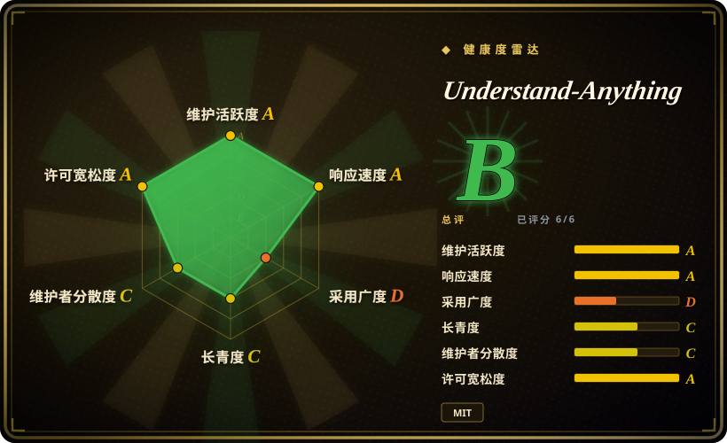

# Understand-Anything

一个 TypeScript 工具，把任意代码库——或文档／知识库、Figma 设计文件——变成可交互、可搜索的知识图谱，让 agent 用自然语言提问。它以插件形式装进 Claude Code、Cursor、Copilot、Codex、Gemini CLI 等 12+ 种助手，生成的图还可以提交进仓库，队友只需 Node 就能打开只读看板——不需要 LLM、不需要 API key。

## 何时使用

你是个开发者，刚被丢进一个陌生的大仓库——几十万行代码、没有架构文档、唯一懂它的人已经离职。你的 AI 助手不停地 grep、反复读半棵目录树，就为了回答“请求鉴权到底在哪发生”“改这个 model 会连带搞坏什么”“谁负责计费”，结果还是漏掉两跳之外的调用方，同时把你的 token 预算烧光。你想要一张*能探索、能追问*的地图（你和 agent 都能查），而不是又一堆原始文件转储。你跑一下 Understand-Anything 的安装脚本（或把它当 Claude Code 插件加进去），指向这个仓库，它用 Tree-sitter 把代码树解析成一张可导航的图，每个节点配上自然语言摘要并支持语义搜索；从此你的 agent 向图提结构化问题，而不是盲目读文件，你自己在上手期也有一张可视化地图来定位。

当你希望同一张图服务于*你已经在用的那个 agent* 时，它最契合——它以原生插件／集成形式覆盖 Claude Code、Cursor、VS Code + Copilot、Copilot CLI、Codex、OpenCode、Gemini CLI 以及一长串其他助手（Kiro、Trae、Cline、KIMI CLI、Vibe CLI、Antigravity、Pi Agent、OpenClaw、Hermes、Nanobot），所以你是接进已有循环，而不是自己造检索管线。对隐私敏感或企业场景，你可以把平台指向本地模型提供方（如 Ollama），而非云端 API。

除代码之外，它还覆盖两个相邻面：`/understand-knowledge` 把 Karpathy 式 LLM wiki 解析成带社区聚类的力导向图；`/understand-figma` 从 Figma 文件构建同类可导航图（页面 → 画板 → 组件／变体，外加 design token 边）。而且生成的图就是 `.ua/` 下的普通 JSON，你可以把它提交进仓库，让不跑任何 AI 助手的队友只用 Node ≥ 18 打开只读看板——适合上手、PR 评审上下文和 docs-as-code。

## 何时不用

- **你想要更经得起检验的代码图谱同类。** [graphify](graphify.zh.md) 做同样的代码→知识图谱的活，但有文档完备的 Python CLI + MCP server、36 种 Tree-sitter 语法、Leiden 社区聚类、可移植的 `graph.json`/`graph.html` 产物，以及 Cypher 导出路径——表面更可检视、文档更全。Understand-Anything 更年轻、README 文档薄得多；想要一个已知量时选 graphify。
- **你明确需要 PR/diff 范围的评审 + 爆炸半径 + CI。** [code-review-graph](code-review-graph.zh.md) 专为“这次改动影响什么”而造：风险评分的 PR 评论以 GitHub Action 形式落地，本地 SQLite 存储、代码不出 runner。Understand-Anything 是通用的探索/查询工具，不是评审闸门管线。
- **年轻、未经证明、单一厂商。** 最新版 v2.9.0（2026-07），约 10 个 release、约 846 次提交、约 59 位贡献者，仓库创建于 2026-03——历史仍只有约 6 个月。集成广度可观，但每个集成的深度未经核实；当作早期软件对待并锁版本。
- **可疑的人气 / 信任信号。** 一个约 846 次提交、约 6 个月历史的仓库有约 83.3k star 和约 7.0k fork：这个数字本身经 GitHub API 核实，但它对采用度／审核的含义未经核实，不应当作社会证明——见存疑。别*因为* star 数而选它。
- **你需要完全离线、确定性、无 LLM 的提取。** 自然语言摘要和“提问”需要 LLM 后端：除非你跑本地 Ollama，否则就是 API key、成本、不确定性，以及把代码／文档内容发给你的模型提供方。只有只读*看板*那条路径是真正无 LLM 的（只需 Node）。`[未验证]` 具体的提供方出网行为。
- **你在传不能外泄的私有代码，且不愿跑本地模型。** 项目的 `SECURITY.md` 自称是本地-only 工具、不 phone home、看板以 access token + 路径 allowlist 保护——但这是自我声明，且*分析*步骤仍会把源码发给你指定的 LLM 提供方。发机密仓库前请自行核实该声明（并使用本地模型）。
- **纯文档/prose 的向量 RAG，不需要代码图。** 想对长文档做段落检索，[PageIndex](pageindex.zh.md)（在目录树上推理）更合适；想要可建应用的真·可查询图数据库，用 [FalkorDB](falkordb.zh.md)。

## 横向对比

| 替代品 | 是否收录 | 我们的评价 | 取舍 |
|---|---|---|---|
| [graphify](graphify.zh.md) | ✅ | 需要文档较完整的 Python CLI/MCP 代码文档建图管线时，选 graphify。 | 最近的同类：代码/文档 → 给 agent 用的可查询图，但有文档完备的 Python CLI + MCP server、36 种语法、Leiden 聚类、可移植 JSON/HTML/Cypher 产物。更可检视、文档更全；Understand-Anything 是 TypeScript、插件优先、更年轻、文档更薄。 |
| [code-review-graph](code-review-graph.zh.md) | ✅ | 需要聚焦代码评审/爆炸半径的管线时，选 code-review-graph。 | 窄域的代码评审/爆炸半径管线（AST→SQLite→MCP），带风险评分 CI Action 和代码不出网的 runner 方案。Understand-Anything 是通用探索/查询工具，不是 PR 评审闸门。 |
| [PageIndex](pageindex.zh.md) | ✅ | 需要面向文档的推理式层级检索时，选 PageIndex。 | 基于推理的*文档*层级检索（无代码 AST/调用图）；检索原语不同——prose 目录树 vs 代码/实体图。 |
| [FalkorDB](falkordb.zh.md) | ✅ | 需要真正的持久化属性图后端时，选 FalkorDB。 | 真正的持久化属性图数据库（Redis 模块、OpenCypher、向量索引），你在它上面建应用；Understand-Anything 是开箱即用的抽取-查询工具，不是图后端。 |
| [Sourcegraph](sourcegraph.zh.md) / [SCIP](scip.zh.md) | ✅ | 需要工业级、规模化的精确代码智能时，选 Sourcegraph 或 SCIP。 | 工业级精确代码智能（跨仓、language server、规模化）；基础设施更重，不是 agent 插件形态的即插即用工具。Understand-Anything 更轻、有 LLM 增强，但未经证明。 |

## 技术栈

- **语言：** TypeScript（约 59.6%），外加 JavaScript（约 28.7%）、Python（约 8.0%）和 Astro（约 2.5%），以及少量 CSS／PowerShell／Shell，来自 GitHub 语言统计（2026-09）。
- **解析：** Tree-sitter 做静态代码解析、构图；`/understand-figma` 另走一条确定性的 Figma REST API 路径（design token、组件、变体；`FIGMA_TOKEN` 严格放在请求头）。
- **智能：** 一条 LLM 多 agent 管线——最多 7 个 agent（project-scanner、file-analyzer、architecture-analyzer、tour-builder、graph-reviewer、domain-analyzer、article-analyzer）——产出自然语言摘要、领域映射与自然语言查询；可指向本地提供方（Ollama）以保隐私。文件分析器并行运行（最多 5 个 worker）。
- **前端：** Astro dashboard 提供交互式图谱视图；另有一个随包发布的本地 viewer（`understand-anything-viewer.tgz`），只需 Node ≥ 18、无 LLM，即可只读访问已提交的图。
- **构建/测试：** pnpm workspace；Vitest 测试。
- **分发：** 安装脚本（`install.sh` / `install.ps1`）外加覆盖 17+ 种助手的各平台插件集成（Claude Code 插件市场、Cursor、VS Code + Copilot、Copilot CLI、Codex、OpenCode、Gemini CLI、OpenClaw、Antigravity、Kiro、Trae、Cline、KIMI CLI、Vibe CLI、Pi Agent、Hermes、Nanobot）。未发布到 npm——`package.json` 为 `private`。

## 依赖

- **运行时：** Node.js——只读 viewer 文档写明 `Node.js (>= 18)`；分析管线的最低版本 README 未说明。`[未验证]`
- **安装：** 多数平台用 `curl -fsSL .../install.sh | bash`（Windows 用 `install.ps1`）；Claude Code 用 `/plugin marketplace add`——把 curl 管进 bash 前先审脚本，机密机器上尤其如此。不通过 npm 分发。
- **LLM 后端：** 摘要和问答必需——云模型 API（key + 成本）或本地提供方如 Ollama。README 未把任何 Egonex 托管后端列为必需；受支持提供方清单未经核实。`[未验证]`
- **宿主 agent：** 要在循环内跑分析，需装一个受支持的助手（Claude Code、Cursor、Copilot、Codex、Gemini CLI 等）；只*查看*已提交的图则只需 Node。

## 运维难度

**低，加上云 LLM 后升到中。** 宣传的顺路径确实很轻：一条安装命令（或加一个 Claude Code 插件），指向仓库，得到图和查询界面——没有任何被描述为强制的数据库或服务器，而且已提交的图可以直接被任何队友只用 Node 打开。一旦加上云 LLM 后端就升到**中**（key 管理、每次查询的成本／延迟，以及源码外发——除非本地跑 Ollama）。项目的 `SECURITY.md` 自称本地-only、不 phone home、读路径以 token 保护，这比早先只有 README 说辞时降低了信任顾虑——但那是自我声明、未经独立审计，且不透明的 `curl | bash` 安装仍建议先在一次性仓库上验证行为。

## 健康度与可持续性

- **响应速度**：Grade A——中位首次响应时间 45.5 小时，基于 90 天窗口内 34 个 qualifying issues/PRs。
- **维护——Grade A，持续在发版。** 评分前最后一次提交距今 7 天，最近 13 周中有 11 周有提交。最新版 v2.9.0（2026-07-10），但总共仍只有约 10 个 release、约 846 次提交：活跃，但履历太短，无法判断稳定性。`[未验证]`
- **采用广度——不可测量，不能当作触达证据。** 评分器返回 `?`（ambiguous）：包未发布到 npm（`private: true`），依赖仓库数基本为零，所以庞大的 star／fork 数字**并不**转化为可测量的依赖图足迹。在本语料里 star 仅供参考。
- **维护者分散度——Grade C，单一厂商 + 单一主导作者。** 最近 12 个月约 58 位贡献者，但原作者（`Lum1104`）占约 73% 提交、前 3 位占约 84%。仓库现在归属 `Egonex-AI` org，MIT 署名同时列出 `Yuxiang Lin` 与 `Infinite Universe, Inc.`；README 写“Originally created by Lum1104”，并链接 egonex.ai 上的配套产品 “Understand Anyone”。`[推断]` 个人项目被并入了一家公司——背书仍系于单一厂商。
- **年龄与 Lindy——年轻、未经证明（创建于 2026-03-15，约 189 天／约 6 个月，截至 2026-09）。** 长青度 Grade C：年轻但在持续发版。仅凭年龄就过不了 Lindy 先验；v2.x 的版本号不是成熟度。
- **信任信号——可疑的人气，硬标志。** 一个约 846 次提交、约 6 个月历史的仓库有约 83.3k star 和约 7.0k fork：这个计数经 GitHub API 核实，但它对采用度／审核的暗示未经核实`[未验证]`。如今可见的广度（59 位贡献者、一家公司、持续发版）让“纯数据异常”的可能性下降，但并不构成采用质量或社会证明。**别*因为* star 数而选它。**
- **风险标志——`curl | bash` 安装、云 LLM 出网、商业化转向。** MIT 许可证（未观察到 relicense），但不透明的安装路径、仅自我声明的本地-only、以及一家正在推销配套产品的单一厂商，意味着把它当作早期软件，而非已背书的依赖。想要一个已知量时，优先选文档更全的同类 [graphify](graphify.zh.md)。

## 存疑（未验证）

- [未验证] **约 83.3k star 与约 7.0k fork 是经 GitHub API 核实过的数字，但它们对采用度／审核的含义未经核实。** 一个约 6 个月、约 846 次提交、约 10 个 release、且未发布到 npm 的仓库，正常不会积累到这个量级；计数是真实的，但它对采用度／质量的暗示未经核实（viral 曝光——仓库带 Trendshift 徽章——是一个合理但未获证实的解释）。**不要**当作社会证明或质量信号。
- [未验证] 最新版 v2.9.0 标注于 2026-07-10；约 846 次提交、约 59 位贡献者（截至 2026-09-19）——来自核验时 GitHub API 的元数据，未经独立审计。
- [未验证] 项目的 `SECURITY.md` 自称本地-only、“不 phone home”、看板以 access token + 路径 allowlist 保护。这是自我声明、未经独立审计，且*分析*步骤仍会把源码发给你所配置的 LLM 提供方。发机密仓库前请自行确认出网路径。
- [未验证] README 未把任何 Egonex-AI 托管服务列为必需，但配套产品 “Understand Anyone”（egonex.ai）或未来任何云功能是否会变成强制，未知；开源项目与该公司之间的商业关系无法独立核实。
- [未验证] 技术栈细节（Tree-sitter、Figma REST 路径、pnpm、Vitest、Astro dashboard、7-agent 管线、语言字节占比）读自 GitHub 页面／README／release notes，可能随版本变动。
- [未验证] “17+ 助手”完整集成清单是项目自己的表述；任一具体集成的深度／成熟度未经核实。
- [未验证] `.ua/` 数据目录重命名（旧 `.understand-anything/` 仍自动识别）取自 v2.9.0 release notes；未实际验证。
- [推断] 早期特征（6 个月历史、单一主导作者、单一厂商）意味着 CLI 表面、输出格式和集成支持会在版本间变动——锁版本并重新核验。
- [推断] 归类为 `tool`（可安装的抽取-查询 CLI/插件，有真实技术栈和运维面），而非纯 skill-pack。
