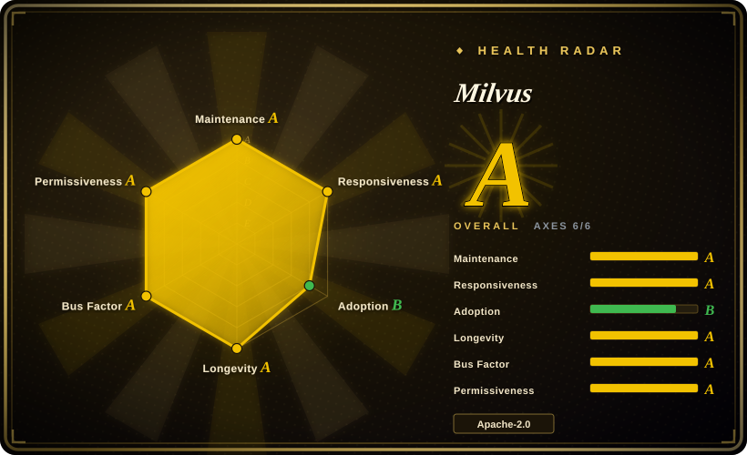
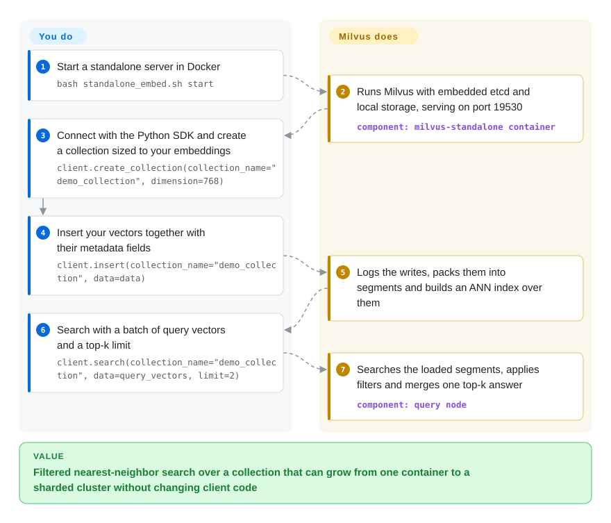

# Milvus

Your RAG or recommendation prototype kept its embeddings in a NumPy array or a FAISS file, and now there are hundreds of millions of them, every query has to be filtered by tenant or date, writes arrive all day, and one machine dying cannot take search down. Milvus is a vector database server that stores each vector together with its metadata, splits the data across machines, and answers "the 10 nearest to this, where tenant = X" over a network API.

## When to use

You run the retrieval layer for a search, RAG, or recommendation product. The first version used an in-process index: `faiss.read_index("prod.index")` at startup, a Python dict mapping IDs back to documents, and a nightly rebuild. Now the index no longer fits in one box's RAM, the nightly rebuild means new documents are invisible until tomorrow, and product wants `where tenant_id == 42 and lang == "de"` on every query. You need the vectors to live in a service with metadata filtering, real-time inserts and deletes, replicas, and horizontal scale — not in a file you ship around.

Reach for Milvus over its closest substitutes when **scale-out is the deciding constraint**: it separates compute from storage (segments persisted to S3/MinIO, query nodes and data nodes scaled independently on Kubernetes), supports the major ANN index families (HNSW, IVF, DiskANN, GPU CAGRA, and from 3.0 raw Faiss factory strings), and does hybrid dense + BM25/sparse search in one collection. The same `MilvusClient` code runs against Milvus Lite (a local file, for prototyping), a single-container standalone server, a distributed cluster, or the vendor's managed Zilliz Cloud, so you can start small without rewriting the client. If you only need tens of millions of vectors next to relational data, pgvector is less to run; if you want a single-binary server, Qdrant is simpler — see When NOT to use.

## How it works

Milvus is a database server you talk to over gRPC/REST (default port 19530) through SDKs in Python, Java, Go, Node.js and others. You define a **collection** — think of a table with one or more vector columns plus ordinary scalar columns (numbers, strings, JSON) — and insert rows. Writes go first to a write-ahead log (a durable journal of incoming changes; Woodpecker by default since 2.6, with Pulsar/Kafka as options), are packed into **segments** (immutable chunks of rows) on object storage, and get an **ANN index** built over them — a precomputed shortcut structure, like a library's subject catalog, so a search visits a small part of the data instead of comparing against every vector. At query time, query nodes load the indexed segments into memory (or mmap them from disk), apply your metadata filter, and merge each segment's top-k into one answer; etcd keeps the cluster's metadata. Milvus does the storage, indexing, sharding, replication, compaction, and filtered search; **you** produce the embeddings (unless you configure its server-side embedding functions), design the schema (dimension, distance metric, fields), choose index and consistency settings, and size memory — vector search is memory-hungry and that bill is yours. For a laptop prototype, `pip install pymilvus[milvus-lite]` plus `MilvusClient("milvus_demo.db")` gives the same API backed by a local file, no server needed.

<!-- flow-steps:begin (generated from flows/milvus.json by tools/flow_card.py — do not edit) -->

Text version of the flow

1. **You**: Start a standalone server in Docker — `bash standalone_embed.sh start`
2. **Milvus**: Runs Milvus with embedded etcd and local storage, serving on port 19530 — component: `milvus-standalone container`
3. **You**: Connect with the Python SDK and create a collection sized to your embeddings — `client.create_collection(collection_name="demo_collection", dimension=768)`
4. **You**: Insert your vectors together with their metadata fields — `client.insert(collection_name="demo_collection", data=data)`
5. **Milvus**: Logs the writes, packs them into segments and builds an ANN index over them
6. **You**: Search with a batch of query vectors and a top-k limit — `client.search(collection_name="demo_collection", data=query_vectors, limit=2)`
7. **Milvus**: Searches the loaded segments, applies filters and merges one top-k answer — component: `query node`

**Value**: Filtered nearest-neighbor search over a collection that can grow from one container to a sharded cluster without changing client code

<!-- flow-steps:end -->

## When NOT to use

- **Your vectors fit in one process and you don't need a database.** If you are embedding search inside one application, under a few million vectors, rebuilt in batch, use [FAISS](faiss.md) (or a small embedded store such as Chroma, not indexed) instead of Milvus, because a library has no server, no etcd, and no object store to operate.
- **You already run Postgres and your corpus is in the tens of millions or below.** Use pgvector (not indexed) instead, because vectors then live next to the rows they describe, inside the same transactions, backups, and access control — a separate Milvus cluster adds a second source of truth to keep in sync.
- **You have no Kubernetes or platform team but expect to need a cluster.** Distributed Milvus is a set of services — proxy, coordinator, query/data/streaming nodes — plus etcd, object storage (MinIO/S3), and a WAL. If that is too much to own, use Qdrant (not indexed; a single Rust binary with built-in sharding) or pay for managed Zilliz Cloud (not a repo) instead of self-hosting the cluster.
- **You want 3.0's headline features and a safe rollback at the same time.** As of 3.0.x, Snapshots, TEXT fields, and External Collections depend on Storage V3, which is **off by default** (`common.storage.useLoonFFI`), and the new sparse/vector index versions are opt-in. Turning them on changes the on-disk format and makes rollback to 2.6 impossible. If you can't take that one-way step yet, stay on the still-patched 2.6.x line (v2.6.25, 2026-09-29) instead of enabling them.
- **You run GPU Milvus on Ubuntu 20.04 hosts.** 3.0 GPU images moved to CUDA 12.9 and dropped Ubuntu 20.04 GPU compatibility; keep those hosts on 2.6.x GPU images or upgrade the OS before moving to 3.0.
- **You plan to ship Milvus Lite as your production store.** The README positions Lite as a `pip install` quickstart; use standalone (one container) or a cluster for anything multi-process or long-lived.

## Comparison

| Alternative | In index | Our verdict | Tradeoff |
|---|---|---|---|
| [FAISS](faiss.md) | ✅ | When the index lives inside one application and is rebuilt in batch, pick FAISS; pick Milvus once you need metadata filters, live inserts/deletes, and a shared network service. | FAISS is a library: fastest path, zero ops, but no persistence model, filtering, replication, or API — you build those. Milvus gives you all of them at the cost of running a database. |
| Qdrant | not indexed | For a self-hosted vector DB up to a few nodes with the least moving parts, pick Qdrant; pick Milvus when you expect to scale compute and storage separately on Kubernetes or need DiskANN/GPU indexes. | Qdrant is one Rust binary with built-in sharding and payload filters; Milvus needs etcd + object storage + WAL but scales query and ingest nodes independently and offers more index types. |
| pgvector | not indexed | If your vectors belong to rows already in Postgres and stay in the tens of millions, pick pgvector; pick Milvus when vector volume or QPS outgrows a single Postgres primary. | pgvector keeps vectors transactional with your data and reuses Postgres ops; Milvus adds a second system but is built for distributed ANN, hybrid sparse+dense search, and hot/cold tiering. |
| Chroma | not indexed | For a notebook or single-app RAG prototype where `pip install` and zero config matter most, pick Chroma; pick Milvus when the prototype must grow into a multi-tenant production service. | Chroma optimizes for developer ergonomics on small corpora; Milvus Lite covers the same prototype niche but the payoff is the upgrade path to standalone/cluster with the same client. |
| Weaviate | not indexed | If you want built-in vectorizer modules and a GraphQL-style object API, pick Weaviate; pick Milvus when raw ANN scale and index choice (IVF/DiskANN/GPU) matter more than bundled model integrations. | Weaviate bundles more application-level features around objects and modules; Milvus focuses on the retrieval engine and storage separation, leaving more of the app layer to you. |

## Tech stack

- **Languages:** Go for the distributed services (proxy, coordinators, nodes) and C++ for the segment/search core, per the README.
- **Vector engine:** Knowhere (Zilliz's vector-index library) vendored under `internal/core/thirdparty`, behind the README's index families (HNSW, IVF, FLAT, SCANN, DiskANN, GPU CAGRA via cuVS); Tantivy is vendored alongside for full-text/BM25 inverted indexes.
- **Storage:** segments on object storage (MinIO/S3-compatible, or local disk in standalone embedded mode); Storage V3 ("Loon") adds a manifest-based columnar layout with Parquet, Lance, and Vortex formats (opt-in in 3.0).
- **Metadata & log:** etcd for metadata; WAL via Woodpecker (default), Pulsar, Kafka, or RocksMQ (`mq.type` in `configs/milvus.yaml`).
- **Clients:** official SDKs for Python (`pymilvus`), Java, Go, Node.js, plus REST v2; GUI admin via Attu (separate repo).
- **Version/date:** v3.0.2 (2026-09-20) on the 3.x line; v2.6.25 (2026-09-29) on the parallel 2.6 line.

## Dependencies

- **Milvus Lite:** Python only (`pymilvus[milvus-lite]`); data in a local file. Prototyping only.
- **Standalone:** Docker. `scripts/standalone_embed.sh` runs one container with embedded etcd and local storage; `deployments/docker/standalone/docker-compose.yml` runs Milvus plus separate etcd (`quay.io/coreos/etcd:v3.5.25`) and MinIO containers.
- **Cluster:** Kubernetes (Helm chart or Milvus Operator), etcd, S3-compatible object storage, and a WAL backend (Woodpecker, optionally as its own service in 3.0; or Pulsar/Kafka).
- **GPU builds:** NVIDIA GPU with CUDA 12.9 images in 3.0 (Ubuntu 20.04 GPU hosts no longer supported).
- **Embeddings:** your own model or provider, unless you configure Milvus's server-side embedding/reranking functions.

## Ops difficulty

**Low for Lite and standalone, high for a production cluster.** Lite is a `pip install`; standalone is one script or a three-container compose file, and backups mean copying its volumes. A cluster is a multi-service distributed system: you size query-node memory to the loaded segments and index type, run etcd and object storage as stateful dependencies with their own backup story, watch compaction and index-build backlogs, and plan rolling upgrades across release lines that ship patches every few weeks. 3.0 adds a one-way decision (enabling Storage V3 or new index versions blocks rollback to 2.6), so upgrades need a staging pass. Attu (GUI), Birdwatcher (debugging), and Prometheus/Grafana dashboards are provided, which helps — but this is a database to operate, not a library to import.

## Health & viability

- **Maintenance (2026-10-08):** very active. Default branch pushed today; v3.0.0 GA on 2026-07-29 followed by v3.0.1/v3.0.2 in September, while v2.6.x keeps getting patch releases (v2.6.25 on 2026-09-29). Two maintained lines at once is a good sign for production users who can't jump majors immediately.
- **Responsiveness:** issue triage is quick — the radar's median time-to-first-response is ~24.9 h on recent issues — though 1.4k+ open issues show a large backlog.
- **Governance / bus factor:** LF AI & Data Foundation project with a Technical Steering Committee mailing list; ~100 active contributors in the last 12 months, top contributor under 10% of commits. The roadmap is, in practice, driven by Zilliz (the README calls it the major contributor), which also sells the managed Zilliz Cloud.
- **Age & Lindy:** created 2019-09 (7 years), continuously developed through 1.x → 2.x → 3.0 rewrites — old *and* active, a solid Lindy prior for infrastructure.
- **Adoption:** ~46.3k stars, ~1.2k dependent Go repos per the registry signal, published SIGMOD 2021 / VLDB 2022 papers, and integrations with LangChain, LlamaIndex, Spark, Kafka, and Airbyte.
- **Risk flags:** Apache-2.0 with no relicense history; open-core pressure is the thing to watch — some convenience features (serverless tiers, BYOC) live only in Zilliz Cloud. Release pace is high, so pin versions and read the compatibility notes.

## Caveats (unverified)

- [未验证] Scale claims ("tens of thousands of queries on billions of vectors") come from the README and vendor benchmarks; no independent benchmark was checked.
- [推断] The quick-setup `create_collection(..., dimension=768)` path creates a default index and loads the collection automatically; the README shows the call but not that behavior.
- [未验证] Milvus Lite (milvus-io/milvus-lite v3.2.1, 2026-08) feature parity with the 3.0 server — e.g., which 3.0 features Lite supports — was not checked.
- [推断] "Roadmap driven by Zilliz" is inferred from the README's "major contributor" wording and contributor affiliations, not from a governance document.
- [未验证] The exact set of features gated to Zilliz Cloud versus open-source Milvus was not audited.
- [未验证] Helm chart / Milvus Operator versions compatible with 3.0 were not checked.
- [推断] The Qdrant, pgvector, Chroma, and Weaviate comparison rows rest on their GitHub metadata (license, language, activity) and general knowledge of those projects; their docs were not reread for this sync.
