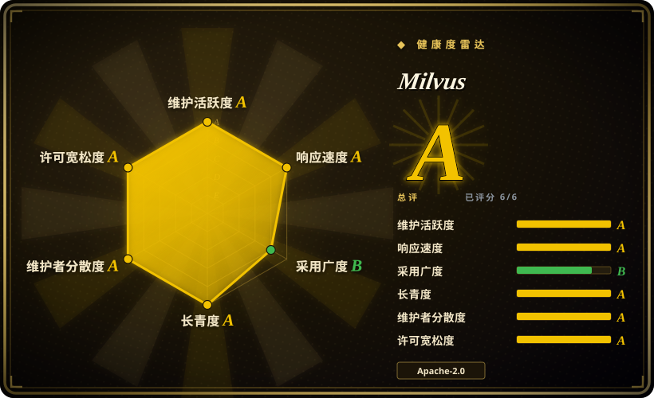
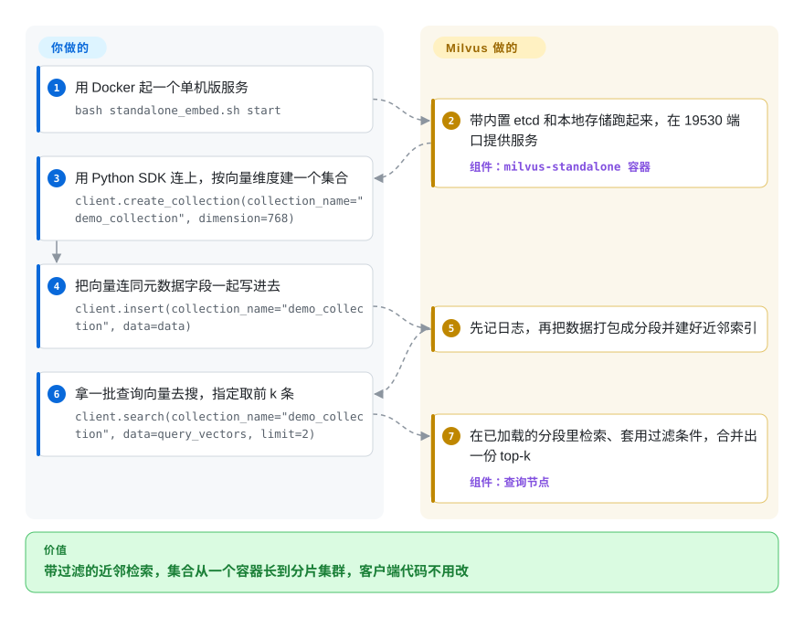

# Milvus

你的 RAG 或推荐原型把向量放在一个 NumPy 数组或 FAISS 文件里，现在涨到几亿条，每次查询都要按租户、按日期过滤，写入一整天不停，而且坏一台机器搜索也不能停。Milvus 是一个向量数据库服务：把每条向量和它的元数据存在一起，把数据拆到多台机器上，通过网络接口回答“离这个最近的 10 条，且 tenant = X”。

## 何时使用

你负责一个搜索、RAG 或推荐产品的检索层。第一版用的是进程内索引：启动时 `faiss.read_index("prod.index")`，再用一个 Python 字典把 ID 映射回文档，每晚重建一次。现在索引已经塞不进一台机器的内存，每晚重建意味着新文档要到明天才搜得到，产品还要求每次查询都带上 `where tenant_id == 42 and lang == "de"`。你需要让向量住进一个服务里：支持元数据过滤、实时增删、副本和横向扩容，而不是一个到处拷贝的文件。

当**能横向扩出去**是决定性约束时，选 Milvus 而不是它最接近的替代品：它把计算和存储分开（分段数据落在 S3/MinIO 上，查询节点和数据节点在 Kubernetes 上各自扩容），支持主流的近邻索引家族（HNSW、IVF、DiskANN、GPU CAGRA，3.0 起还能直接传 Faiss 的索引工厂字符串），并且能在同一个集合里做稠密向量 + BM25/稀疏向量的混合检索。同一套 `MilvusClient` 代码可以连 Milvus Lite（一个本地文件，用来做原型）、单容器的单机版、分布式集群，或厂商托管的 Zilliz Cloud，所以可以从小做起，不用改客户端。如果你只有几千万条向量、而且挨着关系数据，pgvector 运维更省；如果你想要一个单二进制的服务，Qdrant 更简单——见“何时不用”。

## 怎么用起来

Milvus 是一个数据库服务，你通过 Python、Java、Go、Node.js 等 SDK 走 gRPC/REST（默认端口 19530）和它说话。你先定义一个**集合**（collection）——可以理解为一张表，有一列或几列向量，再加普通的标量列（数字、字符串、JSON）——然后往里插行。写入先进预写日志（一本记录所有变更的流水账，保证不丢；2.6 起默认用 Woodpecker，也可以换 Pulsar/Kafka），再被打包成**分段**（segment，不可变的一批行）存到对象存储上，并在上面建好**近邻索引**——一种事先算好的捷径结构，就像图书馆按主题编的目录，搜索时只翻一小部分数据，而不是和每条向量都比一遍。查询时，查询节点把建好索引的分段加载进内存（或从磁盘 mmap 映射），套用你的元数据过滤条件，再把每个分段的 top-k 合并成一个结果；集群的元数据存在 etcd 里。存储、建索引、分片、副本、压缩合并、带过滤的检索都由 Milvus 做；**你**负责产出 embedding（除非你配置了它的服务端 embedding 函数）、设计 schema（维度、距离度量、字段）、选索引和一致性级别、估算内存——向量检索很吃内存，这笔账是你的。如果只是在笔记本上做原型，`pip install pymilvus[milvus-lite]` 再 `MilvusClient("milvus_demo.db")`，就能用同一套接口、背后是一个本地文件，不需要起服务。

<!-- flow-steps:begin (generated from flows/milvus.json by tools/flow_card.py — do not edit) -->

流程文字版

1. **你**：用 Docker 起一个单机版服务 — `bash standalone_embed.sh start`
2. **Milvus**：带内置 etcd 和本地存储跑起来，在 19530 端口提供服务 — 组件：`milvus-standalone 容器`
3. **你**：用 Python SDK 连上，按向量维度建一个集合 — `client.create_collection(collection_name="demo_collection", dimension=768)`
4. **你**：把向量连同元数据字段一起写进去 — `client.insert(collection_name="demo_collection", data=data)`
5. **Milvus**：先记日志，再把数据打包成分段并建好近邻索引
6. **你**：拿一批查询向量去搜，指定取前 k 条 — `client.search(collection_name="demo_collection", data=query_vectors, limit=2)`
7. **Milvus**：在已加载的分段里检索、套用过滤条件，合并出一份 top-k — 组件：`查询节点`

**价值**：带过滤的近邻检索，集合从一个容器长到分片集群，客户端代码不用改

<!-- flow-steps:end -->

## 何时不用

- **向量放得进一个进程，而且你并不需要数据库。** 如果你只是在一个应用里嵌入检索、向量少于几百万条、批量重建，用 [FAISS](faiss.zh.md)（或 Chroma 这类小型嵌入式库，未收录），不要上 Milvus，因为库没有服务、没有 etcd、也没有对象存储要运维。
- **你已经在跑 Postgres，语料在几千万条以内。** 改用 pgvector（未收录），因为向量就和它描述的行放在一起，共享同一套事务、备份和权限——单独一个 Milvus 集群等于多了一个要同步的事实源。
- **你没有 Kubernetes 或平台团队，却预计要上集群。** 分布式 Milvus 是一组服务——proxy、coordinator、查询/数据/流式节点——外加 etcd、对象存储（MinIO/S3）和一个预写日志。如果这些你接不住，改用 Qdrant（未收录，一个 Rust 单二进制，自带分片），或者付费用托管的 Zilliz Cloud（非仓库），而不是自己运维集群。
- **你既想用 3.0 的主打功能，又想保留安全回滚。** 截至 3.0.x，快照、TEXT 字段、外部集合都依赖 Storage V3，而它**默认关闭**（`common.storage.useLoonFFI`），新的稀疏/向量索引版本也要手动开启。一旦打开，磁盘格式就变了，再也回滚不到 2.6。如果你还走不了这一步单向门，就留在仍在打补丁的 2.6.x 线上（v2.6.25，2026-09-29），先别开这些功能。
- **你在 Ubuntu 20.04 主机上跑 GPU 版 Milvus。** 3.0 的 GPU 镜像换到 CUDA 12.9，不再兼容 Ubuntu 20.04 的 GPU 环境；这些主机要么继续用 2.6.x 的 GPU 镜像，要么先升级系统再上 3.0。
- **你打算把 Milvus Lite 当生产存储。** README 把 Lite 定位成 `pip install` 即可的快速上手版；凡是多进程或长期运行的场景，用单机版（一个容器）或集群。

## 横向对比

| 替代品 | 是否收录 | 我们的评价 | 取舍 |
|---|---|---|---|
| [FAISS](faiss.zh.md) | ✅ | 索引住在一个应用进程里、批量重建时，选 FAISS；一旦需要元数据过滤、实时增删和共享的网络服务，选 Milvus。 | FAISS 是库：路径最短、零运维，但没有持久化模型、过滤、副本和接口，这些都得你自己造；Milvus 全都给你，代价是要运维一个数据库。 |
| Qdrant | 未收录 | 想自建一个几节点以内、组件最少的向量库，选 Qdrant；预计要在 Kubernetes 上把计算和存储分开扩容、或需要 DiskANN/GPU 索引时，选 Milvus。 | Qdrant 是一个 Rust 单二进制，自带分片和 payload 过滤；Milvus 要 etcd + 对象存储 + 预写日志，但查询节点和写入节点能独立扩容，索引类型也更多。 |
| pgvector | 未收录 | 向量属于已经在 Postgres 里的行、规模停在几千万条时，选 pgvector；向量量级或 QPS 超出单个 Postgres 主库时，选 Milvus。 | pgvector 让向量和业务数据同在一个事务里、复用 Postgres 的运维；Milvus 多出一套系统，但为分布式近邻检索、稀疏+稠密混合检索和冷热分层而生。 |
| Chroma | 未收录 | 在 notebook 或单应用 RAG 原型里，最看重 `pip install` 和零配置时，选 Chroma；原型注定要长成多租户生产服务时，选 Milvus。 | Chroma 为小语料的开发体验优化；Milvus Lite 也能占住原型这个位置，但真正的收益是同一套客户端能平滑升级到单机版和集群。 |
| Weaviate | 未收录 | 想要内置向量化模块和 GraphQL 风格的对象接口，选 Weaviate；原始近邻检索规模和索引选择（IVF/DiskANN/GPU）比自带模型集成更重要时，选 Milvus。 | Weaviate 围绕对象和模块打包了更多应用层功能；Milvus 专注检索引擎和存算分离，应用层更多留给你自己。 |

## 技术栈

- **语言：** 按 README 的说法，分布式服务（proxy、coordinator、各类节点）用 Go，分段与检索内核用 C++。
- **向量引擎：** Knowhere（Zilliz 的向量索引库）以源码形式放在 `internal/core/thirdparty` 下，支撑 README 列出的索引家族（HNSW、IVF、FLAT、SCANN、DiskANN、经 cuVS 的 GPU CAGRA）；同目录还有 Tantivy，用于全文/BM25 倒排索引。
- **存储：** 分段落在对象存储上（MinIO/S3 兼容，单机内置模式下也可以是本地磁盘）；Storage V3（“Loon”）在 3.0 中可选开启，引入基于 manifest 的列式布局，支持 Parquet、Lance、Vortex 格式。
- **元数据与日志：** etcd 存元数据；预写日志可选 Woodpecker（默认）、Pulsar、Kafka 或 RocksMQ（`configs/milvus.yaml` 里的 `mq.type`）。
- **客户端：** 官方 SDK 覆盖 Python（`pymilvus`）、Java、Go、Node.js，另有 REST v2；图形化管理用 Attu（独立仓库）。
- **版本与日期：** 3.x 线 v3.0.2（2026-09-20）；并行维护的 2.6 线 v2.6.25（2026-09-29）。

## 依赖

- **Milvus Lite：** 只需要 Python（`pymilvus[milvus-lite]`），数据存在本地文件里。只适合做原型。
- **单机版：** Docker。`scripts/standalone_embed.sh` 起一个容器，内置 etcd 和本地存储；`deployments/docker/standalone/docker-compose.yml` 则起 Milvus 加独立的 etcd（`quay.io/coreos/etcd:v3.5.25`）和 MinIO 容器。
- **集群：** Kubernetes（Helm chart 或 Milvus Operator）、etcd、S3 兼容对象存储，以及一个预写日志后端（Woodpecker，3.0 起可单独部署成服务；或 Pulsar/Kafka）。
- **GPU 版：** 3.0 起镜像基于 CUDA 12.9 的 NVIDIA GPU（不再支持 Ubuntu 20.04 的 GPU 主机）。
- **Embedding：** 用你自己的模型或服务商，除非你配置了 Milvus 的服务端 embedding/重排函数。

## 运维难度

**Lite 和单机版低，生产集群高。** Lite 就是一次 `pip install`；单机版是一个脚本或一个三容器的 compose 文件，备份就是拷贝它的数据卷。集群则是一个多服务的分布式系统：要按加载的分段和索引类型估算查询节点内存，把 etcd 和对象存储当有状态依赖来运维、各自做备份，盯住压缩合并和建索引的积压，并且要在每隔几周就发补丁的版本线上规划滚动升级。3.0 还多了一道单向门（开启 Storage V3 或新索引版本后无法回滚到 2.6），所以升级要先过预发环境。官方提供 Attu（图形界面）、Birdwatcher（排障）和 Prometheus/Grafana 看板，能帮上忙——但这是一个要运维的数据库，不是一个 import 进来就完事的库。

## 健康度与可持续性

- **维护（2026-10-08）：** 非常活跃。默认分支今天还有推送；v3.0.0 于 2026-07-29 正式发布，9 月又出了 v3.0.1/v3.0.2，同时 v2.6.x 继续出补丁（v2.6.25，2026-09-29）。两条线同时维护，对没法马上跨大版本的生产用户是好信号。
- **响应速度：** issue 分拣很快——雷达统计的近期首次响应中位数约 24.9 小时——不过 1.4k+ 个未关闭 issue 说明积压不小。
- **治理与巴士因子：** LF AI & Data 基金会项目，有技术指导委员会邮件列表；过去 12 个月约 100 名活跃贡献者，头号贡献者提交占比不到 10%。实际上路线图由 Zilliz 主导（README 称其为主要贡献者），而 Zilliz 同时在卖托管的 Zilliz Cloud。
- **年龄与 Lindy：** 2019-09 创建（7 年），从 1.x 到 2.x 再到 3.0 一路重写、持续开发——又老又活跃，对基础设施来说是扎实的 Lindy 先验。
- **采用度：** 约 4.63 万 star，注册表信号显示约 1.2k 个依赖它的 Go 仓库，发表过 SIGMOD 2021 / VLDB 2022 论文，并与 LangChain、LlamaIndex、Spark、Kafka、Airbyte 有集成。
- **风险信号：** Apache-2.0，没有改许可证的历史；要盯的是开放核心的压力——部分便利功能（serverless 档、BYOC）只在 Zilliz Cloud 里有。发版节奏快，务必锁版本并读兼容性说明。

## 存疑（未验证）

- [未验证] 规模说法（“在数十亿向量上处理数万查询”）来自 README 和厂商基准，没有核对独立基准。
- [推断] 快速建表 `create_collection(..., dimension=768)` 会自动建默认索引并加载集合；README 展示了这个调用，但没写明这个行为。
- [未验证] Milvus Lite（milvus-io/milvus-lite v3.2.1，2026-08）和 3.0 服务端的功能对齐情况——例如 Lite 支持哪些 3.0 功能——没有核对。
- [推断] “路线图由 Zilliz 主导”是从 README 的“主要贡献者”措辞和贡献者归属推出来的，不是来自治理文档。
- [未验证] 哪些功能只在 Zilliz Cloud、不在开源 Milvus 里，没有逐项核对。
- [未验证] 与 3.0 兼容的 Helm chart / Milvus Operator 版本没有核对。
- [推断] Qdrant、pgvector、Chroma、Weaviate 这几行对比只依据它们的 GitHub 元数据（许可、语言、活跃度）和对这些项目的一般了解，这次没有重读它们的文档。
