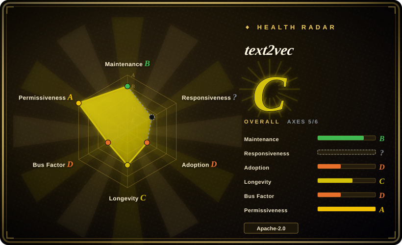
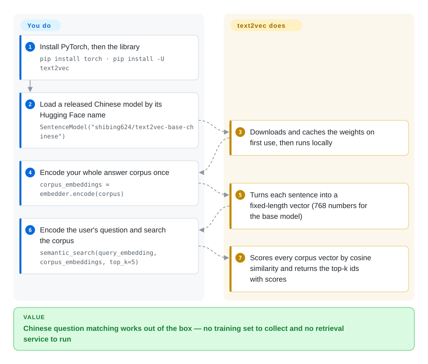

# text2vec

A Python library that turns text into vectors for semantic similarity and retrieval — bundling Word2Vec, BM25, Sentence-BERT, CoSENT and BGE-style methods behind one `pip install`, with a strong Chinese-language focus.

## When to use

You're an NLP engineer at a Chinese-market company building a FAQ/semantic-search feature: a user types a question and you need to find the closest match among thousands of canned answers. You don't want to stand up a heavyweight retrieval stack or fight with raw `transformers` boilerplate just to get sentence embeddings, and most English-first embedding tutorials trained on Western corpora underperform on your Chinese text. You `pip install text2vec`, load one of the bundled Chinese models (a CoSENT or Sentence-BERT checkpoint, or Tencent's Chinese Word2Vec), and call `model.encode(sentences)` to get vectors — then cosine-similarity or BM25 ranks candidates. The library is opinionated toward Chinese semantic matching out of the box, so you get usable similarity scores without curating your own training set first.

You also reach for it when you want to *fine-tune* a sentence embedder on your own labeled pairs (the repo ships CoSENT/SBERT training loops and reports benchmark numbers on Chinese STS datasets like ATEC, BQ, LCQMC, PAWSX, STS-B), or when you need a quick CLI to batch-vectorize a corpus and serve it over FastAPI/Jina.

## How it works

text2vec is a thin layer over Hugging Face `transformers`: `SentenceModel` loads a released checkpoint by its Hub name, runs your sentences through it, and averages the per-word outputs into one sentence vector (an *embedding* — a list of numbers where sentences with similar meaning end up close together). **The models, the pooling and the search helper ship with text2vec**; you choose which checkpoint to load, encode your corpus, and decide where the vectors live. Its `semantic_search` helper is brute force — it compares the question's vector against every stored vector by cosine similarity (the angle between two vectors), which its own docstring sizes for corpora up to about a million entries; beyond that you hand the vectors to an index such as FAISS. Fine-tuning on your own labeled pairs and the CLI / FastAPI / Jina serving paths are side doors off the same model object, not part of the core loop.

<!-- flow-steps:begin (generated from flows/text2vec.json by tools/flow_card.py — do not edit) -->

Text version of the flow

1. **You**: Install PyTorch, then the library — `pip install torch · pip install -U text2vec`
2. **You**: Load a released Chinese model by its Hugging Face name — `SentenceModel("shibing624/text2vec-base-chinese")`
3. **text2vec**: Downloads and caches the weights on first use, then runs locally
4. **You**: Encode your whole answer corpus once — `corpus_embeddings = embedder.encode(corpus)`
5. **text2vec**: Turns each sentence into a fixed-length vector (768 numbers for the base model)
6. **You**: Encode the user's question and search the corpus — `semantic_search(query_embedding, corpus_embeddings, top_k=5)`
7. **text2vec**: Scores every corpus vector by cosine similarity and returns the top-k ids with scores

**Value**: Chinese question matching works out of the box — no training set to collect and no retrieval service to run

<!-- flow-steps:end -->

## When NOT to use

- **You want a full vector database / retrieval engine.** text2vec produces embeddings; it does not store, index (ANN), or serve them at scale. Pair it with FAISS, Milvus, or pgvector — it is the *encoder*, not the index.
- **Your workload is English-first or broadly multilingual.** The library's defaults and benchmarks center on Chinese; for English or many-language retrieval, the `sentence-transformers` ecosystem or a multilingual BGE/E5 model used directly may serve you better (text2vec does ship a `text2vec-base-multilingual` checkpoint, but its benchmarks and curation are Chinese-first).
- **You need the absolute latest embedding SOTA.** It wraps established methods (SBERT, CoSENT, BGE); newer instruction-tuned or large embedding models (e.g. via the MTEB leaderboard) may outrank the bundled checkpoints — verify against current benchmarks for your task.
- **You're already standardized on `sentence-transformers` / HuggingFace directly.** text2vec is a convenience wrapper over `transformers` with its own pooling and search helpers; if you already run sentence-transformers, use its `SentenceTransformer` with text2vec's released checkpoints (the README documents that path) instead of adding the extra layer — the gain is mostly the Chinese-model curation and training scripts.
- **You need a library someone is still actively shipping.** The last release is v1.2.9 (2023-09) and the last commit 2026-02-14, with the single maintainer quiet since (as of 2026-10-08). For new embedding models and ongoing fixes, use `sentence-transformers` or FlagEmbedding (BGE) instead; text2vec is a fine frozen dependency, not a moving one.
- **Single-maintainer dependency is a dealbreaker.** This is one person's project (see Health) — fine as a library you vendor, riskier as a load-bearing dependency you expect long-term support on.

## Comparison

| Alternative | In index | Our verdict | Tradeoff |
|---|---|---|---|
| sentence-transformers (SBERT) | 未收录 | Choose sentence-transformers when you want the actively maintained general embedding library and can pick a Chinese checkpoint yourself. | The library text2vec mirrors (text2vec reimplements its `encode`/`semantic_search` shape on raw `transformers` rather than depending on it); broader model zoo and English/multilingual coverage, but less Chinese-curated out of the box and no bundled BM25/Word2Vec convenience. |
| BGE / FlagEmbedding (BAAI) | 未收录 | Choose BGE/FlagEmbedding when you need the canonical home for newer open embedding checkpoints and rerankers. | State-of-the-art open embedding models (incl. strong Chinese); text2vec can load BGE, but FlagEmbedding is the canonical home for the latest checkpoints and rerankers. |
| [FAISS](faiss.md) | ✅ | Choose FAISS when you need an in-process vector index, not an encoder. | Vector index, not encoder — complementary, not a substitute; you still need an embedder like text2vec in front. |
| [Milvus](milvus.md) | ✅ | Choose Milvus when you need a distributed vector database rather than a local embedding library. | Vector database, not encoder — complementary, not a substitute; you still need an embedder like text2vec in front. |
| OpenAI / Cohere embedding APIs | 未收录 | Choose hosted embedding APIs when no self-hosting/GPU and strong managed quality matter most. | Hosted, no self-hosting or GPU, strong quality — but paid, network-dependent, and sends text to a third party; text2vec runs fully local. |

## Tech stack

- **Language:** Python (3.x).
- **Core deps:** PyTorch and Hugging Face `transformers` (`AutoTokenizer` / `AutoModel`), plus `jieba`, `datasets`, `scikit-learn`, `pandas`, `loguru` per `requirements.txt`; pooling and `semantic_search` are its own code, not imported from `sentence-transformers`.
- **Models:** bundled/loadable checkpoints — Tencent Chinese Word2Vec (200-d), Sentence-BERT, CoSENT, and BGE-style fine-tuned models distributed via the HuggingFace Hub.
- **Methods:** Word2Vec, RankBM25 (lexical), Sentence-BERT, CoSENT (ranking-sensitive loss), contrastive BGE-style fine-tuning.
- **Serving:** optional CLI for batch vectorization; FastAPI / Jina (gRPC) deployment paths mentioned in the README.

## Dependencies

- **Runtime:** Python + PyTorch; model weights pulled from the HuggingFace Hub on first use (network access required for the initial download).
- **Hardware:** runs on CPU; a CUDA GPU accelerates encoding and is needed for practical fine-tuning (README benchmarks cite a Tesla V100). [未验证]
- **No external services** required for inference once weights are cached — embeddings are computed locally.

## Ops difficulty

**Low.** For inference it's a `pip install` and a `model.encode()` call — no datastore, no service to operate. The main operational concerns are the usual ML ones: pinning the model + library versions for reproducibility, the first-run weight download (size/network), and provisioning a GPU if you fine-tune or encode large corpora. Putting it into production means deciding where embeddings live (you bring your own vector index) and how you version the encoder, but the library itself adds no clustering or infra burden.

## Health & viability

- **Responsiveness**: Cannot be scored — no_traffic.
- **Maintenance (2026-10).** Last commit 2026-02-14; latest release v1.2.9 dates from 2023-09. The repo is **not archived**, but it has been quiet for ~8 months — call it a frozen, lightly-maintained library, not an actively developed one. The radar keeps maintenance at B only through its mature-library carve-out.
- **Governance / bus factor.** A **single-maintainer** project (shibing624) with a long tail of minor contributors — the bus factor is effectively one. High stars (~5.0k) on a solo project is social proof of usefulness, not of sustained support. [推断]
- **Age & Lindy verdict.** Created 2019-11, ~6.5 years old and still receiving updates — a moderate Lindy signal: it has outlived the hype cycle of many embedding libraries and remains usable, though the single-maintainer cadence tempers the bet. [推断]
- **Adoption.** Widely used in the Chinese NLP community (~5.0k stars, 428 forks, on PyPI); a practical default for Chinese semantic matching. The thin open-issue count (7) reads as either responsive triage or low current activity. [未验证]
- **Risk flags.** Apache-2.0 (clean, commercial-friendly, no relicense history found). Main flag is bus-factor; secondary is that it wraps a fast-moving upstream (`transformers`) and lags the newest embedding models.

## Caveats (unverified)

- [未验证] ~5.0k stars / 428 forks and v1.2.9 as of 2026-06; star and version numbers are date-sensitive — treat as indicative.
- [未验证] Exact pinned versions of PyTorch / transformers are set by the repo's manifest at install time and shift across releases — not asserting specific versions here.
- [推断] "Chinese-first" is inferred from the README's model curation and Chinese-benchmark focus; English/multilingual quality is supported but less documented — benchmark for your own language before committing.
- [推断] Maintenance level ("frozen, lightly-maintained") is inferred from commit recency (last commit 2026-02-14) and a single maintainer, not from a stated support policy.
- [推断] The ~1 million-entry ceiling for `semantic_search` is the function's own docstring guidance, not a measured limit; memory and latency depend on vector size and hardware.
- [未验证] GPU requirement for fine-tuning and the V100 benchmark figure come from the README; not independently re-measured.
