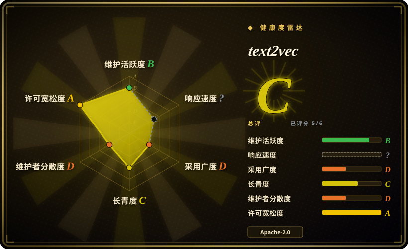
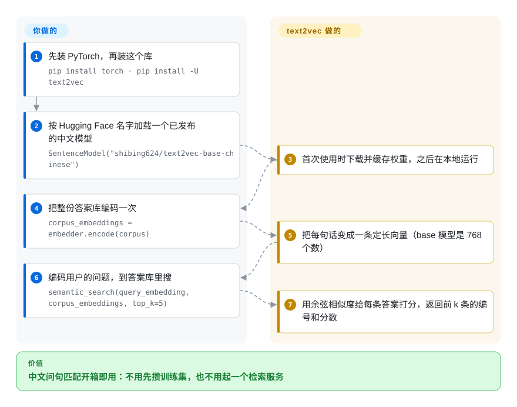

# text2vec

把文本转成向量、用于语义相似与检索的 Python 库——一个 `pip install` 即打包了 Word2Vec、BM25、Sentence-BERT、CoSENT 和 BGE 系方法，且明显偏向中文。

## 何时使用

你是某家面向中国市场公司的 NLP 工程师，要做一个 FAQ / 语义搜索功能：用户输入一个问题，你需要在成千上万条预置答案里找出最接近的那条。你不想为了拿到句向量就搭一套笨重的检索栈，也不想跟原生 `transformers` 的样板代码缠斗，而大多数以英文为先、在西方语料上训练的 embedding 教程对你的中文文本表现都不好。你 `pip install text2vec`，加载一个打包好的中文模型（CoSENT 或 Sentence-BERT 检查点，或腾讯的中文 Word2Vec），调 `model.encode(sentences)` 拿到向量——再用余弦相似度或 BM25 给候选排序。这个库开箱即偏向中文语义匹配，所以你不用先攒自己的训练集就能拿到可用的相似度分数。

当你想在自己的标注样本对上*微调*一个句向量模型时（仓库提供 CoSENT/SBERT 训练循环，并在 ATEC、BQ、LCQMC、PAWSX、STS-B 等中文 STS 数据集上报了基准成绩），或者你需要一个快捷 CLI 来批量向量化语料、再用 FastAPI/Jina 服务它时，你也会选它。

## 怎么用起来

text2vec 是 Hugging Face `transformers` 之上的一层薄封装：`SentenceModel` 按 Hub 上的名字加载一个已发布的检查点，把你的句子喂进去，再把每个词的输出取平均，压成一条句向量（embedding——一串数字，意思相近的句子对应的数字串彼此靠得近）。**模型、取平均这一步和检索小工具都是 text2vec 自带的**；你只管挑加载哪个检查点、把语料编码一遍，并决定这些向量存在哪。它的 `semantic_search` 是暴力比对——拿问题的向量和库里每一条向量逐个算余弦相似度（两条向量夹角的余弦，越接近 1 越相似），函数自己的说明写的是适合约一百万条以内的语料；再大就该把向量交给 FAISS 这类索引。用自己的标注句对做微调、走 CLI / FastAPI / Jina 对外服务，都是同一个模型对象上的旁路，不在主干流程里。

<!-- flow-steps:begin (generated from flows/text2vec.json by tools/flow_card.py — do not edit) -->

流程文字版

1. **你**：先装 PyTorch，再装这个库 — `pip install torch · pip install -U text2vec`
2. **你**：按 Hugging Face 名字加载一个已发布的中文模型 — `SentenceModel("shibing624/text2vec-base-chinese")`
3. **text2vec**：首次使用时下载并缓存权重，之后在本地运行
4. **你**：把整份答案库编码一次 — `corpus_embeddings = embedder.encode(corpus)`
5. **text2vec**：把每句话变成一条定长向量（base 模型是 768 个数）
6. **你**：编码用户的问题，到答案库里搜 — `semantic_search(query_embedding, corpus_embeddings, top_k=5)`
7. **text2vec**：用余弦相似度给每条答案打分，返回前 k 条的编号和分数

**价值**：中文问句匹配开箱即用：不用先攒训练集，也不用起一个检索服务

<!-- flow-steps:end -->

## 何时不用

- **你想要的是完整的向量数据库 / 检索引擎。** text2vec 产出 embedding，但不存储、不建索引（ANN）、也不做规模化服务。请配 FAISS、Milvus 或 pgvector——它是*编码器*，不是索引。
- **你的工作负载以英文为先或广泛多语。** 该库的默认与基准都围绕中文；做英文或多语检索时，直接用 `sentence-transformers` 生态或某个多语 BGE/E5 模型可能更合适（text2vec 也发布了 `text2vec-base-multilingual` 检查点，但基准和模型筛选都以中文为先）。
- **你需要绝对最新的 embedding SOTA。** 它封装的是成熟方法（SBERT、CoSENT、BGE）；更新的指令微调或大型 embedding 模型（如 MTEB 榜单上的）可能胜过打包的检查点——请按你的任务对照当前基准核实。
- **你已经直接标准化在 `sentence-transformers` / HuggingFace 上。** text2vec 是 `transformers` 之上的便利封装，取平均和检索都是它自己写的；若你已在用 sentence-transformers，直接用它的 `SentenceTransformer` 加载 text2vec 发布的检查点即可（README 写了这条路），不必再多套一层——多出来的增益主要是中文模型筛选和训练脚本。
- **你需要一个还在持续发版的库。** 最新版本是 v1.2.9（2023-09），最后一次提交在 2026-02-14，此后单一维护者再无动静（截至 2026-10-08）。要新的 embedding 模型和持续修复，改用 `sentence-transformers` 或 FlagEmbedding（BGE）；text2vec 适合当冻结依赖，不适合当会跟进演进的依赖。
- **单一维护者依赖是底线问题。** 这是一个人的项目（见健康度）——作为你 vendor 进来的库没问题，但作为你指望长期支持的承重依赖就更冒险。

## 横向对比

| 替代品 | 是否收录 | 我们的评价 | 取舍 |
|---|---|---|---|
| sentence-transformers（SBERT） | 未收录 | 想要一个仍在活跃维护的通用 embedding 库、并能自己挑中文检查点时，选 sentence-transformers。 | text2vec 仿照的那个库（text2vec 在原生 `transformers` 上重写了同样形状的 `encode`/`semantic_search`，并不依赖它）；模型库更广、英文/多语覆盖更全，但中文开箱筛选更少，且不带 BM25/Word2Vec 便利封装。 |
| BGE / FlagEmbedding（BAAI） | 未收录 | 需要较新的开源 embedding checkpoints 和 reranker 正统出处时，选 BGE/FlagEmbedding。 | 最先进的开源 embedding 模型（含强中文）；text2vec 可加载 BGE，但 FlagEmbedding 才是最新检查点与 reranker 的正统出处。 |
| [FAISS](faiss.zh.md) | ✅ | 需要进程内向量索引而不是编码器时，选 FAISS。 | 向量索引，不是编码器——互补而非替代；你前面仍需要一个像 text2vec 的 embedder。 |
| [Milvus](milvus.zh.md) | ✅ | 需要分布式向量数据库而不是本地 embedding 库时，选 Milvus。 | 向量数据库，不是编码器——互补而非替代；你前面仍需要一个像 text2vec 的 embedder。 |
| OpenAI / Cohere embedding API | 未收录 | 需要托管 embedding API 且不想自建/GPU 时，选 OpenAI 或 Cohere。 | 托管、无需自建或 GPU、质量强——但要付费、依赖网络，且把文本发给第三方；text2vec 全程本地运行。 |

## 技术栈

- **语言：** Python（3.x）。
- **核心依赖：** PyTorch 与 Hugging Face `transformers`（`AutoTokenizer` / `AutoModel`），以及 `requirements.txt` 里的 `jieba`、`datasets`、`scikit-learn`、`pandas`、`loguru`；取平均和 `semantic_search` 是它自己的代码，不是从 `sentence-transformers` 导入的。
- **模型：** 打包/可加载的检查点——腾讯中文 Word2Vec（200 维）、Sentence-BERT、CoSENT，以及经 BGE 系微调的模型，经 HuggingFace Hub 分发。
- **方法：** Word2Vec、RankBM25（词法）、Sentence-BERT、CoSENT（对排序敏感的损失）、对比式 BGE 系微调。
- **服务：** 可选 CLI 做批量向量化；README 提到 FastAPI / Jina（gRPC）部署路径。

## 依赖

- **运行时：** Python + PyTorch；模型权重首次使用时从 HuggingFace Hub 拉取（首次下载需要联网）。
- **硬件：** 可在 CPU 上跑；CUDA GPU 加速编码，做微调时实际需要它（README 基准引用了 Tesla V100）。[未验证]
- **无外部服务** 用于推理——权重缓存后，embedding 在本地计算。

## 运维难度

**低。** 推理就是一个 `pip install` 加一次 `model.encode()` 调用——没有数据存储、没有要运维的服务。主要的运维顾虑都是常规 ML 那些：为可复现而钉死模型 + 库版本、首次运行的权重下载（体积/网络），以及做微调或编码大语料时备好 GPU。投产意味着你要决定 embedding 存哪（向量索引自带）以及怎么给编码器做版本管理，但库本身不增加集群或基础设施负担。

## 健康度与可持续性

- **响应速度**：无法计算——no_traffic。
- **维护（2026-10）。** 最后一次提交在 2026-02-14；最新版本 v1.2.9 发布于 2023-09。仓库**未归档**，但已安静约 8 个月——算冻结、轻度维护的库，不是在积极开发的库。雷达上维护轴还是 B，靠的是“成熟库”豁免。
- **治理 / bus factor。** **单一维护者**项目（shibing624），外加一条小贡献者长尾——bus factor 实际为一。单人项目上的高 star（约 5.0k）是有用的社会证明，而非持续支持的证明。[推断]
- **年龄与 Lindy 判断。** 2019-11 创建，约 6.5 年且仍在更新——中等 Lindy 信号：它活过了不少 embedding 库的炒作周期、仍然可用，但单一维护者的节奏给这个赌注打了折扣。[推断]
- **采用度。** 在中文 NLP 社区广泛使用（约 5.0k star、428 fork，已上 PyPI）；做中文语义匹配的一个务实默认选项。仅 7 个 open issue，要么是响应及时的 triage，要么是当前活跃度偏低。[未验证]
- **风险标记。** Apache-2.0（干净、商用友好、未发现 relicense 历史）。主要标记是 bus-factor；次要标记是它封装了快速演进的上游（`transformers`），已落后于最新的 embedding 模型。

## 存疑（未验证）

- [未验证] 截至 2026-06 约 5.0k star / 428 fork、版本 v1.2.9；star 和版本号对时间敏感——仅供参考。
- [未验证] PyTorch / transformers 的确切钉版由仓库 manifest 在安装时决定，且随版本变动——这里不断言具体版本。
- [推断] “中文为先”是从 README 的模型筛选和中文基准侧重推断的；英文/多语质量虽支持但文档更少——投产前请对你自己的语言做基准测试。
- [推断] 维护级别（“冻结、轻度维护”）是从提交近况（最后提交 2026-02-14）和单一维护者推断的，而非来自某个声明的支持政策。
- [推断] `semantic_search` 约一百万条的上限是函数自身说明里的建议，不是实测上限；内存和延迟取决于向量维度和硬件。
- [未验证] 微调的 GPU 需求与 V100 基准数字来自 README，未独立复测。
